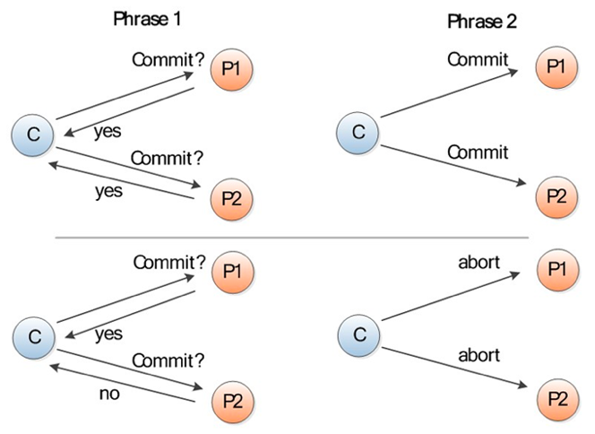
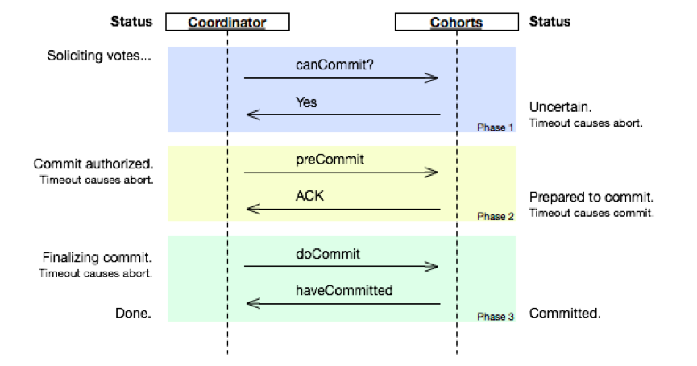
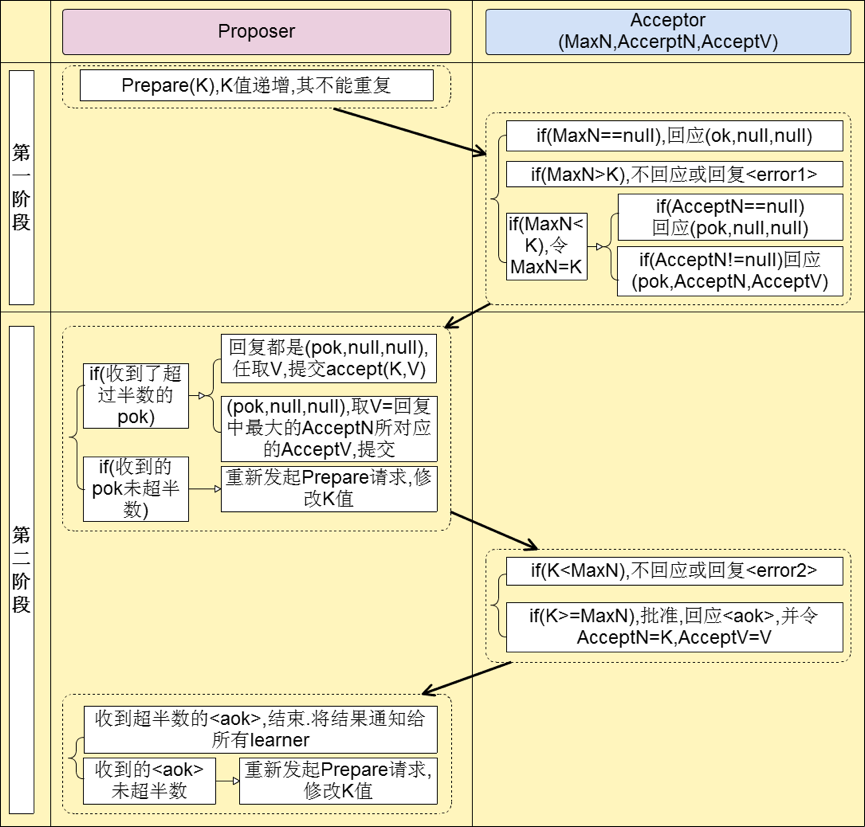
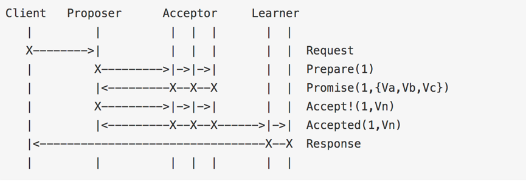
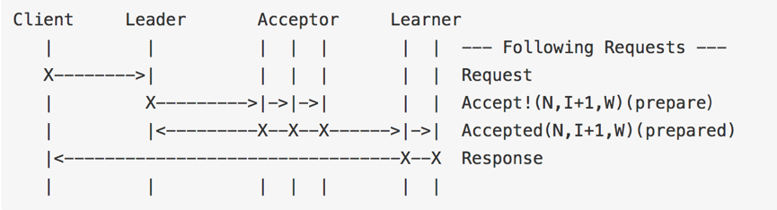
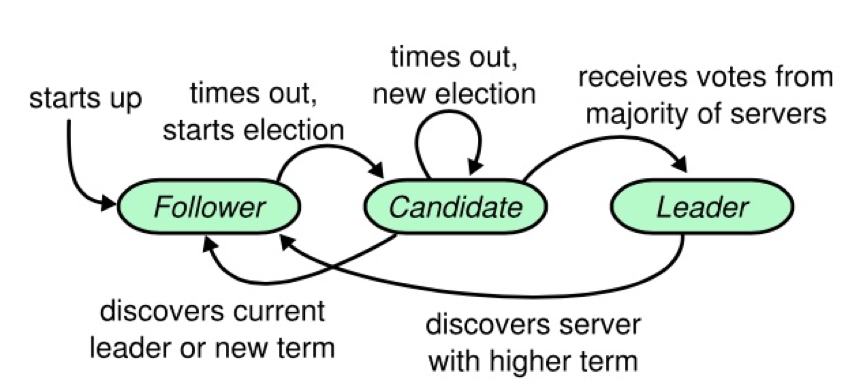
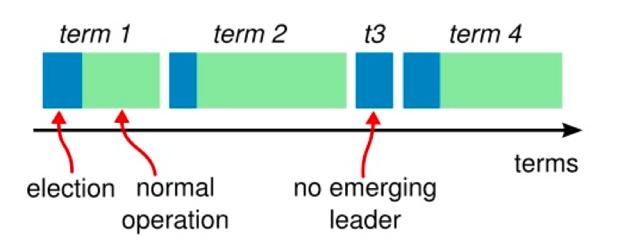
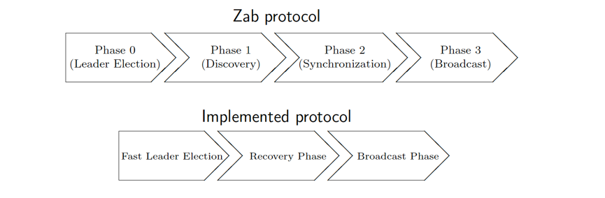

# 分布式一致性协议


&emsp;介绍常见的分布式一致性协议

#### 一．CAP/BASE

##### 1. CAP理论

&emsp;CAP理论又称之为布鲁尔定理（Brewer’S theorem），认为在设计一个大规模可扩放的网络服务时候不能同时兼容：一致性（consistency）、可用性（Availability）、分区容错（Partition-tolerance）。

&emsp;一致性：在分布式系统中的所有数据备份，在同一时刻是否有同样的值。（等同于所有节点访问同一份最新的数据副本）

&emsp;可用性：在集群中一部分节点故障后，集群整体是否还能响应客户端的读写请求。

&emsp;分区容忍性：以实际效果而言，分区相当于对通信的时限要求。系统如果不能在时限内达成数据一致性，就意味着发生了分区的情况，必须就当前操作在C和A之间做出选择

&emsp;CAP理论容易理解，网上也有关于该理论的说明，包括模型的简易证明；弱条件下模型的成立等。

&emsp;参考资料：

1. [http://www.cnblogs.com/mmjx/archive/2011/12/19/2290540.html](http://www.cnblogs.com/mmjx/archive/2011/12/19/2290540.html)

2. [http://nathanmarz.com/blog/how-to-beat-the-cap-theorem.html](http://nathanmarz.com/blog/how-to-beat-the-cap-theorem.html)

##### 2. BASE理论

&emsp;BASE是Basically Available（基本可用）、Soft state（软状态）和Eventually consistent（最终一致性）三个短语的简写，BASE是对CAP中一致性和可用性权衡的结果，其来源于对大规模互联网系统分布式实践的结论，是基于CAP定理逐步演化而来的，其核心思想是即使无法做到强一致性（Strong consistency），但每个应用都可以根据自身的业务特点，采用适当的方式来使系统达到最终一致性（Eventual consistency）

&emsp;基本可用：分布式系统在出现故障的时候，允许损失部分可用性，即保证核心可用。

&emsp;软状态：允许系统存在中间状态，而该中间状态不会影响系统整体可用性

&emsp;最终一致性：系统中的所有数据副本经过一定时间后，最终能够达到一致的状态

#### 二．两阶段提交

&emsp;两阶段提交(Two-phaseCommit)是指，在计算机网络以及数据库领域内，为了使基于分布式系统架构下的所有节点在进行事务提交时保持一致性而设计的一种算法。

&emsp;在分布式系统中，每个节点虽然可以知晓自己的操作时成功或者失败，却无法知道其他节点的操作的成功或失败。当一个事务跨越多个节点时，为了保持事务的ACID特性，需要引入一个作为协调者的组件来统一掌控所有节点(称作参与者)的操作结果并最终指示这些节点是否要把操作结果进行真正的提交。



&emsp;如上图示，该协议分为两个阶段：

1. 请求阶段（commit-request phase，或称表决阶段，voting phase）

	在请求阶段，协调者将通知事务参与者准备提交或取消事务，然后进入表决过程。在表决过程中，参与者将告知协调者自己的决策：同意（事务参与者本地作业执行成功）或取消（本地作业执行故障）。

2. 提交阶段（commit phase）

	在该阶段，协调者将基于第一个阶段的投票结果进行决策：提交或取消。当且仅当所有的参与者同意提交事务协调者才通知所有的参与者提交事务，否则协调者将通知所有的参与者取消事务。参与者在接收到协调者发来的消息后将执行相应的操作。

&emsp;二阶段提交算法的最大缺点就在于它在执行过程中间，节点都处于阻塞态。即节点之间在等待对方的响应消息时，它将什么也做不了。特别是，当一个节点在已经占有了某项资源的情况下，为了等待其他节点的响应消息而陷入阻塞状态时，当第三个节点尝试访问该节点占有的资源时，这个节点也将连带陷入阻塞状态。

&emsp;另外，协调者节点指示参与者节点进行提交等操作时，如有参与者节点出现了崩溃等情况而导致协调者始终无法获取所有参与者的响应信息，这时协调者将只能依赖协调者自身的超时机制来生效。但往往超时机制生效时，协调者都会指示参与者进行回滚操作。这样的策略显得比较保守。

&emsp;参考资料

1. [https://en.wikipedia.org/wiki/Two-phase_commit_protocol](https://en.wikipedia.org/wiki/Two-phase_commit_protocol)

#### 三．三阶段提交

&emsp;与两阶段提交不同的是，三阶段提交是“非阻塞”协议。三阶段提交在两阶段提交的第一阶段与第二阶段之间插入了一个准备阶段，同时对于协调者和参与者都设置了超时机制，使得原先在两阶段提交中，参与者在投票之后，由于协调者发生崩溃或错误，而导致参与者处于无法知晓是否提交或者中止的“不确定状态”所产生的可能相当长的延时的问题得以解决。



&emsp;如上图示，该协议分为三个阶段：

1. canCommit

&emsp;协调者向参与者发送commit请求，参与者如果可以提交就返回Yes响应，否则返回No响应。

2. preCommit

	协调者根据参与者的反应情况来决定是否可以进行事务的PreCommit操作。根据响应情况，有以下两种可能.

	1) 假如协调者从所有的参与者获得的反馈都是Yes响应，那么就会执行事务的预执行。

	&emsp;发送预提交请求,Coordinator向Cohort发送PreCommit请求，并进入Prepared阶段。

	&emsp;事务预提交,Cohort接收到PreCommit请求后，会执行事务操作，并将undo和redo信息记录到事务日志中。

	&emsp;响应反馈,如果Cohort成功的执行了事务操作，则返回ACK响应，同时开始等待最终指令。

	2) 假如有任何一个参与者向协调者发送了No响应，或者等待超时之后，协调者都没有接到参与者的响应，那么就执行事务的中断。

	&emsp;发送中断请求,Coordinator向所有Cohort发送abort请求。

	&emsp;中断事务,Cohort收到来自Coordinator的abort请求之后（或超时之后，仍未收到Cohort的请求），执行事务的中断。

3. doCommit

	该阶段进行真正的事务提交，也可以分为以下两种情况:

	1) 执行提交

	&emsp;A.发送提交请求。Coordinator接收到Cohort发送的ACK响应，那么他将从预提交状态进入到提交状态。并向所有Cohort发送doCommit请求。

	&emsp;B.事务提交。Cohort接收到doCommit请求之后，执行正式的事务提交。并在完成事务提交之后释放所有事务资源。

	&emsp;C.响应反馈。事务提交完之后，向Coordinator发送ACK响应。

	&emsp;D.完成事务。Coordinator接收到所有Cohort的ACK响应之后，完成事务。

	2) 中断事务 协调者没有接收到参与者发送的ACK响应（可能是接受者发送的不是ACK响应，也可能响应超时），那么就会执行中断事务。

&emsp;参考资料：

1. [https://en.wikipedia.org/wiki/Three-phase_commit_protocol](https://en.wikipedia.org/wiki/Three-phase_commit_protocol)

2. [https://my.oschina.net/wangzhenchao/blog/736909](https://my.oschina.net/wangzhenchao/blog/736909)

#### 四. Paxos

##### 1.背景

&emsp;在常见的分布式系统中，总会发生诸如机器宕机或网络异常等情况。Paxos算法需要解决的问题就是如何在一个可能发生上述异常的分布式系统中，快速且正确地在集群内部对某个数据的值达成一致，并且保证不论发生以上任何异常，都不会破坏整个系统的一致性。这里某个数据的值并不只是狭义上的某个数，它可以是一条日志，也可以是一条命令（command）等，根据应用场景不同，某个数据的值有不同的含义。

##### 2.相关概念

&emsp;在Paxos算法中，有三种角色：

1. Proposer：提案发起者，向集群中的其他节点发一个提案Proposal，该提案中有一个对应的值。

2. Acceptor：提案接受者，负责处理接收到的提议，他们的回复就是一次投票。会存储一些状态来决定是否接收一个值。

3. Learners：不参与提案的发起和投票，学习已经被Acceptor接受的提案

##### 3.目标

&emsp;保证最终有一个value会被选定，当value被选定后，进程最终也能获取到被选定的value。

##### 4.两个原则

1. 安全性原则：保证不能做错的事。只能有一个值被批准，不能出现第二个值把第一个覆盖的情况；每个节点只能学习到已经被批准的值，不能学习没有被批准的值。

2. 存活原则：只要有多数服务器存活并且彼此间可以通信最终都要做到的事。最终会批准某个被提议的值；一个值被批准了，其他服务器最终会学习到这个值。

##### 5.Basic Paxos

&emsp;Basic Paxos算法分为两个阶段。具体如下：

###### 阶段一：

1. Proposer选择一个提案编号N，然后向半数以上的Acceptor发送编号为N的Prepare请求。

2. 如果一个Acceptor收到一个编号为N的Prepare请求，且N大于该Acceptor已经响应过的所有Prepare请求的编号，那么它就会将它已经接受过的编号最大的提案（如果有的话）作为响应反馈给Proposer，同时该Acceptor承诺不再接受任何编号小于N的提案。

###### 阶段二：

1. 如果Proposer收到半数以上Acceptor对其发出的编号为N的Prepare请求的响应，那么它就会发送一个针对[N,V]提案的Accept请求给半数以上的Acceptor。注意：V就是收到的响应中编号最大的提案的value，如果响应中不包含任何提案，那么V就由Proposer自己决定。

2. 如果Acceptor收到一个针对编号为N的提案的Accept请求，只要该Acceptor没有对编号大于N的Prepare请求做出过响应，它就接受该提案。

&emsp;示例过程如下，其中MaxN,AccerptN,AcceptV分别表示Acceptor的最大响应提案编号，接受的最大编号和接受编号对应的值:



##### 6.推导过程

```

	1）只有一个Acceptor，只要Acceptor接受它收到的第一个提案并被选定，则可以保证只有一个value会被选定。
	2）多个Acceptor
	提案(Propersal) = [value]
	即使只有一个Proposer提出了一个value，该value也最终被选定 =>
  	P1：一个Acceptor必须接受它收到的第一个提案。 =>
	如果每个Proposer分别提出不同的value，发给不同的Acceptor, Acceptor分别接受自己收到的value，就导致不同的value被选定。 =>
	一个提案被选定需要被半数以上的Acceptor接受 =>
	一个Acceptor必须能够接受不止一个提案 =>
	提案(Propersal) = [提案编号，value] =>
	必须保证所有被选定的提案都具有相同的value值 =>
	P2：如果某个value为v的提案被选定了，那么每个编号更高的被选定提案的value必须也是v。=>
	P2a：如果某个value为v的提案被选定了，那么每个编号更高的被Acceptor接受的提案的value必须也是v。=>
	分区不可用不符合 =>
	P2b：如果某个value为v的提案被选定了，那么之后任何Proposer提出的编号更高的提案的value必须也是v。=>
	P2c：对于任意的N和V，如果提案[N, V]被提出，那么存在一个半数以上的Acceptor组成的集合S，满足以下两个条件中的任意一个： - S中每个Acceptor都没有接受过编号小于N的提案。 - S中Acceptor接受过的最大编号的提案的value为V。=>
	Proposer生成提案，需要先询问集群中其他的节点，确定可被接受的value。=>
	Acceptor接受提案，一个Acceptor只要尚未响应过任何编号大于N的Prepare请求，那么他就可以接受这个编号为N的提案。

```

##### 7.Multi-Paxos

&emsp;basic paxos是由client发起的同步过程，在两阶段返回前，client不能得到成功的返回。引用wiki上的流程图：

 

&emsp;multi-paxos 在basic paxos的二阶段上引入了一个机制，先运行一次完整的paxos算法选举出leader，由leader处理所有的读写请求，然后省略掉prepare过程，让自己看起来像一阶段一样。multi-paxos强leader状态的流程图：



&emsp;流程图中没有了basic paxos的两阶段，变成了一个一阶段的递交协议：

&emsp;一阶段a：发起者（leader）直接告诉Acceptor，准备递交协议号为I+1的协议

&emsp;一阶段b：收到了大部分acceptor的回复后（图中是全部），acceptor就直接回复client协议成功写入

&emsp;Multi-Paxos可以简单的理解为, 经过一轮的Basic Paxos, 成功得到多数派accept的proposer即成为leader(这个过程称为leader Election), 之后可以通过lease机制, 保持这个leader的身份, 使得其他proposer不再发起提案, 这样就进入了一个leader任期。在leader任期中, 由于没有了并发冲突, 这个leader在对后续的日志进行投票时, 不必每次都向多数派询问提案, 也不必执行prepare阶段, 直接执行accept阶段即可。

&emsp;因此在Multi-Paxos中, 我们将leader Election过程中的prepare操作, 视为对leader任期内将要写的所有日志的一次性prepare操作, 在leader任期内投票的所有日志将携带有相同的提案编号. 需要强调的是, 为了遵守Basic Paxos协议约束, 在leader Election的prepare阶段, acceptor应答prepare成功的消息之前要先将这次prepare请求所携带的提案编号持久化到本地。

&emsp;参考资料:

1. [https://en.wikipedia.org/wiki/Paxos_(computer_science)](https://en.wikipedia.org/wiki/Paxos_(computer_science)

2. [http://www.infoq.com/cn/articles/weinxin-open-source-paxos-phxpaxos](http://www.infoq.com/cn/articles/weinxin-open-source-paxos-phxpaxos)

#### 五．Raft

&emsp;与Paxos不同Raft强调的是易懂（Understandability），Raft和Paxos一样只要保证n/2+1节点正常就能够提供服务；众所周知但问题较为复杂时可以把问题分解为几个小问题来处理，Raft也使用了分而治之的思想把算法流程分为三个子问题：选举（Leader election）、日志复制（Log replication）、安全性（Safety）三个子问题。

##### 1.角色：

&emsp;在任意的时间，每一个服务器一定会处于以下三种状态中的一个：Leader、Candidate、Follower。在正常情况下，只有一个服务器是Leader，剩下的服务器是Follower。Follower们是被动的：他们不会发送任何请求，只是响应来自领导人和候选人的请求;Leader来处理所有来自客户端的请求（如果一个客户端与追随者进行通信，追随者会将信息发送给领导人）;Candidate是用来选取一个新的领导人的,在Leader确定后降级为Follower。如下图为各个角色的转换流程:



##### 2.Term:

&emsp;在Raft中使用了一个可以理解为周期（第几届、任期）的概念，用Term作为一个周期，每个Term都是一个连续递增的编号，每一轮选举都是一个Term周期，在一个Term中只能产生一个Leader:



&emsp;每一台服务器都存储着一个当前Term的数字，这个数字会单调的增加。当服务器之间进行通信时，会互相交换当前Term值；如果一台服务器的当前Term比其它服务器的小，则更新为较大的值。如果一个候选人或者领导人意识到它的Term过时了，它会立刻转换为Follower状态。如果一台服务器收到的请求的Term是过时的，那么它会拒绝此次请求。

##### 3.RPC通信：

1. RequestVote RPC：Candidate在选举过程中触发，用于从Follower获取选票。

2. AppendEntries RPC：Leader触发的，为的是复制日志条目和提供一种心跳机制。

##### 4. Leader election

&emsp;在Leader election中有两个超时时间，分别为：

1. Election timeout：Follower转变为Candidate的超时时间，是一个随机值。在选举Leader过程中，如果一个Follower没有在Election timeout时间内收到来自Leader的AppendEntries RPC请求或者Candidate的RequestVote RPC请求的话，则Follower会转变为Candidate，并发起选举。

2. Heartbeate timeout：Leader存在时，Follower在Heartbeat timeout时间内没有接收到Leader的AppendEntires请求，则认为Leader已经下线，自己会转变为Candidate，发起选举。

&emsp;开始时，每个节点都以Follower启动，在第一轮时，由于没有收到任何的RPC请求，会触发Election timeout,节点会自增Term，转为Candidate，发起选举，不断重试，直到满足以下任一条件：

1. 获得超过半数Server的投票，转换为Leader，广播Heartbeat

2. 接收到合法Leader的AppendEntries RPC，转换为Follower

3. 选举超时，没有Server选举成功，自增currentTerm，重新选举

&emsp;Candidate在等待投票结果的过程中，可能会接收到来自其它Leader的AppendEntries RPC。如果该Leader的Term不小于本地的currentTerm，则认可该Leader身份的合法性，主动降级为Follower；反之，则维持Candidate身份，继续等待投票结果；Candidate既没有选举成功，也没有收到其它Leader的RPC请求，这种情况一般出现在多个节点同时发起选举，最终每个Candidate都将超时。为了减少冲突，这里采取“随机退让”策略，每个Candidate重启选举定时器（随机值），大大降低了冲突概率。

##### 5. Log replication

&emsp;Log Replication主要作用是用于保证节点的一致性，这阶段所做的操作也是为了保证一致性与高可用性；当Leader选举出来后便开始负责客户端的请求，所有事务（更新操作）请求都必须先经过Leader处理。

&emsp;正常操作流程：

1. Client发送command给Leader

2. Leader追加command至本地log

3. Leader广播AppendEntries RPC至Followers

4. 一旦收到满足数量的日志项committed成功的响应：

	1) Leader应用对应的command至本地State Machine，并返回结果至Client

	2) Leader通过后续Append EntriesRPC将committed日志项通知到Follower

	3) Follower收到committed日志项后，将其应用至本地State Machine

##### 6. Safety

&emsp;安全性是用于保证每个节点都执行相同序列的安全机制, Raft算法保证以下属性时刻为真：

1. Election Safety：在任意指定Term内，最多选举出一个Leader

2. Leader Append-Only

3. Log Matching：如果两个节点上的日志项拥有相同的Index和Term，那么这两个节点[0, Index]范围内的Log完全一致

4. Leader Completeness：如果某个日志项在某个Term被commit，那么后续任意Term的Leader均拥有该日志项

5. State Machine Safety

&emsp;一旦某个server将某个日志项应用于本地状态机，以后所有server对于该偏移都将应用相同日志项

##### 7.集群拓扑变化

&emsp;集群拓扑变化的意思是在运行过程中多副本集群的结构性变化，如增加/减少副本数、节点替换等
。为了防止出现多主的情况，raft使用了两阶段提交来处理。假设在Raft中，老集群配置用Cold表示，新集群配置用Cnew表示，整个集群拓扑变化的流程如下：

1. 当集群成员配置改变时，leader收到人工发出的重配置命令从Cold切成Cnew；

2. Leader副本在本地生成一个新的log entry，其内容是Cold∪Cnew，代表当前时刻新旧拓扑配置共存，写入本地日志，同时将该log entry推送至其他Follower节点；

3. Follower副本收到log entry后更新本地日志，并且此时就以该配置作为自己了解的全局拓扑结构；如果多数Follower确认了Cold∪Cnew这条日志的时候，Leader就Commit这条log entry；

4. 接下来Leader生成一条新的log entry，其内容是全新的配置Cnew，同样将该log entry写入本地日志，同时推送到Follower上；

5. Follower收到新的配置日志Cnew后，将其写入日志，并且从此刻起，就以该新的配置作为系统拓扑，并且如果发现自己不在Cnew这个配置中会自动退出；

6. Leader收到多数Follower的确认消息以后，给客户端发起命令执行成功的消息。

&emsp;参考资料：

1. [https://raft.github.io/](https://raft.github.io/)

2. [http://www.infoq.com/cn/articles/raft-paper](http://www.infoq.com/cn/articles/raft-paper)

3. [http://thesecretlivesofdata.com/raft/](http://thesecretlivesofdata.com/raft/)

#### 六．Zab

&emsp;ZAB 协议是为分布式协调服务 ZooKeeper 专门设计的一种支持崩溃恢复的原子广播协议。在 ZooKeeper 中，主要依赖 ZAB 协议来实现分布式数据一致性，基于该协议，ZooKeeper 实现了一种主备模式的系统架构来保持集群中各个副本之间的数据一致性。

##### 1.	相关术语

1. Peer：节点。代表了系统中的进程，往往系统有多个进程，也就有多个节点提供服务

2. Quorum：多数。当有N个Peer，多数就代表Q（Q>N/2）个Peer

3. Leader：主节点，最多存在一个。代表zookeeper系统中主要的工作进程，Leader才是真正处理所有zookeeper写请求的节点，写请求会从Leader广播到Quorum Follower

4. Follower：从节点，可以有多个。如果client对zookeeper发起一个读请求，Follower可以直接处理。如果client对zookeeper发起一个写请求，Follower需要转发到唯一的Leader，再有Leader处理并发起广播

5. transaction：事务，一次写请求就代表一次事务

6. zxid：事务id。zk为了保证消息有序性，提出了事务编号这个概念。zxid是一个二元组，e代表选举纪元，c代表事务的计数，同一纪元内每次出现写请求，c自增。容易理解，纪元不变时，计数不断增加，纪元变化时，计数清零。

7. acceptedEpoch：follower 已经接受的 leader 更改纪元的提议。

8. state：节点状态，目前只有这三种:

	election：节点处于选举状态

	leading：当前节点是 leader，负责协调事务

	following：当前节点是跟随者，服从 leader 节点的命令

	代码实现中多了一种：observing 状态，这是 Zookeeper 引入 Observer 之后加入的，Observer 不参与选举，是只读节点，跟 ZAB 协议没有关系节点的持久状态。

9. history：当前节点接收到事务提议的 log。

10. lastZxid：history 中最近接收到的提议的 zxid （最大的）。

##### 2.协议内容

&emsp;随着系统启动或者恢复，会经历Zab协议中描述的如下四个阶段:

&emsp;Phase 0：Leader选举,每个peer从Quorum peer中选出自己心中的准leader。节点在一开始都处于选举阶段，只要有一个节点得到超半数节点的票数，它就可以当选准 leader。这一阶段的目的是就是为了选出一个准 leader，然后进入下一个阶段。

&emsp;Phase 1：发现，准leader从Quorum Follower中发现最新的数据，并覆盖自己的过期数据。在这个阶段，followers 跟准 leader 进行通信，同步 followers 最近接收的事务提议。这一阶段的主要目的是发现当前大多数节点接收的最新提议，并且准 leader 生成新的 epoch，让 followers 接受，更新它们的 acceptedEpoch。

&emsp;Phase 2：同步，准leader采用二阶段提交的方式将自己的最新数据同步给Quorum Follower。完成这个步骤，准leader就转为正式leader。同步阶段主要是利用 leader 前一阶段获得的最新提议历史，同步集群中所有的副本。只有当 quorum 都同步完成，准 leader 才会成为真正的 leader。follower 只会接收 zxid 比自己的 lastZxid 大的提议。

&emsp;Phase 3：广播，Leader接受写请求，并通过二阶段提交的方式广播给Quorum Follower。到了这个阶段，Zookeeper 集群才能正式对外提供事务服务，并且 leader 可以进行消息广播。同时如果有新的节点加入，还需要对新节点进行同步。ZAB 提交事务并不像 2PC 一样需要全部 follower 都 ACK，只需要得到 quorum （超过半数的节点）的 ACK 就可以了。

##### 3.实现

&emsp;真正apache zookeeper在实现上提出设想：优化leader选举，直接选出最新的Peer作为预备Leader，这样就能将Phase 0和Phase 1合并，减少网络上的开销和多流程的复杂性。

 

&emsp;实现上，协议被简化为三个阶段

&emsp;Fast Leader Election：从Quorum Peer中选出数据最新的peer作为leader。该阶段会选举拥有最新提议历史（lastZixd最大）的节点作为 leader，这样就省去了发现最新提议的步骤。这是基于拥有最新提议的节点也有最新提交记录的前提。成为 leader 的条件：选epoch最大的；epoch相等，选 zxid 最大的；epoch和zxid都相等，选择myid最大的。节点在选举开始都默认投票给自己，当接收其他节点的选票时，会根据上面的条件更改自己的选票并重新发送选票给其他节点，当有一个节点的得票超过半数，该节点会设置自己的状态为 leading，其他节点会设置自己的状态为 following。

&emsp;Recovery Phase：Leader将数据同步给Quorum Follower。

&emsp;Broadcast Phase：Leader接受写请求，并广播给Quorum Follower。

&emsp;对于选举和恢复阶段，zab算法需要确保两件事：

1. 已经处理过的提案不能被丢弃。

2. 已经丢弃的提案不能被重复处理。

参考资料：

1. [http://www.tcs.hut.fi/Studies/T-79.5001/reports/2012-deSouzaMedeiros.pdf](http://www.tcs.hut.fi/Studies/T-79.5001/reports/2012-deSouzaMedeiros.pdf)
r


