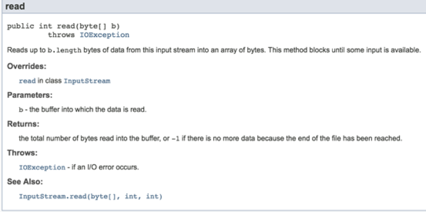
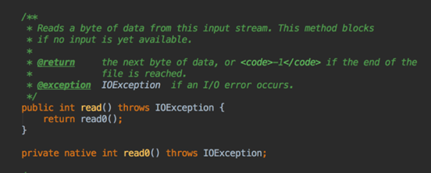
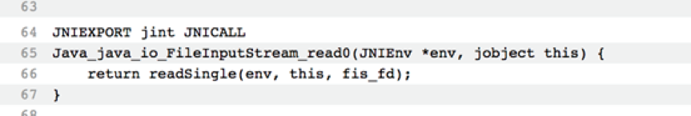
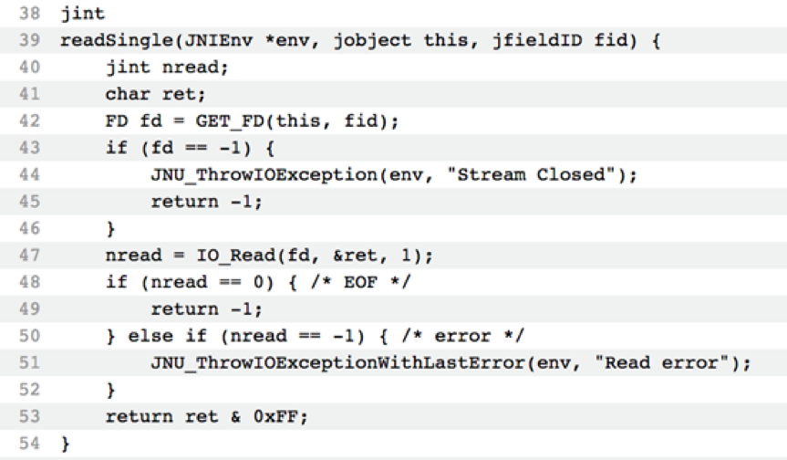
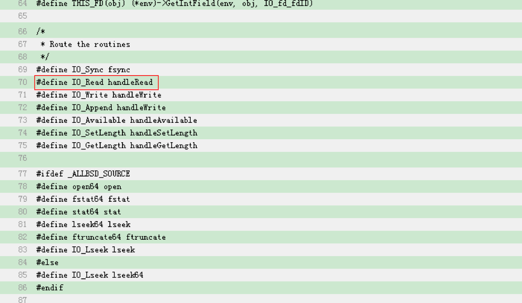
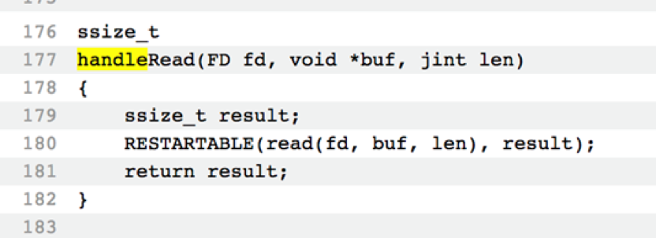
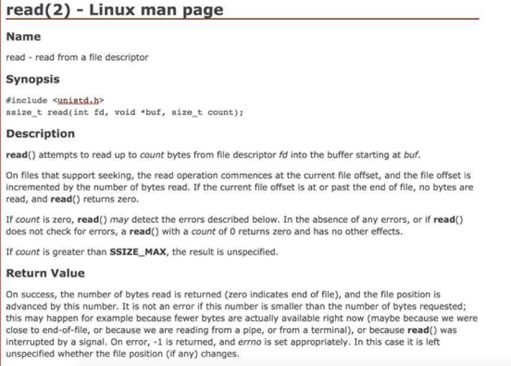

# Java的EOF标识？

&emsp;这篇是关于JAVA中EOF标识的讲解，之前在工作上碰到过一个问题，有人问过，不能通过判断EOF来知道文件有没有读取完毕吗？其实，还真不能。

&emsp;直接从JDK接口文档入手，以FileInputStream为例，JDK接口文档给出了明确的说明：

 

&emsp;使用FileInputStream的read方法读取文件时，当返回-1就表明读到了文件末尾，如果期间出现IO异常，则会抛出一个IOException。而对于EOF文件结束符，其实是不存在的。在Linux系统之中，EOF根本不是一个字符，而是当系统读取到文件结尾，所返回的一个信号值，例如在C语言中，EOF是一个定义在头文件stdio.h的常量，一般等于-1。对于JAVA的实现，我们可以通过查看FileInputStream的源码查看，如下：

 

&emsp;其中read0为native方法，需要查看jvm源码。根据JVM源码定位进去，发现read0调用readSingle方法：

 

&emsp;源码看这FileInputStream.c（[http://hg.openjdk.java.net/jdk8u/jdk8u/jdk/file/5b86f66575b7/src/share/native/java/io/FileInputStream.c](http://hg.openjdk.java.net/jdk8u/jdk8u/jdk/file/5b86f66575b7/src/share/native/java/io/FileInputStream.c)）

&emsp;而readSingle方法位于io_util.c中：

 

&emsp;搓这里io_util.c（[http://hg.openjdk.java.net/jdk8u/jdk8u/jdk/file/5b86f66575b7/src/share/native/java/io/io_util.c](http://hg.openjdk.java.net/jdk8u/jdk8u/jdk/file/5b86f66575b7/src/share/native/java/io/io_util.c)）
跟踪IO_Read方法，可以得到如下源码实现：

 

&emsp;源文件分别位于io_util_md.h([http://hg.openjdk.java.net/jdk/jdk/file/bd45ce23b1ac/src/java.base/unix/native/libjava/io_util_md.h](http://hg.openjdk.java.net/jdk/jdk/file/bd45ce23b1ac/src/java.base/unix/native/libjava/io_util_md.h))和io_util_md.c([http://hg.openjdk.java.net/jdk/jdk/file/bd45ce23b1ac/src/java.base/unix/native/libjava/io_util_md.c](http://hg.openjdk.java.net/jdk/jdk/file/bd45ce23b1ac/src/java.base/unix/native/libjava/io_util_md.c))

&emsp;所以，其实read方法最后还是调用了操作系统的read方法,该方法跟具体的操作系统相关，在linux下，有如下的说明
 
&emsp;也就是，当使用read方法去读文件时，如果读到了文件末尾，没有字符返回时，则该方法返回0，如果出现异常，则返回-1.然后，JDK在readSingle方法里进行了包装，如果返回0，则在JDK层面返回-1，如果返回-1，则抛出IOException.因而，JAVA中没有EOF这个标识符，而是使用-1来标识文件结束。

