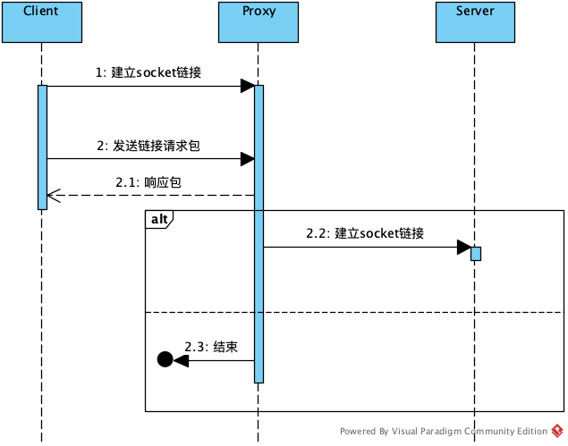
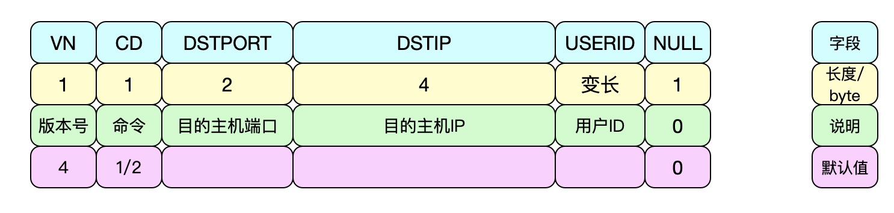
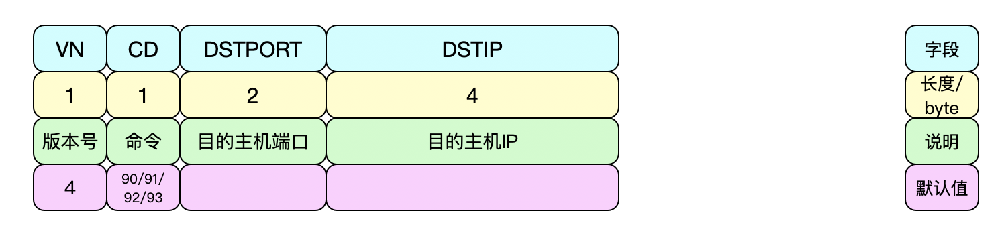
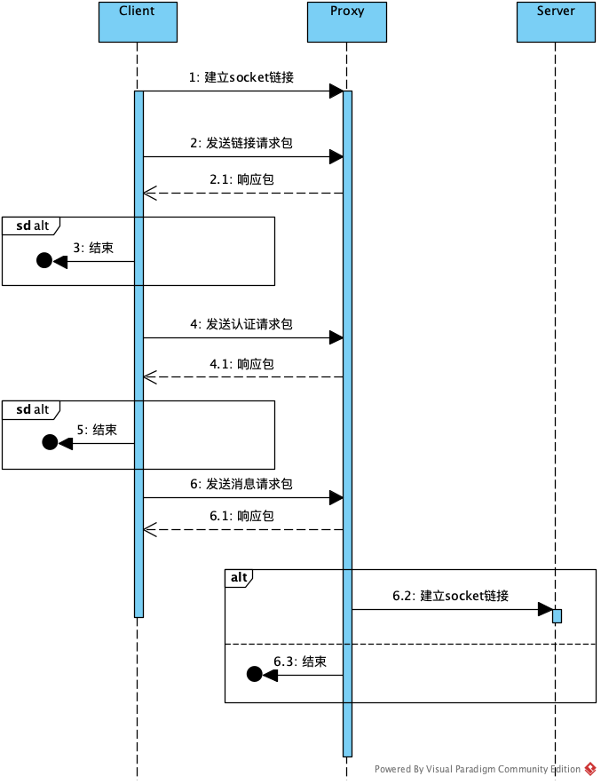
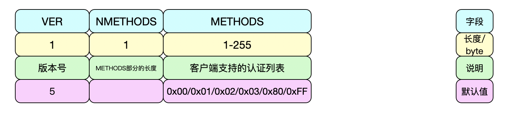
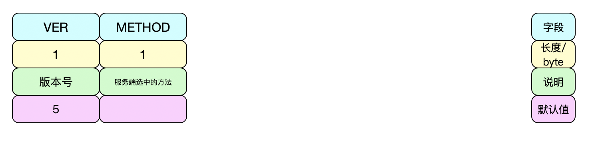
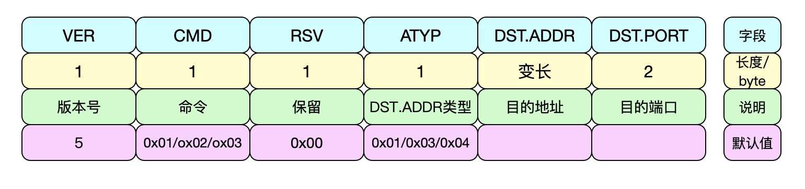
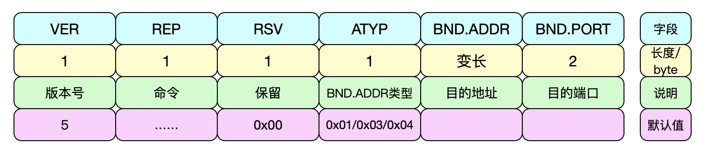

# Socks协议


SOCKS：防火墙安全会话转换协议 （Socks: Protocol for sessions traversal across firewall securely） SOCKS协议提供一个框架，为在 TCP和UDP域中的客户机/服务器应用程序能更方便安全地使用网络防火墙所提供的服务。协议工作在OSI参考模型的第5层(会话层)，使用TCP协议传输数据，因而不提供如传递ICMP信息之类的网络层网关服务。

当防火墙后的客户端要访问外部的服务器时，就跟SOCKS代理服务器连接。这个代理服务器控制客户端访问外网的资格，允许的话，就将客户端的请求发往外部的服务器。Socks不要求应用程序遵循特定的操作系统平台，Socks 代理与应用层代理、 HTTP 层代理不同，Socks代理只是简单地传递数据包，而不必关心是何种应用协议（比如FTP、HTTP和NNTP请求）。所以，Socks代理比其他应用层代理要快得多。它通常绑定在代理服务器的1080端口上。

这个协议最初由David Koblas开发，而后由NEC的Ying-Da Lee将其扩展到SOCKS4。最新协议是
SOCKS5，与前一版本相比，增加支持UDP、验证，以及IPv6。

#### 1. Socks4

Socks4的建立过程如下：



1.客户端先跟代理服务器建立socket连接

2.客户端向代理服务器发送链接请求包，第一个包的格式为



3.代理服务器收到第一个包后根据实际情况作出判断，并给客户端发送响应包，格式为：



4.当代理服务器返回拒绝后则直接断开客户端链接；否则充当客户端与目的主机之间建立连接并进行双向传递，对客户端而言，就如同直接在与目的主机相连。

#### 2. Socks5

SOCKS5比SOCKS4a多了验证、IPv6、UDP支持。

Socks5的建立过程如下：



1.客户端先跟代理服务器建立socket连接

2.客户端向代理服务器发送链接请求包，该包用来确认协议版本及认证方式，格式为：



3.代理服务器从客户端提供的方法中选择一个认证方法并通过回包来通知客户端，格式为：



当返回结果为OXFF(代理服务端无可接受认证方法)时，客户端需要关闭连接，流程结束。

4.选定认证方法后，客户端和代理服务器需要根据选定的认证方式执行对应的认证。如果认证失败则中断链接。

5.认证通过后，客户端则向代理服务器发起请求，第一个包格式为：



6.代理服务器收到包后进行处理，作出判断后发送回包，回包格式为：



7.当代理服务器返回拒绝后则直接断开客户端链接；否则充当客户端与目的主机之间建立连接并进行双向传递，对客户端而言，就如同直接在与目的主机相连。

#### 3. Jsocks

github上实现socks协议的项目有很多，这里选jsocks()[https://github.com/ravn/jsocks](https://github.com/ravn/jsocks))来说明。顾名思义，jsock是用Java写的，项目本身实现了socks4和socks5协议。

jsocks实现功能同上面大体相同，代码也比较简单，这边不做说明。这里只提一点jsocks里的认证方式，在源码的```IdentAuthenticator```类里。这个类没有使用用户名密码方式，也没有自定义认证协议，而是直接通过判断协议里的用户名跟客户端的发起方是否是同一个人来进行验证。

实现上在验证方式上选择```无需验证```，然后为每个请求方的ip范围分配一个用户，只有对应用户才能继续往下走。jsocks通过访问客户端的113端口来判断发起方同配置中的用户是否一致，只有匹配的用户流程才能继续玩下走。113端口是一个许多计算机上运行的协议，用于鉴别TCP连接的用户。相当于把socks5原来的认证流程换为了代理服务器主动访问客户端进行验证。当验证通过后，jsocks这时候会持有客户端的socket(RemoteSocket)，并代替客户端向目标地址发起socket(OutSocket)连接，后面会循环把RemoteSocket的数据流写入到OutSocket里以完成数据的传输。

#### 4. 参考资料

[https://zh.wikipedia.org/wiki/SOCKS](https://zh.wikipedia.org/wiki/SOCKS)
