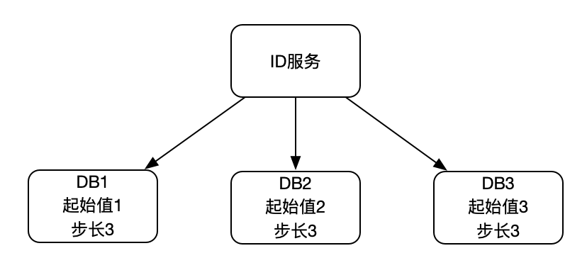
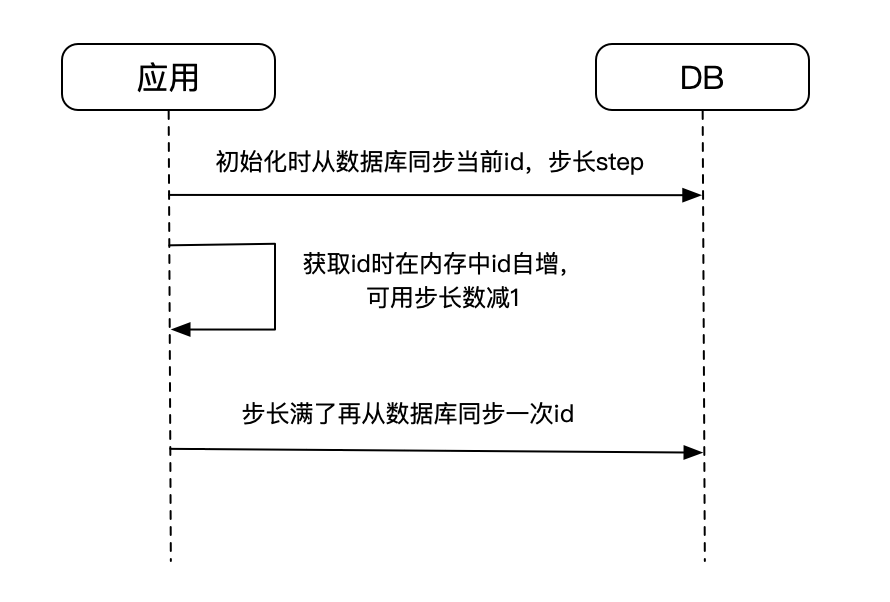
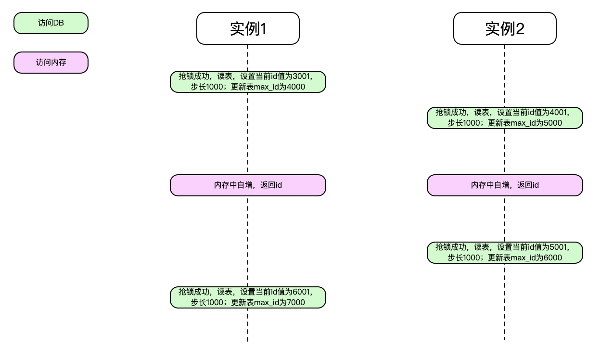
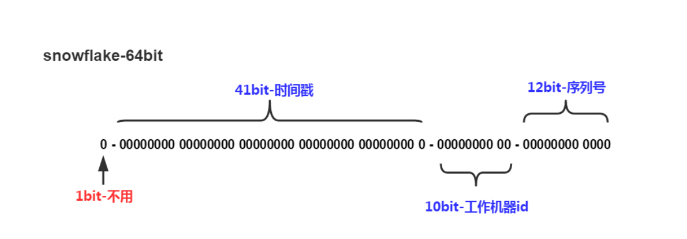

# 常见的分布式唯一ID方案


最近看一个新系统，发现里面有很多场景用到唯一id，便搜罗了一下常见的方案。

对于分布式id，需要满足下面的基本要求

1. 全局唯一
2. 趋势递增

#### 1. UUID

UUID（Universally Unique Identifier）全局唯一标识符，定义为一个字符串主键，采用32位数字组成，编码采用16进制，定义了在时间和空间都完全惟一的系统信息。

UUID的编码规则：

1. 1~8位采用系统时间，在系统时间上精确到毫秒级保证时间上的惟一性；
2. 9~16位采用底层的IP地址，在服务器集群中的惟一性；
3. 17~24位采用当前对象的HashCode值，在一个内部对象上的惟一性；
4. 25~32位采用调用方法的一个随机数，在一个对象内的毫秒级的惟一性。

通过以上4种策略可以保证惟一性。在系统中需要用到随机数的地方都可以考虑采用UUID算法。

UUID可能会是大家很快想到的，因为它现成，全球唯一，不需要中心协调器来控制唯一。主流语言中都会有内置现成的api直接生成。但却不推荐，因为它

1. 无序，没有自增趋势，作为主键插入效率低下（如MySql）
2. 过长，浪费存储空间
3. 无法存储业务逻辑，可读性差，当然如果你的id没有长度限制，可以通过拼接前缀/后缀来增加信息

#### 2. 中心协调器类

可以引入中心协调器类，通过该系统自带的特性来完成id的生成和分配。

#### 2.1 数据库自增主键

Don't say so match，大家应该都用过，通过DB的```auto_increment```自增主键来控制id的唯一以及有序，使用简单。当然缺点也是明显的，依赖DB存在单点问题，当然可以通过主从模式来解决单点问题。

网上还有有人介绍了自增主键的另一种模式，如下



引入多实例，为每个实例设置初始值以及固定的步长来降低单点的风险，以及分摊DB压力。当然只是降低，单点问题还是存在的，同时还不容易扩容，也需要客户端做支持。对于趋势递增则需要ID服务来维持，它需要轮训访问后端的各个DB实例，以维持趋势递增的特性。

#### 2.2 Redis

Redis提供了```incr```命令可以实现id的原子性自增，能够达到类似DB的auto_increment的效果。使用Redis需要注意持久化的问题，避免Redis重启后数据丢失导致id重复。

#### 2.3 ZooKeeper

zookeeper自带生成顺序节点的功能，可以使用其生成顺序节点的编号来作为id。客户端创建完节点后，通过解析返回的节点名来获得当前分配的id。

中心协调器类其实都差不多，将id的生成转到中心协调器上。

#### 3. 数据库号段

数据库号段的方式如下：



涉及的表结构如下：


type字段用来区分不同的业务，隔离不同业务之间的相互影响；max_id字段则表示当前业务类型已经分配的最大id值，下一次分配则从该值开始；step为步长；state用来做锁控制，这里用的是乐观锁，也可以不用该字段，改为行锁(```select ... for update```)。

以bizType1为例，数据库中记录着bizType1的下一个id起始值3000，以及对应的步长1000。当应用启动后首次使用时，尝试去获取bizType1这条记录的锁，获取到锁的应用读取max\_id和step的值，同步更新到内存，然后将max\_id的值加上步长后更新回表中，这个值便是下一个id的起始值。当应用实例内存中的步长没有消耗完前，直接通过应用内部自己自增返回id，避免频繁请求DB。当应用消耗完后则再次访问DB同步更新max\_id和step，反复循环下去。



开头讲到的最近接触的新系统用的就是号段的方式来生成唯一id，但它不是用乐观锁的方式而是用行锁。测试环境给的步长比较小，刚好测试同学在做压测造数据的时候并发开的大，导致抢锁锁频繁抛异常了。当然如果使用乐观锁也会存在饥饿的情况，会导致一直获取不到锁而一直忙等。

看完上面的过程，其实核心点在于有个第三方系统来提供锁和存储以及应用端的配合，所以其实不用DB也可以实现该功能。

#### 4. Snowflake雪花算法

相信大家都听过这个算法，都知道这个算法是由Twitter提出来的，既然大家都知道就不多说了，那大家也都看过下面这张图：



该算法使用一个64 bit的整型数据，包括

1. 首位不用的1个bit(最高位是标识位，为1表示为负数，不使用)
2. 41个bit的毫秒级时间(41位的长度可以使用69年)，
3. 10个bit的工作机器id，包括5个bit的datacenterId和5个bit的workerId(10位的长度最多支持部署1024个节点）
4. 12个bit的毫秒内的计数（12位的计数顺序号支持每个节点每毫秒产生4096个ID序号）

一共加起来刚好64位，为一个Long型。

Snowflake算法核心把时间戳，工作机器id，序列号组合在一起。整体上按照时间自增排序，并且整个分布式系统内不会产生ID碰撞（由datacenter和机器ID作区分），并且效率较高，经测试，snowflake每秒能够产生26万id左右，完全满足需要。

Snowflake算法中41个bit的时间戳完全依赖于时间的，如果有```时钟回拨```的情况发生，则会生成重复的id。时钟回拨涉及两种情况

1. 实例停机→时钟回拨→实例重启→计算ID

2. 实例运行中→时钟回拨→计算ID

对于时间回拨，网上给出了很多处理方法，包括：

1. 如果发现有时钟回拨，时间很短比如5毫秒,就等待，然后再生成；或者就直接报错，交给业务层去处理
2. 可以找2bit位作为时钟回拨位，发现有时钟回拨就将回拨位加1，达到最大位后再从0开始进行循环
3. 实例启动后，改用内存生成时间，如百度开源的UidGenerator，该方式可以解决时钟回拨的第2种情况。对于时钟回拨的第1中情况，UidGenerator在实例启动后使用未分配过的工作机器id来解决，当然这样做就得管理工作机器id，因而需要一个外部存储，增加了复杂度。
