# MySQL InnoDB索引那点事儿

总结下之前看到的一些关于MySQL索引原理的内容，好记性不如烂笔头。

#### 1. B+树

我们知道InnoDB的索引是以B+树的形式组织的。B+树是一种树数据结构，是一个n叉树，每个节点通常有多个孩子，一颗B+树包含根节点、内部节点和叶子节点。

下面是B+树的示例：

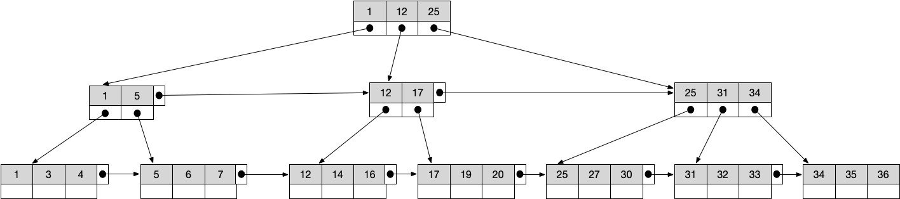

B+树把所有的数据都存储在叶子节点中，内部节点只存放关键字和孩子指针，因此最大化了内部节点的分支因子，所以B+树的遍历也更加高效。

B+树通常用于数据库和操作系统的文件系统中，其特点是能够保持数据稳定有序，其插入与修改拥有较稳定的对数时间复杂度。B+树适合作为数据库的基础结构，完全是因为计算机的内存-机械硬盘两层存储结构。内存可以完成快速的随机访问（随机访问即给出任意一个地址，要求返回这个地址存储的数据）但是容量较小。而硬盘的随机访问要经过机械动作（1磁头移动、2盘片转动），访问效率比内存低几个数量级，但是硬盘容量较大。典型的数据库容量大大超过可用内存大小，这就决定了在B+树中检索一条数据很可能要借助几次磁盘IO操作来完成。

使用B+树作为索引结构有如下优势：

1.B+树非叶子节点上是不存储数据的，仅存储键值**（聚集索引）**。

之所以这么做是因为在数据库中页的大小是固定的，InnoDB中页的默认大小是 16KB。如果不存储数据，那么就会存储更多的键值，相应的树的阶数（节点的子节点树）就会更大，树就会更矮更胖，如此一来查找数据进行磁盘的 IO 次数又会再次减少，数据查询的效率也会更快。

另外真实数据库中的B+树应该是非常扁平的，其阶数是等于键值的数量的，如果我们的B+树一个节点可以存储1000个键值，那么3层B+树可以存储1000×1000×1000=10亿个数据。一般根节点是常驻内存的，所以一般我们查找10亿数据，只需要2次磁盘IO。

2.B+树索引的所有数据均存储在叶子节点，而且数据是按照顺序排列的。因而B+树使得范围查找，排序查找，分组查找以及去重查找变得异常简单。

#### 2.InnoDB页存储结构

#### 2.1 存储结构

存储引擎中所有数据都被存储在表空间中，表又由Segment(段)、Extent(区)、Page(页)组成，如下为MySQL技术内幕中介绍的InnoDB逻辑存储结构：

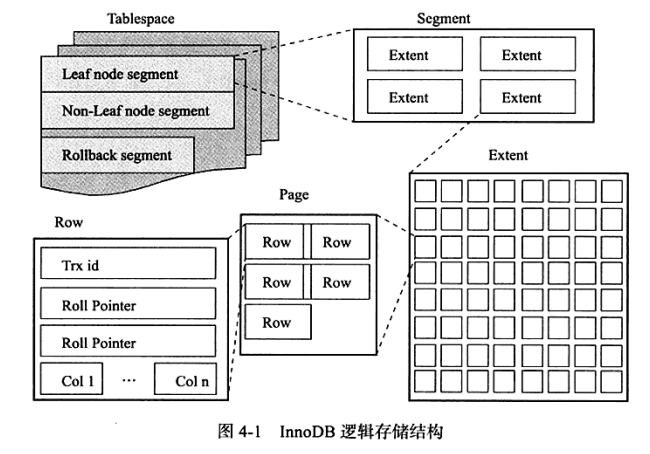

1.表空间：在默认情况下，InnoDB存储引擎有一个共享表空间 ibdata1，所有的数据都放在这个表空间内.如果启用了innodb\_file\_per\_table参数，每张表的表空间只存放数据、索引和插入缓冲bitmap页，其他的数据如undo信息、插入缓冲、double write buffer等还是存放在共享表空间中。

2.段：常见的段有数据段、索引段、回滚段等。数据段是B+树的叶子结点，索引段为B+树的非叶子结点

3.区：区由连续页组成，每个区大小固定为1MB，为保证区中page的连续性通常InnoDB会一次从磁盘中申请4-5个区。在默认page的大小为16KB的情况下，一个区则由64个连续的page。

4.页：页是InnoDB磁盘管理的最小单位也叫做块，默认大小为16kB。常见的页有数据页、undo页、系统页等。类型为B-tree Node的页存放的即是表中行的实际数据

5.行：InnoDB存储引擎中数据是按行进行存放的，每个页中最多存放7992行记录

#### 2.2 页结构

Page是整个InnoDB存储的最基本构件，也是InnoDB磁盘管理的最小单位，与数据库相关的所有内容都存储在这种Page结构里。每个Page使用一个32位的int值来唯一标识，这也正好对应InnoDB最大64TB的存储容量（16Kib * 2^32 = 64Tib）。一个Page的结构如下所示：

涉及的内容包括：

1. 页头(Page Header)：记录页面的控制信息，包括页的左右兄弟页面指针、页面空间使用情况等

2. Infimum(最小虚记录)/Supremum(最大虚记录)：两个固定位置存储的虚记录，本身并不存储数据。最小虚记录比任何记录都小，而最大虚记录比任何记录都大。这两个用来代表开头结尾的Record存储在System Records的段里,这个System Records和User Records是两个平行的段。

3. 记录堆(Record Heap)：也称为User Records,以链表的形式存储一条条行记录，表示页面已分配的记录空间，也是索引数据的真正存储区域。记录堆分为两种，即有效记录(黄色)和已删除记录(紫色)。有效记录就是索引正常使用的记录，而已删除记录表示索引已经删除，不再使用的记录。随着记录的更新和删除越来越频繁，记录堆中已删除记录将会越多，即会出现越来越多的空洞（碎片）。这些已删除记录连接起来，就会成为页面的自由空间链表。

4. 未分配空间(Free Space)：指页面未使用的存储空间，随着页面不断使用，未分配空间将会越来越小。当新插入一条记录时，首先尝试从自由空间链表中获得合适的存储位置（空间足够），如果没有满足的，就会在未分配空间中申请。

5. Slot区：也称为Page Directory，页中某些记录的相对位置，用于提升查询效率。slot是一些页面有效记录的指针，每个slot占两个字节，存储了记录相对页面首地址的偏移。如果页面有n条有效记录，那么slot的数量就在n/8+2~n/4+2之间，它是记录页面有序和二分查找的关键。

6. 页尾(Page Tailer)：页面最后部分，占8个字节，主要存储页面的校验信息。

上面提到，页头里包含了唯一id，页的左右兄弟页面指针，从而可以将页抽象为如下结构：

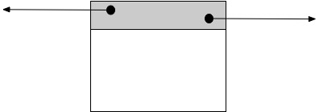

Page的头部保存了两个指针，分别指向前一个Page和后一个Page，根据这两个指针我们很容易想象出Page链接起来就是一个双向链表的结构。

InnoDB的行数据和索引的存储都位于User Records，存在4种不同的Record，它们分别是：

1. 主键索引树非叶节点
2. 主键索引树叶子节点
3. 辅助键索引树非叶节点
4. 辅助键索引树叶子节点

这4种节点的Record格式有一些差异，但是它们都存储着Next指针指向下一个Record。User Record在Page内以单链表的形式存在，最初数据是按照插入的先后顺序排列的，但是随着新数据的插入和旧数据的删除，数据物理顺序会变得混乱，但他们依然保持着逻辑上的先后顺序。

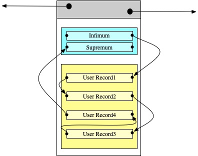

将该结构扩展到多个页就有如下形式：

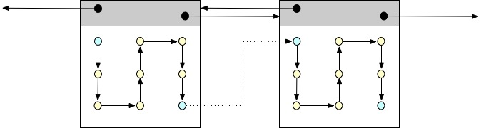

根据最大最小虚记录将多个页内记录的顺序连接起来。

#### 2.3 页内查询

前面提到User Records中的记录是以单链表的形式存在，这样在插入一条记录时，只要修改前后两条记录的指针就行，这样就可以避免记录的移动同时保证了有序性。但是，带来的问题是，链表是无法在对数时间内使用二分查找，这样的设计会导致查询效率低下。为了高效的在一个页中查找指定的一条记录，InnoDB使用Page Directory提供了解决方案。

InnoDB会将一个页中的所有记录划分成若干个组，每组4-8个记录。将每个组最后一个记录相对于第一个记录的地址偏移量（可以定位到真实数据记录）提取出来存放在页中一个叫做Page Directory的数组中，数组中的元素就是这些地址偏移量，也称为槽(slot)。

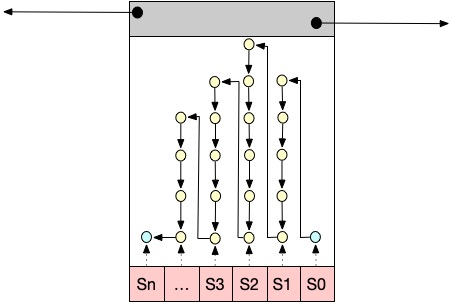

所以在一个页中根据主键查找记录是很快的，步骤为：

1. 二分法确定该记录所在的槽，并找到该槽所在分组中主键值最小的那条记录。
2. 通过next_record属性遍历单链表找到记录

对于插入操作，首先通过查询的方式确定插入的位置，在自由空间链表或未分配空间中获得空间并写记录内容，slot所指向的链高度加1，同时维护好原链表的关系。

插入记录后，如果Slot支链高度超过8，那么就将该支链拆分为两个子链，同时多申请一个slot（平移此slot及其后面的空间）。

#### 3. 索引结构

MySql提供了两种索引存储方式，一种叫做聚簇索引，一种叫做非聚簇索引。

#### 3.1. 聚簇索引

行数据和主键B+树存储在一起，辅助键B+树只存储辅助键和主键，主键和非主键B+树几乎是两种类型的树。InnoDB使用的是聚簇索引，将主键组织到一棵B+树中，而行数据就储存在叶子节点上。

考虑如下的数据：

其中Id作为主索引，Name作为辅助索引，则聚集索引的结构如下：

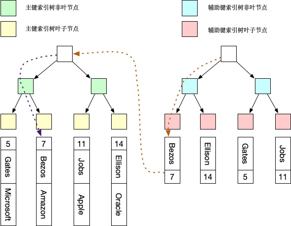

当通过主键索引查找数据时，会连带返回对应的记录。当通过辅助键查找数据时，根据索引找到叶子节点中的主键值，根据主键值再到聚簇索引中得到完整的一行记录，该行为也即我们常说的回表。需要说明一点的是，对于联合主键，当存在辅助索引时，辅助索引也会保留联合主键的多个字段，从而影响到索引文件的大小。

下面以开头的B+树为例，再结合Page结构，展示其内部组织方式（只展示其中一部分）：

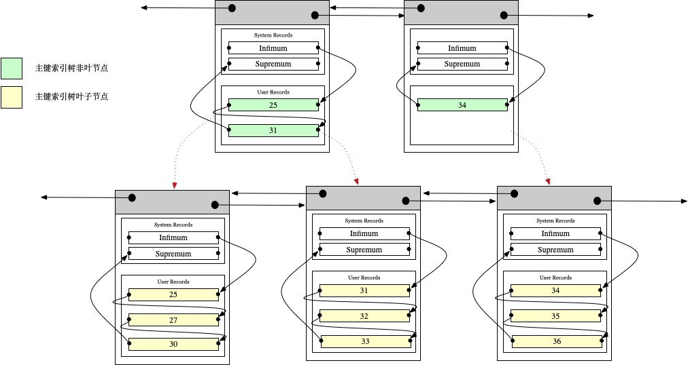

注意Page和B+树节点之间并没有一一对应的关系，Page只是作为一个Record的保存容器，它存在的目的是便于对磁盘空间进行批量管理。

#### 3.2 非聚簇索引

主键B+树在叶子节点存储指向真正数据行的指针，而非主键。MyISAM使用的是非聚簇索引，非聚簇索引的两棵B+树看上去没什么不同，节点的结构完全一致只是存储的内容不同而已，

对于上面的表数据，非聚集索引的结构如下：

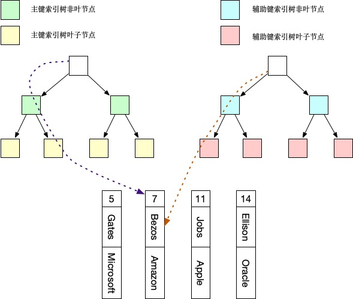

非聚集索引中，主键索引B+树的节点存储了主键，辅助键索引B+树存储了辅助键。表数据存储在独立的地方，这两颗B+树的叶子节点都使用一个地址指向真正的表数据，对于表数据来说，这两个键没有任何差别。由于索引树是独立的，通过辅助键检索无需访问主键的索引树。

#### 3.3 联合索引

联合索引又叫复合索引。对于复合索引，Mysql从左到右的使用索引中的字段，一个查询可以只使用索引中的一部份，但只能是最左侧部分，即我们常说的最左前缀匹配原则。由于联合索引的匹配是从做往右进行，且不能跳过中间列，因而在设计联合索引时最好按照列的索引区分度来排序。

#### 4. InnoDB内存管理

InnoDB存储引擎的内存管理主要采用预分配内存空间的方式，数据以页为单位加载进内存池，交由后台线程使用并进行维护：

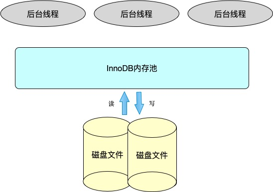

其中内存池的主要工作包括：

1. 维护所有进程/线程需要访问的多个内部数据结构
2. 缓存磁盘上的数据，方便快速读取，同时在对磁盘文件修改之前进行缓存
3. 缓存重做日志（redo log）

后台线程的主要工作包括:

1. 刷新内存池中的数据，保证缓冲池中缓存的数据最新
2. 将已修改数据文件刷新到磁盘文件
3. 保证数据库异常时InnoDB能恢复到正常运行状态

这里主要关注内存池的管理，上图中缓冲池用于存放各种数据的缓存，缓冲池中的页可以分为：空闲页、数据页和脏页，如下：

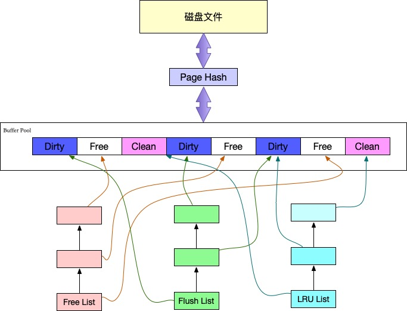

Page Hash用于维护内存Page和文件Page的映射关系，同时维护3个列表用于管理空闲页、数据页以及脏页的装载和淘汰。

1.LRU List

Innodb总是将磁盘中的数据按页为单位读取到缓冲池，然后按LRU算法来保存缓冲池中的数据，即最频繁使用的页在LRU列表的前端，而最少使用的页在LRU列表的尾端。当缓冲池不能存放新读取到的页时，将首先释放LRU列表中尾端的页。稍有不同的是InnoDB存储引擎对传统的LRU算法做了一些优化。在InnoDB的存储引擎中，LRU列表中还加入了midpoint位置。新读取到的页，虽然是最新访问的页，但并不是直接放入到LRU列表的首部，而是放入到LRU列表的midpoint位置，等待一定时间后再加入到LRU列表的new端成为热点数据。在默认配置下，midpoint在LRU列表长度的5/8处。

这样做的原因在于，若直接将读取到的page放到LRU的首部，那么某些SQL操作可能会使缓冲池中的page被刷出。常见的这类操作为索引或数据的扫描操作。这类操作访问表中的许多页，而这些页通常只是在这次查询中需要，并不是活跃数据。如果直接放入到LRU首部，那么非常可能将真正的热点数据从LRU列表中移除，在下一次需要时，InnoDB需要重新访问磁盘读取，这样性能会低下。

2.Free List

LRU列表用来管理已经读取的页，但当数据库刚启动时，LRU列表是空的，即没有任何的页。这时页都存放在Free列表中。当需要从缓冲池中分页时，首先从Free列表中查找是否有可用的空闲页，若有则将该页从Free列表中删除，放入到LRU列表中。否则，根据LRU算法，淘汰LRU列表末尾的页，将该内存空间分配给新的页。

3.Flush List

在LRU列表中的页被修改后，称该页为脏页，即缓冲池中的页和磁盘上的页的数据产生了不一致。这时数据库会通过CHECKPOINT机制将脏页刷新回磁盘，而Flush列表中的页即为脏页列表。需要注意的是，脏页既存在于LRU列表中，也存在于Flush列表中。LRU列表用来管理缓冲池中页的可用性，Flush列表用来管理将页刷新回磁盘，二者互不影响。

