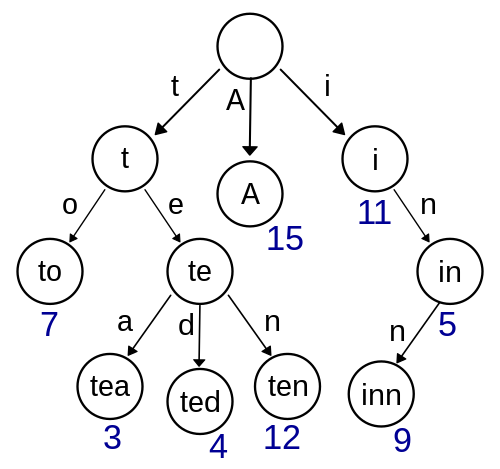
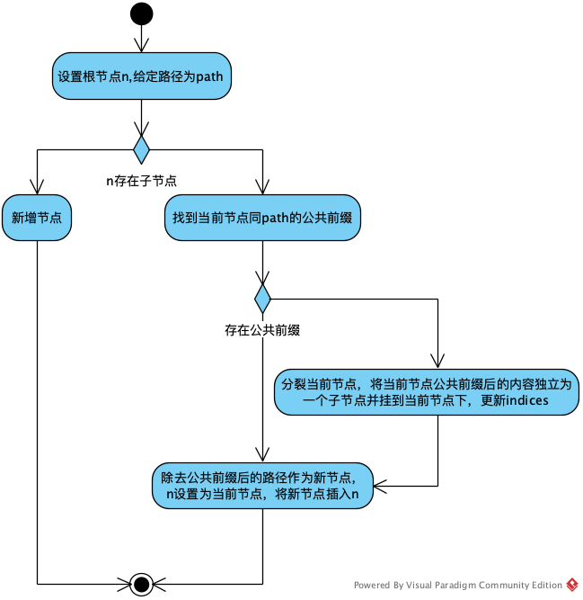
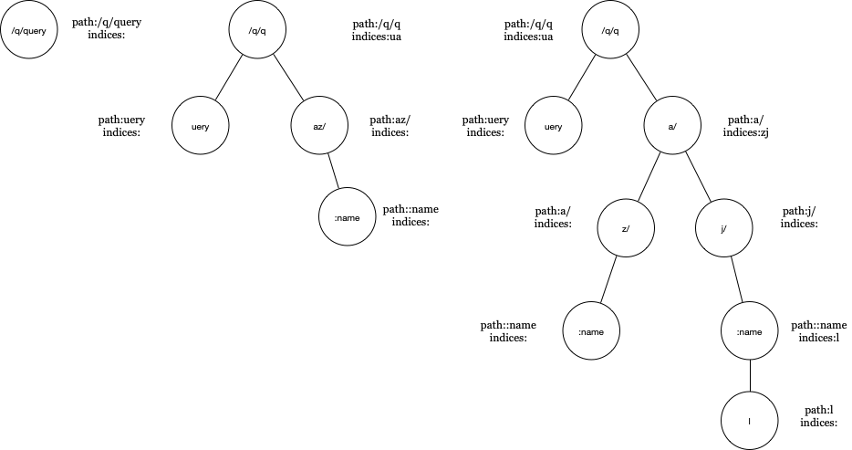
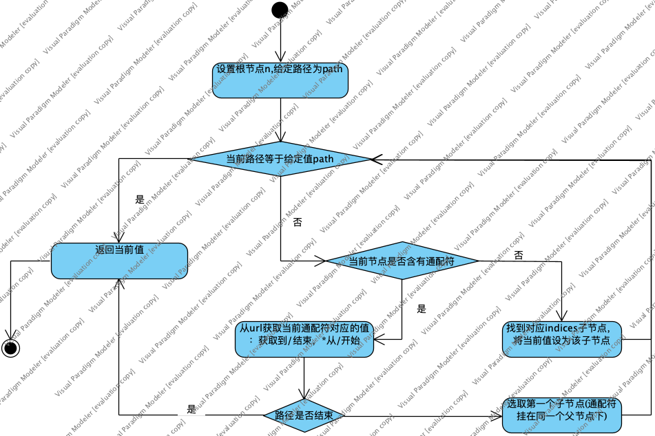
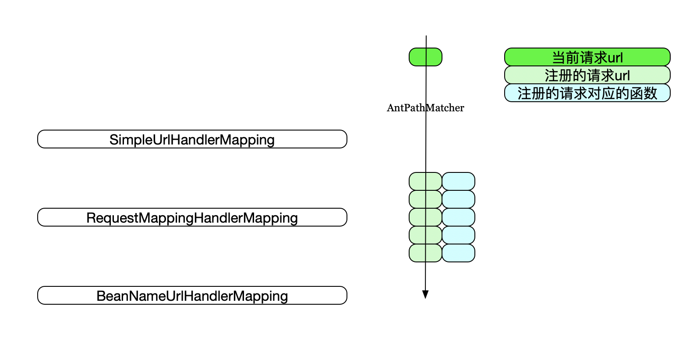

# 动态路由:Gin vs SpringMVC


&emsp;这两天在接触Gin，对它的动态路由功能比较感兴趣，特意做了笔记，顺便跟SpringMVC作下对比。

##### 1.简介

&emsp;Gin是使用Go/golang语言实现的HTTP Web框架。接口简洁,性能极高。截止1.4.0版本,包含测试代码,仅14K,其中测试代码9K左右,也就是说框架源码仅5K左右。SpringMVC不用过多介绍，Java市场的一把手。

&emsp;Gin支持动态路由，简单示例如下：

```
import (
"github.com/gin-gonic/gin"
"net/http"
)

func main() {
    r := gin.Default()
    r.GET("/hello/:name", func(context *gin.Context) {
        context.String(http.StatusOK, "Hello : "+context.Param("name"))
    })
    r.Run()
}
```

对比SpringMVC的例子为：

```
import org.springframework.web.bind.annotation.PathVariable;
import org.springframework.web.bind.annotation.RequestMapping;
import org.springframework.web.bind.annotation.RestController;

@RestController
public class HelloWorldController {


@RequestMapping("/hello/{name}")
public String antUser (@PathVariable("name") String name) {
    return "Hello : " + name;
}

}
```

二者有相似的地方。

##### 2.Gin

&emsp;Gin使用Trie树来实现动态路由。Trie树,即字典树,又称单词查找树或键树,是一种树形结构,是一种哈希树的变种。典型应用是用于统计和排序大量的字符串（但不仅限于字符串），所以经常被搜索引擎系统用于文本词频统计。它的优点是：最大限度地减少无谓的字符串比较，查询效率比哈希表高。

&emsp;Trie的核心思想是空间换时间。利用字符串的公共前缀来降低查询时间的开销以达到提高效率的目的。它有3个基本性质：

1. 根节点不包含字符，除根节点外每一个节点都只包含一个字符。
2. 从根节点到某一节点，路径上经过的字符连接起来，为该节点对应的字符串。
3. 每个节点的所有子节点包含的字符都不相同。



如上图示，为一个保存了8个键的trie结构，"A", "to", "tea", "ted", "ten", "i", "in", "inn"。其中，键标注在节点中，值标注在节点之下。每一个完整的英文单词对应一个特定的整数。Trie可以看作是一个确定有限状态自动机，尽管边上的符号一般是隐含在分支的顺序中的。

&emsp;Trie数的常见应用场景包括：

1. 字符串检索
2. 词频统计
3. 前缀检索
4. 前缀词频统计
5. 对所有的字符串按照字典序排序

&emsp;Gin的路由实现也是跟上面的例子类似，具体实现在tree.go文件里，主要包括trie树的构建和查找过程。

##### 2.1. 建树过程

&emsp;先看node的定义

```
type node struct {
    path      string           // 当前节点相对路径,即公共前缀
    indices   string           // 所有孩子节点的path[0]组成的字符串，如果子节点有通配符，则为空
    children  []*node          // 孩子节点
    handlers  HandlersChain    // 当前节点的处理函数（包括中间件）
    priority  uint32           // 当前节点及子孙节点的实际路由数量
    nType     nodeType         // 节点类型
    maxParams uint8            // 子孙节点的最大参数数量
    wildChild bool             // 孩子节点是否有通配符（wildcard）
    fullPath  string           // 完整的请求路径，各中间节点也有
}
```

建树过程主要由两个方法来完成

```
// 根据给定的路径增加一个节点，主要用于处理公共前缀的分割
func (n *node) addRoute(path string, handlers HandlersChain) {}

// 主要用于处理新节点的插入
func (n *node) insertChild(numParams uint8, path string, fullPath string, handlers HandlersChain) {}
```

流程如下：


使用addRoute方法从根节点添加一个新的路径P，如果树为空，则作为新节点直接插入，此时该节点为树中的第一个节点(根节点)，path和fullPath值都为P。如果根节点存在子节点，则找到P跟根节点path的公共前缀，如果不存在公共前缀，则将新节点作为根节点的子节点加入，使用insertChild方法。如果存在公共前缀，则分裂当前节点，将根节点(当前节点)公共前缀后的内容独立为一个子节点，并挂到当前节点下，更新indices；接着获取P去掉公共前缀的第一个字符，判断当前节点indices列表是否存在相同的字符，即判断剩下的内容是要作为新节点加入，还是要继续分裂，如果需要继续分裂，则重复addRoute方法。

&emsp;以下面这段代码为例，

```
r.GET("/q/query", func(context *gin.Context) {
    context.String(http.StatusOK,"Hello "+context.Query("name"))
})
r.GET("/q/qaz/:name", func(context *gin.Context) {
    context.String(http.StatusOK,"Hello "+context.Query("name"))
})
r.GET("/q/qaj/:name/l", func(context *gin.Context) {
    context.String(http.StatusOK,"Hello "+context.Query("name"))
})
```

构建的trie树为：




这里需要指出的是，对于通配符，:xxxx或者*，会作为一个单独的节点出现。

##### 2.2. 查找过程

查找过程比较简单，直接从根节点往下找，知道找到匹配的节点，过程如下：




##### 3.SpringMVC

&emsp;如下为一个简单的示例：

```
@RestController
public class HelloWorldController {

@RequestMapping("/hello/{name}")
public String antUser (@PathVariable("name") String name) {
    return "hello : " + name;
}

}
```

&emsp;之前在介绍《SpringMVC加载流程》是说过，Spring MVC路由的加载是由RequestMappingHandlerMapping来处理的。该类会查找所有符合条件的Method上的注解，然后添加到父类AbstractHandlerMethodMapping的MappingRegistry中封装为HandlerMethod进行缓存，直接以HashMap的方式。除了RequestMappingHandlerMapping外还有其他HandlerMapping,如SimpleUrlHandlerMapping,BeanNameUrlHandlerMapping等。

&emsp;当查找符合的HandlerMethod时会遍历所有的HandlerMapping，如果某HandlerMapping能够处理，返回对应的HandlerExecutionChain,同时退出循环，由HandlerAdapter来执行具体的Method,Apdater会完成入参的注入。而RequestMappingHandler的动态路由则体现在HandlerMethod的查找上，该功能主要由AbstractHandlerMethodMapping的lookupHandlerMethod方法来实现。lookupHandlerMethod方法会遍历MappingRegistry中的所有注册对象，通过PatternsRequestCondition的getMatchingCondition来判断，具体交由AntPathMatcher来实现。

&emsp;AntPathMatcher主要用来做类URLs字符串匹配,可以匹配的规则如下：

* ？匹配一个字符
* *匹配0个或多个字符
* **匹配0个或多个目录

具体实现在doMatch方法中。

即SpringMVC是通过遍历所有注册的Url，对每个Url应用AntPathMatcher来判断当前请求的Url是否符合注册的通配符写法，从而找到对应的处理函数。

如下为简单的示意图：



##### 4.参考

[https://zh.wikipedia.org/wiki/Trie](https://zh.wikipedia.org/wiki/Trie)

