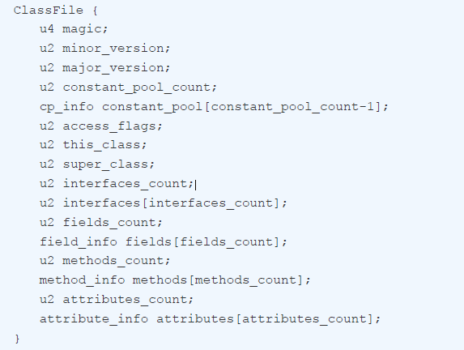
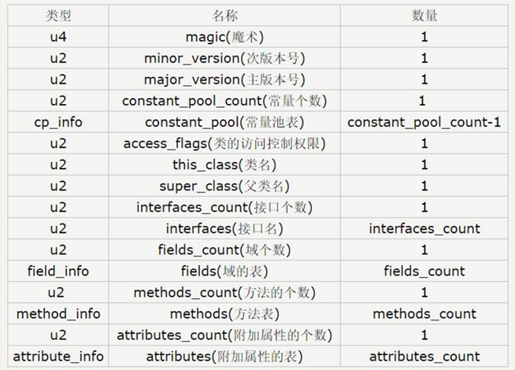
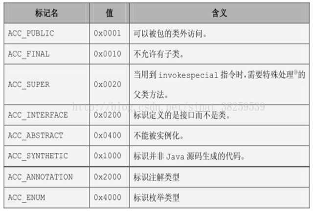
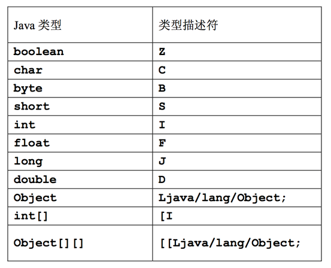
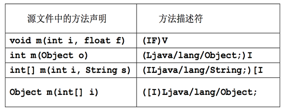

# Class文件格式


&emsp;我们知道Java是一门跨平台的语言，我们编写的Java代码会被编译成中间class文件以让Java虚拟机解析运行。而Java虚拟机规范仅仅描述了抽象的Java虚拟机，在实现具体的Java虚拟机时，仅指出了设计规范。Java虚拟机的实现必须体现规范中的内容，但仅在确有必要时才应该受制于这些规范。对于完整内容，可以查看原文档，以JDK7为例，可查看[https://docs.oracle.com/javase/specs/jvms/se7/html/](https://docs.oracle.com/javase/specs/jvms/se7/html/)，或者《深入理解Java虚拟机 JVM高级特性与最佳实践》一书。完整的规范主要包含以下内容：

 * 第2章：概览Java虚拟机整体架构
 * 第3章：介绍如何将Java语言编写的程序转换为虚拟机指令集
 * 第4章：定义class文件格式。它是一种与硬件和操作系统无关的二进制格式，用来表示编译后的类和接口
 * 第5章：定义了Java虚拟机启动以及类和接口的加载、链接和初始化的过程
 * 第6章：定义了Java虚拟机指令集
 * 第7章：提供了一张以操作码值为索引的Java虚拟机操作码助记表

&emsp;本文只是大概记录项目需要了解的基础概念，着重在介绍Class文件格式上，为该系列后续内容做铺垫。

&emsp;Class文件是一组以8字节为基础单位的二进制流，各个数据项目严格按照顺序紧凑排列在class文件中，中间没有任何分割符。每个 Class 文件都是由 8 字节为单位的字节流组成，所有的 16 位、32 位和 64 位长度的数据将被构造成 2 个、4 个和 8 个 8 字节单位来表示。

&emsp;每一个Class文件对应于一个如下所示的ClassFile结构体:



涉及到的内容包括：

 * magic：魔数，魔数的唯一作用是确定这个文件是否为一个能被虚拟机所接受的Class文件。魔数值固定为0xCAFEBABE，不会改变。
 * minor\_version、major\_version：副版本号和主版本号，minor\_version和major\_version的值分别表示Class文件的副、主版本。一个Java虚拟机实例只能支持特定范围内的主版本号（Mi至Mj）和0至特定范围内（0至m）的副版本号。
 * constant\_pool\_count：常量池计数器，constant\_pool\_count的值等于constant\_pool表中的成员数加1。
 * constant\_pool\[]：常量池，constant\_pool是一种表结构，它包含Class文件结构及其子结构中引用的所有字符串常量、类或接口名、字段名和其它常量。
 * access\_flags：访问标志，access\_flags是一种掩码标志，用于表示某个类或者接口的访问权限及基础属性。
 * this\_class：类索引
 * super\_class：父类索引
 * interfaces\_count：接口计数器，interfaces\_count的值表示当前类或接口的直接父接口数量
 * interfaces\[]：接口表，在interfaces\[]数组中，成员所表示的接口顺序和对应的源代码中给定的接口顺序（从左至右）一样，即interfaces\[0]对应的是源代码中最左边的接口。
 * fields\_count：字段计数器，fields\_count的值表示当前Class文件fields\[]数组的成员个数。
 * fields\[]：字段表，fields\[]数组描述当前类或接口声明的所有字段，但不包括从父类或父接口继承的部分。
 * methods\_count：方法计数器，methods\_count的值表示当前Class文件methods\[]数组的成员个数。
 * methods\[]：方法表，methods\[]数组只描述当前类或接口中声明的方法，不包括从父类或父接口继承的方法。
 * attributes\_count：属性计数器，attributes\_count的值表示当前Class文件attributes表的成员个数。
 * attributes\[]：属性表

&emsp;可用jdk自带的javap命令对class文件进行反编译，以查看内容，如下代码：

```
public class Ex {

    public void judgeAge(int age) {
        int step = 0;
        if (age > 18) {
            step++;
            System.out.println("a litter old");
        } else {
            System.out.println("a litter cute");
            step++;
        }
        System.out.println(step);
    }

    public static void main(String[] args) {
        Ex ex = new Ex();
        ex.judgeAge(16);
    }
}

```

执行 javap -verbose -p Ex.class的结果为

```
Classfile Ex.class
  Last modified 2019-11-29; size 788 bytes
  MD5 checksum 8b5d8ebf38c4441fe7150c10da31ce1b
  Compiled from "Ex.java"
public class Ex
  minor version: 0
  major version: 52
  flags: ACC_PUBLIC, ACC_SUPER
Constant pool:
   #1 = Methodref          #10.#31        // java/lang/Object."<init>":()V
   #2 = Fieldref           #32.#33        // java/lang/System.out:Ljava/io/PrintStream;
   #3 = String             #34            // a litter old
   #4 = Methodref          #35.#36        // java/io/PrintStream.println:(Ljava/lang/String;)V
   #5 = String             #37            // a litter cute
   #6 = Methodref          #35.#38        // java/io/PrintStream.println:(I)V
   #7 = Class              #39            // Ex
   #8 = Methodref          #7.#31         // Ex."<init>":()V
   #9 = Methodref          #7.#40         // Ex.judgeAge:(I)V
  #10 = Class              #41            // java/lang/Object
  #11 = Utf8               <init>
  #12 = Utf8               ()V
  #13 = Utf8               Code
  #14 = Utf8               LineNumberTable
  #15 = Utf8               LocalVariableTable
  #16 = Utf8               this
  #17 = Utf8               LEx;
  #18 = Utf8               judgeAge
  #19 = Utf8               (I)V
  #20 = Utf8               age
  #21 = Utf8               I
  #22 = Utf8               step
  #23 = Utf8               StackMapTable
  #24 = Utf8               main
  #25 = Utf8               ([Ljava/lang/String;)V
  #26 = Utf8               args
  #27 = Utf8               [Ljava/lang/String;
  #28 = Utf8               ex
  #29 = Utf8               SourceFile
  #30 = Utf8               Ex.java
  #31 = NameAndType        #11:#12        // "<init>":()V
  #32 = Class              #42            // java/lang/System
  #33 = NameAndType        #43:#44        // out:Ljava/io/PrintStream;
  #34 = Utf8               a litter old
  #35 = Class              #45            // java/io/PrintStream
  #36 = NameAndType        #46:#47        // println:(Ljava/lang/String;)V
  #37 = Utf8               a litter cute
  #38 = NameAndType        #46:#19        // println:(I)V
  #39 = Utf8               Ex
  #40 = NameAndType        #18:#19        // judgeAge:(I)V
  #41 = Utf8               java/lang/Object
  #42 = Utf8               java/lang/System
  #43 = Utf8               out
  #44 = Utf8               Ljava/io/PrintStream;
  #45 = Utf8               java/io/PrintStream
  #46 = Utf8               println
  #47 = Utf8               (Ljava/lang/String;)V
{
  public Ex();
    descriptor: ()V
    flags: ACC_PUBLIC
    Code:
      stack=1, locals=1, args_size=1
         0: aload_0
         1: invokespecial #1                  // Method java/lang/Object."<init>":()V
         4: return
      LineNumberTable:
        line 1: 0
      LocalVariableTable:
        Start  Length  Slot  Name   Signature
            0       5     0  this   LEx;

  public void judgeAge(int);
    descriptor: (I)V
    flags: ACC_PUBLIC
    Code:
      stack=2, locals=3, args_size=2
         0: iconst_0
         1: istore_2
         2: iload_1
         3: bipush        18
         5: if_icmple     22
         8: iinc          2, 1
        11: getstatic     #2                  // Field java/lang/System.out:Ljava/io/PrintStream;
        14: ldc           #3                  // String a litter old
        16: invokevirtual #4                  // Method java/io/PrintStream.println:(Ljava/lang/String;)V
        19: goto          33
        22: getstatic     #2                  // Field java/lang/System.out:Ljava/io/PrintStream;
        25: ldc           #5                  // String a litter cute
        27: invokevirtual #4                  // Method java/io/PrintStream.println:(Ljava/lang/String;)V
        30: iinc          2, 1
        33: getstatic     #2                  // Field java/lang/System.out:Ljava/io/PrintStream;
        36: iload_2
        37: invokevirtual #6                  // Method java/io/PrintStream.println:(I)V
        40: return
      LineNumberTable:
        line 4: 0
        line 5: 2
        line 6: 8
        line 7: 11
        line 9: 22
        line 10: 30
        line 12: 33
        line 13: 40
      LocalVariableTable:
        Start  Length  Slot  Name   Signature
            0      41     0  this   LEx;
            0      41     1   age   I
            2      39     2  step   I
      StackMapTable: number_of_entries = 2
        frame_type = 252 /* append */
          offset_delta = 22
          locals = [ int ]
        frame_type = 10 /* same */

  public static void main(java.lang.String[]);
    descriptor: ([Ljava/lang/String;)V
    flags: ACC_PUBLIC, ACC_STATIC
    Code:
      stack=2, locals=2, args_size=1
         0: new           #7                  // class Ex
         3: dup
         4: invokespecial #8                  // Method "<init>":()V
         7: astore_1
         8: aload_1
         9: bipush        16
        11: invokevirtual #9                  // Method judgeAge:(I)V
        14: return
      LineNumberTable:
        line 16: 0
        line 17: 8
        line 18: 14
      LocalVariableTable:
        Start  Length  Slot  Name   Signature
            0      15     0  args   [Ljava/lang/String;
            8       7     1    ex   LEx;
}
SourceFile: "Ex.java"

```

下面对后续需要接触到的几项内容做说明。

#### 1. 数据项

&emsp;Class文件中有两种数据类型，分别是无符号数和表:



 * 无符号数：属于基本数据类型，主要可以用来描述数字、索引符号、数量值或者按照UTF-8编码构成的字符串值，大小使用u1、u2、u4、u8分别表示1字节、2字节、4字节和8字节
 * 表：是由多个无符号数或者其他表作为数据项构成的复合数据类型，所有的表都习惯以“_info”结尾

#### 2. 访问和修饰符标识



&emsp;带有 ACC_SYNTHETIC 标志的部分，意味着它是由编译器自己产生的而不是由程序员编写的源代码生成的。有该标志的类、属性、方法等不会在源码中显示。

#### 3. 类型描述符



&emsp;基本类型的描述是单个字符：

 * Z表示 boolean
 * C表示 char
 * B表示 byte
 * S表示 short
 * I 表示 int
 * F 表示 float
 * J 表示 long
 * D 表示 double
 * 一个类类型的描述符是这个类的内部名，前面加上字符 L，后面跟有一个分号。例如，String 的类型描述符为 Ljava/lang/String;。而一个数组类型的 述符是一个方括号后面跟有该数组元素类型的描述符。

#### 4. 方法描述符

&emsp;方法描述符是一个类型描述符列表，它用一个字符串描述一个方法的参数类型和返回类型。

&emsp;方法描述符以左括号开头，然后是每个形参的类型描述，然后是一个右括号，接下来是返回类型的类型描述符，如果该方法返回void，则是 V，表示方法描述中不包含方法的名字或参数名，可看如下例子：



#### 5. 指令

&emsp;Java虚拟机的指令由一个字节长度的、代表着某种特定操作含义的操作码（Opcode）以及跟随其后的零至多个代表此操作所需参数的操作数（Operands）所构成。虚拟机中许多指令并不包含操作数，只有一个操作码。

&emsp;常见的指令如下：

 * 字段访问指令：getfield，putfield，getstatic，pustatic
 * 比较指令：dcmpg,dcmpl,fcmpg,fcmpl,lcmp
 * 跳转指令：ifeq,iflt,ifle,ifne,ifgt,ifge,ifnull,ifnonnull
 * 比较条件跳转指令：if_icmpeq,if_icmpne,if_icmplt,if_icmpgt,if_icmple,if_icmpge,if_acmpeq,if_acmpne
 * 多条件分支跳转：tableswitch和lookupswitch
 * 无条件跳转：goto
 * 函数调用与返回指令
 * 函数调用指令：invokevirtual,invokeinterface,invokespecial,invokestatic,invokedynamic；
 * 函数返回：需要将返回值压入调用者操作数栈，需要使用xreturn指令（x可以是i,l,f,d,a或空）

&emsp;PS:笔者个人习惯使用Bytecode Outline进行反编译，这款插件输出的内容可读性会高点，上面的内容输出下：

```
// class version 52.0 (52)
// access flags 0x21
public class Ex {

  // compiled from: Ex.java

  // access flags 0x1
  public <init>()V
   L0
    LINENUMBER 1 L0
    ALOAD 0
    INVOKESPECIAL java/lang/Object.<init> ()V
    RETURN
   L1
    LOCALVARIABLE this LEx; L0 L1 0
    MAXSTACK = 1
    MAXLOCALS = 1

  // access flags 0x1
  public judgeAge(I)V
   L0
    LINENUMBER 4 L0
    ICONST_0
    ISTORE 2
   L1
    LINENUMBER 5 L1
    ILOAD 1
    BIPUSH 18
    IF_ICMPLE L2
   L3
    LINENUMBER 6 L3
    IINC 2 1
   L4
    LINENUMBER 7 L4
    GETSTATIC java/lang/System.out : Ljava/io/PrintStream;
    LDC "a litter old"
    INVOKEVIRTUAL java/io/PrintStream.println (Ljava/lang/String;)V
    GOTO L5
   L2
    LINENUMBER 9 L2
   FRAME APPEND [I]
    GETSTATIC java/lang/System.out : Ljava/io/PrintStream;
    LDC "a litter cute"
    INVOKEVIRTUAL java/io/PrintStream.println (Ljava/lang/String;)V
   L6
    LINENUMBER 10 L6
    IINC 2 1
   L5
    LINENUMBER 12 L5
   FRAME SAME
    GETSTATIC java/lang/System.out : Ljava/io/PrintStream;
    ILOAD 2
    INVOKEVIRTUAL java/io/PrintStream.println (I)V
   L7
    LINENUMBER 13 L7
    RETURN
   L8
    LOCALVARIABLE this LEx; L0 L8 0
    LOCALVARIABLE age I L0 L8 1
    LOCALVARIABLE step I L1 L8 2
    MAXSTACK = 2
    MAXLOCALS = 3

  // access flags 0x9
  public static main([Ljava/lang/String;)V
   L0
    LINENUMBER 16 L0
    NEW Ex
    DUP
    INVOKESPECIAL Ex.<init> ()V
    ASTORE 1
   L1
    LINENUMBER 17 L1
    ALOAD 1
    BIPUSH 16
    INVOKEVIRTUAL Ex.judgeAge (I)V
   L2
    LINENUMBER 18 L2
    RETURN
   L3
    LOCALVARIABLE args [Ljava/lang/String; L0 L3 0
    LOCALVARIABLE ex LEx; L1 L3 1
    MAXSTACK = 2
    MAXLOCALS = 2
}
```

