# Spring Environment的加载


&emsp;这节介绍environment，默认环境变量的加载以及初始化内容。

&emsp;之前在介绍spring启动过程讲到，第一步进行环境准备时就会初始化一个StandardEnvironment。下图为Environment类图的接口，可以分为4块内容：

1. ConversionService（蓝）：类型转换服务

2. PropertySource（绿）:键值对数据源

3. PropertyResolver（红）:键值对服务，包括类型转换

4. Environment（紫）:环境配置数据服务

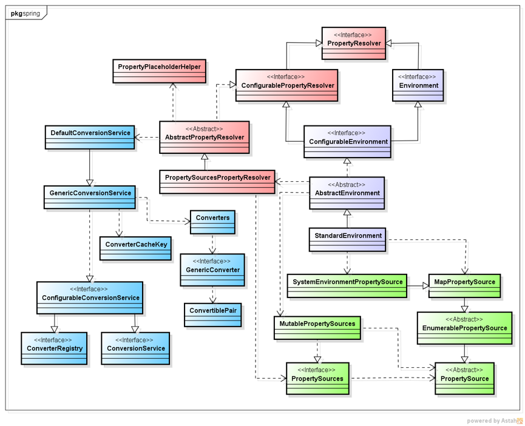

#### 1.ConversionService

&emsp;提供了类型转换服务，能将源目标转换为目标类型，同时提供了管理功能，内部维护了各类型转换映射关系。其实从ConversionService和ConverterRegistry接口就能看出该模块的功能，如下：

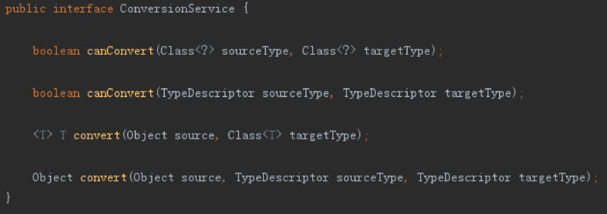

&emsp;ConversionService接口为主要的对外功能接口，提供查询的能力。

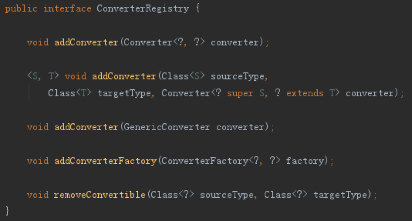

&emsp;ConverterRegistry接口为主要的管理接口，提供添加和删除的能力。而ConfigurableConversionService继承自上面二者，则提供了Converter的CRUD功能。结构上也延续了Spring固有的风格，将执行接口作为主要功能对外提供单一的接口，再通过继承的方式，以Configurable开头的子接口，扩展出管理功能，使得责任分离更加立体。

&emsp;接下来是GenericConversionService类，该类提供了接口全部实现，下图展示了其主要实现:

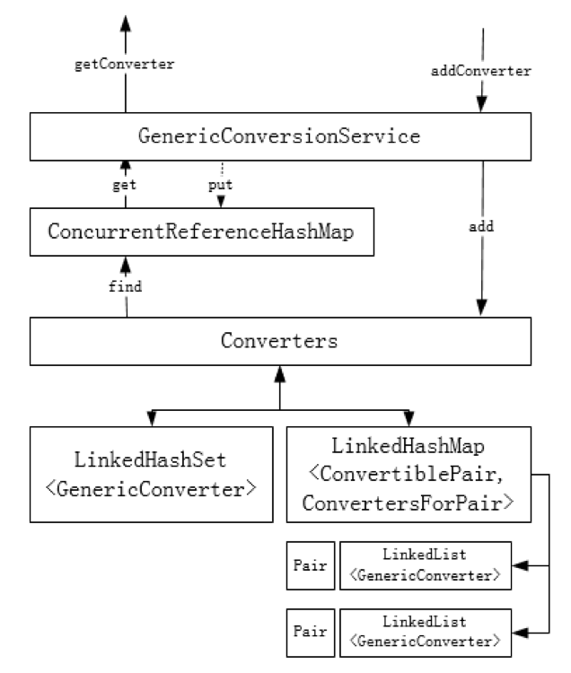

&emsp;GenericConversionService结构上可以说是一个小型的管理系统，内部维护了一个Converters对象，用于“底层”管理所有的GenericConverter。同时还维护了一个ConcurrentReferenceHashMap用于缓存常用的GenericConverter。

&emsp;Converters在存储GenericConverter时还进行了分类，如果GenericConverter有指定能够解析的类别（ConvertiablePair：包括SourceType和TargetType）时，则使用一个LinkedHashMap按Key Value进行存储，在存储时会遍历可解析的类别，将该GenericConverter追加到对应的Value列表末尾，因而可以看到该Map的Value是一个LinkedList。对应没有指定能解析的类别的GenericConverter，则直接放到LinkedHashSet维护的集合中。

&emsp;Converters在查询时会遍历源类型和目标类型的组合结果，以查找匹配的目标GenericConverter对象。如下：

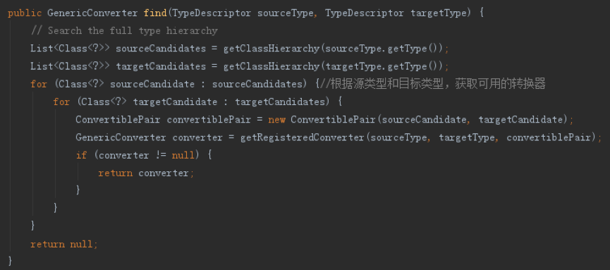

&emsp;对于getRegisteredConverter方法，会先使用Key从LinkedHashMap中查找是否有匹配的Converter,再遍历相应的Value,查找到能处理的转换器。若Map中无法查到，则遍历LinkedHashSet，以查到到能处理的转换器。

&emsp;由上知道，Converters在查找时存在多次遍历列表的过程，在频率过多时效率会比较低下，因而GenericConversionService内部维护了一个ConcurrentReferenceHashMap提供缓存的功能，该Map提供了同ConcurrentHashMap相同的功能，但是能够存储对应的软引用，从而能在内存不足时自动进行内存回收。在查到转换器时，会先试着从缓存中查找，如果获取不到，则会转而从Converters中查找，当从Converters中查找到后便会put到ConcurrentReferenceHashMap缓存中。

&emsp;DefaultConversionService是一个单例，继承自GenericConversionService，在初始化后自动添加了默认的转换器，包括Scalar相关的、集合相关的等转换器。

####2.PropertySource

&emsp;PropertySource代表了一个包含键值对的数据源。从类定义上看，有一个表示数据源名字的name字段，还有一个表示具体数据源泛型T的source字段。而数据源的设置则是通过构造方法传入的，同时方法提供了通过键名获取键值的抽象方法getProperty。此外还有其他抽象方法，如containsProperty等。

&emsp;EnumerablePropertySource继承自PropertySource，增加了getPropertyNames方法，要求子类返回内存持有的键名列表。同时实现了containsProperty方法，通过判断所给的键名是否存在上述返回的键名列表中从而判断是否包含该键名。

&emsp;MapPropertySource继承自EnumerablePropertySource，顾名思义，内部通过Map维护各键值对内容。类似的还有PropertiesPropertySource，内部通过Properties维护各键值对内容。

&emsp;SystemEnvironmentPropertySource是MapPropertySource的装饰器，继承自MapPropertySource，为其添加了键名转换功能，以应对环境变量、shell参数的环境。在通过键名获取键值时，会先根据原键名进行查找，查找不到则通过对键进行转换再尝试查找，具体查找过程为：

1. 通过name查找

2. 将name中的 . 转换为 _ 查找

3. 将name中的 – 转换为 _ 查找

4. 将name中的 . 和 _ 转换为 – 查找

5. 将name转换为大写，再进行（1） - （4）的过程

&emsp;PropertySources的实现如下，扩展了PropertySource接口，将单个数据源的能力扩展到了多个。MutablePropertySources作为PropertySources的实现，内部维护了一个List对象，用以存储给个数据源，并将自身的行为封装为List。

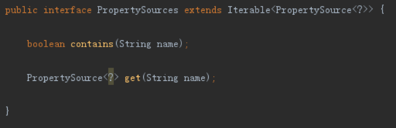


#### 3.PropertyResolver

&emsp;PropertyResolver定义了一系列接口，以提供了对外根据键名获取相应值的功能，同时提供了类型转换和占位符替换的功能，是ConversionService和PropertySource的结合。ConfigurablePropertyResolver接口继承自PropertyResolver接口，老规则，扩展了设置的功能，主要是设置类型转换器和占位符的相关属性。

&emsp;AbstractPropertyResolver提供了除PropertySource功能外的其余实现。使用DefaultConversionService作为默认的类型转换实现，使用 ${ 和 } 作为占位符的前后缀，使用:作为默认值分割符，同时引入PropertyPlaceholderHelper用于占位符的解析和替换。而getProperty的实现则留到了了子类PropertySourcesPropertyResolver中，其引入了PropertySources用以维护多个键值对数据源。获取指定属性值过程如下：

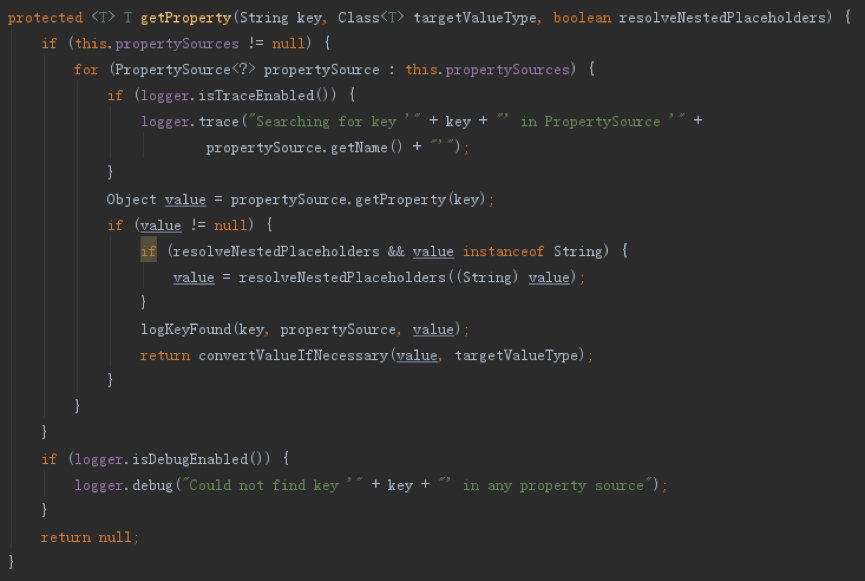

&emsp;通过遍历数据源的方式，查到对应的值后，会进行占位符的替换，替换完占位符后会进行类型的转换。类型转换直接用的DefaultConversionService，这个上面已经介绍过了，下面介绍占位符替换。

&emsp;占位符替换的功能是在PropertyResolver接口中定义的，分为严格和不严格模式，如下：

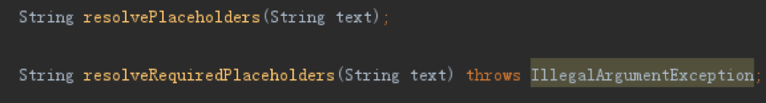

&emsp;resolvePlaceholders为不严格模式，如果没法替换占位符，则直接忽略，resolveRequiredPlaceholders为严格模式，如果占位符没法替换则会抛出异常。如上面说的，AbstractPropertyResolver实现时都委托给PropertyPlaceholderHelper的replacePlaceholders方法。

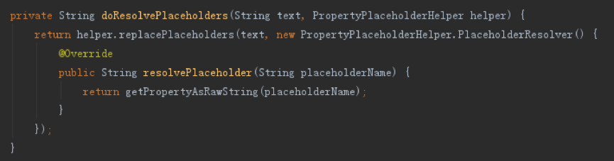

&emsp;如上，该方法要求传入一个源字符串，同时提供一个PlaceholderResolver数据源，一遍解析出占位符内容后能够从数据源中获取对应的值。为了保持类功能的单一职责，从而增加了一个内部接口PlaceholderResolver。上面提到，在这个模块中的键值对数据源都是由PropertySourcesPropertyResolver维护的，事实上上面方法截图的实现中，getPropertyAsRawString方法也确实是由PropertySourcesPropertyResolver提供实现的，下面看下占位符的解析。

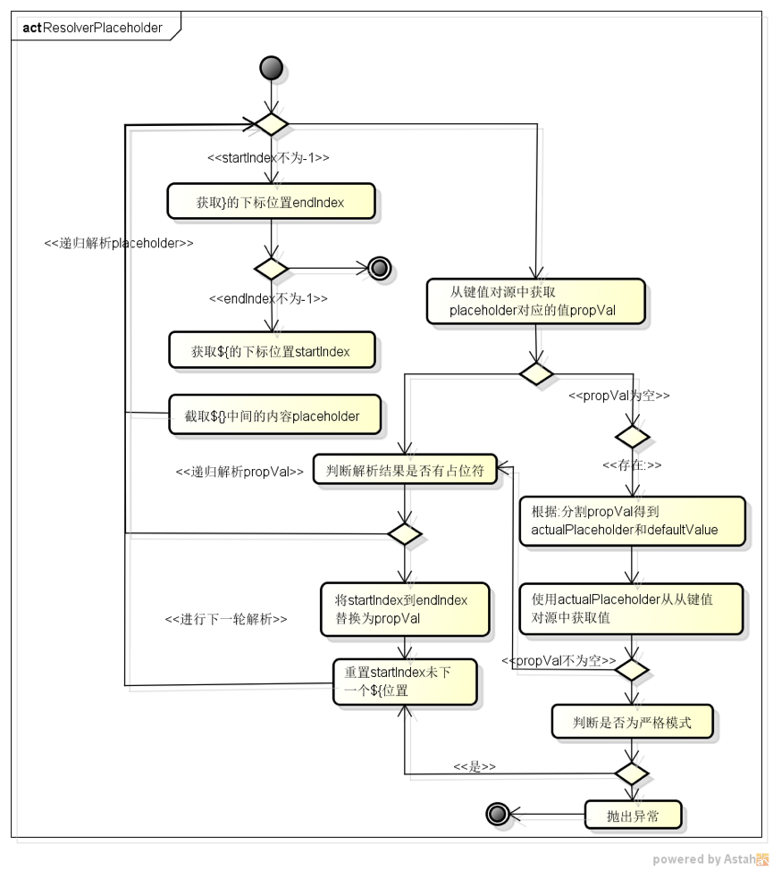

&emsp;占位符的解析过程如上流程，主要过程为：

1. 根据${前缀得到startIndex

2. 查找跟${前缀配对的}后缀，如${xxx${yy}z}，得到第二个}后缀的下标endIndex

3. 截取${和}中间的内容得到placeholder

4. 由于placeholder的内容可能也可能包含占位符，因而要递归处理placeholder，既占位符可以嵌套，内层的结果可以当做外层的Key使用

5. placeholder解析完后，将其作为Key从键值对源中获取对应的值propVal

6. 如果propVal值为空，则判断是否存在:分割符，如果有分割符，则进行分割，并使用前端内容作为Key再次查找值。若该次查找结果不为空，则使用该次结果为propVal的值，否则使用第二段内容作为默认值

7. 若第（5）/（6）步中propVal结果不为空，则判断从键值对源中获取的值是否也有占位符，若有占位符，则再次进行解析，若没有，则将结果替换回原字段中，更新startIndex，继续下次解析。

8. 若第（5）/（6）步中propVal结果不空，则会根据设置的解析模式来判断下一步行为，如果未不严格模式，则跳过该次内容，更新startIndex，继续下一次解析，若为严格模式，则抛出异常，流程结束。

&emsp;下面以一个例子进行演示，如下


输出结果为：

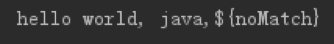

&emsp;若将解析模式设置为严格模式则会抛出异常

#### 4.Environment

&emsp;Environment继承自PropertyResolver接口，增加了Profiles功能，即我们平时看到的，多环境特性，能够在不同环境下加载不同的配置。ConfigurableEnvironment继承自Environment，老规矩，又是添加了修改的扩展接口，同时增加了获取系统参数的接口。另外，该接口也继承自ConfigurablePropertyResolver，有了键值对数据源管理、获取和处理的能力，集合Environment接口的功能，能够达到在不同环境下通过加载不同配置源实现环境隔离的效果。

&emsp;AbstractEnvironment是ConfigurablePropertyResolver的实现，提供了默认的环境源default，同时内部组合使用PropertySourcesPropertyResolver作为PropertyResolver的实现。

&emsp;它还维护了一个MutablePropertySources对象，用于存储多个数据源，在Context的父子上下文中，通过merge方法，能够将父上文中的环境变量内容添加进来（在AbstractApplicationContext设置父Context时，会将父Environment进行合并）。同时还有一个方法customizePropertySources，会在构造方法中进行调用，开放给子类添加默认的键值对源，如下：

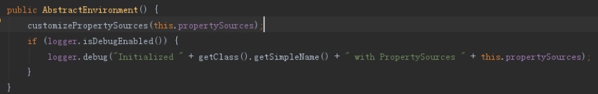

&emsp;最后是StandardEnvironment类，继承自AbstractEnvironment，重写了customizePropertySources方法，在该方法中添加了系统相关的属性和应用环境变量相关的属性的键值对源。如下

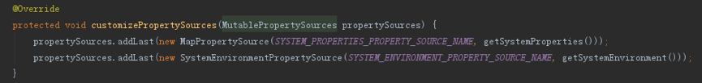

&emsp;而这两个数据源来自于前面提到的PropertySource实现。其中，系统相关属性```SYSTEM_PROPERTIES_PROPERTY_SOURCE_NAME```的数据源来源于```System.getProperties()```，而应用环境变量相关属性```SYSTEM_ENVIRONMENT_PROPERTY_SOURCE_NAME```则来源于```System.getenv()```。

