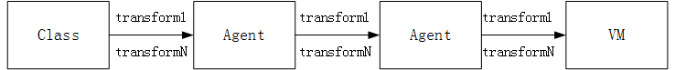

# Instrument API介绍


#### 1. Instrumentation介绍

&emsp;[JVMTI](https://docs.oracle.com/javase/7/docs/platform/jvmti/jvmti.html#whatIs)（JVM Tool Interface）是 Java 虚拟机所提供的 native 编程接口，是 JVMPI（Java Virtual Machine Profiler Interface）和 JVMDI（Java Virtual Machine Debug Interface）的更新版本。JVMTI 提供了一套“代理”程序机制，可以支持第三方工具程序以代理的方式连接和访问 JVM，并利用 JVMTI 提供的丰富的编程接口，完成很多跟 JVM 相关的功能。

&emsp;Agent 即 JVMTI 的客户端，它和执行 Java 程序的虚拟机运行在同一个进程上。他们通常由另一个独立的进程控制，充当这个独立进程和当前虚拟机之间的中介，通过调用 JVMTI 提供的接口和虚拟机交互，负责获取并返回当前虚拟机的状态或者转发控制命令。java.lang.instrument 包的实现，也是基于这种机制的。在 Instrumentation 的实现当中，存在一个 JVMTI 的代理程序，通过调用 JVMTI 当中于 Java 类相关的函数来完成Java 类的动态操作。

&emsp;利用 java.lang.instrument 做动态 Instrumentation 是 Java SE 5 的新特性，它把 Java 的 instrument 功能从本地代码中解放出来，使之可以用 Java 代码的方式解决问题。使用 Instrumentation，开发者可以构建一个独立于应用程序的代理程序（Agent），用来监测和协助运行在 JVM 上的程序，甚至能够替换和修改某些类的定义。有了这样的功能，开发者就可以实现更为灵活的运行时虚拟机监控和 Java 类操作了，这样的特性实际上提供了 一种虚拟机级别支持的 AOP 实现方式，使得开发者无需对 JDK 做任何升级和改动，就可以实现某些 AOP 的功能了。

&emsp;在 Java SE6 里面，最大的改变是运行时的 Instrumentation 成为可能。在 Java SE 5 中，Instrument 要求在运行前利用命令行参数或者系统参数来设置代理类，在实际的运行之中，虚拟机在初始化之时（在绝大多数的 Java 类库被载入之前），instrumentation 的设置已经启动，并在虚拟机中设置了回调函数，检测特定类的加载情况，并完成实际工作。但是在实际的很多的情况下，我们没有办法在虚拟机启动之时就为其设定代理，这样实际上限制了 instrument 的应用。而 Java SE 6 的新特性改变了这种情况，通过 Java Tool API 中的 attach 方式，我们可以很方便地 在运行过程中动态地设置加载代理类，以达到 instrumentation 的目的。

&emsp;Instrumentation 的最大作用，就是类定义动态改变和操作。在 Java SE 5 及其后续版本当中，开发者可以在一个普通 Java 程序（带有 main 函数的 Java 类）运行时，通过 -javaagent参数指定一个特定的 jar 文件（包含 Instrumentation 代理）来启动 Instrumentation 的代理程序。

#### 2. Transformer

&emsp;Transformer是字节码转换的接口，Instrumentation是管理Transformer、调度Transformer进行字节码转换的门面。 当执行Instrumentation的addTransformer、removeTransformer方法时，最终是调用了TransformerManager的addTransformer、removeTransformer，以此来管理Transformer。

&emsp;Instrumentation的retransformClasses、redefineClasses是用于通知TransformerManager调度字节码转换的。除此之外，在调用ClassLoader.defineClass1()这个native方法用于进行类的定义时，也会通知TransformerManager调度Transformer来进行字节码转换。这三个字节码转换通知时机分别称为：

 * 加载类时（1）
 * 重定义类时（2）
 * 重转换类时（3）

&emsp;<b>Transformer可以分为两类：可重转换的Transformer、不可重转换的Transformer。任何一个Transformer都可以用于加载类时、重定义类时进行转换。如果是可重转换的Transformer，也可以在重转换时进行转换。对于所有的注册转换器，在发生类加载时（1）或者重定义类时（2），会触发转换器的执行。重转换类时只有可中转换的Transformer会触发。</b>

&emsp;当存在多个转换器时，转换将由transform调用链组成。也就是说，一个transform调用返回的byte数组将成为下一个调用的输入。 转换将按以下顺序进行：

 * 不可重转换转换器
 * 不可重转换本地（native）转换器
 * 可重转换转换器
 * 可重转换本地（native）转换器

同样，在重转换时（3），不会调用不可重转换转换器，而是重用前一个转换的结果。对于所有其他情况，调用此方法。在每个这种调用组中，转换器将按照注册的顺序调用。

&emsp;ClassFileTransformer接口只有一个方法：

```
byte[] transform(  ClassLoader         loader,
                String              className,
                Class<?>            classBeingRedefined,
                ProtectionDomain    protectionDomain,
                byte[]              classfileBuffer)
        throws IllegalClassFormatException;
```

其中classfileBuffer字段为加载的class内容的byte数组，返回结果未待初始化的class内容的byte数组。即可以通过该方法修改原class内容，返回修改后的内容来修改类的行为。如果不做任何转换，则要返回null。 如果转换器抛出异常（未捕获的异常），后续转换器仍然将被调用并加载，仍然将尝试重定义或重转换。因此，抛出异常与返回 null 的效果相同。

&emsp;请参考[https://docs.oracle.com/javase/7/docs/api/java/lang/instrument/ClassFileTransformer.html](https://docs.oracle.com/javase/7/docs/api/java/lang/instrument/ClassFileTransformer.html)

##### 2.1. redefineClasses

&emsp;使用提供的类文件重新定义提供的一组类。

&emsp;该方法用于替换类的定义，而不引用现有的类文件字节，就像从源头进行重新编译以进行修复和继续调试时一样。 在现有的类文件字节要转换的地方应该使用retransformClasses。

&emsp;该方法对一组class进行操作，以便同时允许多个相互依赖的类的更改，如A类的重新定义可能需要重新定义B类。

&emsp;如果重新定义的方法具有活动堆栈帧，则这些活动帧将继续运行原始方法的字节码。 重新定义的方法将做用于新的调用。

&emsp;该方法不会导致任何初始化，除了在常规JVM语义下会发生。 换句话说，重新定义一个类并不会导致它的初始化器被运行。 静态变量的值将保持在调用之前。重新定义的类的实例不受影响。

&emsp;重新定义可能会改变方法体，常量池和属性。 重定义不能添加，删除或重命名字段或方法，更改方法的签名或更改继承。 这些限制可能在将来的版本中解除。 类文件字节不会被检查，验证和安装，直到应用转换为止，如果结果字节错误，则此方法将抛出异常。如果此方法抛出异常，则不会重新定义任何类。

&emsp;该方法的定义如下：

```
void redefineClasses(ClassDefinition... definitions)  throws ClassNotFoundException,UnmodifiableClassException

public ClassDefinition(Class<?> theClass,byte[]  theClassFile) {
    if (theClass == null || theClassFile == null) {
        throw new NullPointerException();
    }
    mClass      = theClass;
    mClassFile  = theClassFile;
}
```

如上所述，该方法需要指定需要替换的Class以及提供自定义类文件的字节码内容，请参考[https://docs.oracle.com/javase/8/docs/api/java/lang/instrument/Instrumentation.html#redefineClasses-java.lang.instrument.ClassDefinition...-](https://docs.oracle.com/javase/8/docs/api/java/lang/instrument/Instrumentation.html#redefineClasses-java.lang.instrument.ClassDefinition...-)

##### 2.2. retransformClasses

&emsp;重新转换提供的一组类。

&emsp;该方法主要作用于已经加载过的class。可以用ClassFileTransformer对初始化过或者redifine过的class进行重新处理， 无论以前是否发生转换，此函数都将重新运行转换过程。 转换过程遵循以下步骤：

 * 从初始类文件字节开始

 * 对于将canRetransform设置为false的每个转换器，在上一个类加载或重定义期间由转换器返回的字节将被重新用作当前转换的输出，相当于当前转换器不生效

 * 对于将canRetransform设置为true的每个转换器，将会在当前调用该转换器

 * 转换后的类文件字节作为类的新定义安装

&emsp;该方法对一组class进行操作，以便同时允许多个相互依赖的类的更改，如A类的重新定义可能需要重新定义B类。

&emsp;如果重新定义的方法具有活动堆栈帧，则这些活动帧将继续运行原始方法的字节码。 重新定义的方法将做用于新的调用。

&emsp;该方法不会导致任何初始化，除了在常规JVM语义下会发生。 换句话说，重新定义一个类并不会导致它的初始化器被运行。 静态变量的值将保持在调用之前。重新定义的类的实例不受影响

&emsp;重新转换可能会改变方法体，常量池和属性。 重新传输不能添加，删除或重命名字段或方法，更改方法的签名或更改继承。 这些限制可能在将来的版本中解除。 类文件字节不会被检查，验证和安装，直到应用转换为止，如果结果字节错误，则此方法将抛出异常。如果此方法抛出异常，则不会重新创建任何类。

&emsp;该方法的内容如下:

```
void retransformClasses(Class<?>... classes)  throws UnmodifiableClassException
```
该方法要传入需要进行重转换的类，请参考[https://docs.oracle.com/javase/8/docs/api/java/lang/instrument/Instrumentation.html#retransformClasses-java.lang.Class...-](https://docs.oracle.com/javase/8/docs/api/java/lang/instrument/Instrumentation.html#retransformClasses-java.lang.Class...-)

&emsp;需要注意的是，为Agent开启redefine功能需要在javaagent的MANIFEST.MF里设置Can-Redefine-Classes:true。为Agent开启retransform功能需要在javaagent的MANIFEST.MF文件里定义了Can-Retransform-Classes:true。

&emsp;介绍完了相关的内容，下面介绍如何实现。

#### 3. JDK5 premain方式

&emsp;使用premain方式进行处理需要如下几个步骤

##### 3.1.  提供一个公共的静态方法premain:

```
//<1>
public static void premain(String agentArgs, Instrumentation inst);
//<2>
public static void premain(String agentArgs);
```

其中，<1>的优先级比 <2> 高，将会被优先执行（<1>和<2>同时存在时，<2>被忽略）。

&emsp;正如这个方法名，该方法会先于main方法被执行。一般会在这个方法中创建一个代理对象，通过参数 inst 的 addTransformer() 方法，将创建的代理对象再传递给虚拟机。agentArgs 是 premain 函数得到的程序参数，随同 “– javaagent”一起传入。与 main 函数不同的是，这个参数是一个字符串而不是一个字符串数组，如果程序参数有多个，程序将自行解析这个字符串。

##### 3.2. 提供一个或者多个ClassFileTransformer实现类

&emsp;上面说过，会在premain中调用inst的addTransformer()方法，该方法的入参就是ClassFileTransformer对象。

&emsp;对于字节码的修改在上一节已经介绍过了，可以有多种方式。这里使用上一节的例子，对CoreActionImpl类进行修改以达到AOP的效果。代码如下：

```
public class PreMainProxyAction implements ClassFileTransformer {

    @Override
    public byte[] transform(ClassLoader loader, String className, Class<?> classBeingRedefined, ProtectionDomain protectionDomain,
        byte[] classfileBuffer) throws IllegalClassFormatException {
        if (!className.equals("demo/CoreActionImpl")) {
            return classfileBuffer;
        }
        ASMProxyAction proxyAction = new ASMProxyAction();
        byte[] bytes = proxyAction.aop(classfileBuffer);
        //这里可以将bytes写入到文件，输出处理后的calss内容
        return bytes;
    }


    public static void premain(String agentArgs, Instrumentation inst) throws ClassNotFoundException, UnmodifiableClassException {
        inst.addTransformer(new PreMainProxyAction());
    }
}
```

其中ASMProxyAction的内容为上一节ASM例子的内容，只是重新组织了代码以进行复用，核心内容如下：

```
public byte[] aop(byte[] bytes) {
        ClassReader cr = new ClassReader(bytes);
        return aop(cr);
    }

    public byte[] aop(ClassReader cr) {
        ClassWriter cw = new ClassWriter(ClassWriter.COMPUTE_MAXS);
        cr.accept(new ClassVisitor(Opcodes.ASM6, cw) {
            @Override
            public MethodVisitor visitMethod(int access, String name, String desc, String signature, String[] exceptions) {
                MethodVisitor mv = super.visitMethod(access, name, desc, signature, exceptions);
                if (!"say".equals(name)) {
                    return mv;
                }
                MethodVisitor aopMV = new MethodVisitor(super.api, mv) {
                    @Override
                    public void visitCode() {
                        super.visitCode();
                        mv.visitFieldInsn(Opcodes.GETSTATIC, "java/lang/System", "out", "Ljava/io/PrintStream;");
                        mv.visitLdcInsn("before core action");
                        mv.visitMethodInsn(Opcodes.INVOKEVIRTUAL, "java/io/PrintStream", "println", "(Ljava/lang/String;)V", false);
                    }

                    @Override
                    public void visitInsn(int opcode) {
                        if (Opcodes.RETURN == opcode) {
                            mv.visitFieldInsn(Opcodes.GETSTATIC, "java/lang/System", "out", "Ljava/io/PrintStream;");
                            mv.visitLdcInsn("after core action");
                            mv.visitMethodInsn(Opcodes.INVOKEVIRTUAL, "java/io/PrintStream", "println", "(Ljava/lang/String;)V", false);
                        }
                        super.visitInsn(opcode);
                    }
                };
                return aopMV;
            }
        }, ClassReader.SKIP_DEBUG);
        return cw.toByteArray();
    }
```

##### 3.3. jar 文件打包

&emsp;将这个 Java 类打包成一个 jar 文件，并在其中的 manifest 属性当中加入” Premain-Class”来指定步骤3.1当中编写的那个带有 premain 的 Java 类。

##### 3.4. 运行

&emsp;用如下方式运行带有 Instrumentation 的 Java 程序：

```
java -javaagent:jar 文件的位置 [= 传入 premain 的参数 ]
```

&emsp;按照上面示例代码注释的内容，输出处理过后的字节码如下：

```
public class demo/CoreActionImpl implements demo/Action  {


  // access flags 0x1
  public <init>()V
    ALOAD 0
    INVOKESPECIAL java/lang/Object.<init> ()V
    RETURN
    MAXSTACK = 1
    MAXLOCALS = 1

  // access flags 0x1
  public say()V
    GETSTATIC java/lang/System.out : Ljava/io/PrintStream;
    LDC "before core action"
    INVOKEVIRTUAL java/io/PrintStream.println (Ljava/lang/String;)V
    GETSTATIC java/lang/System.out : Ljava/io/PrintStream;
    LDC "hello world"
    INVOKEVIRTUAL java/io/PrintStream.println (Ljava/lang/String;)V
    GETSTATIC java/lang/System.out : Ljava/io/PrintStream;
    LDC "after core action"
    INVOKEVIRTUAL java/io/PrintStream.println (Ljava/lang/String;)V
    RETURN
    MAXSTACK = 2
    MAXLOCALS = 1
}
```
其实就是上节ASM处理过后的结果，实现了AOP。即Instrument提供的premain方法，提供了一个入口，可以在main方法执行前，修改原class的内容，增加自定义逻辑。

&emsp;需要指出的是，addTransformer 方法并没有指明要转换哪个类，因而在 transform（Transformer 类中）方法中，程序需要自己判断当前的类是否需要转换，如上面的示例。



#### 4. JDK6 agentmain方式

&emsp;JDK5提供的premain方式只能在应用启动前对class进行处理，JDK6 在此基础上进行了改进，开发者可以在 main 函数开始执行以后，再启动自己的处理程序。

&emsp;使用agentmain方式进行处理需要如下几个步骤

##### 4.1.  提供一个公共的静态方法agentmain:

```
//<1>
public static void agentmain (String agentArgs, Instrumentation inst);
//<2>
public static void agentmain (String agentArgs);
```

其中，<1>的优先级比 <2> 高，将会被优先执行（<1>和<2>同时存在时，<2>被忽略）。

##### 4.2. 提供一个或者多个ClassFileTransformer实现类

&emsp;方法同3.2一致。不同的是，由于agentmain方式是在虚拟机启动后进行处理的，这时候目标class可能已经被加载过了，需要重新对目标class进行处理，根据上面的介绍，可以调用retransformClasses方法对类进行重新处理。

##### 4.3. jar 文件打包

&emsp;将这个 Java 类打包成一个 jar 文件，并在其中的 manifest 属性当中加入” Agent-Class”来指定步骤4.1当中编写的那个带有 agentmain 的 Java 类。

##### 4.4. 加载jar包

&emsp;同premain不一致的是，agentmain的接入需要外部应用显示触发。Java SE 6 当中提供的 Attach API，用来向目标 JVM  attach代理工具程序。需要注意的是，Attach API 不是 Java 的标准 API，而是 Sun 公司提供的一套扩展 API。

&emsp;Attach API 很简单，只有 2 个主要的类，都在 com.sun.tools.attach 包里面： VirtualMachine 代表一个 Java 虚拟机，也就是程序需要监控的目标虚拟机，提供了 JVM 枚举，attach 动作和 detach 动作（Attach 动作的相反行为，从 JVM 上面解除一个代理）等等 ; VirtualMachineDescriptor 则是一个描述虚拟机的容器类，配合 VirtualMachine 类完成各种功能。

&emsp;可用如下的方式将一个jar包attach到一个运行的虚拟机上去：

```
public void start(String processId,String agentArgs, String agentJarPath) throws Exception {
    VirtualMachine virtualMachine = null;
    try {
        virtualMachine = VirtualMachine.attach(processId);
        virtualMachine.loadAgent(agentJarPath,agentArgs);
    } finally {
        if (virtualMachine != null) {
            virtualMachine.detach();
        }
    }
}
```
其中需要的参数为:

 * processId：目标应用pid
 * agentArgs：传给agentmain的参数
 * agentJarPath：待加载的jar包

&emsp;


