# Sentinel Culster流程分析


&emsp;前面介绍了sentinel-core的流程，提到在进行流控判断时，会判断当前是本地限流，还是集群限流，若是集群模式，则会走另一个分支，这节便对集群模式做分析。

#### 一.基本概念

&emsp;namespace：限流作用于，用于区分一个规则作用于什么范围

&emsp;flowId：代表全局唯一的规则 ID，Sentinel 集群限流服务端通过此 ID 来区分各个规则，因此务必保持全局唯一。一般 flowId 由统一的管控端进行分配，或写入至 DB 时生成。

&emsp;thresholdType：代表集群限流阈值模式。其中单机均摊模式下配置的阈值等同于单机能够承受的限额，token server 会根据客户端对应的 namespace（默认为 project.name 定义的应用名）下的连接数来计算总的阈值（比如独立模式下有 3 个 client 连接到了 token server，然后配的单机均摊阈值为 10，则计算出的集群总量就为 30）；而全局模式下配置的阈值等同于整个集群的总阈值。

#### 二.通信框架

&emsp;sentinel-cluster基于netty提供了一套远程通信框架，分为客户端和服务，其使用了jdk自带的SPI，提供了一些接口的默认实现。如下图为sentinel-cluster-client客户端模块的默认实现类。

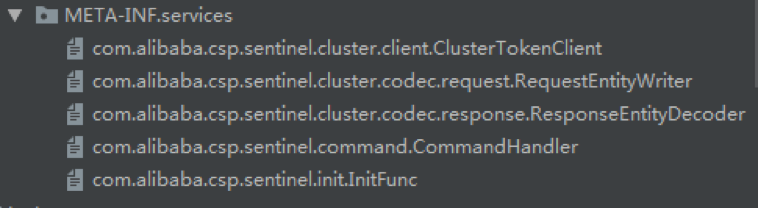

&emsp;InitFunc的加载是通过InitExecutor加载的，InitExecutor在sentinel-core模块中。InitExecutor会在全局访问内加载所有InitFunc的实现类，并调用其init方法完成初始化。该模块中配置的InitFunc实现类为DefaultClusterClientInitFunc，该类会初始化通信协议中各种类型的编码和解码处理类。编解码器将调用注册工厂RequestDataWriterRegistry和ResponseDataDecodeRegistry的方法进行注册，供后续使用。系统提供了PING,FLOW（流控）和PARAM_FLOW（热点参数流控）三种编解码器。

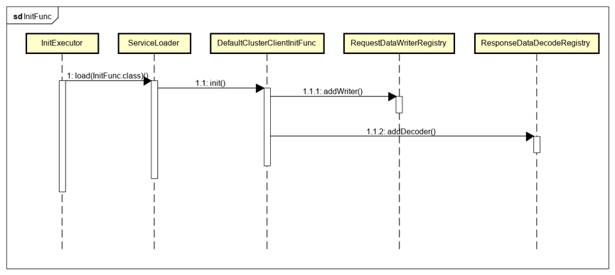

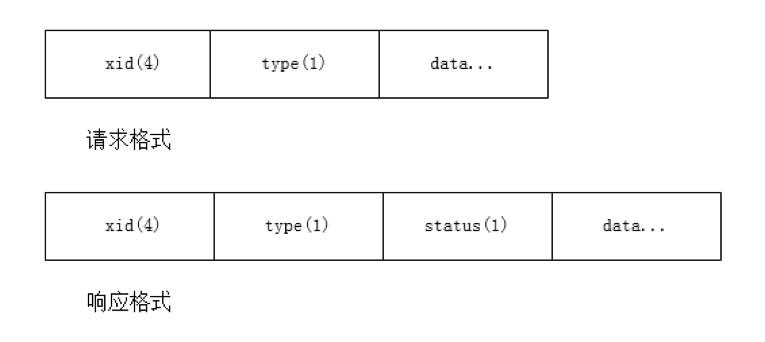

&emsp;上图为sentinel-cluster的通信协议格式，请求和响应中有个4个字节的消息id和1个字节的消息类型，剩下的就是消息体，对于响应格式，有1个字节的状态信息。需要说明的是，在初始化Netty客户端时，增加了两个filter：

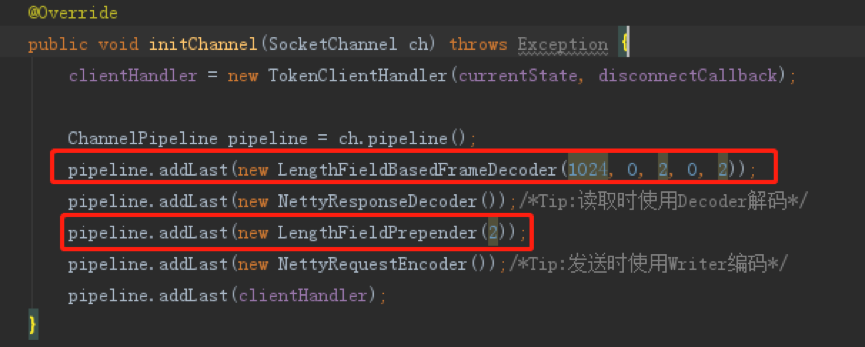

&emsp;也就是说在发送一个消息时，会自动加上长度为2个字节的消息长度头部，在读取时也会自动省略2个字节的消息长度头部。
为了解析上面的消息格式，在提供了注册方法之上，sentinel还提供了ClientEntityCodeProvider，统一了报文的处理。

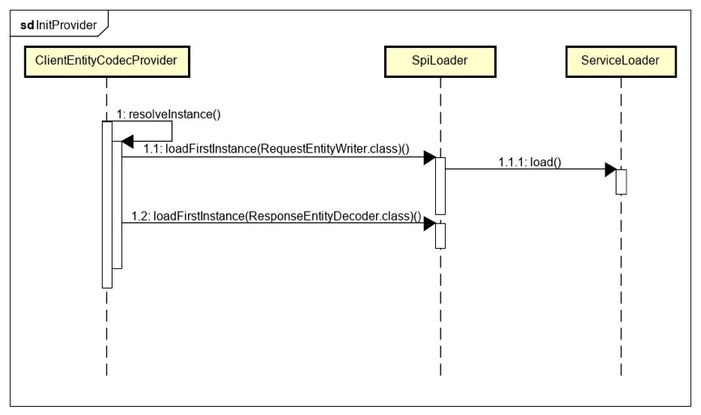

&emsp;如上，该类在static静态代码块中进行了初始化，使用SPI，获取RequestEntityWriter和ResponseEntityDecoder的实现类，这两种实现类也在该模块中指定了默认实现：DefaultResponseEntityDecoder和DefaultRequestEntityWriter。即处理过程为

```

ClientEntityCodecProvider->ResponseEntityDecoder->ResponseDataDecodeRegisty-> EntityDecoder

ClientEntityCodecProvider->RequestEntityWriter->RequestDataWriterRegisty-> EntityWriter

```

&emsp;系统还提供了TokenClientHandler类，用于响应数据流，进行相应的处理

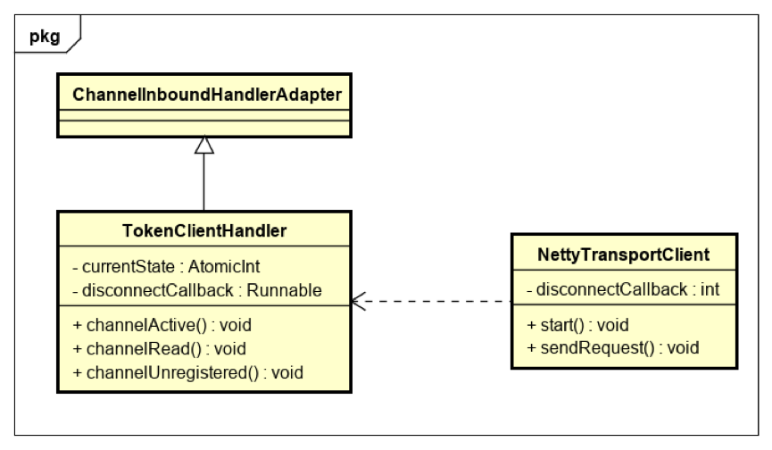

&emsp;如上只列出了比较重要的属性和方法。该类继承了ChannelInboundHandlerAdapter并实现了对应的方法，currentState属性用于标记客户端当前的状态，disconnectCallback则用于负责在断线时进行重连。TokenClientHandler实现channelActive方法，会在连接建立时会发送PING请求给服务端；实现channelUnregistered方法，会在连接断开时调用disconnectCallback，在一定时间后进行重连，等待时间跟失败次数有关；实现channelRead方法，会在有响应数据时，接收响应内容，并进行处理，处理流程如下：

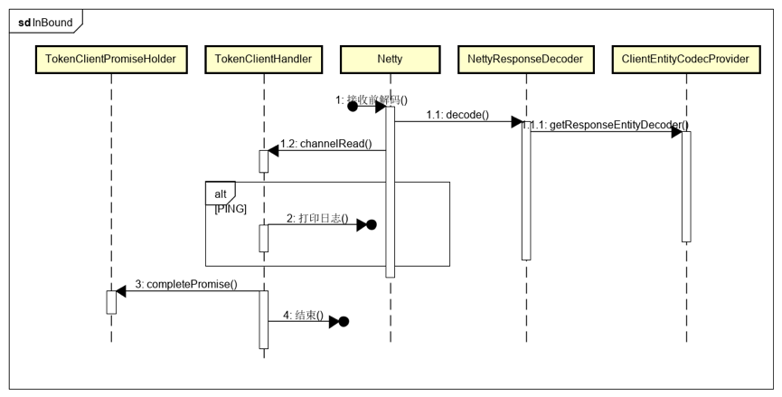

&emsp;在经过Netty处理解析为消息类型对象后，会判断该响应的类型，如果是PING消息的响应，则直接输出日志，否则将从TokenClientPromiseHolder中根据消息id设置对应的响应内容，以便消息发送线程能够获得响应。
&emsp;上面提到的TokenClientPromiseHolder用于缓存请求消息。如下图，发送消息后，会获取对应的ChannelPromise对象，并根据消息存于TokenClientPromiseHolder中。ChannelPromise会等待Netty请求响应回来，对应的流程如上面InBound流程。在请求正常响应后，会根据消息id再从TokenClientPromiseHolder中获取对应的响应结果。

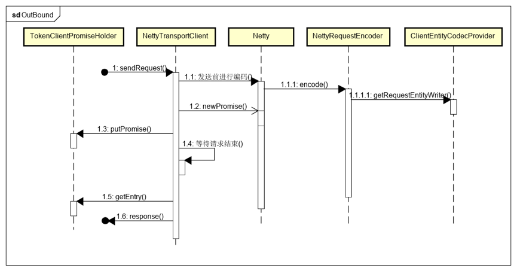

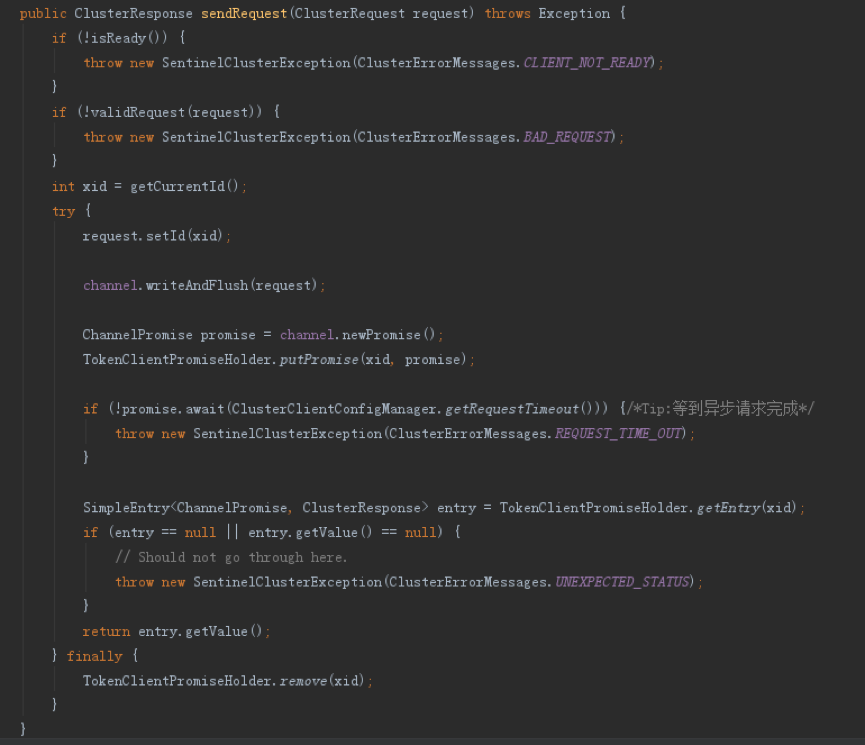

&emsp;Cluster模块的核心接口为TokenService ，ClusterTokenServer和ClusterTokenClient。其中ClusterTokenClient内部主要类为NettyTransportClient，在上面已经进行了说明，下面说下其他两个接口。TokenService ，ClusterTokenServer在模块中的关系如下图：

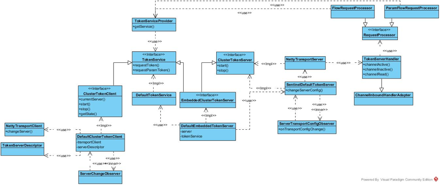

&emsp;其中接口都由SPI给出了默认的实现，如下：

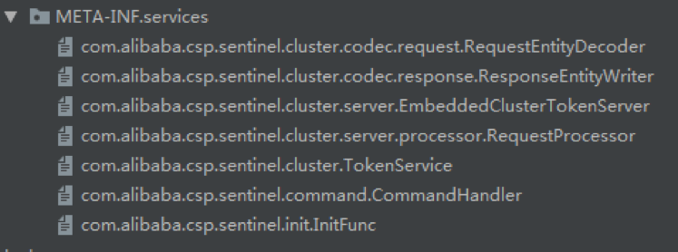

&emsp;下面对涉及到的接口和类进行说明。

&emsp;TokenService：token服务接口，提供了requestToken和requestParamToken方法，分别表示获取流控令牌和获取热点参数令牌。提供的默认实现为DefaultTokenService，会在TokenServiceProvider初始化时使用SPI进行加载。

&emsp;ClusterTokenServer：服务端上层接口，提供了start和stop方法用于服务端的启动和停止。

&emsp;NettyTransportServer：ClusterTokenServer的netty实现，同客户端对应，有如下的pipeline配置

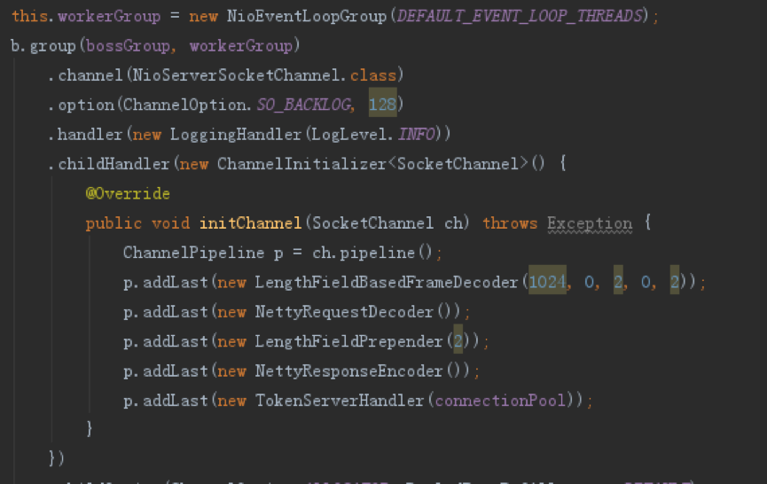

&emsp;其中编解码器的处理同客户端类似，只是增加了服务端的处理器：TokenServerHandler。TokenServerHandler继承自ChannelInboundHandlerAdapter用以在连接建立和有数据交互时进行相应的处理：

1.	实现channelActive：在连接建立时将其缓存起来

2.	实现channelInactive：在连接断开时移除缓存

3.	实现channelRead：在有数据到来时，进行处理。这里会使用RequestProcessorProvider加载的RequestProcessor实现类，根据请求的类型(type字段)选择相应的处理类进行处理。系统现在提供的处理类有FlowRequestProcessor和ParamFlowRequestProcessor，这两者最后都将通过TokenServiceProvider获得DefaultTokenService对象，调用其来完成请求。

&emsp;SentinelDefaultTokenServer：包装了NettyTransportServer方法，增加了ServerTransportConfigObserver用于监听服务端配置项的更改，从而更新自身。

&emsp;EmbeddedClusterTokenServer：继承自TokenService和ClusterTokenServer，用于内嵌服务端模式，默认实现为DefaultEmbeddedClusterTokenServer。

&emsp;DefaultEmbeddedClusterTokenServer：主要组合了DefaultTokenService和SentinelDefaultTokenServer对象用以实现接口方法。

&emsp;结合上面服务端的实现，可以得到客户端请求一个token的流程如下：

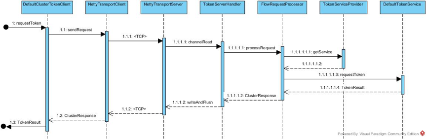

1.	客户端调用DefaultClusterTokenClient的requestToken方法获取token，其内部会委托NettyTransportClient编码后发给服务端
2.	服务端NettyTransportServer收到请求后，由TokenServerHandler的channelRead方法处理这里会根据请求内容中的type，委托给对应的消息处理处理，如FlowRequestProcessor
3.	FlowRequestProcessor会调用TokenServiceProvider获取对应的TokenService实现类，默认为DefaultTokenService。然后委托为该类进行处理。


#### 三.统计逻辑

&emsp;由上可知，cluster模式下，token的获取是由DefaultTokenService来负责的，分为两种：普通流控和热点参数流控。二者的实现基本一致，这里只对普通流控做讲解，即DefaultTokenService中的requestToken方法，如下为处理流程。

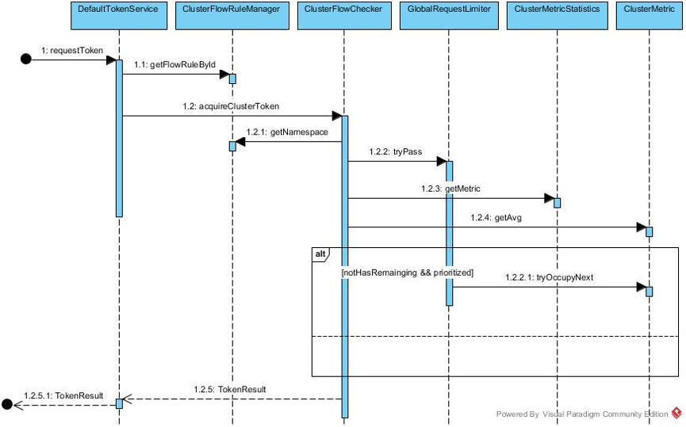

&emsp;当请求requestToken方法时，请求参数包括:

&emsp;ruleId：规则id

&emsp;acquireCount：需要获取的token数

&emsp;prioritized：是否支持优先

1.	DefaultTokenService会先根据ruleId，使用ClusterFlowRuleManager获得对应的FlowRule规则对象。ClusterFlowRuleManager会在更新规则或者加载规则时根据ruleId缓存在Map中，且分配唯一一个ClusterMetric。

2.	获得对应的FlowRule对象后，会调用ClusterFlowRuleChecker，判断是否能够获取所需要的token

3.	ClusterFlowRuleChecker会先根据规则Id获得该规则所对应的namespace，然后判断该namespace在全局状态下是否超过流控，该步骤主要由GlobalRequestLimiter提供，该类存储着各个namespace对应的RequestLimiter对象。RequestLimiter继承自LeapArray，只提供了QPS一个维度的滑动窗口实现，默认实现为一秒内10个格子，如下图。全局流控主要使用RequestLimiter的tryPass方法，计算当前qps是否大于规则设定的全局qps。

4.	全局流控通过后，会根据ClusterMetricStatistics获取ruleId对应的ClusterMetric，以获取ruleId对应的统计维度。首先会判断当前时间是否有可用的token，这里会根据规则设定的thresholdType，区分设定的阈值模式，如果是全局模式，直接根据设定的值进行限流，如果是单机均摊模式，会将该值乘上已有的额客户端数达到设定的阈值。如果有则更新统计信息并返回成功，如果没有且不支持优先，则直接返回获取失败。如果支持优先，则尝试从下一个格子借用token(注：本地模式的借用会从后面的格子借用，只要不超过最大的等待时间)，如果借用成功则更新统计信息并返回成功，否则返回失败。ClusterMetric的结构如下，继承自ClusterMetriceLeapArray，该滑动窗口提供了cluster模式下多种模式的统计数据，还支持请求优先。


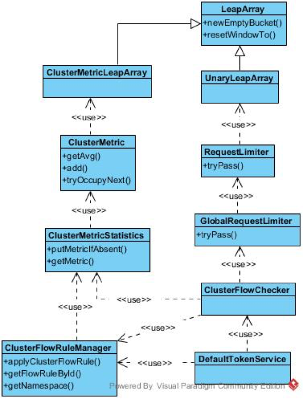


#### 四.服务端启动模式

&emsp;Sentinel服务端启动模式可以分为Alone独立模式和Embedded嵌入模式。

&emsp;独立模式（Alone），即作为独立的 token server 进程启动，独立部署，隔离性好，但是需要额外的部署操作。独立模式适合作为 Global Rate Limiter 给集群提供流控服务。

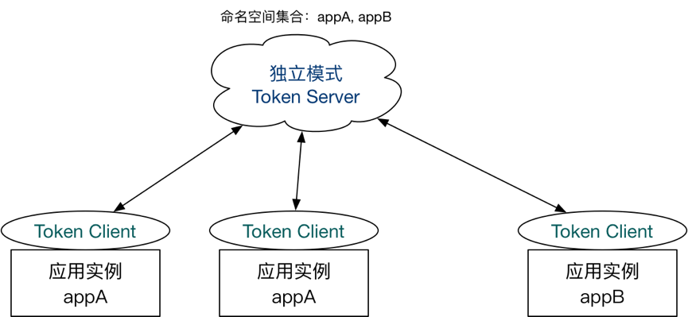

1. 在独立模式下，我们可以直接创建对应的 ClusterTokenServer 实例并在 main 函数中通过 start 方法启动 Token Server。

2. 嵌入模式（Embedded），即作为内置的 token server 与服务在同一进程中启动。在此模式下，集群中各个实例都是对等的，token server 和 client 可以随时进行转变，因此无需单独部署，灵活性比较好。但是隔离性不佳，需要限制 token server 的总 QPS，防止影响应用本身。嵌入模式适合某个应用集群内部的流控。

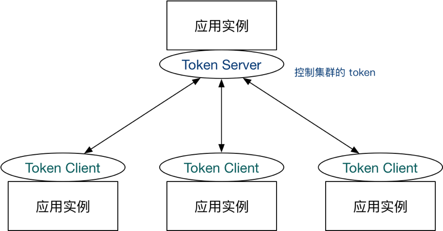

&emsp;系统提供了 HTTP API 用于在 embedded 模式下转换集群流控身份：

```
http://<ip>:<port>/setClusterMode?mode=<xxx>
```

&emsp;其中 mode 为 0 代表 client，1 代表 server，-1 代表关闭。

&emsp;该请求会由ModifyClusterModeCommandHandler处理并最终调用ClusterStateManager.applyState方法来设置当前节点的状态。需要说明的是，嵌入模式可以不用显示启动服务端，而是由上面的applyState模式来设置，该方法会在内部启动服务。当然也可以不显示启动客户端，同样通过上面的方法，可以将当前节点设置为客户端模式。在将当前节点设置为客户端时，会先获取当前嵌入模式下的服务端对象，如果不为空，则停止该对象，并启动服务端；反之在设置服务端时，会先获取客户端对象，如果不为空，则先停掉，再启动嵌入模式下服务端对象。应用启动接入dashboard后，可以通过管理台来控制各节点的角色，或者通过从配置中心加载规则来更改规则。

#### 五.Handler

&emsp;sentinel-transport-common中定义了一套handler接口，用于对外提供HTTP接口同系统交互，从而能够获取系统数据或者对应用节点下发命令。

&emsp;common模块提供了如下几个基本接口:

1. CommandCenter：命令中心，作为服务启动，定义了start和stop方法，主要提供handler的初始化和注册服务。

2. HeartbeatSender：心跳发送接口，用于给控制台dashboard定时发送心跳

3. CommandHandler：请求处理接口，请求对象为CommandRequest，响应对象为CommandResponse

4. CommandMapping：注解，用于为Handler添加元数据，包括处理器名(URL路径名)和描述

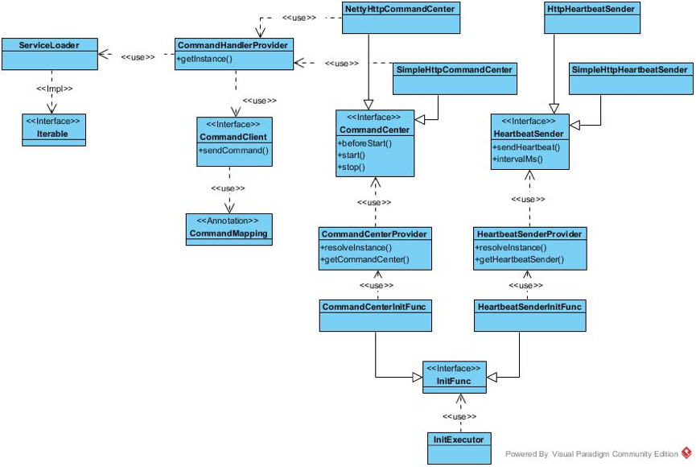

&emsp;针对上面的接口，common模块提供了相对应的Provider类，用于以SPI的方式加载默认/自定义的实现，如上图，包括：

1. CommandCenterProvider：根据SPI，加载设定的实现，如果有多个实现，则根据Order注解，选择优先级最高的一个

2. HeartbeatSenderProvider：根据SPI，加载设定的实现，如果有多个实现，则根据Order注解，选择优先级最高的一个

3. CommandHandlerProvider：会加载所有的Handler实现类，不同模块提供的Handler实现只要以SPI的方式，在META-INF中提供对应的全限定名就会被该类扫描并使用。实现类需要增加CommandMapping注解以指定URL。

&emsp;如下为common模块提供的Handler实现


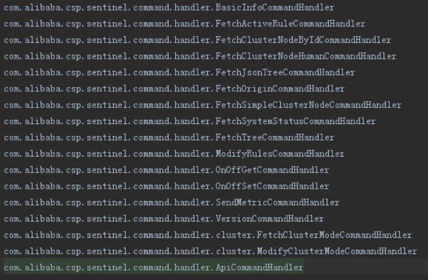

&emsp;上图中common的SPI接口中还有一个InitFunc实现，包括CommandCenterInitFunc和HeartbeatSenderInitFunc两个实现类，这两个类实现了InitFunc接口，会在InitExecutor被调用时初始化所有的InitFunc实现。对应的作用为：

&emsp;CommandCenterInitFunc：使用CommandCenterProvider获取对应的CommandCenter实现，依次执行beforeStart和start方法，以启动服务。即只要加载了sentinel-transport-common模块并通过SPI提供CommandCenter的实现，便会在InitFunc被调用时启动服务。

&emsp;HeartbeatSenderInitFun：HeartbeatSenderProvider获取对应的HeartbeatSender实现，启动定时器，每隔5秒执行一次sendHeartbeat方法。即只要加载了sentinel-transport-common模块并通过SPI提供HeartbeatSender的实现，便会在InitFunc被调用时启动心跳定时器。

&emsp;上面提到，只要提供了CommandCenter和HeartbeatSender的实现，并通过SPI注册对应的实现，并会自动启动对应的服务，而位于sentinel-transport-simple-http和sentinel-transport-netty的模块为这两个接口提供了默认实现。

&emsp;sentinel-transport-simple-http提供的实现为SimpleHttpCommandCenter和SimpleHttpHeartbeatSender。

&emsp;SimpleHttpCommandCenter：基于socket，以阻塞模式提供了简单的http服务器，会在启动前通过CommandHandlerProvider缓存所有的Handler对象，当请求进来时新开线程处理，并在线程中调用对应的Handler进行处理并返回

&emsp;SimpleHttpHeartbeatSender：使用内建的SimpleHttpRequest向dashboard发送Http心跳请求

&emsp;sentinel-transport-netty提供的实现为NettyHttpCommandCenter和HttpHeartbeatSender。

&emsp;NettyHttpCommandCenter：基于netty，以服务端模式启动，会在启动前通过CommandHandlerProvider缓存所有的Handler对象，内建的HttpServerHandler对象会在请求进来时获取解码后的对象，并根据请求类型调用对应的Handler进行处理并返回

&emsp;HttpHeartbeatSender：使用httpclient客户端想dashboard发送Http心跳请求

&emsp;综上，sentinel-cluster-server-default模块提供了如下的Handelr实现，用于给dashboard提供集群信息并接受从dashboard发送过来的命令。

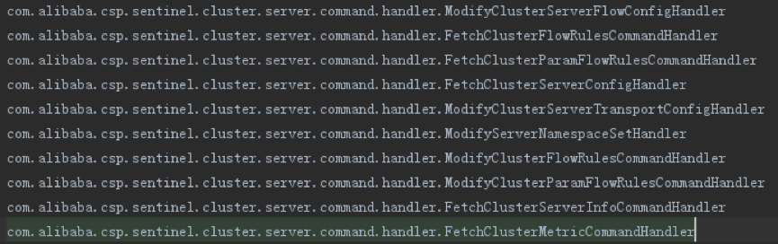

&emsp;其中Fetch开头的为读取消息，Modify开头的为修改系统消息。

#### 六.集群管理接口

&emsp;Sentinel预留了诸多管理接口，用于动态加载规则或者配置，然后更新本地的状态，这里对涉及到cluster模式下的几个管理接口进行说明。在这之前，先介绍下demo中以Nacos为配置中心的接入方式。

&emsp;接入Nacos涉及到另外两个模块,sentinel-datasource-extension和sentinel-datasource-nacos。Extension模块定义了ReadableDataSource接口，用于从数据源读取数据，返回配置数据SentinelProperty。Extension模块提供了一个抽象类实现AbstractDataSource，实现了loadConfig方法。该类引入了Converter接口和DynamicSentinelProperty类，Converter接口用于将数据源中读取的数据结构转换为SentienlProperty存储的数据格式；DynameicSentinelProperty类为SentinelPorperty的默认实现，该类能够添加多个PropertyListener监听器，在添加时触发监听器的configLoad方法进行监听器的初次动作，并在数据发生变更时，逐个通知监听器，调用监听器的configLoad方法，提醒监听器进行更新。AbstractDataSource实现了loadConfig方法，该方法会调用readSource方法，从数据源读取原始数据，并调用Converter进行数据转换。

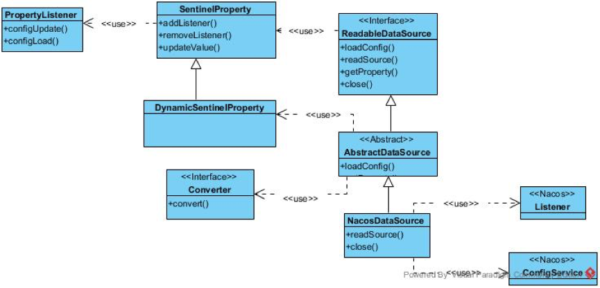

&emsp;Nacos模块提供了NacosDataSource实现，继承自AbstractDataSource，以接入Nacos配置中心。NacosDataSource在初始化时会在Nacos上申请一个配置集，并添加监听器，然后执行一遍loadConfig，从配置中心加载一遍配置并，更新property中的值并通知配置集上的监听器。Nacos上的监听器会在配置发生变化时，调用Convert记性处理，并更新配置集，同时通知配置集上的监听器。

&emsp;由上可知，可以通过使用DynamicSentinelProperty动态配置集上的监听器，配合数据眼监听配置变化，从而让系统做出相应的动作。事实上，sentinel内置的大部分管理接口都是这样处理的，如下为集群相关的主要管理接口，均以Manager结尾。这些管理接口的结构都同FlowRuleManager一样，内部维护这一个或者多个配置源，并在配置源上设置了监听器，当配置源有数据变化时，会调用配置源的updateValue方法，更新配置源数据并且通知监听器。

1. FlowRuleManager

	&emsp;这个在讲解sentinel-core模块时有介绍过，主要是存储本地限流规则集SentinelProperty<List<FlowRule>>。该规则集上有FlowPropertyListener监听器，会在规则发生变更时重新构建，加载规则。

2. ParamFlowRuleManager

	&emsp;同FlowRuleManager，主要用于热点参数限流规则管理。

3. ClusterClientConfigManager

	&emsp;集群客户端配置管理，主要管理：

	1) 集群客户端配置，用于设定客户端超时时间，配置集为SentinelProperty<ClusterClientConfig>和监听器ClientConfigPropertyListener。会在规则发生变更时，更新客户端的请求超时时间

	2) 集群服务端信息配置，用于设定服务端的ip和端口信息，配置集为SentinelProperty<ClusterClientAssignConfig>和监听器ClientAssignPropertyListener。会在规则发送变更时，更新本地配置，并通知ServerChangeObserver观察者服务端节点发送了变化，由之前的内容可以看到，DefaultClusterTokenClient为该接口的观察者，会在服务端信息发送变更时先断开同之前的链接，再同心的服务端节点建立新的链接。

4. ClusterServerConfigManager

	&emsp;集群服务端配置管理，主要管理：

	1) 集群服务端传输配置，用于设定服务端端口和idle时间，配置集为SentinelProperty<ServerTransportConfig>和监听器ServerGlobalTransportPropertyListener。会在规则发生变更时，更新本地配置，并通知ServerTransportConfigObserver观察者配置发生了变化。由之前的内容可以看到，SentinelDefaultTokenServer为该接口的观察者，会在服务端信息发送变更时，停止自身应用，再重新启动。

	2) 集群服务端全局流控配置，用于设定全局流控配置项，包括滑动窗口实现大小，窗口格子数，允许通过的最大qps等。配置集为SentinelProperty<ServerFlowConfig>和监听器ServerGlobalFlowPropertyListener，会在规则更新时重新设置这些配置内容。

	3) 集群服务端namespace集合配置，用于设定集群中的namespace集合，配置集为SentinelProperty<Set<String>>和监听器ServerNamespaceSetPropertyListener，会在配置发生变更时移除老namesapce的配置，并重新载入新namesapce的配置，包括对应的全局限流器GlobalRequestLimiter，集群限流规则，集群热点限流规则。

5. ClusterFlowRuleManager

	&emsp;集群限流规则配置管理，主要管理：

	1) 集群规则配置，用于设定集群规则，配置集为SentinelProperty<List<FlowRule>>和监听器FlowRulePropertyListener，会在配置发生变更时，移除对应namespace下的缓存的配置，并重新构建对应的规则。对于一个新的flowId，会为其分配一个对应的ClusterMetricStatistics统计节点。

6. ClusterParamFlowRuleManager

	&emsp;集群热点限流规则配置管理，同ClusterFlowRuleManager

7. ClusterStateManager

	&emsp;集群全局状态管理，主要管理：

	1) 本机角色配置，配置集为SentinelProperty<Integer>和监听器ClusterStatePropertyListener，会在规则发生变更时，调整本机的角色。角色包括：服务端，客户端和非集群模式。若规则为非集群模式，则会停止相关的客户端或者服务端；若设置为服务端模式，则会使用嵌入模式启动服务，若之前为客户端则会关闭客户端连接；若设置为客户端模式，则会启动客户端连接，若之前为服务端则会停止服务。

&emsp;上述几个管理接口都可以接入配置中心如Nacos，以通过配置中心和管理台来改变各配置项。


