# Spring BeanDefinition的加载


&emsp;前面提到AbstractRefreshableApplicationContext在刷新BeanFactory时，会调用loadBeanDefinitions方法以加载系统中Bean的定义，下面将讲解Bean定义的加载过程。

#### 一．XML定义

&emsp;XML配置的加载由AbstractXmlApplicationContext实现，方法实现如下：

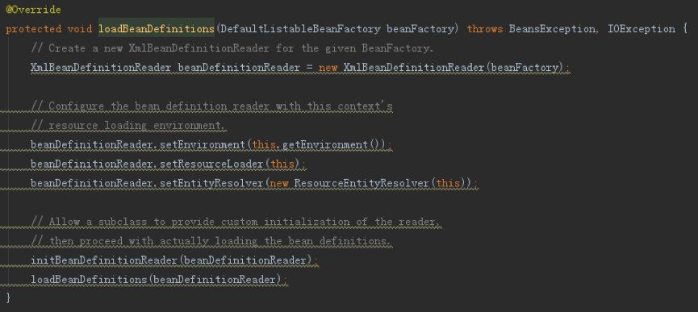


&emsp;主要是实例化了一个XmlBeanDefinitionReader对象，对其设置了Environment对象（具体过程可以上一篇）等后，调用XmlBeanDefinitionReader进行解析。直接跟踪进去，得到如下内容：


&emsp;其中参数inputSource为XML配置文件，Resource则该配置文件的描述，主要描述了该配置文件在classpath中的位置和可用于加载该配置文件的加载器。doLoadDocument方法比较简单，主要是加载指定的配置文件，返回一个JDK内置的XML解析Document对象，以便于解析XML DOM节点。

&emsp;重点看下registerBeanDefinitions方法，如下：

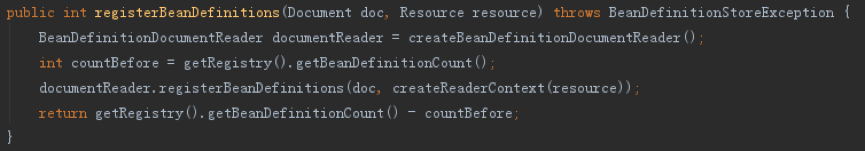

&emsp;该方法最终委托给了BeanDefinitonDocumentReader来完成Bean的解析。在这之前，初始化了一系列相关对象。包括：

1. 使用DefaultBeanDefinitionDocumentReader作为BeanDefinitionDocumentReader接口的实现

2. 创建了一个XmlReaderContext用于保存解析过程中使用到的各个相关对象，如资源描述对象Resource、ReaderEventListener事件监听器、XmlBeanDefinitionReader以及NamespaceHandlerResolver命名空间解析器。其中划重点的是DefaultNamespaceHandlerResolver，该类完成了自定义XML格式的解析，后面会有讲解。

&emsp;初始相关对象后便将解析过程委托给了DefaultBeanDefinitionDocumentReader来进行处理，该类的重点为parseBeanDefinitions方法，在调用该方法前，先初始化了一个BeanDefinitionParserDelegate对象，如下：

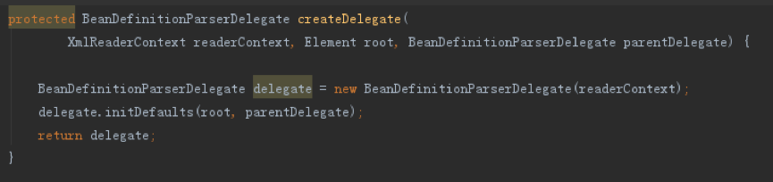

&emsp;并将该delegate对象传入了parseBeanDefinitions方法。BeanDefinitionParserDelegate主要提供了命名空间为```http://www.springframework.org/schema/beans```（下面简写为beans空间）的XML文件解析过程。该命名空间定义了4个主要的XML标签，分别为```beans```、```bean```、```import```和```alias```以及这些标签对应的属性，如下为该命名空间的示例，定义了一个基础的Bean。

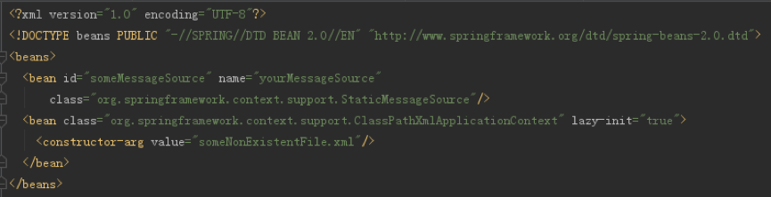

&emsp;需要注意的是，上面在初始化BeanDefinitionParserDelegate后会先解析XML上```<beans>```标签上的默认属性，包括：```default-lazy-init```、```default-merge```、```default-autowire```、```default-dependency-check```、```default-autowire-candidates```、```default-init-method```和```default-destroy-method```这些全局属性。

&emsp;下面看下parseBeanBefinitoins方法：

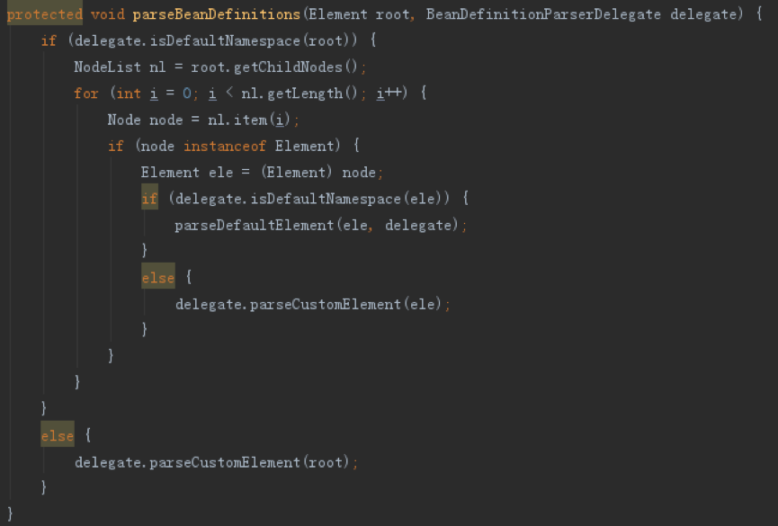

&emsp;该方法会对当前节点所属命名空间进行判断，分为默认命名空间和自定义命名空间，其中默认命名空间指的是上面提到的beans空间。对于默认命名空间，会逐一解析每个DOM子节点，判断子节点的命名空间，最终委托给两个方法：处理默认命名空间的parseDefaultElement方法和处理自定义命名空间的parseClustomElement方法。

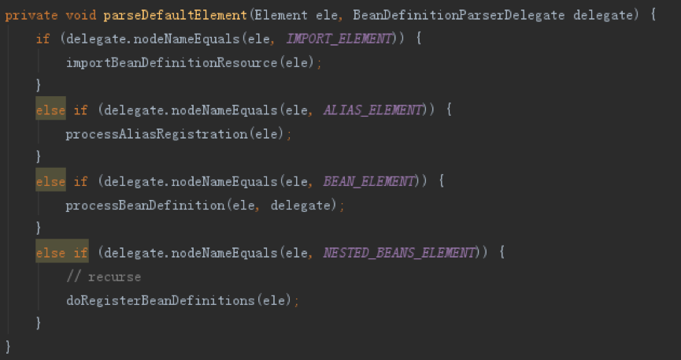

&emsp;parseDefautlElement方法如上， 对beans空间定义的各个标签分别进行了处理：

1. 解析import标签时，会读取resource属性指定的配置文件，加载后再解析该文件中的bean定义。
2. 解析alias标签时，读取标签的name和alias属性，添加到BeanRegistry缓存中。
3. 解析bean标签时，直接委托给BeanDefinitionParserDelegate来处理，过程为：

	1) 获取id属性值作为beanName

	2) 获取name属性值作为aliases，该属性值可以配置多个，以 , 或者 ; 符进行分割，将作为该bean的别名使用；若id指为空，且name不为空，则使用第一个name值作为id值

	3) 检查beanName和aliases的唯一性

	4) 解析bean其他配置，生成GenericBeanDefinition对象

	5) 若beanName为空，则为其分配一个

	对于步骤```3.d```，处理过程为：

	1) 获取class属性值

	2) 获取parent属性值

	3) 初始化GenericBeanDefinition实例

	4) 解析bean节点的属性，设置到BeanDefinition中，包括：```scope```、```abstract```、```lazy-init```、```autowired```、```dependency-check```、```autowire-candidate```、```primary```、```init-method```、```destroy-method```、```factory-method```、```factory-bean```

	5) 解析description子节点，获取值设置bean的描述内容

	6) 解析meta子节点列表，获取key、value值设置附加元数据信息

	7) 解析lookup-method子节点列表，获取name、bean值设置方法注入信息

	8) 解析replaced-method子节点列表，获取值设置需要动态代理的方法信息

	9) 解析constructor-arg子节点列表，获取值设置构造参数信息

	10) 解析property子节点列表，获取值设置属性信息

	11) 解析qualifier子节点列表，获取值进行设置

&emsp;上面解析完bean的配置后，会再处理子节点中其他命名空间的配置，使用NamespaceHandler的decorate方法，用以修改Bean定义内容，这部分将使用下面的内容，放在后面一起讲。

4. 解析beans标签时，会进行递归处理

&emsp;如上，默认命名空间主要用于解析bean的定义，经过上面的处理，bean定义的解析就已经完成，会将实例对象注册到上下文中进行保存

&emsp;下面介绍parseClustomElement方法，顾名思义，该方法主要用来处理自定义命名空间的XML标签的，可以当做是spring XML配置处理的一种扩展手段，如下，为该方法的内容：

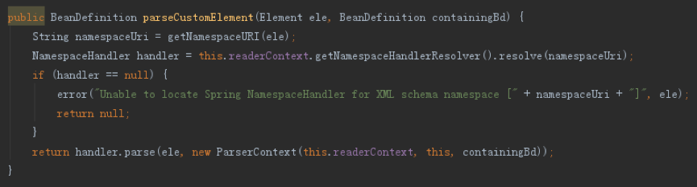

&emsp;主要委托给了NamespaceHandlerResolver，通过查找到对应节点对应命名空间的Handler，调用该Handler的parse方法进行处理。

&emsp;前面说过，NamespaceHandlerResolver使用了```DefaultNamespaceHandlerResolver```作为实现，跟踪resolve方法进去如下：

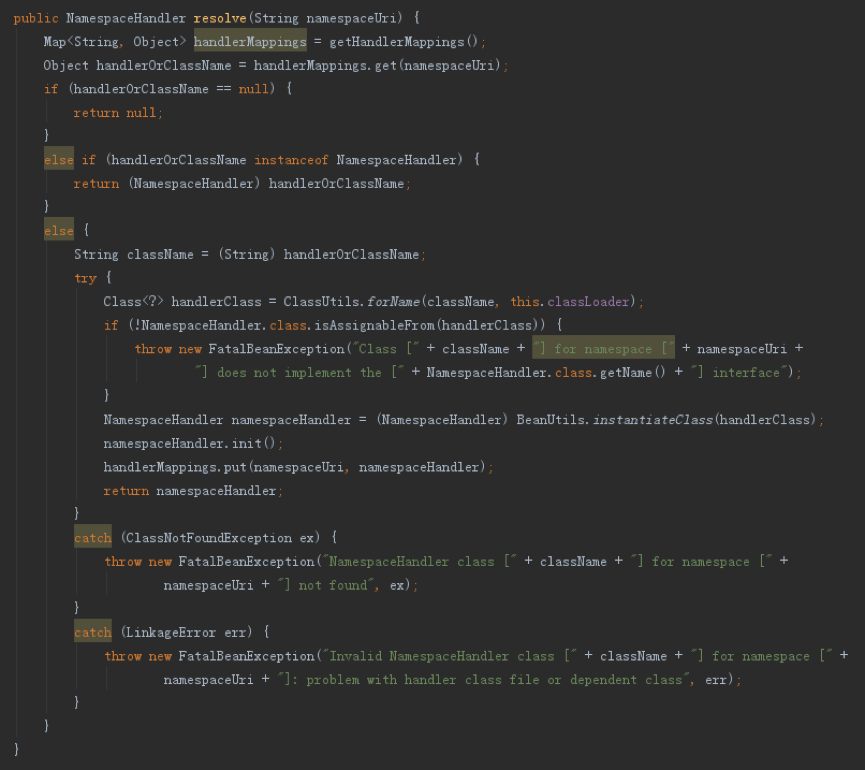

&emsp;过程为：

1. 获取已有的Handler处理列表，返回结果为一个Map，Key为XML命名空间，值可能为代表对应Handler类型的Spring对象或者已经实例化后的Handler对象，取决于之前是否已经调用过

2. 若指为Handler对象，则直接返回

3. 若为String对象，表明未初始化过，则初始化该类，并执行init初始化方法，然后将其重新返回Map中

&emsp;对于第（1）步中Handler处理列表的获取，Spring会扫描classpath中所有位于META-INF中的spring.handlers配置文件，将所有内容读取到一个Map中并返回。

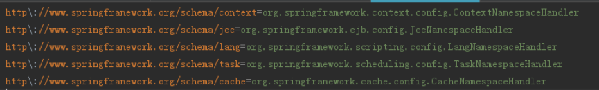

&emsp;如上，为spring-context模块提供的```spring.handlers```文件，提供了该模块自定义命名空间标签的支持。如下为自定义命名空间的例子：

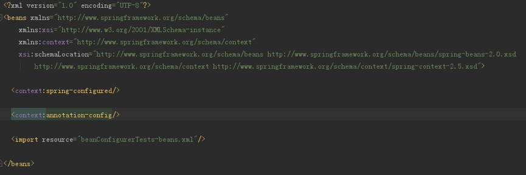

&emsp;主要引入了context空间的```spring-configured```标签和```annotation-config```标签。

&emsp;至此，介绍了XML配置下的bean解析。

#### 二、注解配置

&emsp;下面介绍Spring以注解的方式进行bean加载的过程，如下，为开启注解加载所需要的配置：

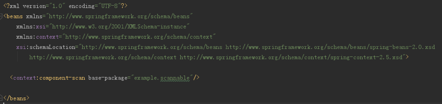

&emsp;根据前面的内容，```component-scan```为```http://www.springframework.org/schema/context```命名空间中的标签，处理对象在spring-context模块的spring.handlers文件中定义，对应的是类org.springframework.context.config.ContextNamespaceHandler，如下：

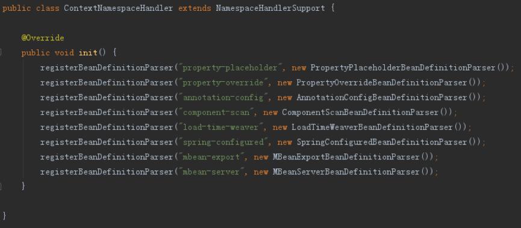

&emsp;查看该类，可以知道，component-scan由ComponentScanBeanDefinitionParser处理，如下：

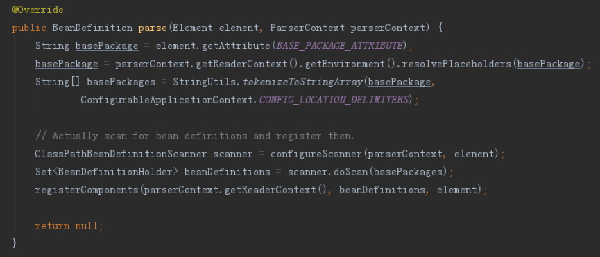

&emsp;主要过程为：

1. 获取```base-package```属性内容赋值给basePackage

2. 替换basePackage中的占位符内容

3. 根据 ,  ;  \t  \n 分割符分割basePackage，得到多个包路径

4. 解析component-scan配置内容，返回ClassPathBeanDefinitionScanner对象

	1) 解析设置use-default-filters参数

	2) 解析设置resource-pattern参数

	3) 解析设置name-generator参数

	4) 解析设置scope-resolver、scoped-proxy等参数

	5) 解析设置```include-filter```、```exclude-filter```等参数, ClassPathBeanDefinitionScanner对象再初始化时默认增加了org.springframework.stereotype. Component、javax.annotation.ManagedBean和javax.inject.Named几种注解

5. 调用ClassPathBeanDefinitionScanner的doScan方法执行扫描，将符合的类并注册到上下文中然后返回

6. 解析annotation-config参数，如果为true（默认为true）则自动注册一系列用于后置解析的注解处理类定义到上下文中
这里重点看下第（5）步和第（6）步

&emsp;第（5）执行扫描时，会遍历第（3）步返回的所有路径，对于每个路径，会调用父类ClassPathScanningCandidateComponentProvider的findCandidateComponents方法，返回该路径下所有符合要求的Bean，如下：

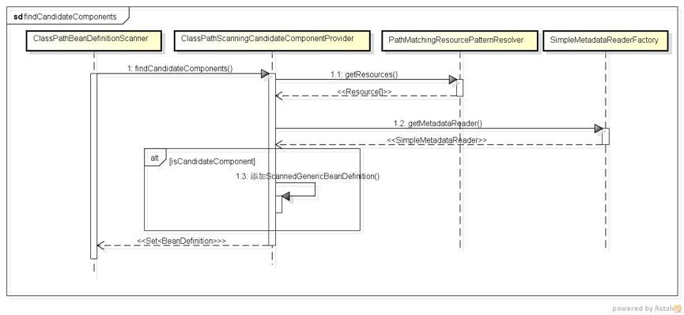

&emsp;ClassPathScanningCandidateComponentProvider会找到指定路径所有的类，包装为Resource[]对象，对于每个Resource，会使用SimpleMetadataReaderFactory工厂类为每个Resouce对象新建一个SimpleMetadataReader对象，该对象用于解析类的信息，需要注意的是，在初始化SimpleMetadataReader对象的时候就会执行解析动作，将结果存为ClassMetadata数据和AnnotationMetadata数据，前者用于存储类的定义信息，包括类名，是否接口，包含的属性等信息，后者则包含所有的注解信息。获取SimpleMetadataReader对象后，会判断该类是否符合```component-scanner```定义的```include-filter```和```exclude-filter```中定义的内容，注意，默认包含了```@Component```等对象，所以默认会加载所有有```@Component```注解且所有有```@Component```元注解注解(如```@Service```、```@Repository```)的类。若符合要求，则将该类包装为ScannedGenericBeanDefinition对象，同时会检查该类不能为一个接口且不能依赖一个内部非静态类，若符合，则添加到待返回列表中。

&emsp;执行完上面的findCandidateComponents方法后，会为其分配一个beanName，用于内部使用，之后会调用AnnotationConfigUtils的processCommonDefinitionAnnotations方法，该方法会对上面返回的BeanDefinition解析一些基本的注解属性并进行设置，包括```@Lazy```、```@Primary```、```@DependsOn```、```@Role```和```@Description```。完成该步后会判断该bean是否已经存在，若不存在，则添加到上下文中。

&emsp;第（6）步的代码如下：

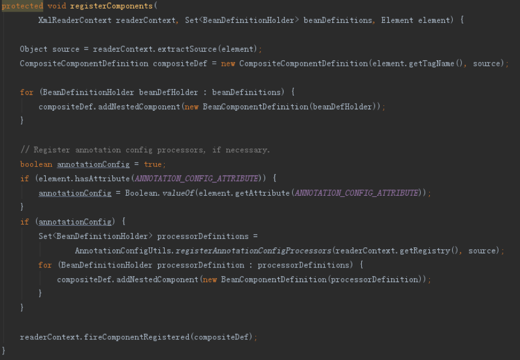

&emsp;重点在后半部分，会调用AnnotationConfigUtils的registerAnnotationConfigProcessors方法，该方法添加了一系列用于后置解析的注解处理类定义到上下文中，包括：

1. 添加ConfigurationClassPostProcessor处理器（BeanDefinitionRegistryPostProcessor）,添加```@Configuration```功能，对应bean为org.springframework.context.annotation.internalConfigurationAnnotationProcessor

2. 添加AutowiredAnnotationBeanPostProcessor处理器（SmartInstantiationAwareBeanPostProcessor、MergedBeanDefinitionPostProcessor），添加```@Autowired```，```@Value```功能，对应bean为org.springframework.context.annotation.internalAutowiredAnnotationProcessor

3. 添加RequiredAnnotationBeanPostProcessor处理器（SmartInstantiationAwareBeanPostProcessor、MergedBeanDefinitionPostProcessor），添加```@Required```功能，对应bean为org.springframework.context.annotation.internalRequiredAnnotationProcessor

4. 添加CommonAnnotationBeanPostProcessor处理器（InstantiationAwareBeanPostProcessor 、DestructionAwareBeanPostProcessor、MergedBeanDefinitionPostProcessor、BeanPostProcessor），添加```@PostConstruct```、```@PreDestroy```功能，对应bean为org.springframework.context.annotation.internalCommonAnnotationProcessor

5. 添加PersistenceAnnotationBeanPostProcessor处理器（InstantiationAwareBeanPostProcessor、DestructionAwareBeanPostProcessor、MergedBeanDefinitionPostProcessor），添加```@PersistenceUnit```、```@PersistenceContext```功能，对应bean为org.springframework.context.annotation.internalPersistenceAnnotationProcessor

6. 添加EventListenerMethodProcessor，添加```@EventListener```功能，对应bean为org.springframework.context.event.internalEventListenerProcessor

7. 添加DefaultEventListenerFactory，对应bean为org.springframework.context.event.internalEventListenerFactory

&emsp;以上各个bean在添加前都会先判断是否已经存在改定义，若不存在才增加，因而可以通过在添加相应bean的方式，修改对应的处理功能。

&emsp;***PS:第（6）步添加注解后置处理的方法其实也是annotation-config这个标签功能的主要处理方法。由上可知annotation-config的处理类为AnnotationConfigBeanDefinitionParser，该类内部其实也是调用了AnnotationConfigUtils的registerAnnotationConfigProcessors方法来完成注解的功能，具体代码如下：***

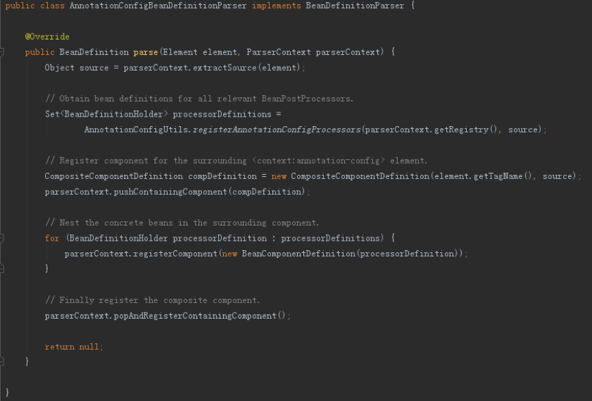

#### 三、接口回调

&emsp;结合之前Spring启动的内容，接上上面的内容，可以得到如下的接口回调顺序

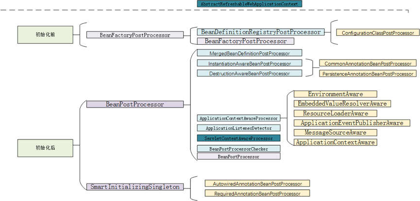

&emsp;因为InstantiationAwareBeanPostProcessor、DestructionAwareBeanPostProcessor等接口继承自MergedBeanDefinitionPostProcessor接口，MergedBeanDefinitionPostProcessor接口继承自BeanPostrProcessor，实现类上存在重叠，这里先根据讲解顺序排序。

