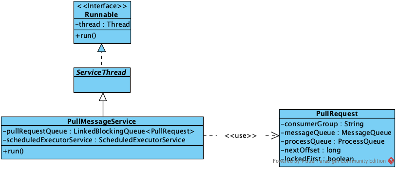
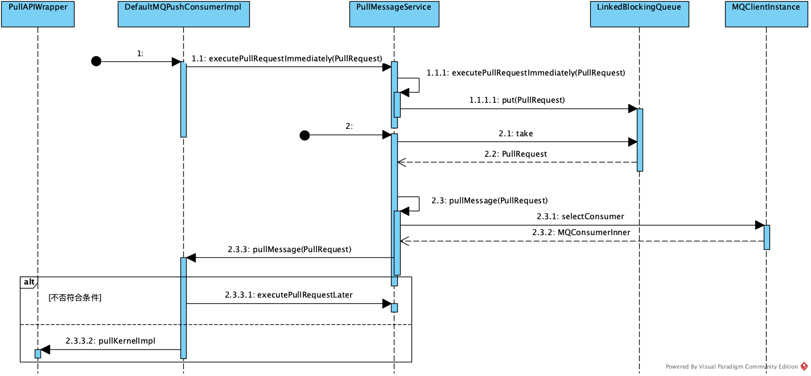
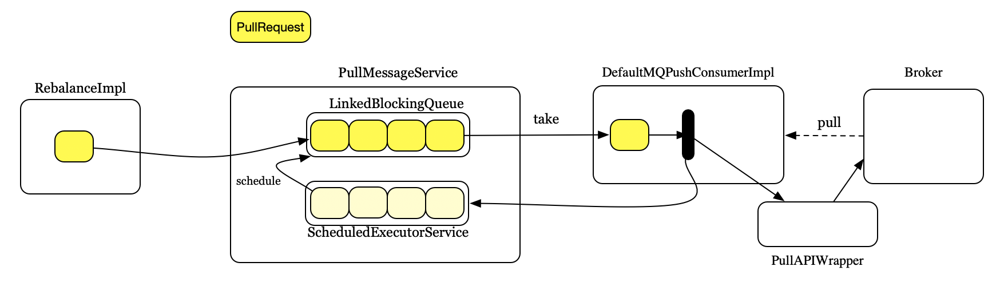
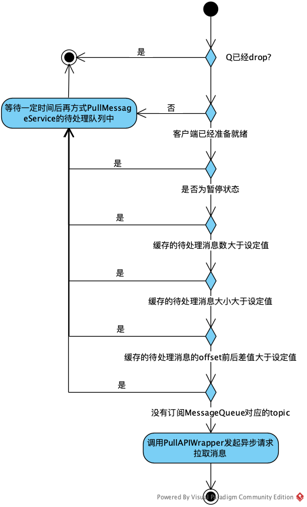
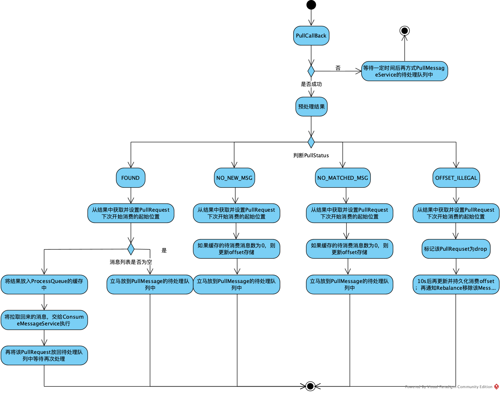
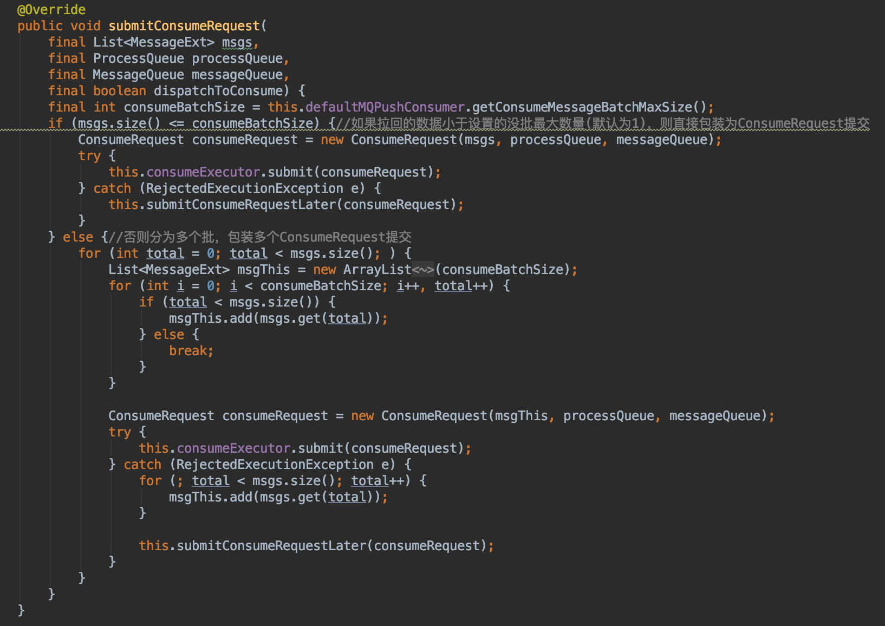
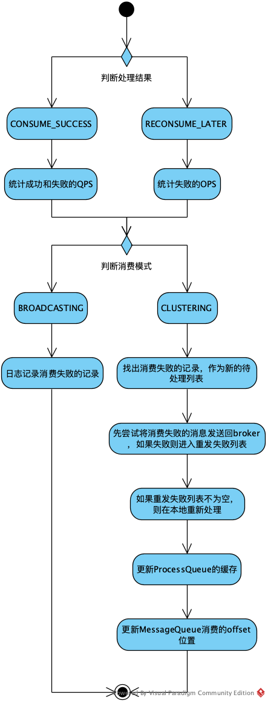
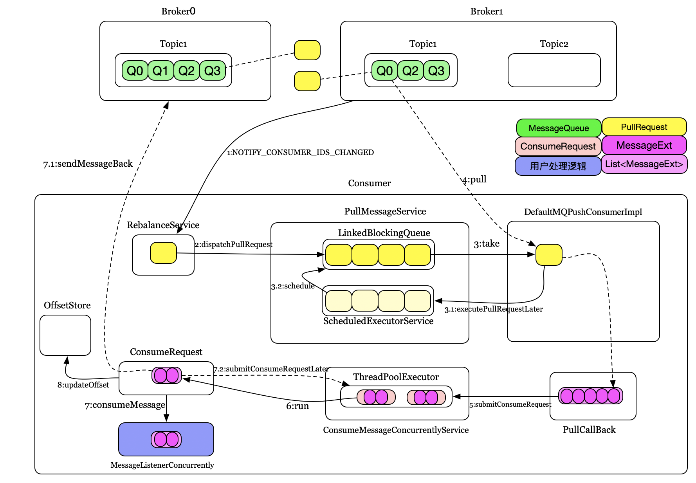
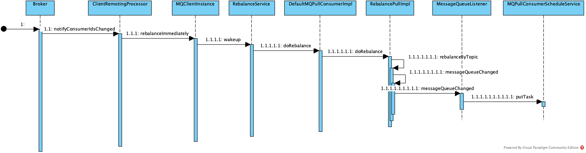
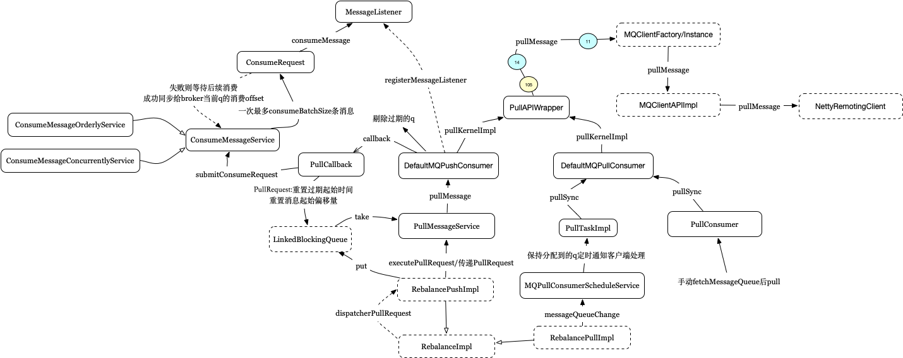

# RocketMQ Consumer接收消息流程


&emsp;这节介绍Consumer接收消息的流程，分为Pull和Push模式。

#### 1. 初始化

&emsp;上一节讲Rebalance时提到，Consumer接受客户端有两种方式：

1. Broker发现客户端列表有变化，通知所有Consumer执行Rebalance
2. Consumer定时没20秒自动执行Rebalance

其中1.的通知到达Consumer后，会立即触发Rebalance，然后会重置2.的定时器等待时间。二者最后通知Consumer的方式为

1. Push模式：当有新的Queue分配给客户端时，会新包装一个PullRequest，用于后续自动拉取消息，具体到DefaultMQPushConsumerImpl的executePullRequestImmediately方法
2. Pull模式：回调DefaultMQPullConsumerImpl的MessageQueueListener有Queue发生改变

#### 2. Push模式

&emsp;executePullRequestImmediately的内容为：

```
public void executePullRequestImmediately(final PullRequest pullRequest) {
    this.mQClientFactory.getPullMessageService().executePullRequestImmediately(pullRequest);
}
```

即将PullRequest对象传给了PullMessageService的executePullRequestImmediately方法：

```
public void executePullRequestImmediately(final PullRequest pullRequest) {
    try {
        this.pullRequestQueue.put(pullRequest);
    } catch (InterruptedException e) {
        log.error("executePullRequestImmediately pullRequestQueue.put", e);
    }
}
```

PullMessageService的结构如下：



内部维护着一个LinkedBlockingQueue属性pullRequestQueue，用于存储待处理的PullRequest;还有一个ScheduledExecutorService，用于延期处理PullRequest。具体流程如下：



1. RebalanceImpl调用DefaultMQPushConsumerImpl的executePullRequestImmediately方法，传入PullRequest
2. DefaultMQPushConsumerImpl内部调用PullMessageService的executePullRequestImmediately方法，该方法会把传入的PullRequest对象放到LinkedBlockingQueue中进行存储，等待后续处理。
3. PullMessageService会循环从队列中出队一个PullRequest，并调用自身的pullMessage用于后续处理。该动作会从MQClientInstance中选择对应的客户端实例DefaultMQPushConsumerImpl，并委托给它的pullMessage方法。
4. DefaultMQPushConsumerImpl会先判断当前请求是否满足条件，如果不满足条件，会调用PullMessage的executePullRequestLater方法，将当前请求延后处理。如果满足条件，会封装一个PullCallback对象用于处理异步消息，并调用PullAPIWrapper异步请求Broker拉取消息。

从上面的过程可以看出，Push模式内部还是客户端主动去拉取的，即所谓的封装拉模式以实现推模式,简单示意图如下：



内部通过PullMessageService循环的从PullRequest对应MessageQueue中主动拉取数据。

#### 2.1. DefaultMQPushConsumerImpl.pullMessage(PullRequest)

&emsp;该方法用于完成从MessageQueue拉取消息的过程，主要过程如下：



1. 判断该MessageQueue对应的PullRequest是否已经标记为drop，如果是则直接返回
2. 进行一系列的检查，如果检查不通过，则等待一定时间后再放回PullMessageService的待处理队列中，主要是通过PullMessageService中的ScheduledExecutorService来做到延迟执行，涉及的情况包括：
	1. 如果客户端未准备就绪(DefaultMQPushCOnsumerImpl执行start后status为RUNNING)，则延迟PULL\_TIME\_DELAY\_MILLS\_WHEN\_EXCEPTION(3000)后再放回PullMessage的队列中
	2. 如果是暂停状态，则延迟PULL\_TIME\_DELAY\_MILLS\_WHEN\_SUSPEND(1000)后再放回PullMessageService的等待队列中
	3. 如果缓存的消息数大于配置的拉取线程数阈值(默认1000)，则等待PULL\_TIME\_DELAY\_MILLS\_WHEN\_FLOW\_CONTROL(50)后再返回等待队列中处理
	4. 如果缓存的消息大小大于配置的拉取大小阈值(默认100M)，则等待PULL\_TIME\_DELAY\_MILLS\_WHEN\_FLOW\_CONTROL(50)后再返回等待队列中处理
	5. 缓存的数据offset相差的偏移量超过设定值(默认2000)，则等待PULL\_TIME\_DELAY\_MILLS\_WHEN\_FLOW\_CONTROL(50)后再返回等待队列中处理
	6. 如果没有订阅MessageQueue对应的topic，则等待PULL\_TIME\_DELAY\_MILLS\_WHEN\_EXCEPTION(3000)后再返回队列中处理

3. 包装PullCallback对象，并调用PullAPIWrapper发起异步请求拉取消息

上面通过PullAPIWrapper收到结果后会将结果包装为PullResult对象并回调PullCallback。PullCallback和PullResult的定义如下：

```
public interface PullCallback {
	void onSuccess(final PullResult pullResult);

	void onException(final Throwable e);
}
```

```
public class PullResult {
    private final PullStatus pullStatus;//请求状态
    private final long nextBeginOffset;//Broker返回的下一次开始消费的offset
    private final long minOffset;
    private final long maxOffset;
    private List<MessageExt> msgFoundList;//消息列表，一次请求返回一批消息
}
```

下面为pullMessage方法处理异步返回结果的流程：



1. 如果请求失败，则等待PULL\_TIME\_DELAY\_MILLS\_WHEN\_EXCEPTION(3000)后再放回PullMessageService的待处理队列中；处理成功则进入2.
2. 调用PullAPIWrapper对结果进行预处理
3. 根据请求状态进行处理
	1. 有新消息(FOUND)
		1. 设置PullRequest下次开始消费的起始位置为PullResult的nextBeginOffset
		2. 如果结果列表为空则不延迟，立马放到PullMessageService的待处理队列中，否则进入3
		3. 将PullResult中的结果List\<MessageExt\>放入ProcessQueue的缓存中，并通知ConsumeMessageService处理
		4. 将该PullRequest放回待处理队列中等待再次处理，如果有设置拉取的间隔时间，则等待该时间后再翻到队列中等待处理，否则直接放到队列中等待处理
	2. 没有新消息(NO\_NEW\_MSG)
		1. 设置PullRequest下次开始消费的起始位置为PullResult的nextBeginOffset
		2. 如果缓存的待消费消息数为0，则更新offset存储
		3. 将PullRequest立马放到PullMessageService的待处理队列中
	3. 没有匹配的消息(NO\_MATCHED\_MSG)
		1. 设置PullRequest下次开始消费的起始位置为PullResult的nextBeginOffset
		2. 如果缓存的待消费消息数为0，则更新offset存储
		3. 将PullRequest立马放到PullMessageService的待处理队列中
	4. 不合法的偏移量(OFFSET\_ILLEGAL)
		1. 设置PullRequest下次开始消费的起始位置为PullResult的nextBeginOffset
		2. 标记该PullRequset为drop
		3. 10s后再更新并持久化消费offset；再通知Rebalance移除该MessageQueue

&emsp;下面先介绍下ProcessQueue，这里只标识几个相关的属性：

```
public class ProcessQueue {
    private final ReadWriteLock lockTreeMap = new ReentrantReadWriteLock();
    //缓存的待消费消息,按照消息的起始offset排序
    private final TreeMap</*消息的起始offset*/Long, MessageExt> msgTreeMap = new TreeMap<Long, MessageExt>();
    //缓存的待消费消息数量
    private final AtomicLong msgCount = new AtomicLong();
    //缓存的待消费消息大小
    private final AtomicLong msgSize = new AtomicLong();
    private final Lock lockConsume = new ReentrantLock();
    /**
     * A subset of msgTreeMap, will only be used when orderly consume
     */
    private final TreeMap<Long, MessageExt> consumingMsgOrderlyTreeMap = new TreeMap<Long, MessageExt>();
    private final AtomicLong tryUnlockTimes = new AtomicLong(0);
    private volatile long queueOffsetMax = 0L;
    private volatile boolean dropped = false;
    //最近执行pull的时间
    private volatile long lastPullTimestamp = System.currentTimeMillis();
    //最近被客户端消费的时间
    private volatile long lastConsumeTimestamp = System.currentTimeMillis();
    private volatile boolean locked = false;
    private volatile long lastLockTimestamp = System.currentTimeMillis();
    //当前是否在消费，用于顺序消费模式，对并行消费无效
    private volatile boolean consuming = false;
    private volatile long msgAccCnt = 0;
}
```

ProcessQueue展示了MessageQueue的消费情况。上面提到，发起pull请求后如果有数据，会先放到ProcessQueue的缓存中，即msgTreeMap属性，因而缓存的消息会按照消息的起始offset被排序存储。通过ProcessQueue可以查看MessageQueue当前的处理情况，ProcessQueue还用于辅助实现顺序消费。

#### 2.2 ConsumeMessageService

&emsp;异步返回的消息内容将交给ConsumeMessageService处理，ConsumeMessageService是个接口，方法定义如下：

```
public interface ConsumeMessageService {
    void start();

    void shutdown();

    void updateCorePoolSize(int corePoolSize);

    void incCorePoolSize();

    void decCorePoolSize();

    int getCorePoolSize();

    ConsumeMessageDirectlyResult consumeMessageDirectly(final MessageExt msg, final String brokerName);

    void submitConsumeRequest(
        final List<MessageExt> msgs,
        final ProcessQueue processQueue,
        final MessageQueue messageQueue,
        final boolean dispathToConsume);
}
```

通过定义可见，要求实现类提供异步处理的功能。内部提供的实现类有：


ConsumeMessageConcurrentlyService:并行消费；ConsumeMessageOrderlyService:顺序消，这里重点看ConsumeMessageConcurrentlyService。异步请求后会将拉取的新消息列表交给submitConsumeRequest方法处理，如下：



该方法会将传入的消息列表分装为一个ConsumeRequest，并提到到线程池中等待处理。如果传入的消息列表长度超过设定值(默认为1)，则会分多个批处理。

&emsp;在介绍消费具体过程之前先回顾客户端启动流程的Demo，接收消息的写法如下：

```
public class Consumer {

    public static void main (String[] args) throws InterruptedException, MQClientException {

        // 实例化消费者
        DefaultMQPushConsumer consumer = new DefaultMQPushConsumer ("GroupTest");

        // 设置NameServer的地址
        consumer.setNamesrvAddr ("localhost:9876");

        // 订阅一个或者多个Topic，以及Tag来过滤需要消费的消息
        consumer.subscribe ("TopicTest", "*");
        // 注册回调实现类来处理从broker拉取回来的消息
        consumer.registerMessageListener (new MessageListenerConcurrently () {
            @Override
            public ConsumeConcurrentlyStatus consumeMessage (List<MessageExt> msgs, ConsumeConcurrentlyContext context) {
                System.out.printf ("%s Receive New Messages: %s %n", Thread.currentThread ().getName (), msgs);
                // 标记该消息已经被成功消费
                return ConsumeConcurrentlyStatus.CONSUME_SUCCESS;
            }
        });
        // 启动消费者实例
        consumer.start ();
        System.out.printf ("Consumer Started.%n");
    }
}
```

其中注册了一个MessageListenerConcurrently，该类将用于用户端处理消息。

&emsp;回过来看ConsumeRequest，该类实现了Runnable接口，会在run方法完成主要的处理工作，主要动作为：

1. 调用DefaultMQPushConsumerImpl.executeHookBefore执行前置hook动作
2. 调用MessageListenerConcurrently.consumeMessage通知用户端处理消息，即上面demo内容，会返回处理结果ConsumeConcurrentlyStatus
3. 调用DefaultMQPushConsumerImpl.executeHookAfter执行后置hook动作
4. ConsumeMessageConcurrentlyService.processConsumeResult根据ConsumeConcurrentlyStatus执行收尾动作

#### 2.2.1. MessageListenerConcurrently.consumeMessage

&emsp;用户真正接收消息并执行处理动作的地方，需要返回ConsumeConcurrentlyStatus告知框架处理结果。这里在方法里最好不要做耗时长的任务，快速处理后返回给框架结果，避免消息堆积在线程池中。可以将消息内容复制一遍后再放到线程池中进行分发处理。

#### 2.2.2. ConsumeMessageConcurrentlyService.processConsumeResult

&emsp;该方法主要在用户消费完数据后进行收尾动作，过程如下：



ConsumerRequest在run方法的开始处，实例化了一个ConsumeConcurrentlyContext对象，用于后续传递内容,该定义为:

```
public class ConsumeConcurrentlyContext {
    private final MessageQueue messageQueue;
    //重试的延迟级别,-1:不重试;0:由broker控制;>0由客户端控制
    private int delayLevelWhenNextConsume = 0;
    //消息列表最后一个正常消费的消息索引号
    private int ackIndex = Integer.MAX_VALUE;
}
```

其中ackIndex表示最后一个正常消费的消息索引号(0从开始，0~ackIndex为正常消费)，该位置后的消息表示没法正常消费。该值由用户端控制,可以通过ackIndex来控制需要重发的消息。

&emsp;ackIndex默认值为Integer.MAX_VALUE，如果为该值则认为所有消息正常消费，不存在错误。上面流程中统计成功和失败也是根据ackIndex来判断的，对于ackIndex后的消息，如果是集群消费模式，则会先尝试发送回broker，由broker控制重试时机；如果重试失败，会收集这些失败的消息，延迟5秒后再调用一次ConsumeMessageService.submitConsumeRequest让用户端再次处理。最后会将处理成功的消息从ProcessQueue中移除，更新缓存，然后将q消费的偏移量记录下来，等待后台线程同步到broker或者本地。

&emsp;综合上面的介绍，Push模式下的处理流程大致如下：



Push模式通过PullMessageService循环从监听的MessageQueue中以Pull模式拉取消息，并分发给用户注册的MesageListenerConsurrently对象处理，完了之后会自动处理消息的重试，offset更新等动作，从而模拟消息从Broker端主动推动过来。

#### 2. Pull模式

&emsp;同Push模式一样，Pull模式的触发也是通过Rebalance，如下：



同开头提及的一样，会回调DefaultMQPullConsumerImpl的MessageQueueListener有Queue发生改变。

&emsp;系统提供了MQPullConsumerScheduleService，可以定时以Pull模式拉取消息，并将结果通知MessageQueueListener，内部的实现为：

```
class MessageQueueListenerImpl implements MessageQueueListener {
    @Override
    public void messageQueueChanged(String topic, Set<MessageQueue> mqAll, Set<MessageQueue> mqDivided) {//mqAll该topic下的所有q，mqDivided该实例分配到的q
        MessageModel messageModel =
            MQPullConsumerScheduleService.this.defaultMQPullConsumer.getMessageModel();
        switch (messageModel) {
            case BROADCASTING:
                MQPullConsumerScheduleService.this.putTask(topic, mqAll);//通知该topic下的监听器，最新的所有q
                break;
            case CLUSTERING:
                MQPullConsumerScheduleService.this.putTask(topic, mqDivided);//通知该topic下的监听器，该实例分配的q
                break;
            default:
                break;
        }
    }
}
```

putTask会将分配到的新的MessageQueue包装为一个PullTaskImpl，PullTaskImpl实现了Runnable,会在后台一直执行；而将不属于自己处理的MessageQueue对应的PullTaskImpl停掉。PullTaskImpl会查找该MessageQueue所监听topic对应的处理类PullTaskCallback，调用doPullTask，将具体动作让用户处理。

&emsp;MQPullConsumerScheduleService的例子为：

```
public class PullScheduleService {

    public static void main(String[] args) throws MQClientException {
        final MQPullConsumerScheduleService scheduleService = new MQPullConsumerScheduleService("GroupName1");

        scheduleService.setMessageModel(MessageModel.CLUSTERING);
        scheduleService.registerPullTaskCallback("TopicTest", new PullTaskCallback() {//注册topic的监听器

            @Override
            public void doPullTask(MessageQueue mq, PullTaskContext context) {
                MQPullConsumer consumer = context.getPullConsumer();
                try {

                    long offset = consumer.fetchConsumeOffset(mq, false);
                    if (offset < 0)
                        offset = 0;

                    PullResult pullResult = consumer.pull(mq, "*", offset, 32);
                    System.out.printf("%s%n", offset + "\t" + mq + "\t" + pullResult);
                    switch (pullResult.getPullStatus()) {
                        case FOUND:
                            break;
                        case NO_MATCHED_MSG:
                            break;
                        case NO_NEW_MSG:
                        case OFFSET_ILLEGAL:
                            break;
                        default:
                            break;
                    }
                    consumer.updateConsumeOffset(mq, pullResult.getNextBeginOffset());//上报消费的offset，消费完后要主动上报

                    context.setPullNextDelayTimeMillis(100);//设置下一次触发间隔
                } catch (Exception e) {
                    e.printStackTrace();
                }
            }
        });

        scheduleService.start();
    }
}
```

&emsp;也可以自己手动执行pull，如下面的例子：

```
public class PullConsumer {
    private static final Map<MessageQueue, Long> OFFSE_TABLE = new HashMap<MessageQueue, Long>();

    public static void main(String[] args) throws MQClientException {
        DefaultMQPullConsumer consumer = new DefaultMQPullConsumer("please_rename_unique_group_name_5");

        consumer.start();

        Set<MessageQueue> mqs = consumer.fetchSubscribeMessageQueues("TopicTest1");
        for (MessageQueue mq : mqs) {
            System.out.printf("Consume from the queue: %s%n", mq);
            SINGLE_MQ:
            while (true) {
                try {
                    PullResult pullResult =
                        consumer.pullBlockIfNotFound(mq, null, getMessageQueueOffset(mq), 32);
                    System.out.printf("%s%n", pullResult);
                    putMessageQueueOffset(mq, pullResult.getNextBeginOffset());
                    switch (pullResult.getPullStatus()) {
                        case FOUND:
                            break;
                        case NO_MATCHED_MSG:
                            break;
                        case NO_NEW_MSG:
                            break SINGLE_MQ;
                        case OFFSET_ILLEGAL:
                            break;
                        default:
                            break;
                    }
                } catch (Exception e) {
                    e.printStackTrace();
                }
            }
        }

        consumer.shutdown();
    }

    private static long getMessageQueueOffset(MessageQueue mq) {
        Long offset = OFFSE_TABLE.get(mq);
        if (offset != null)
            return offset;

        return 0;
    }

    private static void putMessageQueueOffset(MessageQueue mq, long offset) {
        OFFSE_TABLE.put(mq, offset);
    }

}
```

&emsp;相较于Push模式，Pull模式则需要用户自己控制消息的重试，offset更新等动作。下面附上该部分当时源码阅读过程做的笔记简图：


