# Netty-RocketMQ底层通信的利器


这节介绍RocketMQ底层通信的原理

在之前的内容中有介绍过RocketMQ底层用了Netty来进行通信，下图为RocketMQ通信的大致过程，主要分为Server端和Client端。

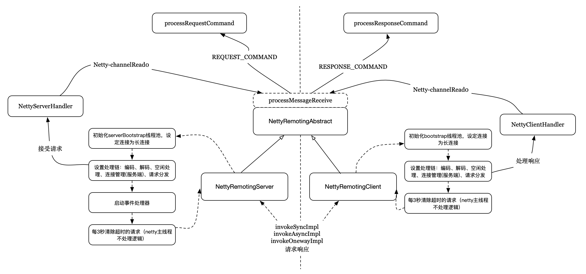

客户端通过invokeSyncImpl、invokeAsyncImpl、invokeOnewayImpl这几个方法同服务端交互。

#### 1. NettyRemotingServer

Server启动主要是初始化ServerBootstrap，主要配置如下：

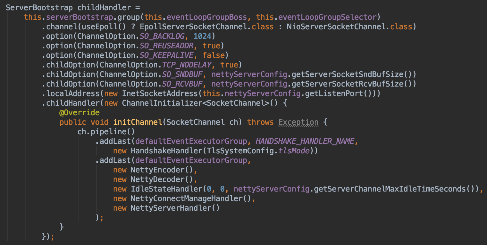

1. 设置tcp的参数，包括SO_BACKLOG、SO_REUSEADDR、SO_KEEPALIVE、TCP_NODELAY等。
2. 设置pipeline处理链，包括编码、解码、空闲处理、连接管理、请求分发。

启动完ServerBootstrap后会启动一个定时器，每3秒清除超时的请求。

这里介绍下面几个处理器：

1. NettyEncoder
2. NettyDecoder
3. NettyConnectManageHandler
4. NettyServerHandler

#### 1.1. NettyEncoder

NettyEncoder继承自LengthFieldBasedFrameDecoder，主要有用于解码入站数据流，并将数据流解码为RemotingCommand对象。

LengthFieldBasedFrameDecoder（自定义长度解码器）的构造器，涉及5个参数，都与长度域（数据包中的长度字段）相关，具体介绍如下：

1. maxFrameLength：发送的数据包最大长度；

2. lengthFieldOffset：长度域偏移量，指的是长度域位于整个数据包字节数组中的下标；

3. lengthFieldLength：长度域的自己的字节数长度。

4. lengthAdjustment：长度域的偏移量矫正。 如果长度域的值，除了包含有效数据域的长度外，还包含了其他域（如长度域自身）长度，那么，就需要进行矫正。矫正的值为：包长 - 长度域的值 – 长度域偏移 – 长度域长。

5. initialBytesToStrip：丢弃的起始字节数。丢弃处于有效数据前面的字节数量。比如前面有4个节点的长度域，则它的值为4。

以NettyEncoder为例，器构造构造方法为

```
public NettyDecoder() {
    super(FRAME_MAX_LENGTH, 0, 4, 0, 4);
}
```

即数据流中前4个字节的值表示有效数据域的长度，除开前4个字节外的内容都是有效数据域的内容，不存在偏移量。

接收到数据域的内容后，便会调用RemotingCommand.decode方法，将数据流转为RemotingCommand对象。

RemotingCommand对象分为Header部分和Body部分。Header部分包括固定的一组字段，已经长度不定的扩展字段；Body部分为byte[]，不进行具体的细分。

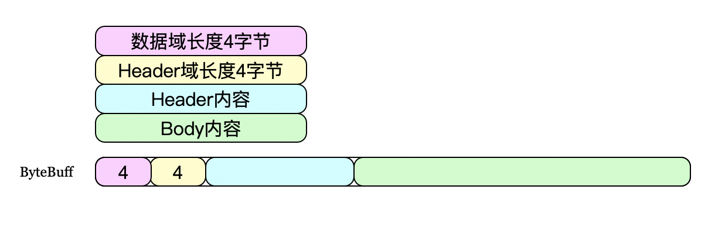

数据域的解析过程同上面的类似，数据域中前4个自己为Header域的长度，取到Header长度后便能计算出Body长度，从而进行读取。RemotingCommand的内容如下：

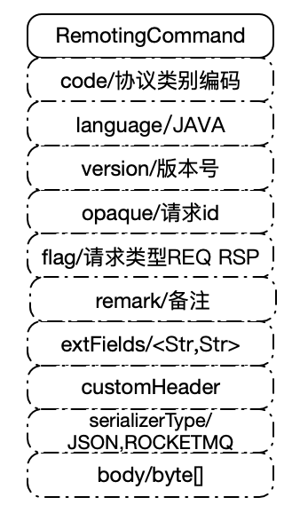

根据serializerType的不同，Header的编码会分为Json或者二进制的方式。

#### 1.2. NettyDecoder

NettyEncoder的反过程，将RemotingCommand对象序列化为ByteBuffer对象。根据serializerType的不同，Header会编码为JSON或者二进制。


#### 1.3. NettyConnectManageHandler

NettyConnectManageHandler继承自ChannelDuplexHandler，用于监听pipeline中入站/出站的事件，主要进行日志记录。

#### 1.4. NettyServerHandler

NettyServerHandler继承自SimpleChannelInboundHandler，重写了channelRead0方法，在里面调用了父类NettyRemotingAbstract的processMessageReceived方法，如下：

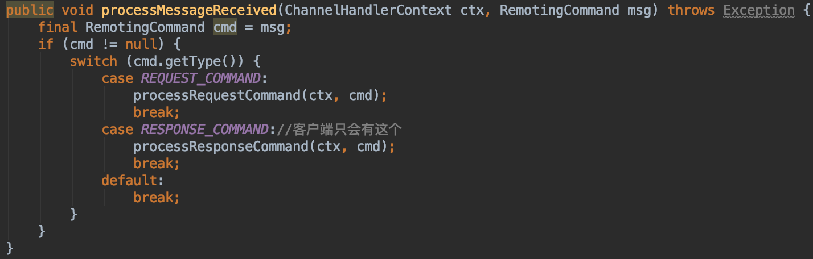

该方法定义了请求和响应的处理过程。

1.processRequestCommand

处理请求过程，先根据RemotingCommand中的code值判断当前请求是否能够处理，如果不能处理则直接响应不支持。如果可以支持，则会找到对应的处理器，新起线程来处理当前请求。需要说明的是，NettyRemotingServer内部维护这一个processorTable，表示该server可以处理的command，对应的Processor以及对应的线程池。

```
protected final HashMap<Integer/* request code */, Pair<NettyRequestProcessor, ExecutorService>> processorTable =
new HashMap<Integer, Pair<NettyRequestProcessor, ExecutorService>>(64);
```

Processor的定义如下，对于具体的command，会由对应的Processor来处理

```
public interface NettyRequestProcessor {
    RemotingCommand processRequest(ChannelHandlerContext ctx, RemotingCommand request)
    throws Exception;

boolean rejectRequest();
}
```

RocketMQ提供的Processor如下，其中一个Processor可能会处理一个或者多个code.

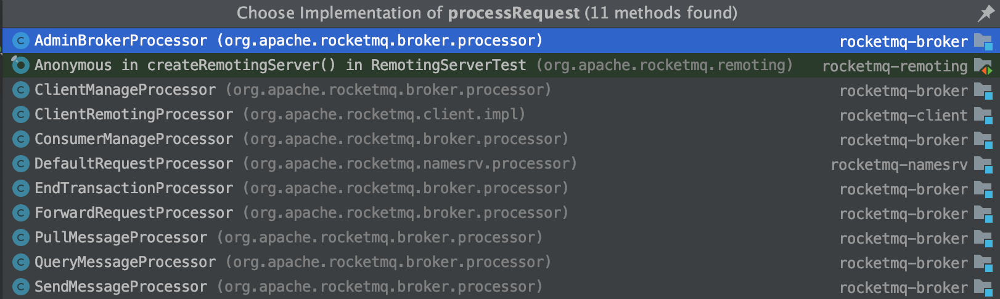

2.processResponseCommand

客户端发起一次调用时，会根据请求id，构造一个ResponseFuture，并将其缓存在responseTable字段中，用来表示目前正在进行中的请求。

```
protected final ConcurrentMap<Integer /* opaque */, ResponseFuture> responseTable =
    new ConcurrentHashMap<Integer, ResponseFuture>(256);
```

当有响应的时候，会根据请求id，获取对应的ResponseFuture，再进行后置处理，包括执行回调、释放资源等。

#### 2. NettyRemotingClient

Client启动主要是初始化Bootstrap，主要配置如下：

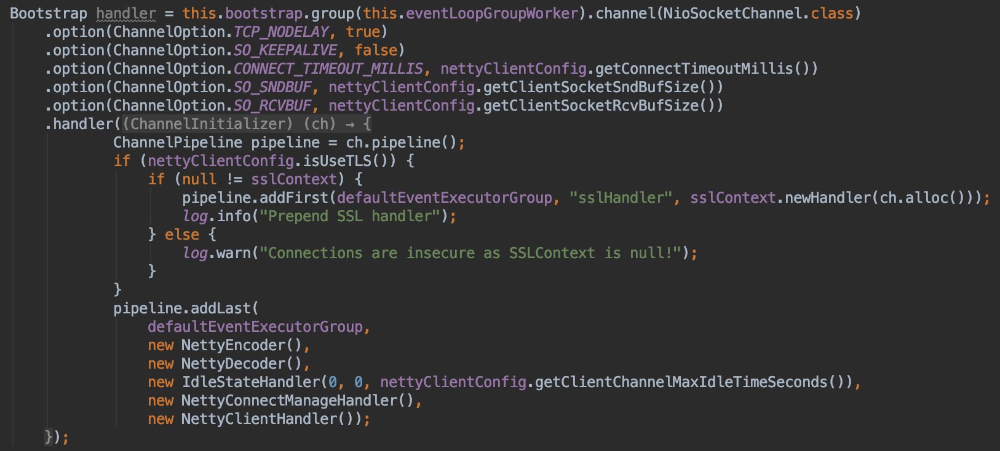

1. 设置tcp的参数，包括TCP_NODELAY、SO_KEEPALIVE、CONNECT_TIMEOUT_MILLIS等。
2. 设置pipeline处理链，包括编码、解码、空闲处理、连接管理、请求分发。

启动完ServerBootstrap后会启动一个定时器，每3秒清除超时的请求。

Client端处理链上的几个处理器，除了NettyClientHandler外都同Server端的一样。而NettyClientHandler也继承自SimpleChannelInboundHandler，并重写了channelRead0方法，在里面调用了父类NettyRemotingAbstract的processMessageReceived方法，过程跟Server端类似。

#### 3. 调用流程

上面介绍了Server端和Client端的启动过程，以及消息的编解码，这里介绍消息的具体请求过程。主要是开头提到的invokeSyncImpl、invokeAsyncImpl和invokeOnewayImpl这几个方法。

#### 3.1. invokeSyncImpl 同步调用

内部是通过countdownlatch等待来模拟的同步调用，如下图：

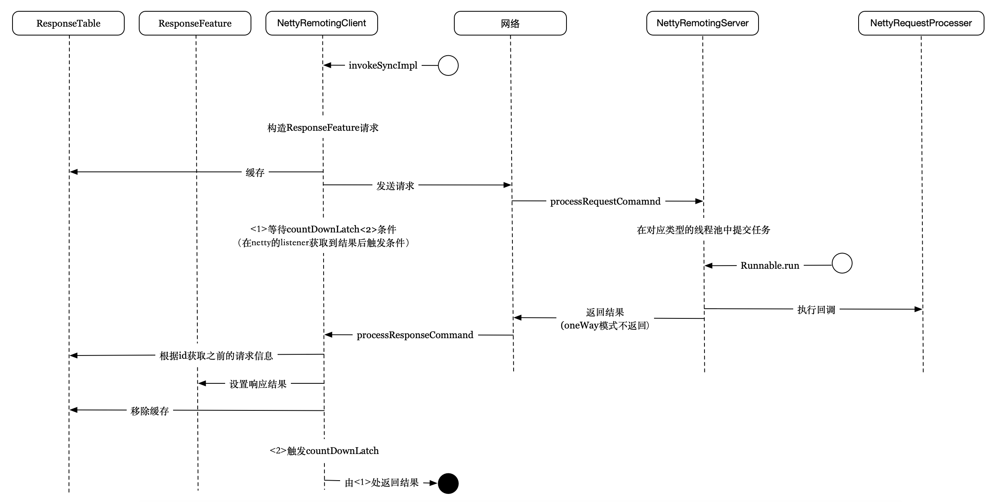

1. 客户端调用invokeSyncImpl后，client会构造ResponseFeature对象，并根据请求id将其缓存起来，然后调用Netty发送请求后在ChannelFutureListener中等待回调。

2. 这时候客户端会通过countdownlatch等待一定的时间，如果客户端请求成功，则在ChannelFutureListener中直接返回，等待超时时间到达；如果请求失败，则直接通知countdownlatch，不再等待，直接返回
3. 请求到达服务端，经过NettyDecoder、NettyServerHandler后，会调用processRequestCommand方法，最终在对应类型的线程池中提交任务，任务执行完后通过执行糊掉，返回结果
4. 客户端接收到响应后，通过NettyClientHandler，会加油processResponseCommand方法处理，这时会根据请求id获取之前的ResponseReature对象，执行回调，最后清除缓存。

#### 3.2. invokeAsyncImpl 异步调用

相比同步调用，少了等待超时时间，但是增加了semaphore信号量控制最多有多少个连接同时执行。请求发起后，将结果对象缓存起来，结果将通过InvokeCallback进行回调，如果有设置回调函数，结果返回，在回调线程发起后就会将信号量回收，如果没有设置回调函数，结果返回后就会将信号量回收。其余过程大致同同步调用类似。

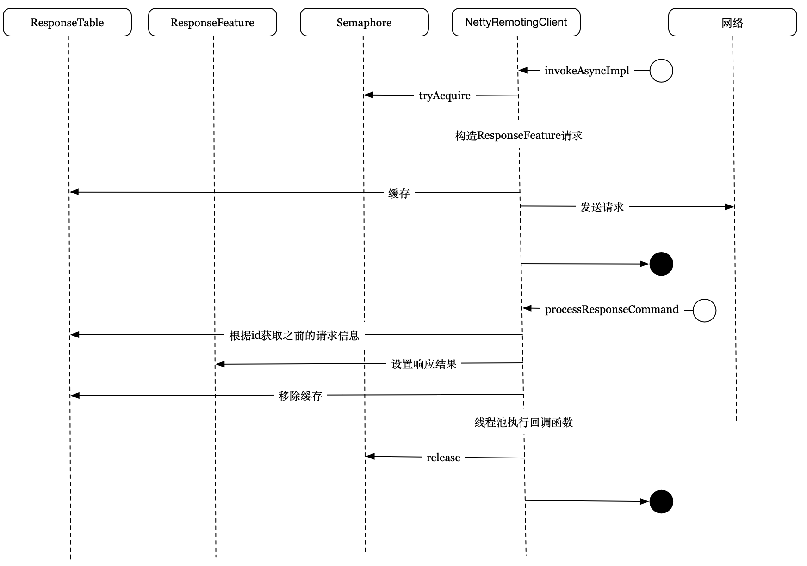


#### 3.3. invokeOnewayImpl 单步调用

单向请求，无结果，请求成功后不等待结果，直接释放信号量，服务端也不会返回结果。

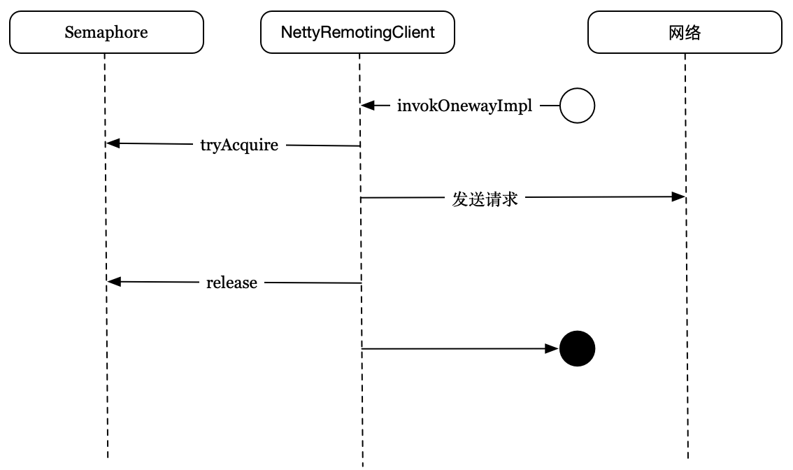

#### 3.4. MQClientAPIImpl

MQClientAPIImpl在之前介绍过，主要为Producer和Consumer提供远程通信调用的功能，内部主要是对NettyRemotingClient的封装，以对外提供服务，如：

1. createSubscriptionGroup，请求broker创建group
2. createTopic，请求broker创建创建topic
3. sendMessage，发送消息，单步、异步、同步

等多种服务的封装。同时MQClientAPIImpl也能够接收服务端的主动请求，从而进行响应，对外提供的具体功能如下，通过调用registerProcessor来添加：

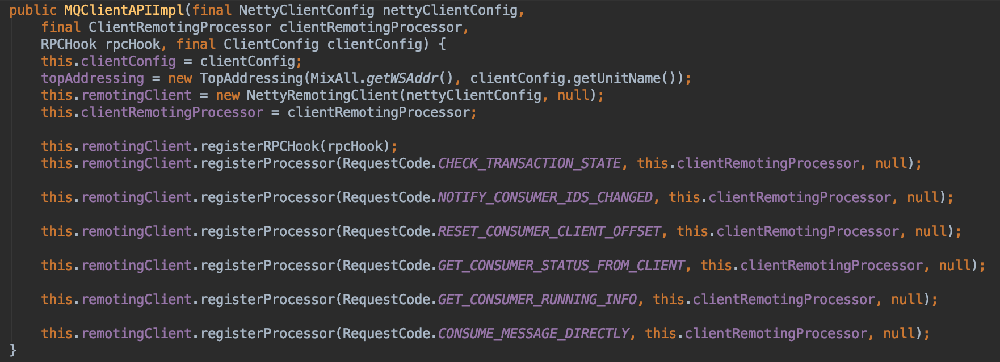

以NOTIFY_CONSUMER_IDS_CHANGED为例，当Broker发现Group中的Consumer实例发生改变的时候，会遍历客户的连接Channel，然后逐一通知到客户端。这时候客户端的角色转变为”服务端“，服务端转变为"客户端"，两端都会触发processResponseCommand方法。


