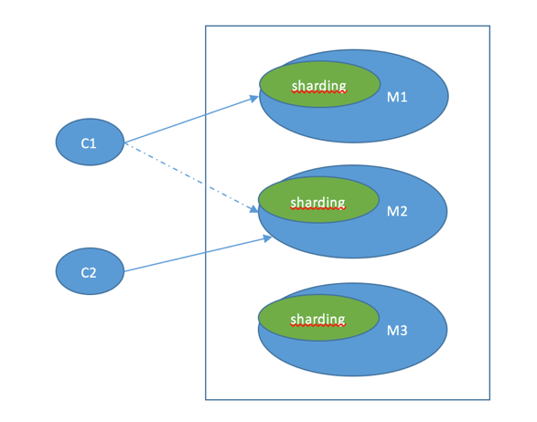
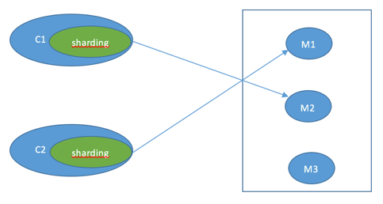
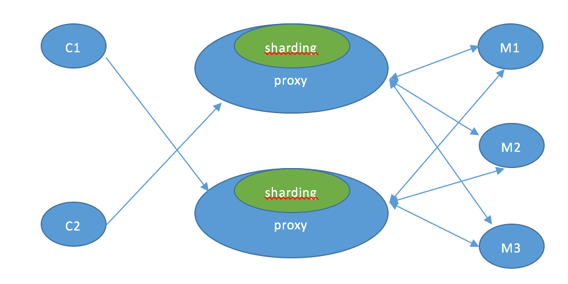

# Redis集群


&emsp;这节介绍Redis的集群模式

&emsp;主从模式提供了读写分离的支持，Sentinel提供了高可用的保障，满足了读模式下的横向扩展，但主节点只有一个，集中式的写模式无法应对不断增长的写需求。

&emsp;Redis 3.x 版本提供了Redis ```cluster```功能，服务端sharding使用槽作为分布式的解决方案。对于 2.x版本，则通过客户端API提供的客户端sharding方式，使用一致性哈希来实现数据分片。此外，twiter开源的```twemproxy``` 和豌豆荚的```codis```，则采用代理模式来实现。

#### 1 服务端模式

&emsp;对于客户端来说，整个集群被看做一个整体，客户端可以连接任意一个节点进行操作，就像操作单一Redis数据库一样。当客户端操作的key没有分配到该节点上时，会返回转向指令，指向正确的节点。



##### 1.1 集群的建立

&emsp;3.x 版本的Redis节点可以通过打开```clustrer-enabled```选项来开启服务器的集群模式，再通过

```
	CLUSTER MEET	<ip>	  <port>
```

命令连接其他节点。

&emsp;新加入的节点B通过```CLUSTER MEET```命令同节点A建立连接后，节点A会通过```Gossip协议```将节点B的信息传播给集群中的其他节点，当其他节点发现新加入的节点B后也会主动同它建立连接。处于集群状态的节点同单机模式下的服务器实例没什么区别，只是只能使用```db 0``` 数据库，同时除了执行单机模式下的任务外还会执行集群所需的任务，如Gossip的消息的传播。

##### 1.2 槽指派

&emsp;Redis集群使用槽来存储分片信息，集群中的每个节点负责处理16384个槽中的一部分。对于每个写操作，通过计算```crc(key)%16384```对key值进行hashing，分配到16384个槽中的一个，然后由对应的节点处理。

&emsp;节点负责哪些槽信息可以通过向节点发送

```
	CLUSTER ADDSLOTS	  <slot>  [slot …]
```

来指派。分配完槽信息后，该节点会将自身的信息传播给集群中的机器节点，使得集群中的所有节点都有全部的槽分配信息。当16384个槽都有节点在处理时，节点处于上线状态；相反的，如果有任何一个槽没有得到处理，那么集群处于下线状态。

&emsp;集群中的某个节点在收到一个请求时，会先判断是否由自己来处理，如果不是，则会向客户端返回

```
	MOVE <slot> <ip>:<port>
```

错误命令，该命令给出了请求所属的槽以及对应节点的ip和端口号。客户端在收到```MOVE```错误时，会转到对应的节点重新发送之前的命令。注意，需要使用客户端的集群模式才会自动跳转,如下：

````
	redis-cli -c -h xxx -p xxx
```

&emsp;当动态添加或者减少节点时，需要将16384个槽做重新分片，槽中的键值也要迁移。重新分片可以在线执行，使用自带的```redis-trib```工具。

##### 1.3 高可用和故障转移

&emsp;Redis集群，要保证```16384```个槽对应的节点都正常工作，如果某个节点发生故障，那它负责的槽也就失效，整个集群将不能工作。可以使

```
	CLUSTER REPLICATE <node_id>
```

将节点配置成主从结构来增加节点的可用行。

&emsp;集群中的每个节点会定期的向其他节点发送PING消息来检测对方的状态，一个节点的状态可以为```在线```，```疑似下线```和```下线```。当某个节点n发现半数以上负责处理槽的主节点都将某个主节点x标记为疑似下线状态时，节点n将节点x标记为下线状态，并向集群广播消息。

&emsp;当节点x的从节点收到主节点下线的消息时，会对该节点进行故障转移。同Sentinel选举新的leader Sentinel节点一样，节点x的从节点会向集群中负责处理槽的其余主节点获取选票，以在节点x的从节点中选出新的主节点。新的主节点会撤销已下线主节点的槽指派，并分配给自己，然后向集群中的其他节点广播自己为新主节点的消息。

#### 2 客户端模式

&emsp;客户端模式下每个节点都是单一的实例，需要由客户端应用自己管理key所在的分片，以及处理节点的故障转移，Redis的客户端Jedis提供了分片的支持。




&emsp;Jedis对Sharded的实现主要是在```ShardedJedis.java```和```ShardedJedisPool.java```中,可以见[这里](https://segmentfault.com/a/1190000002691429)。

&emsp;Jedis的Redis Sharding实现具有如下特点：

1.	采用[一致性哈希算法](http://www.cnblogs.com/lpfuture/p/5796398.html)，将key和节点name同时hashing，然后进行映射匹配，采用的算法是```MURMUR_HASH```。采用一致性哈希而不是采用简单类似哈希求模映射的主要原因是当增加或减少节点时，不会产生由于重新匹配造成的rehashing。一致性哈希只影响相邻节点key分配，影响量小。

2.	为了避免一致性哈希只影响相邻节点造成节点分配压力，ShardedJedis会对每个Redis节点根据名字(没有的话，Jedis会赋予缺省名字)会虚拟化出160个虚拟节点进行散列。根据权重也可虚拟化出160倍数的虚拟节点。用虚拟节点做映射匹配，可以在增加或减少Redis节点时，key在各 Redis节点移动再分配更均匀，而不是只有相邻节点受影响。

3.	Sharded Jedis支持```keyTagPattern```模式，即抽取key的一部分keyTag做sharding，这样通过合理命名key，可以将一组相关联的key放入同一个Redis节点，这在避免跨节点访问相关数据时很重要。

#### 3 代理模式

&emsp;通过在客户端和实际Redis服务中间增加代理层，代理模块实现Redis协议，客户端连接代理和连接原生的Redis实例没有什么区别，上层应用可以像使用单机的Redis一样使用，代理会处理请求的转发，不停机的数据迁移等工作，所有后边的一切事情，对于前面客户端来说是透明的，可以简单的认为后边连接是一个内存无限大的Redis服务。




&emsp;Twitter的```twemproxy```和豌豆荚的```codis```就是该模式的实现。关于```codis```的介绍，可以看[这里]( http://www.cnblogs.com/wangdaijun/p/6156397.html)。

&emsp;同前面两种模式相比，代理模式的好处在于，客户端和服务端无需作出变更，主要维护工作在于代理模块中；同后端实际实例的连接数落在了代理上，能够有效的控制客户端过多造成的连接数暴增；提供sharding功能，支持服务器集群水平扩展。同时，由于增加了代理，客户端到真正的实例服务器需要走两次网络。


