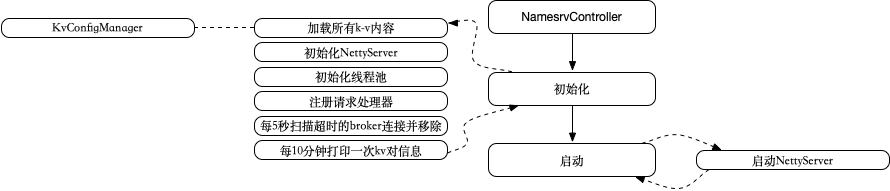
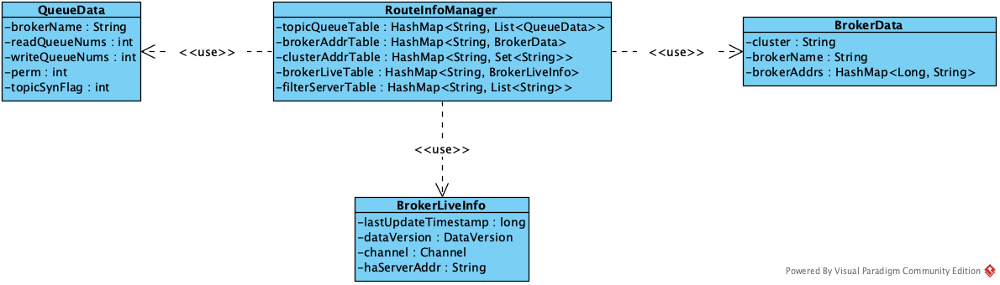
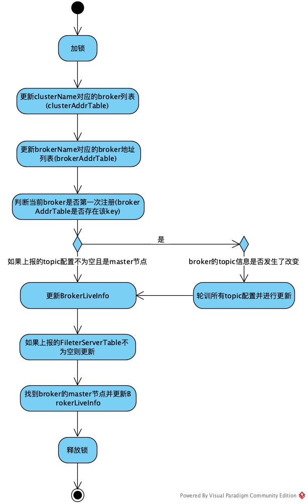
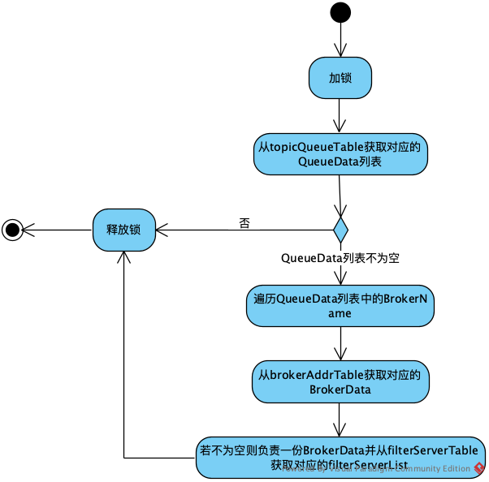

# 轻量级注册中心：RocketMQ NameServer


NameServer实现比较简单，主要包括配置管理、路由管理两块。其主要功能是为整个MQ集群提供服务协调与治理，具体就是记录维护Topic、Broker的信息，及监控Broker的运行状态，为client提供路由能力。NameServer是一个几乎无状态节点，可集群部署，节点之间无任何信息同步。

NameServer为生产者和消费者提供Meta数据，以确定消息该发往哪个Broker或者该从哪个Broker拉取消息。有了Meta数据后，生产者和消费者就可以直接和 Broker交互了。这种点对点的交互方式最大限度降低了消息传递的中间环节，缩短了链路耗时。

#### 1. 启动

NameServer的启动过程如下：



1. 加载本地的备份文件，载入k-v对，有KVConfigManager持有，格式如下

```
HashMap<String/* Namespace */, HashMap<String/* Key */, String/* Value */>> configTable = new HashMap<String, HashMap<String, String>>();
```
在有值发生变化的时候就会执行一次持久化
2. 初始化NettyRemotingServer，传入BrokerHousekeepingService，会在客户端连接发生变化的时候进行路由管理的变更
3. 初始化线程池，用于NettyRemotingServer分发请求，详见上一节关于Netty的介绍
4. 注册请求处理器，NameServer的实现为DefaultRequestProcessor，提供了包括PUT_KV_CONFIG、GET_KV_CONFIG等管理功能的CRUD远程调用入口
5. 启动定时器，每5秒扫描超时的broker连接并移除
6. 启动定时器，每10分钟打印一次kv对信息

#### 2. 服务管理

NameServer的对外服务入口由DefaultRequestProcessor提供，主要包括配置管理和路由管理，分别由KVConfigManager和RouteInfoManager实现。

#### 2.1. KVConfigManager

比较简单，中规中矩的一个类，内部有一个configTable按照命名空间管理配置键值对，除了put和get操作外，还有持久化为json以及加载持久化文件的操作。

#### 2.2. RouteInfoManager

RouteInfoManager主要用来管理Broker及Topic对应的路由信息，类关系如下：



包括：

1. Topic对应的Queue列表
2. Queue所在的Broker，以及Queue对应的属性
3. Broker对应的集群信息、集群中的实例地址信息
4. 每个Broker实例对应的存活信息，包括最后更新时间、版本号、Netty io连接、HA地址
5. 集群对应的Broker列表

主要用于管理Broker和Topic的路由信息。

#### 2.2.1. 注册Broker(registerBroker)

方法定义如下：

```
public RegisterBrokerResult registerBroker(
/*集群名*/final String clusterName,
/*broker地址*/final String brokerAddr,
/*broker名*/final String brokerName,
/*brokerId*/final long brokerId,
/*ha地址*/final String haServerAddr,
/*broker上对应的topic配置项*/final TopicConfigSerializeWrapper topicConfigWrapper,
/*需要过滤的server列表*/final List<String> filterServerList,
    /*broker对应的channel*/final Channel channel)
```

过程如下：




#### 2.2.2. 根据topic选择路由信息(pickupTopicRouteData)

方法定义如下：

```
public TopicRouteData pickupTopicRouteData(final String topic)
```

返回结果为：

```
public class TopicRouteData extends RemotingSerializable {
    private String orderTopicConf;
    private List<QueueData> queueDatas;//topic中的queue
        private List<BrokerData> brokerDatas;//topic分布在哪些broker
            private HashMap<String/* brokerAddr */, List<String>/* Filter Server */> filterServerTable;

...
}
```

即根据topic名找到该topic下所有Queue在Broker上的分布信息，过程如下：



#### 2.2.3 去注册Broker(unregisterBroker)

去掉属性中持有的关于该Broker对应的所有数据，可以类比上面的过程看源码。

RouteInfoManager的其他服务也类似，都是从持有的各个属性中查找到数据有并返回。

相对于ZooKeeper这种支持强一致性的注册中心来说，NameServer实现上比较轻量，RocketMQ的架构设计决定了它不需要进行Master选举，用不到其他复杂的功能，只需要一个轻量级的元数据服务器就足够了。中间件对稳定性要求很高，RocketMQ的NameServer只有很少的代码，容易维护，所以不需要再依赖另一个中间件，从而减少整体维护成本。

