# Spring MVC


&emsp;这节介绍SpringMVC，SpringMVC是一种基于Java的实现MVC设计模式的请求驱动类型的轻量级Web框架。本章会介绍相关概念，流程，再从源码进行讲解。

#### 1. MVC

&emsp;MVC(Model View Controller)是一种软件设计的框架模式，它采用模型(Model)-视图(View)-控制器(controller)的方法把业务逻辑、数据与界面显示分离。MVC框架模式是一种复合模式，MVC的三个核心部件分别是

 * Model(模型)：所有的用户数据、状态以及程序逻辑，独立于视图和控制器

 * View(视图)：呈现模型，类似于Web程序中的界面，视图会从模型中拿到需要展现的状态以及数据，对于相同的数据可以有多种不同的显示形式(视图)

 * Controller(控制器)：负责获取用户的输入信息，进行解析并反馈给模型，通常情况下一个视图具有一个控制器

#### 2. SpringMVC流程

&emsp;基本上大家都会在网上看到这张图：
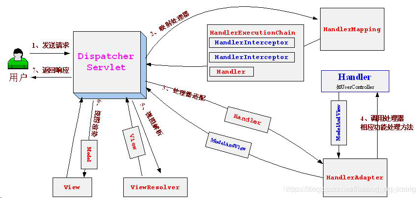

这个图描述了SpringMVC处理一个Http请求的基本流程，对应的流程为：

* 用户发送请求至前端控制器DispatcherServlet。
* DispatcherServlet收到请求调用HandlerMapping处理器映射器。
* 处理器映射器找到具体的处理器(可以根据xml配置、注解进行查找)，生成处理器对象及处理器拦截器(如果有则生成)一并返回给DispatcherServlet。
* DispatcherServlet调用HandlerAdapter处理器适配器。
* HandlerAdapter经过适配调用具体的处理器(Controller，也叫后端控制器)。
* Controller执行完成返回ModelAndView。
* HandlerAdapter将controller执行结果ModelAndView返回给DispatcherServlet。
* DispatcherServlet将ModelAndView传给ViewReslover视图解析器。
* ViewReslover解析后返回具体View.
* DispatcherServlet根据View进行渲染视图（即将模型数据填充至视图中）。
* DispatcherServlet响应用户。

&emsp;还有大家都会接触到的demo:

web.xml

```
<?xml version="1.0" encoding="UTF-8"?>
<web-app xmlns="http://xmlns.jcp.org/xml/ns/javaee"
         xmlns:xsi="http://www.w3.org/2001/XMLSchema-instance"
         xsi:schemaLocation="http://xmlns.jcp.org/xml/ns/javaee http://xmlns.jcp.org/xml/ns/javaee/web-app_4_0.xsd"
         version="4.0">
    <context-param>
        <param-name>contextConfigLocation</param-name>
        <param-value>/WEB-INF/applicationContext.xml</param-value>
    </context-param>
    <listener>
        <listener-class>org.springframework.web.context.ContextLoaderListener</listener-class>
    </listener>
    <servlet>
        <servlet-name>dispatcher</servlet-name>
        <servlet-class>org.springframework.web.servlet.DispatcherServlet</servlet-class>
        <load-on-startup>1</load-on-startup>
    </servlet>
    <servlet-mapping>
        <servlet-name>dispatcher</servlet-name>
        <url-pattern>/*</url-pattern>
    </servlet-mapping>
</web-app>

```

在applicationContext.xml，指定包的扫描访问并添加标签

```
<context:component-scan base-package="xxx" />

<mvc:annotation-driven />
```

添加Controller

```
import org.springframework.web.bind.annotation.RequestMapping;
import org.springframework.web.bind.annotation.RestController;

@RestController
public class HelloController {
    @RequestMapping("/hello")
    public String excute() {
        return "hello";
    }
}
```

上面表示的意思为：

 * 开启ContextLoaderListener加载Spring根Context，对应的配置文件为applicationContext.xml
 * 开启DispatcherServlet监听/*下的所有请求，加载WebContext，对应的配置文件为dispatcher-servlet.xml
 * 指定扫描包路径，并开启mvc注解支持
 * 添加对应的Controller，使用@RestController标记为Controller对象并使用@RequestMapping标记处理的请求路径

#### 3. SpringMVC加载流程

&emsp;SpringMVC的加载是依赖Servlet切入的，主要依赖两个技术点：Listener和Servlet。

##### 3.1. ContextLoaderListener的加载

&emsp;从web.xml中可以知道，ContextLoaderListener依赖于Servlet的Listener技术。Listener是在servlet2.3中加入的，主要用于对session、request、context等进行监控。使用Listener需要实现相应的接口。触发Listener事件的时候，tomcat会自动调用相应的Listener的方法。常用的监听接口包括：

 *  HttpSessionListener:监听session的创建和销毁。
 * ServletRequestListener:监听request的创建和销毁
 * ServletContextListener:监听context的创建和销毁。

这里主要使用了ServletContextListener，用于在Servlet初始化前执行自定义动作。

&emsp;ContextLoaderListener的定义如下：

```
public class ContextLoaderListener extends ContextLoader implements ServletContextListener {
	public ContextLoaderListener() {
	}

	public ContextLoaderListener(WebApplicationContext context) {
		super(context);
	}

	@Override
	public void contextInitialized(ServletContextEvent event) {
		initWebApplicationContext(event.getServletContext());
	}

	@Override
	public void contextDestroyed(ServletContextEvent event) {
		closeWebApplicationContext(event.getServletContext());
		ContextCleanupListener.cleanupAttributes(event.getServletContext());
	}
}
```

该类继承了ContextLoader，并通过contextInitialized方法执行了初始化(传入ServletContext)，通过contextDestroyed方法进行资源销毁回收。重点看ContextLoader方法。

&emsp;ContextLoader在初始化时，会先执行内部的一个静态代码块：

```
private static final Properties defaultStrategies;

static {
	try {
		ClassPathResource resource = new ClassPathResource(DEFAULT_STRATEGIES_PATH, ContextLoader.class);
		defaultStrategies = PropertiesLoaderUtils.loadProperties(resource);
	}
	catch (IOException ex) {
		throw new IllegalStateException("Could not load 'ContextLoader.properties': " + ex.getMessage());
	}
}
```

这一步会加载classpath下的配置文件ContextLoader.properties，该文件将作为默认配置用于初始化Properties对象defaultStrategies。

###### 3.1.1. contextInitialized

&emsp;contextInitialized方法的主要内容如下：

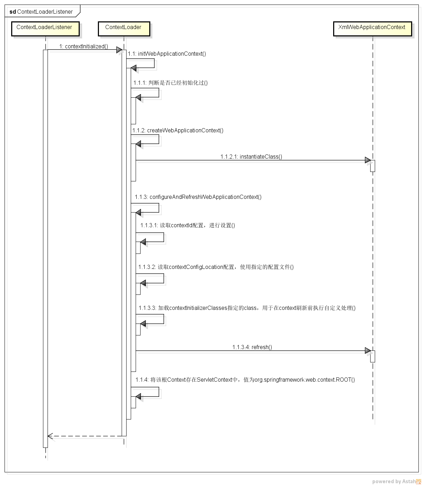

过程为：

(1) 判断当前Context是否已经初始化过

&emsp;通过判断ServletContext中是否存在key为org.springframework.web.context.ROOT的值
 * 初始化WebApplicationContext：从ContextLoader.properties中查找WebApplicationContext的具体实现，如下：

 ```
 org.springframework.web.context.WebApplicationContext=org.springframework.web.context.support.XmlWebApplicationContext
 ```

 即XmlWebApplicationContext，然后初始化该类

(2) 配置并刷新该XMLWebApplicationContext

&emsp;XMLWebApplicationContext继承简图如下：

 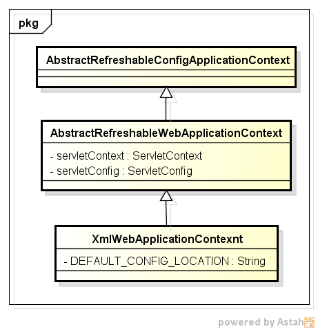

层级比较明显，本身也是一个RefreshableConfigApplicationContext(具体内容可以看往期内容)。其父类保存了ServletContext和ServletConfig两个Web Context相关的对象，其本身也维持了一些默认属性，如

```
DEFAULT_CONFIG_LOCATION = "/WEB-INF/applicationContext.xml";
```
这个属性就是默认的Spring配置文件的路径。

&emsp;需要指出的是XMLWebApplicationContext重写了父类的loadBeanDefinitions方法

```
@Override
protected void loadBeanDefinitions(DefaultListableBeanFactory beanFactory) throws BeansException, IOException {
	// Create a new XmlBeanDefinitionReader for the given BeanFactory.
	XmlBeanDefinitionReader beanDefinitionReader = new XmlBeanDefinitionReader(beanFactory);

	// Configure the bean definition reader with this context's
	// resource loading environment.
	beanDefinitionReader.setEnvironment(getEnvironment());
	beanDefinitionReader.setResourceLoader(this);
	beanDefinitionReader.setEntityResolver(new ResourceEntityResolver(this));

	// Allow a subclass to provide custom initialization of the reader,
	// then proceed with actually loading the bean definitions.
	initBeanDefinitionReader(beanDefinitionReader);
	loadBeanDefinitions(beanDefinitionReader);
}

protected void loadBeanDefinitions(XmlBeanDefinitionReader reader) throws IOException {
	String[] configLocations = getConfigLocations();
	if (configLocations != null) {
		for (String configLocation : configLocations) {
			reader.loadBeanDefinitions(configLocation);
		}
	}
}

@Override
protected String[] getDefaultConfigLocations() {//Tip:返回配置文件路径
	if (getNamespace() != null) {
		return new String[] {DEFAULT_CONFIG_LOCATION_PREFIX + getNamespace() + DEFAULT_CONFIG_LOCATION_SUFFIX};
	}
	else {
		return new String[] {DEFAULT_CONFIG_LOCATION};
	}
}
```

这里用了XmlBeanDefinitionReader来解析Bean定义，且指定了配置文件的加载逻辑，getConfigLocations方法：如果父类的configLocations不为空，则返回该值，否则返回getDefaultConfigLocations的值。而getDefaultConfigLocations方法逻辑为：如果存在命名空间，则返回/WEB_INF/namespace.xml作为配置文件，否则返回/WEB-INF/applicationContext.xml。对应上面的demo，将返回配置中的文件（同默认值相同）。

&emsp;XMLWebApplicationContext的初始化步骤为：

 * 读取contextId配置，进行设置
 * 读取contextConfigLocation配置，使用指定的配置文件，若没有则使用上面提到的默认配置文件DEFAULT_CONFIG_LOCATION
 * 加载contextInitializerClasses指定的class，用于在context刷新前执行自定义处理
 * 调用XMLWebApplicationContext的refresh方法

(3)标记已经初始化

&emsp;通过将该根Context存在ServletContext中，并设置值为org.springframework.web.context.ROOT，用于第(1)步的判断

###### 3.1.2. contextDestroyed

&emsp;销毁过程比较简单，首先调用WebApplicationContext的close方法销毁该Context，然后移除ServletContex中的org.springframework.web.context.ROOT属性值，最后清除ServletContext中所有org.springframework.开头的属性值。

##### 3.2. DispatcherServlet的加载

&emsp;同ContextLoaderListener类似，DispatcherServlet依赖于Servlet进行扩展。DispatcherServlet的结构如下：

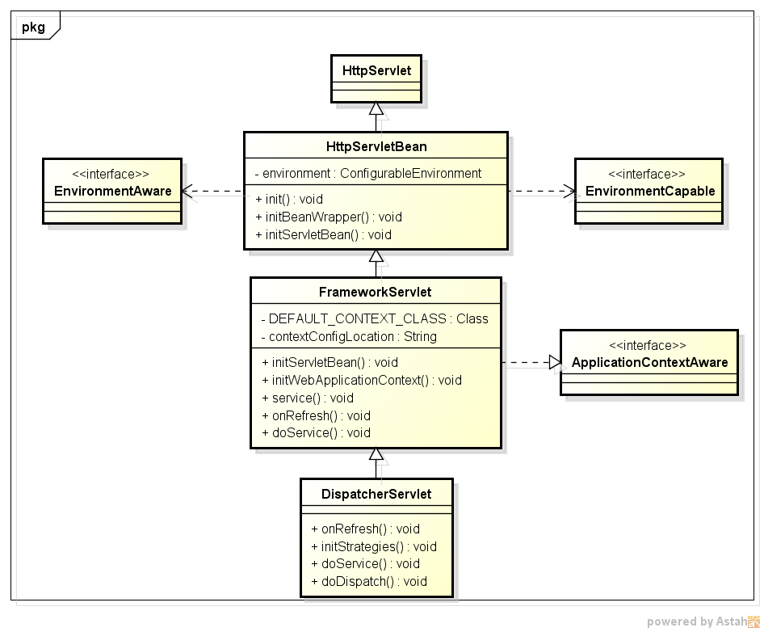

如上，DispatcherServlet继承自HttpServlet，并重写了doService方法，用于处理http请求，其中：

###### 3.2.1.  HttpServletBean

&emsp;在HttpServlet的继承上增加了ConfigurableEnvironment属性，用于存放Servlet的配置项。通过重写init方法，在初始化时将servlet配置项添加到上下文环境变量中，并在该方法中开放了initBeanWrapper和initServletBean方法给子类。

###### 3.2.2. FrameworkServlet

&emsp;基于Servlet实现的Web框架，每个Servlet内部都对应一个XmlWebApplicationContext对象，且namespace格式为ServletName-servlet。上面说了在没显示设定配置文件路径的情况下，且存在namespace时，会使用/WEB-INF/namespace.xml作为Spring配置文件，对应到demo即为/WEB-INF/dispatcher-servlet.xml。FrameworkServlet重写了父类的intServletBean方法，对XmlWebApplicationContext的初始化工作。Servlet在初始化XmlWebApplicationContext时，会尝试从ServletContext中获取根Context(上面提到的，会将根Ccontext放到ServletContext中以标记已经初始化过)并设置为当前Context的父Context，然后再按照雷士根Contextde 的初始化过程对其进行初始化。不同的是，会在refresh前开放口子进行扩展，包括:

  * 对内通过重写子类的postProcessWebApplicationContext方法
  * 对外通过加载并执行globalInitializerClasses中配置的ApplicationContextInitializer类

FrameworkServlet还重写了父类的各doXXX方法，都交给processService方法，以处理Http请求。processService最终委托给了doService方法。

##### 3.2.3. DispatchdrServlet

&emsp;是SpringMVC处理Http请求的主要实现，主要完成了两件事：

3.1. 重写了onRefresh方法

&emsp;初始化时设置了众多默认处理策略，包括：文件处理策略、HandlerMapping处理策略、HandlerAdapter处理策略、HandlerException处理策略、View解析策略等。SpringMVC在处理Http的每个步骤上，都提供了类似filter的机制，每个步骤都能够注册多个策略处理器，按照顺序选择出能够处理当前请求的策略并交给其处理。而大部分的默认策略来至于spring-mvc模块下的org/springframework/web/servlet/DispatcherServlet.properties文件，如下：

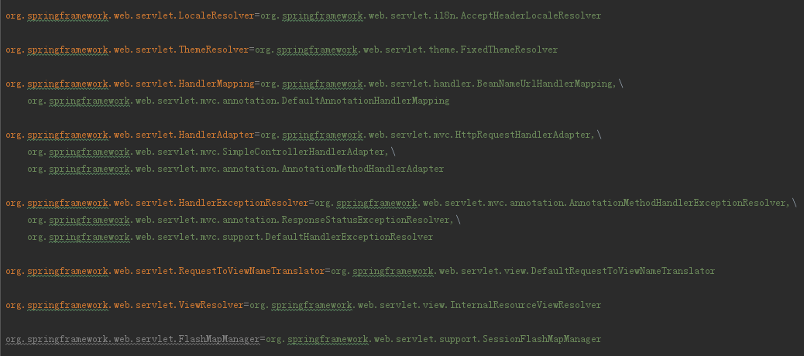

下面为本人demo（SpringBoot）运行时DispatcherServlet各属性以及注册的各策略的情况

 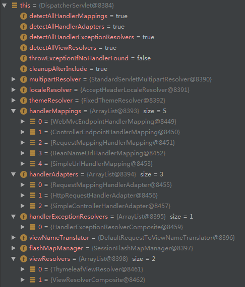

 主要关注handlerMappings中的RequestMappingHandlerMapping和handlerAdapters中的RequestMappingHandlerAdapter。这两个都不是在DispatcherServlet.properties文件中指定的，而是在开启<mvc:annotation-driven />后自动注册的，这个后面会介绍。

3.1.1 RequestMappingHandlerMapping初始化

&emsp;RequestMappingHandlerMapping主要用于查找@RequestMapping注解的handler，其继承关系如下：

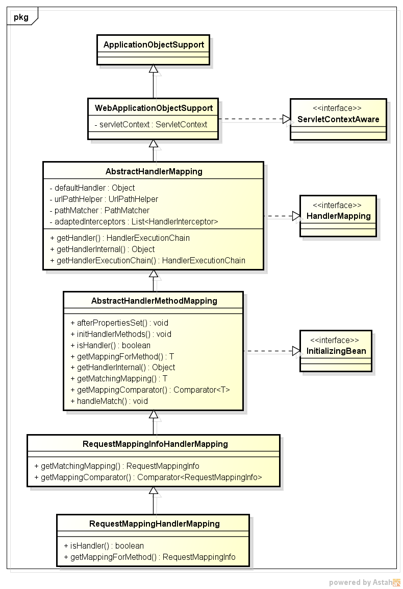

 * AbstractHandlerMapping：实现了HandlerMapping接口，提供了获取handler的主要实现。getHandler方法的实现为，将具体handler的查找委托给了子类的getHandlerInternal方法，然后跟当前请求路径相关的interceptor一起包装为一个HandlerExecutionChain返回。interceptor为所有实现了MappedInterceptor接口的bean，会在AbstractHandlerMapping初始化的时候遍历上下文进行查找。
 * AbstractHandlerMethodMapping：在AbstractHandlerMapping的基础上，主要提供了根据请求查找对应handler method的实现，即getHandlerInternal方法。该类会在初始化时遍历上下文中所有的Bean，然后符合条件的Bean（通过isHandler方法），遍历当前Bean符合条件的方法（通过getMappingForMethod方法），每个方法都有一个对应的path，称为lookUpPath。getHandlerInternal实现上也是通过请求的HttpServletRequest得到对应的lookUpPath，然后从内存缓存中获取对应的handler。
 * RequestMappingHandlerMapping：@RequestMapping的实现，主要实现了 isHandler和getMappingForMethod。
  * isHandler：判断是否出现@Controller注解或者@RequestMapping注解
  * getMappingForMethod：根据@RequestMapping注解返回RequestMappingInfo实例。
3.1.2 RequestMappingHandlerAdapter初始化

&emsp; RequestMappingHandlerAdapter主要完成HandlerMethod的执行，，其继承关系如下：

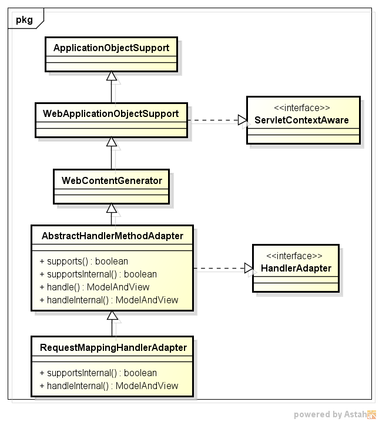

 * AbstractHandlerMethodAdapter：用于判断是否支持Handler的执行，需要传入的handler是否为HandlerMethod实例，同时将handler的执行委托给子类的handleInternal方法。
 * RequestMappingHandlerAdapter：真正执行handler对应的Method对象，会调用各种resolvers解析参数，用于在反射时作为入参传入；调用各种converter用于对结果进行加工等操作。

3.2.  重写doService方法

&emsp;实现了Http请求的处理过程，具体流程如下图，即开头提及的SpringMVC处理Http请求的过程，前面已经介绍过流程，这里不再赘述。

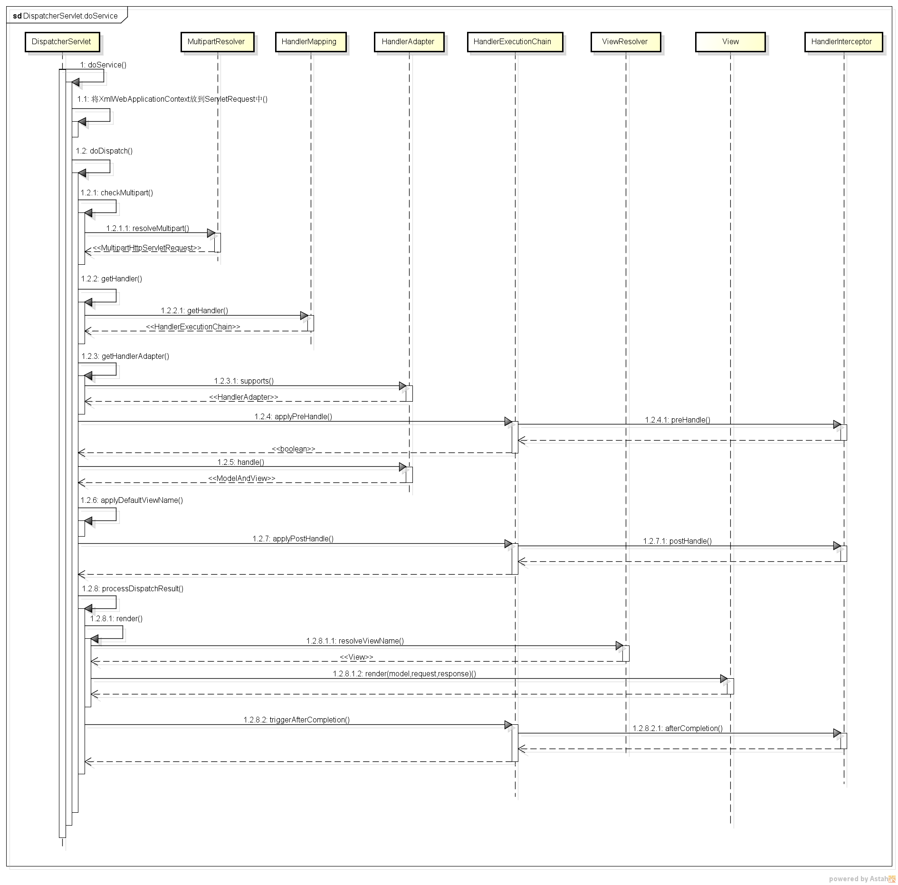

##### 3.3. mvc:annotation-driven

&emsp;按照之前说的，先看resource/META-INF/spring.handlers文件，这个配置在spring-webmvc模块下，内容为：

```
http\://www.springframework.org/schema/mvc=org.springframework.web.servlet.config.MvcNamespaceHandler
```

支持的标签如下：

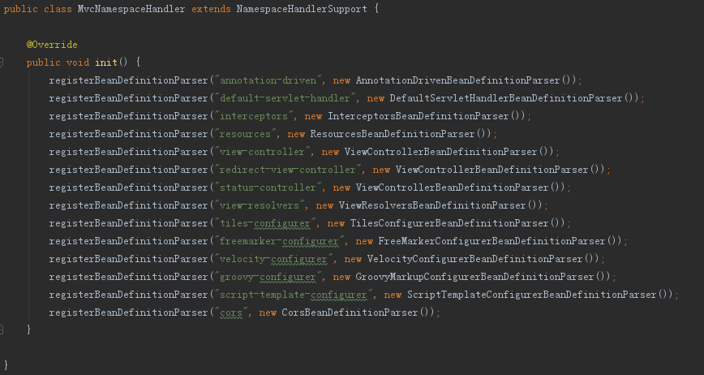

annotation-driven的解析类为：AnnotationDrivenBeanDefinitionParser，该类主要自动做了如下动作：

 * 注入了RequestMappingHandlerMapping和BeanNameUrlHandlerMapping两个HandlerMapping实现
 * 注入了RequestMappingHandlerAdapter、HttpRequestHandlerAdapter和SimpleControllerHandlerAdapter三个HandlerAdapter实现。需要指出的是对于RequestMappingHandlerAdapter，如果没有配置message-converters标签指定消息处理器的话，会根据classpath中存在的包自动注入处理器，包括：
  * ByteArrayHttpMessageConverter
  * StringHttpMessageConverter
  * ResourceHttpMessageConverter
  * SourceHttpMessageConverter
  * AllEncompassingFormHttpMessageConverter
  * 如果存在com.rometools.rome.feed.WireFeed类，则增加AtomFeedHttpMessageConverter、RssChannelHttpMessageConverter
  * 如果存在com.fasterxml.jackson.dataformat.xml.XmlMapper类，则增加MappingJackson2XmlHttpMessageConverter
  * 如果存在javax.xml.bind.Binder类，则增加Jaxb2RootElementHttpMessageConverter
  * 如果存在com.fasterxml.jackson.databind.ObjectMapper和com.fasterxml.jackson.core.JsonGenerator，则增加MappingJackson2HttpMessageConverter
  * 如果存在com.google.gson.Gson，则增加GsonHttpMessageConverter
 * 注入了ExceptionHandlerExceptionResolver用于实现@ExceptionHandler注解、注入了ResponseStatusExceptionResolver用于实现@ResponseStatus和DefaultHandlerExceptionResolver
 * 注入了AntPathMatcher和UrlPathHelper用于路径解析

&emsp;上面介绍了SpringMVC大体流程的实现，当然还有很多细节没有进行说明，如@Param,HttpServletRequest等各种参数的解析和注入，响应结果转为json等各种结果的加工，详细内容可以根据上面介绍再进行深入。

#### 4. WebApplicationInitializer

&emsp;Servlet3.0+提供了ServletContainerInitializer接口，用于在web容器启动时为提供给第三方组件机会做一些初始化的工作，例如注册servlet或者filtes等。

&emsp;每个框架要使用ServletContainerInitializer就必须在对应的jar包的META-INF/services 目录创建一个名为javax.servlet.ServletContainerInitializer的文件，文件内容指定具体的ServletContainerInitializer实现类。spring-web模块下便存在该配置：

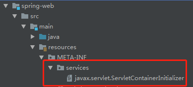

内容为:

```
org.springframework.web.SpringServletContainerInitializer
```

SpringServletContainerInitializer的主要功能是加载classpath下的所有WebApplicationInitializer实现类（非接口、非抽象类），按照@Order进行排序后依次执行WebApplicationInitializer的onStartup方法。

&emsp;spring-web模块提供的抽象类实现AbstractContextLoaderInitializer能够不用web.xml配置增加RootContext；提供的抽象类实现AbstractDispatcherServletInitializer能够不用web.xml配置增加DispatcherServlet。当然更重要的实现是SpringBoot中的实现，这个后续介绍SpringBoot时再提。
