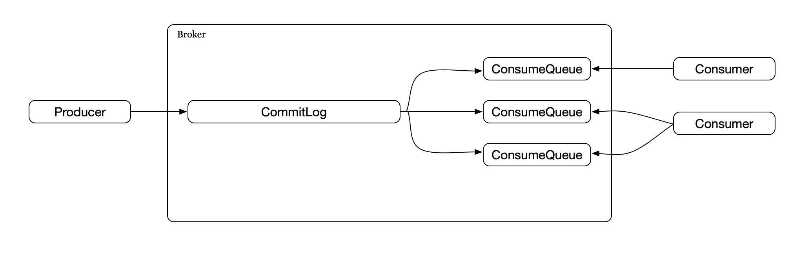
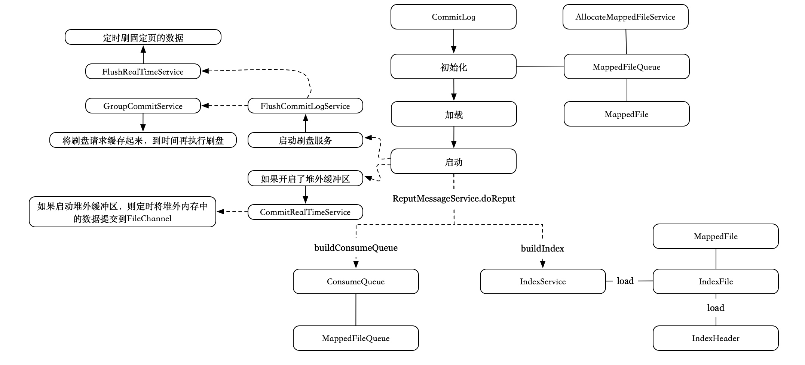
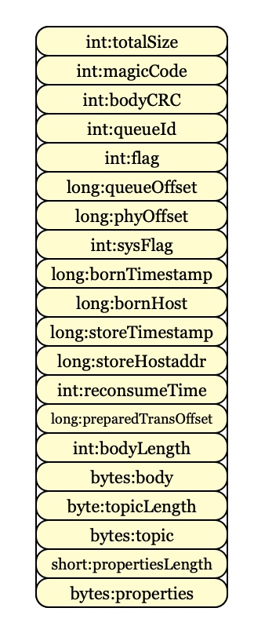
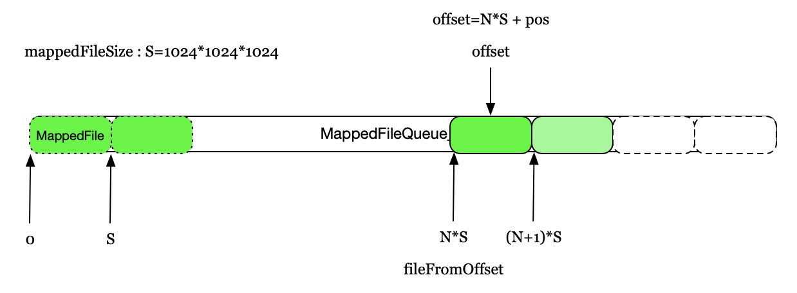
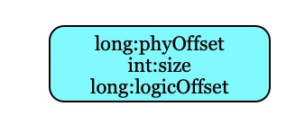
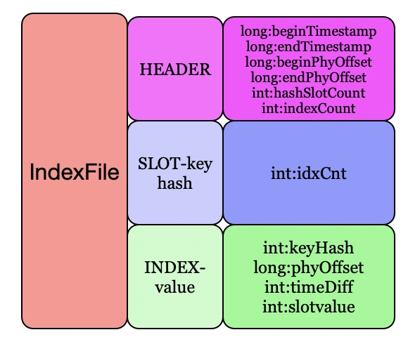
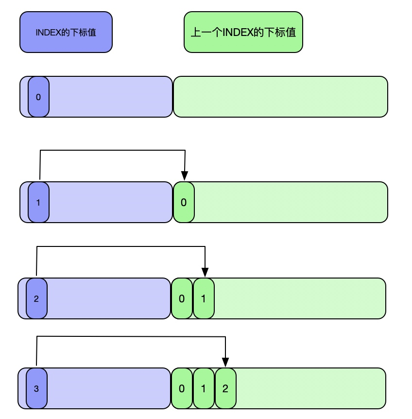
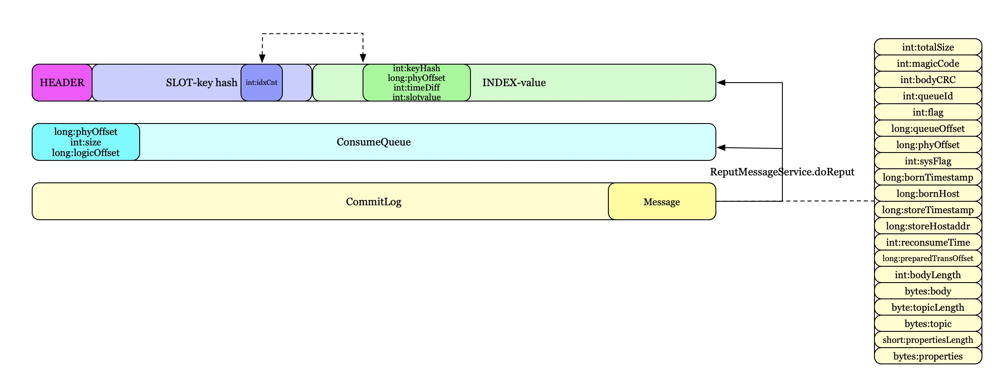
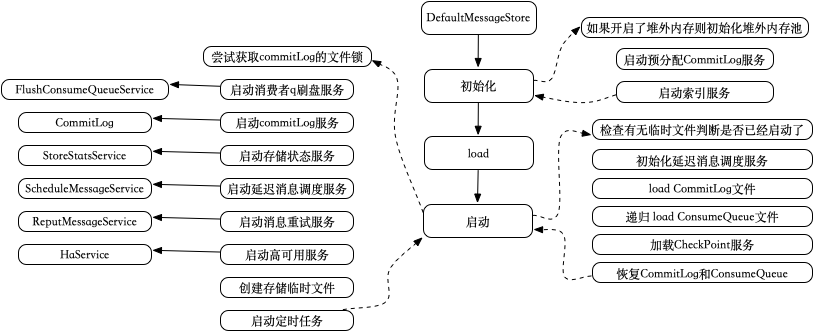
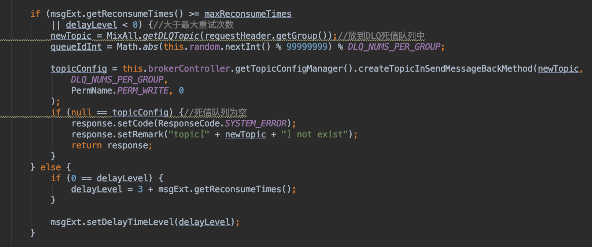

# RocketMQ消息的存储消费模型


这节介绍RocketMQ中消息的存储模型：CommitLog和ConsumeQueue。CommitLog用于存储Producer的消息，ConsumeQueue接受CommitLog分配的消息，等待Consumer消费。

#### 1. 存储消费模型

RocketMQ采用了单一的日志文件，即把同1台机器上面所有topic的所有queue消息都存放在一个文件里面，以避免随机的磁盘写入。其存储结构如下：



Broker会把所有消息都存在一个单一的CommitLog文件里面，然后由后台线程异步的同步到ConsumeQueue中，再由Consumer进行消费。

该模型下，ConsumeQueue中并不需要存储消息的内容，而是存储消息在CommitLog中的offset。也就是说，ConsumeQueue其实是CommitLog的一个索引文件。即CommitLog的写入是顺序的，而读取需要支持随机读的，支持该特性的实现就是上一节提到的MappedFileQueue。

#### 2. CommitLog

CommitLog的很多操作都基于MappedFileQueue来操作，在MappedFileQueue上增加了CR~~U~~D操作。CommitLog的调用过程如下：



初始化时会初始化相关的组件，包括MappedFileQueue、FlushCommitLogService、AppendMessageCallback等。

1. MappedFileQueue主要设定了文件的路径位置和每个MappedFile的大小(1024 * 1024 * 1024 = 1G)。

2. FlushCommitLogService的实现类有3个GroupCommitService、FlushRealTimeService和CommitRealTimeService。前两个用于刷盘，如果开启了异步刷盘，则使用GroupCommitService，该实现会将刷盘请求缓存起来，到时间后再执行刷盘；FlushRealTimeService，该实现直接定时刷固定页的数据，如果启用了堆外缓冲区则使用GroupCommitService，否则使用FlushRealTimeService。后面的CommitRealTimeService则用于将堆外缓冲区中的数据写到FileChannel中(如果启用了堆外缓冲，调用MappedFileQueue的commit方法)。

3. AppendMessageCallback主要用于实现具体消息写入ByteBuf的方式。

此外，还缓存了每个topic下每个queue对应的<b>逻辑偏移量</b>

```
private HashMap<String/* topic-queueid */, Long/* offset */> topicQueueTable = new HashMap<String, Long>(1024);
```

加载主要是调用MappedFileQueue的load方法，最后启动FlushCommitLogService服务。

同时，CommitLog还通过ReputMessageService，将消息offset放到了ConsumeQueue以及IndexService，ReputMessageService的调用在DefaultMessage里。

#### 2.1. 追加消息

追加消息的大致过程如下，其中写入消息时会加锁，从而保证每个CommitLog文件的写都是顺序写入的。


其中AppendMessageCallback主要完成了对消息写入ByteBuff的处理，包括单笔和批量消息。这里主要介绍单笔消息的写入：计算一条消息每一部分的大小和内容，然后写入到byteBuffer中，byteBuffer是MappedFile slice后的内容，写入每个部分如下：



大部分内容通过字段便能够看出具体的意思，这里不再赘述，只对一些内容进行介绍。

1. 计算消息的全局ID：MessageId，MessageId由存储的broker机器的ip地址+commitLog中的起始物理offset组成。MessageId会带在返回结果PutMessageResult中返回。
2. 写入成功后会将topic-queue的逻辑偏移量+1(逻辑偏移量表示消息数量的大小，一条消息进来下标就会长1)
3. 写入之前会计算消息的大小，如果超过设定的单条消息的大小(默认512K)则拒绝写入
4. 写入之前会判断当前文件剩余内容是否足够，如果不够则会插入一条空白消息，将剩余部分填满，返回文件已满，上层判断文件满了，会重新生成一个文件，将消息再次写入.空白消息写入的内容为totalSize+magicCode+0值,其中正常消息的magicCode为-626843481，空白消息为-875286124

#### 2.2. 读取消息

根据所给的起始offset(物理偏移量),确定该offset所在MappedFile后，获取从offset开始到MappedFile当前可读的所有内容。

MappedFile里会维护一个fileFromOffset属性，标记当前文件存储消息的起始偏移量，该值也是文件的文件名，默认值每个文件为1G=1073741824,即每个文件名的步长为1073741824。对于给定的offset，只要找到符合```fileFromOffset <= offset < fileFromOffset + mappedFileSize(1G)```的MappedFile即可。找到目标MappedFile后，通过```offset%mappedFileSize```可以计算出所给的起始offset在当前文件中的位置。



获得ByteBuff内容后，可以调用checkMessageAndReturnSize方法，从ByteBuff中还原消息，返回DispatchRequest(不含消息body内容)。

前面提到，ReputMessageService会从CommitLog中读取消息，然后用于构建ConsumeQueue和IndexFile，这里传送的内容就是DispatchRequest。DefaultMessageStore会定时从CommitLog中读取消息，并将解析出的DispatchRequest对象传给ConsumeQueue和IndexService。

#### 2.3. 删除消息

调用MappedFileQueue，按照offset或者过期时间(默认72小时)删除物理文件

#### 3. ConsumeQueue

代表一个topic下一个queue的消费队列。ConsumeQueue底层基于MappedFileQueue，存储每个topic-queueId下对应消息的offset，但消息被实际消费时，再通过offset从CommitLog中查找具体的消息内容。

ConsumeQueue的调用过程和提供方法同CommitLog类似，也是初始化时从指定的路径下重构MappedFileQueue，并提供了CR~~~U~~~D方法来操作文件。

ConsumeQueue以路径的形式来分割每个topic下queue的存储，每个q对应的数据存储路径为

```/DirToStore/topic/queueId/ ```

每次写入的数据格式(数据单元)为：

```
物理偏移量(long/8)|消息大小(int/4)|逻辑偏移量(long/8) = 20
```




ConsumeQueue初始化MappedFile的默认大小为 30000 * 20，即每个文件存30万条记录，没个文件名的步长为600000，消费时只要每次读取20个字节便能查找到每个消息的offset。

#### 4. IndexService

IndexService用于构建消息的索引文件IndexFile。ConsumeQueue中的消息都是通过offset从CommitLog中查到对应消息内容，但不知道消息的offset，又想通过其他特征(key)来查找消息时便没法完成，索引文件IndexFile就是为了支持该功能。

IndexFile对应的文件名为yyyyMMddHHmmssSSS，即时间戳。IndexFile的结构如下，由3部分组成：




#### 4.1. HEADER

头部信息，包括该文件的开始/结束时间，起始/结束物理偏移量以及槽的数量和索引的数量，头部信息的长度是固定的，为40个字节。

#### 4.2. SLOT

槽，对于每个key值，通过计算hash值，会对应到一个槽下标slotPos，槽只存储一个int数字，指向INDEX的下标。通过40 + hash(key) * 4 可以定位到槽的物理位置，再读取4个字节可以得到INDEX的下标。hash值的计算如下：

```
public int indexKeyHashMethod(final String key) {
    int keyHash = key.hashCode();
    int keyHashPositive = Math.abs(keyHash);
    if (keyHashPositive < 0)
    keyHashPositive = 0;
    return keyHashPositive;
}
```

当hash值出现冲突时，使用链表法，将冲突的hash内容放到INDEX中，连成链表，在下面会介绍。

#### 4.3. INDEX

存储消息对应的物理offset的信息，包括Key的hash值、消息在CommitLog的起始物理offset，相对于索引文件开始时间的差值、上一个槽指向的INDEX下标值，长度为20个字节。通过槽获得索引的下标后，可以通过 40 + 槽总数量* 4 + 索引下标 + 20 定位到该索引内容。默认槽的数量为5000000，索引最大的数量为5000000 * 4。

新加入一条索引后，INDEX里存着上一个槽指向的INDEX下标值，而将SLOT的值设为当前INDEX的下标值，从而将相同hash值的内容组成一条链表。假设一开始的时候连续插入3条带有同一KEY值的消息，则索引的构建过程如下：




应该查找指定key对应消息的过程为：

1. 根据key计算出hash值，找到对应的SLOT里的INDEX下标值，该值为链表中的最后一个节点
2. 根据INDEX下标读取INDEX内容，获得物理offset后，再根据INDEX中存储的上一个INDEX的下标值，找到链表中当前节点的上一个节点获得对应的物理offset。重复该步骤直到结束。

即根据key查找消息返回的是一个列表。

介绍完IndexFile，再回过来介绍IndexFileService。IndexFileService底层依赖MappedFile，内部维护这一个MappedFile列表。当接收到一个DisapatchRequest后，会找出该消息里的所有Key值，再将对应的物理offset写到IndexFile中。

一条消息包含的Key值包含两部分:

1. MessageID:根据topic#MessageID的格式拼接成Key值
2. 自定义Key:找到Message中自定义的MessageConst.PROPERTY_KEYS的内容value，根据topic#value格式拼接成Key值

即可以根据MessageID随机查找消息，也可以根据自定义ID查找。

由于一个IndexFile的大小是有限的，因而当一个IndexFile满了后，消息会写到新的索引文件中，从而对于相同hash值的key有可能存在多个IndexFile中。根据Key查找文件的时候需要遍历所有的IndexFile以找到所有的值。为了防止过度扫描文件，根据key值查找索引文件时需要指定时间范围以及符合key的hash值的最大数量。

综上，可以得到下面的结构图：



3个组件的协作由DefaultMessageStore的ReputMessageService串起来。

#### 5. DefaultMessageStore

前面说到，Broker接收消息后，会调用MessageStore将接收到的消息进行持久化。消费者在消费消息时，Broker也是根据请求的Offset从MessageStore中读取对应的消息然后返回。结合这两节的内容，可以说MessageStore是RocketMQ解耦的核心所在。

RocketMQ默认提供的实现为DefaultMessageStore，其启动涉及如下内容：



初始化主要是初始化相关联的其他组件，包括：

1. AllocateMappedFileService
2. CommitLog
3. FlushConsumeQueueService:定时执行ConsumeQueue flush,写入checkpoint
4. IndexService
5. HAService:高可用服务
6. TransientStorePool:对外内存管理，用于池化管理多个ByteBuffer对象,进行借与还的操作。启动时会申请poolSize*fileSize份堆外内存，关联到DirectBuffer，存在队列中
7. ScheduleMessageService:定时消费服务，定时从对应的延迟队列中消费延迟消息

等。初始化完后便会执行load动作，调用相关组件的load方法，包括ScheduleMessageService、CommitLog、ConsumeQueue、IndexService等。同样，load完后便会调用相关组件的start方法以启动各个组件。

下面介绍消息的消费过程以及定时投递(延迟消费消费)服务ScheduleMessageService。

#### 5.1. 读取消息

DefaultMessageStore内部维护着该Broker管理的queue跟ConsumeQueue映射关系

```
private final ConcurrentMap<String/* topic */, ConcurrentMap<Integer/* queueId */, ConsumeQueue>> consumeQueueTable;
```

获取消息的定义如下

```
public GetMessageResult getMessage(
final String group,
final String topic,
final int queueId,
/*逻辑偏移量*/ final long offset,
final int maxMsgNums,
final MessageFilter messageFilter) {
}
```

为了找到该偏移量在CommitLog中的内容，DefaultMessage会根据offset现在对应topic、queue的ConsumeQueu中找到元数据，以获得该offset在CommitLog中的物理偏移量和大小，然后再从CommitLog中读出具体的消息内容。注意DefaultMessage在这里提供给上层的offset为逻辑偏移量，使用该offset在ConsumeQueue中查找元数据时需要先乘以20(ConsumeQueue中每个消存储单元为20字节)。


#### 5.2. ScheduleMessageService

ScheduleMessageService内部持有如下属性

```
private final ConcurrentMap<Integer /* level */, Long/* delay timeMillis */> delayLevelTable =
new ConcurrentHashMap<Integer, Long>(32);

private final ConcurrentMap<Integer /* level */, Long/* offset */> offsetTable =
new ConcurrentHashMap<Integer, Long>(32);
```

代表不同延迟级别待处理的消息偏移量。

在应用停止时会将未处理的延迟消息持久化为json文件进行存储，启动时会在当前步骤再次加载进内存。

延迟级别包括

```
1s 5s 10s 30s 1m 2m 3m 4m 5m 6m 7m 8m 9m 10m 20m 30m 1h 2h
```

级别逐级递增。

对于每个级别的延迟队列，ScheduleMessageService会对应的启动一个Timer定时器在后台处理。当定时器到点时，会从```SCHEDULE_TOPIC_XXXX```队列中读取延迟的消息并通过消息头里的```MessageConst.PROPERTY_REAL_TOPIC```属性获得原Topic，并将消息重新放回原消息队列中等待Consumer消费。等定时器处理完后会计算下一个待处理的偏移量，并重新设定定时器等待触发下一次操作。

```SCHEDULE_TOPIC_XXXX```队列中的消息主要发生在向CommitLog添加消息的时候，在CommitLog.putMessage方法中有如下内容，


当消息设置了延迟级别时，就会将消息的topic设置为```SCHEDULE_TOPIC_XXXX```，并将原topic放入消息头的```MessageConst.PROPERTY_REAL_TOPIC```属性中。

之前介绍Broker讲到，SendMessageProcessor在处理失败消息时，会将消息放入到重试队列（```%RETRY%+Group```）或者死信队列(```%DLQ%+Group```)，并根据重试的次数设置对应的延迟级别，如下：



由于设置了延迟消费时间，因而消息会先被投递到```SCHEDULE_TOPIC_XXXX```队列中，等延迟时间到了后再由ScheduleMessageService将消息从```SCHEDULE_TOPIC_XXXX```中取出，再投递到对应的重试队列/死信队列中，等待客户端消费。

结合之前的内容，可以得到消息的投递消费示意如下：


