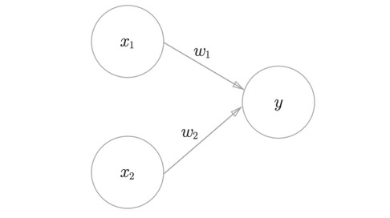
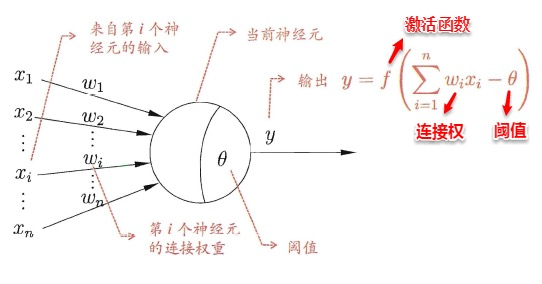

# 深度学习:感知机

### 感知机
> 最近陈硕在给我授课，讲深度学习，第一节内容主要是感知机

#### 1. 什么是感知机

感知机是二分类的线性模型，其输入是实例的特征向量，输出的是实例的类别，分别为0和1，属于判别模型。感知机接收多个输入信号，输出一个信号。

下图是一个接收两个输入信号的感知机的例子。

其中$x_{1}、 x_{2}$是输入信号，$y$是输出信号， $w_{1}、 w_{2}$是权重。图中的○称为“神经元”或者“节点”。输入信号被送往神经元时，会被分别乘以固定的权重。神经元会计算传送过来的信号的总和（$w_{1}x_{1} + w_{2}x_{2}$），只有当这个总和超过了某个界限值时，才会输出1。这也称为“神经元被激活” 。这里将这个界限值称为阈值，用符号$\theta$表示。

把上述内容用数学式来表示，就是下面这个式子

#### 2. 感知机模型

感知机是有生物学上的一个启发，我们的大脑可以认为是一个神经网络，这么一个生物的神经网络是由神经元组织起来的，在这个生物的神经网络里边，神经元的一些工作机制就是通过这样一个下面图的结构来运行的。首先接收到一些信号，这些信号通过这些树突组织，树突组织接收到这些信号送到细胞里边的细胞核，这些细胞核对接收到的这些信号（如光、声音）到树突的时候会产生一些微弱的生物电，从而形成一些刺激，那么在细胞核里边对这些收集到的接收到的刺激进行综合的处理，当它的信号达到了一定的阈值之后，它就会被激活，从而产生一个刺激的输出，那么就会形成一个我们大脑接收到的进一步的信号，再通过轴突来输出计算的，这就是我们人脑的一个神经元进行感知的时候大致的一个工作原理。

结合神经元模型有人提出了经典的抽象模型：M-P神经元模型，如下图

而感知机模型是从神经元模型发展过来的。感知机是由两层神经元组成的一个简单模型。只有输出层是M-P 神经元，即只有输出层神经元进行激活函数处理，也称为功能神经元（ functional neuron）；输入层只是接受外界信号（样本属性）并传递给输出层（输入层的神经元个数等于样本的属性数目），而没有激活函数。

(1.1)公式对应

将输入和权重扩展到多维，则式子(1.1)可以表示为

其中激活函数为越阶函数

#### 3. 感知机的应用

感知机可以用来表示简单的逻辑电路，逻辑电路是有两个输入和一个输出的门电路,最简单的例子当然是逻辑电路当中的与或门。与门、或门、非门其实都差不多，都是有两个输入和一个输出。下图为与门的真值表

|$x_1$|$x_2$|$y$|
|:--|:--|:--|
|0|0|0|
|1|0|0|
|0|1|0|
|1|1|1|

下面考虑用感知机来表示这个与门,需要做的就是确定公式(1.1)成立时能满足图中的真值表的$(w_1,w_2,\theta)$的值

|$x_1$|$x_2$|$y$|(1.1)代入|阈值条件|
|:--|:--|:--|:--|:--|
|0|0|0|$w_1 * 0 + w_2 * 0 -\theta \lt 0$ | $\theta \gt 0$ |
|0|1|0|$w_1 * 0 + w_2 * 1 -\theta \lt 0$ | $\theta \gt w_2$ |
|1|0|0|$w_1 * 1+ w_2 * 0 -\theta \lt 0$ | $\theta \gt w_1$ |
|1|1|1|$w_1 * 1 + w_2 * 1 -\theta \lt 0$ | $\theta \le w_1 + w2$ |

很明显该表有值，如$w_1 = w_2 且 \theta = 1.5 w_1$时

同理，或门和非门也是可以表示的

或门：

|$x_1$|$x_2$|$y$|(1.1)代入|阈值条件|
|:--|:--|:--|:--|:--|
|0|0|0|$w_1 * 0 + w_2 * 0 -\theta \lt 0$ | $\theta \gt 0$ |
|0|1|0|$w_1 * 0 + w_2 * 1 -\theta \ge 0$ | $\theta \le w_2$ |
|1|0|0|$w_1 * 1+ w_2 * 0 -\theta \ge 0$ | $\theta \le w_1$ |
|1|1|1|$w_1 * 1 + w_2 * 1 -\theta \ge 0$ | $\theta \le w_1 + w2$ |

与非门：

|$x_1$|$x_2$|$y$|(1.1)代入|阈值条件|
|:--|:--|:--|:--|:--|
|0|0|1|$w_1 * 0 + w_2 * 0 -\theta \gt 0$ | $\theta \lt 0$ |
|0|1|1|$w_1 * 0 + w_2 * 1 -\theta \gt 0$ | $\theta \lt w_2$ |
|1|0|1|$w_1 * 1+ w_2 * 0 -\theta \gt 0$ | $\theta \lt w_1$ |
|1|1|0|$w_1 * 1 + w_2 * 1 -\theta \le 0$ | $\theta \ge w_1 + w2$ |

但异或门没法处理

|$x_1$|$x_2$|$y$|(1.1)代入|阈值条件|
|:--|:--|:--|:--|:--|
|0|0|0|$w_1 * 0 + w_2 * 0 -\theta \lt 0$ | $\theta \gt 0$ |
|0|1|0|$w_1 * 0 + w_2 * 1 -\theta \ge 0$ | $\theta \le w_2$ |
|1|0|0|$w_1 * 1+ w_2 * 0 -\theta \ge 0$ | $\theta \le w_1$ |
|1|1|1|$w_1 * 1 + w_2 * 1 -\theta \lt 0$ | $\theta \gt w_1 + w2$ |

表中的条件明显矛盾，故不存在解

事实上，感知机是一种判别式的线性分类模型，可解决与、或、非这样的简单的线性可分问题，但感知机的局限性就在于它只能表示由一条直线分割的空间，对于异或问题不能用一条直线解决，如下图

#### 4. 多层感知机

感知机可以通过“叠加层”来实现异或门，如下图

将最左边的一列称为第0层，中间的一列称为第1层，最右边的一列称为第2层。其中s1为与非门，s2为或门，s1和s2再做与运算，则该网络能够表示异或门。

|$x_1$|$x_2$|$s_1$|$s_2$|$y$|
|:--|:--|:--|:--|:--|
|0|0|1|0|0|
|1|0|1|1|1|
|0|1|1|1|1|
|1|1|0|1|0|

异或门因为叠加了2层感知机，因而称为"多层感知机"，当然加了一层后已经不能称为感知机了，已经算神经网络了，这个下一节展开。
