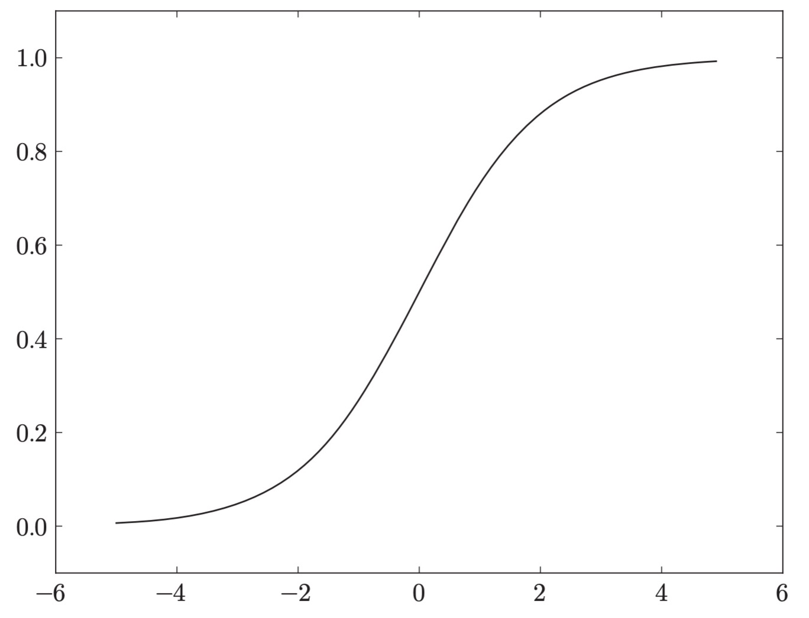

# 深度学习:神经网络

### 神经网络

> 接着上节感知机后，引入神经网络

#### 1. 激活函数

上一节介绍了两个输入信号的感知机的例子，以及用数学公式表示的例子，具体可以见上节内容,感知机。

可以将上节感知机的公式调整为

$$
y = h(b+w_1x_1+w_2x_2)  (1.1)
$$

其中函数$h(x)$的定义如下
$$
h(x) =
\begin{cases}
 0 (x \le 0) \\
 1 (x \gt 0)
\end{cases}
(1.2)$$

结合示例如下：

其中函数$h(x)$称之为激活函数，该函数会将输入信号的总和转换为输出信号。而灰色的输入信号是为了体现偏执$b$专门加上去的，主要是为了方便理解。

##### 1.1 阶跃函数

上面(1.2)就是阶跃函数，它的值呈阶段式变化，所以称为阶跃函数。

##### 1.2 sigmoid函数

sigmoid函数如下

$$
h(x) = \displaystyle\frac{1}{1+e^{-x}}
(1.3)$$

如下，sigmoid函数是一条平滑的曲线，输出随着输入发生连续性的变化，相对于阶跃函数，具有平滑性，在深度网络的学习中具有重要意义，能够增加表达能力。

另一个不同点是，相对于阶跃只能返回0或1，sigmoid函数可以返回0.731...,0.880...等实物。也就是说，感知机中神经元之间流动的是0和1的二元信号，而神经网络中流动的是连续的实数值信号。

虽然阶跃函数和sigmoid函数在平滑性上有差异，但二者还是有相同的点，当输入值越小，输出越接近0，输入值越大，输出越接近1.也就是说，当输入信号为重要信息时，阶跃函数和sigmoid都会输出较大值，当输入信号为不重要的信息时，二者都会输出较小的值。还有一个共同点，不管输入 信号多小，或者有多大，输出信号的值都在0和1之间。另外一个相同点是，它两都是非线性函数。

神经网络的激活函数必须使用非线性函数，如果使用线性函数作为激活函数的话，加深神经网络的层数就没有意义了。以激活函数$h(x)=cx$举例，运算3层后结果为$y(x)=h(h(h(x)))$，即$y(x)=c^3x$等价于$y(x)=ax$，即对于线性函数来说，不管加多少层，总是存在与之等效的"无隐藏层的神经网络"。

##### 1.3 ReLU函数

如下，ReLU函数在输出大于0时，直接输出该值，在输出小于等于0时，输出0.

$$
h(x) =
\begin{cases}
 0 (x \le 0) \\
 x (x \gt 0)
\end{cases}
(1.4)$$

#### 2. 神经网络

感知机的激活函数为阶跃函数，输出结果只有0和1两种，当激活函数为其他非线性函数时则为神经网络。

如下所示，为3层神经网络的实例：

输入层和输出层之间为中间层，又称为隐藏层，其中输入层(第0层)有2个神经元，第一个隐藏层(第1层)有3个神经元，第2个隐藏层(第2层)有2个神经元，输出层(第3层)有2个神经元。

上述激活函数主要作用于中间层。如下表示了激活函数$h()$的效果示例：

可以用矩阵表示上图的动作，即

$$
A^{(1)} = XW^{(1)} + B^{(1)}
$$

其中，$A^{(1)}$表示输出值，$X$为输入，$B^{(1)}$为偏置值，$W^{(1)}$为输出到各输出的权重
$$
A^{(1)} = 
\begin{pmatrix}
a_{1}^{(1)} & a_{2}^{(1)} & a_{3}^{(1)} \\
\end{pmatrix}
$$

$$
X = 
\begin{pmatrix}
x_{1} & x_{2} \\
\end{pmatrix}
$$

$$
B^{(1)} = 
\begin{pmatrix}
b_{1}^{(1)} & b_{2}^{(1)} & b_{3}^{(1)} \\
\end{pmatrix}
$$

$$
W^{(1)} = 
\begin{pmatrix}
w_{11}^{(1)} & w_{21}^{(1)} & w_{31}^{(1)} \\
w_{12}^{(1)} & w_{22}^{(1)} & w_{32}^{(1)} \\
\end{pmatrix}
$$

关于矩阵运算这里不展开讲，可以直接网上找材料，然后再对 $A^{(1)}$做激活函数运算，可以得到下一层神经网络的输入层

$$
Z^{(1)} = h(A^{(1)})
$$

注意，这里用到了numpy对矩阵运算的广播操作，即直接对矩阵的各元素单独执行了激活函数运算。

以此类推，可以得到下一层神经网络的处理过程

重复下去最后到输出层。这里要注意一点的是，输出层矩阵(m,n)到输出层矩阵(p,q)是通过矩阵乘法来转换得到的，所以多次中间件矩阵变换的时候需要满足前后转换条件。

##### 2.1 softmax函数

softmax函数主要作用于输出层：

$$
y(k) = \displaystyle\frac{e^{a_{k}}}{\sum_{i=1}^ne^{a_{i}}}
(1.5)$$

函数的输出是0.0到1.0之间的实数，并且，softmax函数的输出值的总和是1。输出总和为1是softmax函数的一个重要性质，因为有了这个性质，可以把softmax的输出解释为概率。

由于$e^n$可能非常大，为了避免结果发生溢出，可以通过增加任意常数的方式来避免，如下：

$$
y(k) = \displaystyle\frac{e^{a_{k}}}{\sum_{i=1}^ne^{a_{i}}}\\

\quad \\

= \displaystyle\frac{Ce^{a_{k}}}{C\sum_{i=1}^ne^{a_{i}}} \\

\quad \\

= \displaystyle\frac{e^{(a_{k}+ logC)}}{\sum_{i=1}^ne^{(a_{i}+ logC)} } 

$$

其中$logC$为常数。

另外，需要注意的是，即使使用了softmax函数，各元素之间的大小关系也不会改变。因此，神经网络在进行分类时，输出层的softmax函数可以省略。
