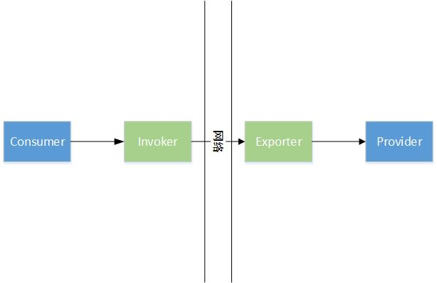

# Dubbo简介


> 这篇是开门贴，内容来自网上。

Dubbo是阿里巴巴公司开源的一个高性能优秀的服务框架，使得应用可通过高性能的 RPC 实现服务的输出和输入功能，可以和Spring框架无缝集成。Dubbo是一款高性能、轻量级的开源Java RPC框架，它提供了三大核心能力：面向接口的远程方法调用，智能容错和负载均衡，以及服务自动注册和发现。*(来自百度百科)*

#### 1. 整体架构

Dubbo的整体架构如下：


涉及到的组件包括：

1. Provider：暴露服务的服务提供方
2. Consumer：调用远程服务的服务消费方
3. Registry：服务注册与发现的注册中心
4. Monitor：统计服务的调用次数和调用时间的监控中心
5. Container：服务运行容器

调用流程为：

<ol start="0">
    <li>服务容器负责启动，加载，运行服务提供者。</li>
    <li>服务提供者在启动时，向注册中心注册自己提供的服务。</li>
    <li>服务消费者在启动时，向注册中心订阅自己所需的服务。</li>
    <li>注册中心返回服务提供者地址列表给消费者，如果有变更，注册中心将基于长连接推送变更数据给消费者。</li>
    <li>服务消费者，从提供者地址列表中，基于软负载均衡算法，选一台提供者进行调用，如果调用失败，再选另一台调用。</li>
    <li>服务消费者和提供者，在内存中累计调用次数和调用时间，定时每分钟发送一次统计数据到监控中心。</li>
</ol>

*(上面内容来自Dubbo官方文档)*

#### 2. 使用demo

#### 2.1 Api方式

纯Api方式调用模式如下：

Provider：

```
public class ApplicationApi {

    public static void main(String[] args) throws Exception {
        ServiceConfig<DemoServiceImpl> service = new ServiceConfig<>();
        service.setApplication(new ApplicationConfig("dubbo-demo-api-provider"));
        service.setRegistry(new RegistryConfig("zookeeper://127.0.0.1:2181"));
        service.setInterface(DemoService.class);
        service.setRef(new DemoServiceImpl());
        service.export();
        System.in.read();
    }
}
```

Consumer：

```
public class ApplicationApi {

    public static void main(String[] args) {
        ReferenceConfig<DemoService> reference = new ReferenceConfig<>();
        reference.setApplication(new ApplicationConfig("dubbo-demo-api-consumer"));
        reference.setRegistry(new RegistryConfig("zookeeper://127.0.0.1:2181"));
        reference.setInterface(DemoService.class);
        reference.setAsync(true);
        DemoService service = reference.get();
        String message = service.sayHello("dubbo");
        System.out.println(message);
    }
}
```

展示纯Api调用方式有利于看清事物的本质

*(上面代码来自dubbo-demo-api模块)*

#### 2.2 Spring方式

Spring方式调用模式如下：

dubbo-provider：

```
<beans xmlns:xsi="http://www.w3.org/2001/XMLSchema-instance"
       xmlns:dubbo="http://dubbo.apache.org/schema/dubbo"
       xmlns="http://www.springframework.org/schema/beans"
       xsi:schemaLocation="http://www.springframework.org/schema/beans http://www.springframework.org/schema/beans/spring-beans-4.3.xsd
       http://dubbo.apache.org/schema/dubbo http://dubbo.apache.org/schema/dubbo/dubbo.xsd">

    <dubbo:application name="demo-provider"/>

    <dubbo:registry address="zookeeper://127.0.0.1:2181"/>

    <dubbo:protocol name="dubbo"/>

    <bean id="demoService" class="org.apache.dubbo.demo.provider.DemoServiceImpl"/>

    <dubbo:service interface="org.apache.dubbo.demo.DemoService" ref="demoService"/>

</beans>
```

dubbo-consumer：

```
<beans xmlns:xsi="http://www.w3.org/2001/XMLSchema-instance"
       xmlns:dubbo="http://dubbo.apache.org/schema/dubbo"
       xmlns="http://www.springframework.org/schema/beans"
       xsi:schemaLocation="http://www.springframework.org/schema/beans http://www.springframework.org/schema/beans/spring-beans-4.3.xsd
       http://dubbo.apache.org/schema/dubbo http://dubbo.apache.org/schema/dubbo/dubbo.xsd">

    <dubbo:application name="demo-consumer"/>

    <dubbo:registry address="zookeeper://127.0.0.1:2181"/>

    <dubbo:reference id="demoService" check="false" interface="org.apache.dubbo.demo.DemoService"/>

</beans>
```

有了Bean后便可以在Spring中进行操作。

*(上面代码来自dubbo-demo-xml模块)*

#### 3. 框架设计

Dubbo的分层结构如下：


涉及到的各层职责为：

* config 配置层：对外配置接口，以 ServiceConfig, ReferenceConfig 为中心，可以直接初始化配置类，也可以通过 spring 解析配置生成配置类
* proxy 服务代理层：服务接口透明代理，生成服务的客户端 Stub 和服务器端 Skeleton, 以 ServiceProxy 为中心，扩展接口为 ProxyFactory
* registry 注册中心层：封装服务地址的注册与发现，以服务 URL 为中心，扩展接口为 RegistryFactory, Registry, RegistryService
* cluster 路由层：封装多个提供者的路由及负载均衡，并桥接注册中心，以 Invoker 为中心，扩展接口为 Cluster, Directory, Router, LoadBalance
* monitor 监控层：RPC 调用次数和调用时间监控，以 Statistics 为中心，扩展接口为 MonitorFactory, Monitor, MonitorService
* protocol 远程调用层：封装 RPC 调用，以 Invocation, Result 为中心，扩展接口为 Protocol, Invoker, Exporter
* exchange 信息交换层：封装请求响应模式，同步转异步，以 Request, Response 为中心，扩展接口为 Exchanger, ExchangeChannel, ExchangeClient, ExchangeServer
* transport 网络传输层：抽象 mina 和 netty 为统一接口，以 Message 为中心，扩展接口为 Channel, Transporter, Client, Server, Codec
* serialize 数据序列化层：可复用的一些工具，扩展接口为 Serialization, ObjectInput, ObjectOutput, ThreadPool

*(上面内容来自Dubbo官方文档)*

可以看到，除Service 和 Config 层为 API，其它各层均为 SPI，这也是Dubbo面向插件设计的核心。


最终调用链为：


核心过程抽象为：



后续内容也是根据这个流程来展开并进行扩充。

最后就是，Dubbo官方文档是最好的文档，基本看懂官方文档对Dubbo也就熟络了，这个系列主要以笔者自己结合官方文档看源码笔记为主。
