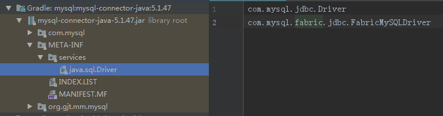
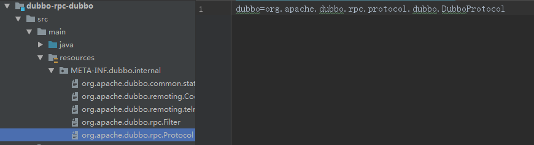

# Dubbo自适应扩展机制


> 上一节提到过，Dubbo里除了Service和Config层为API，其它各层均为SPI。相比于Java中的SPI仅仅通过接口类名获取所有实现，Dubbo的实现可以通过接口类名和key值来获取一个具体的实现。通过SPI机制，Dubbo实现了面向插件编程，只定义了模块的接口，实现由各插件来完成。

#### 1. 使用方式

#### 1.1 Java SPI

在扩展类的jar包内，放置扩展点配置文件META-INF/service/接口全限定名，内容为：扩展实现类全限定名，多个实现类用换行符分隔。

如下为Mysql中Driver接口的实现：



```
package com.mysql.jdbc;

import java.sql.SQLException;

public class Driver extends NonRegisteringDriver implements java.sql.Driver {
	...
}
```

调用时使用ServiceLoader加载所有的实现并通过循环来找到目标实现类

```
ServiceLoader<Driver> loadedDrivers = ServiceLoader.load(Driver.class);
Iterator<Driver> driversIterator = loadedDrivers.iterator();
try{
    while(driversIterator.hasNext()) {
        driversIterator.next();
    }
} catch(Throwable t) {
// Do nothing
}
```

#### 1.2 Dubbo SPI

拿Dubbo中Protocol接口来说，Protocol的定义如下：

```
package org.apache.dubbo.rpc;

import org.apache.dubbo.common.URL;
import org.apache.dubbo.common.extension.Adaptive;
import org.apache.dubbo.common.extension.SPI;

@SPI("dubbo")
public interface Protocol {

    int getDefaultPort();

    @Adaptive
    <T> Exporter<T> export(Invoker<T> invoker) throws RpcException;

    @Adaptive
    <T> Invoker<T> refer(Class<T> type, URL url) throws RpcException;

    void destroy();

}
```

需要指出的是Invoker基础了Node接口，该Node接口提供了getUrl方法，**既每个方法都能从入参获得URL对象**。

```
public interface Node {
    URL getUrl();

    boolean isAvailable();

    void destroy();
}
```

要求

1.接口上有```org.apache.dubbo.common.extension.SPI```注解，提供默认的实现

2.对于支持自适应扩展的方法要求方法入参能获得```org.apache.dubbo.common.URL```对象，同时方法上有```org.apache.dubbo.common.extension.Adaptive```注解，Adaptive注解可以提供多个key名，以便从URL中获取对应key的值，从而匹配到对应的实现**(这里Protocol比较特别，没有提供key名也能根据URL来动态获取实现，后面会说明)**

3.在扩展类的jar包内，放置扩展点配置文件META-INF/dubbo/接口全限定名，内容为：配置名=扩展实现类全限定名，多个实现类用换行符分隔。如Protocol的默认实现:



*注意：META-INF/dubbo/internal为Dubbo内部实现的配置文件路径*

调用时通过ExtensionLoader根据需要来选择具体的实现类，

```
ExtensionLoader<Protocol> loader = ExtensionLoader.getExtensionLoader(Protocol.class);
```

可选方式包括

1.选择默认的实现

```
Protocol protocol = loader.getDefaultExtension();
```

2.根据指定key选择实现

```
Protocol protocol = loader.getExtension("dubbo");
```

3.根据URL参数动态获取实现

```
Protocol protocol = loader.getAdaptiveExtension();
```

#### 2. Dubbo SPI 特性

Dubbo对Java中的标准SPI进行了扩展增强，官方文档中提到其提供了如下特性：

* 扩展点自动包装
* 扩展点自动装配
* 扩展点自适应
* 扩展点自动激活

在介绍各个特性前先介绍下大概的内部实现。从上面的使用中可以看到Dubbo对SPI扩展的主要实现在ExtensionLoader类中，关于这个类源码的讲解可以看官方文档，讲解的很详细，这边主要说下大概过程：

1. 根据传入的类型从classpath中查找META-INF/dubbo/internal和META-INF/dubbo路径下所有对应的扩展点配置文件
2. 读取扩展点配置文件中所有的键值对
3. 根据键值对缓存Class对象，如果类有同类型参数的构造函数，则为包装类，会缓存在另一个容器中
4. 实例化对象，缓存后并返回

#### 2.1 扩展点自动包装

在返回真正实例前，会用该类型的包装类进行包装，既采用装饰器模式进行功能增强。

```
if (CollectionUtils.isNotEmpty(wrapperClasses)) {
    // 循环创建 Wrapper 实例
    for (Class<?> wrapperClass : wrapperClasses) {
        // 将当前 instance 作为参数传给 Wrapper 的构造方法，并通过反射创建 Wrapper 实例。
        // 然后向 Wrapper 实例中注入依赖，最后将 Wrapper 实例再次赋值给 instance 变量
        instance = injectExtension((T) wrapperClass.getConstructor(type).newInstance(instance));
    }
}
```

其实就是使用静态代理来实现AOP


#### 2.2 扩展点自动装配

返回实例前会遍历所有的setXXX方法，判断set方法参数是否存在自适应对象，如果存在则通过ExtensionLoader加载自适应对象然后进行赋值，可以通过方法上加```org.apache.dubbo.common.extension.DisableInject```注解来屏蔽该功能。该功能其实就是实现了IOC，具体可以看ExtensionLoader的```injectExtension```方法。


#### 2.3 扩展点自适应

同上面介绍的一样，Dubbo的SPI可以根据传入的URL参数中携带的数据来动态选择具体的实现。

#### 2.4 扩展点自动激活

上面介绍过，Adaptive注解是加在方法上的，类似的有个注解```org.apache.dubbo.common.extension.Activate```是加在实现类上。当加在Class上时，ExtensionLoader会将对应的key和Class信息缓存到另一个容器中，后续可以通过ExtensionLoader获取某一类的实现列表，既如下方法

```
public List<T> getActivateExtension(URL url, String[] values){
	...
}
```

##### 3. ExtensionLoader自适应扩展机制

ExtensionLoader自适应扩展机制的大概实现逻辑是这样的：Dubbo会为拓展接口生成具有代理功能的代码，然后通过 javassist 或 jdk 编译这段代码，得到 Class 类。最后再通过反射创建代理类，在代理类中，就可以通过URL对象的参数来确定到底调用哪个实现类。主要实现在```createAdaptiveExtensionClass```方法中。

```
private Class<?> createAdaptiveExtensionClass() {
    String code = new AdaptiveClassCodeGenerator(type, cachedDefaultName).generate();
    ClassLoader classLoader = findClassLoader();
    org.apache.dubbo.common.compiler.Compiler compiler = ExtensionLoader.getExtensionLoader(org.apache.dubbo.common.compiler.Compiler.class).getAdaptiveExtension();
    return compiler.compile(code, classLoader);
}
```

上面的Protocol接口经过处理后的内容如下：

```
public class Protocol$Adaptive implements org.apache.dubbo.rpc.Protocol {

    public void destroy() {
        throw new UnsupportedOperationException(
            "The method public abstract void org.apache.dubbo.rpc.Protocol.destroy() of interface org.apache.dubbo.rpc.Protocol is not adaptive method!");
    }

    public int getDefaultPort() {
        throw new UnsupportedOperationException(
            "The method public abstract int org.apache.dubbo.rpc.Protocol.getDefaultPort() of interface org.apache.dubbo.rpc.Protocol is not adaptive method!");
    }

    public org.apache.dubbo.rpc.Exporter export(org.apache.dubbo.rpc.Invoker arg0) throws org.apache.dubbo.rpc.RpcException {
        if (arg0 == null) {
            throw new IllegalArgumentException("org.apache.dubbo.rpc.Invoker argument == null");
        }
        if (arg0.getUrl() == null) {
            throw new IllegalArgumentException("org.apache.dubbo.rpc.Invoker argument getUrl() == null");
        }
        org.apache.dubbo.common.URL url = arg0.getUrl();
        String extName = (url.getProtocol() == null ? "dubbo" : url.getProtocol());
        if (extName == null) {
            throw new IllegalStateException(
                "Failed to get extension (org.apache.dubbo.rpc.Protocol) name from url (" + url.toString() + ") use keys([protocol])");
        }
        org.apache.dubbo.rpc.Protocol extension = (org.apache.dubbo.rpc.Protocol) ExtensionLoader
            .getExtensionLoader(org.apache.dubbo.rpc.Protocol.class).getExtension(extName);
        return extension.export(arg0);
    }

    public org.apache.dubbo.rpc.Invoker refer(java.lang.Class arg0, org.apache.dubbo.common.URL arg1) throws org.apache.dubbo.rpc.RpcException {
        if (arg1 == null) {
            throw new IllegalArgumentException("url == null");
        }
        org.apache.dubbo.common.URL url = arg1;
        String extName = (url.getProtocol() == null ? "dubbo" : url.getProtocol());
        if (extName == null) {
            throw new IllegalStateException(
                "Failed to get extension (org.apache.dubbo.rpc.Protocol) name from url (" + url.toString() + ") use keys([protocol])");
        }
        org.apache.dubbo.rpc.Protocol extension = (org.apache.dubbo.rpc.Protocol) ExtensionLoader
            .getExtensionLoader(org.apache.dubbo.rpc.Protocol.class).getExtension(extName);
        return extension.refer(arg0, arg1);
    }
}
```

前面提到过，Protocol是一个比较特殊的接口，Adaptive注解里没有指定Key，因而没法通过URL携带的参数获取具体的实现类。从上面处理过后的内容来看，可以看到，对于Protocol接口直接使用的URL的protocol属性字段的值来进行判断的。

如下例子是在Adaptive里有提供key的实现处理过后的内容：

```
public java.lang.String sayHello(org.apache.dubbo.common.URL arg0) {
    if (arg0 == null) {
        throw new IllegalArgumentException("url == null");
    }
    org.apache.dubbo.common.URL url = arg0;
    String extName = url.getParameter("keyA", "dobbo");
    if (extName == null) {
        throw new IllegalStateException("Failed to get extension (cn.demo.spi.Factory) name from url (" + url.toString() + ") use keys([keyA])");
    }
    cn.demo.spi.Factory extension = (cn.demo.spi.Factory) ExtensionLoader.getExtensionLoader(cn.demo.spi.Factory.class).getExtension(extName);
    return extension.sayHello(arg0);
}
```

可以发现这种情况直接使用的URL的getParameter方法从携带的参数中获取对应的值。

通过查看AdaptiveClassCodeGenerator的实现可以发现该类的generateExtNameAssignment里对protocol做了特殊的判断。AdaptiveClassCodeGenerator完成了代理类内容的创建，大概过程为：根据原接口定义(type)，包装出根据URL参数动态调用getExtension方法的实现类，然后将动作实际委托给了ExtensionLoader.getExtensionLoader(type).getExtension(extName);方法。其中extName为方法上的Adaptive注解指定的key的对应值，获取过程为：

1. 如果Adaptive注解配置的key为空，则使用类名作为扩展名
2. 如果扩展名为protocol，则从URL的protocol里获取对应的值
3. 如果扩展名不为protocol，且方法参数里有org.apache.dubbo.rpc.Invocation，则从URL.getMethodParameter里获取
4. 以上都没有则直接从URL.getParameter中获取。

Protocol接口由于没有在Adaptive注解里指定key，则会使用类名protocol作为默认的扩展名，从而命中第2条规则。
