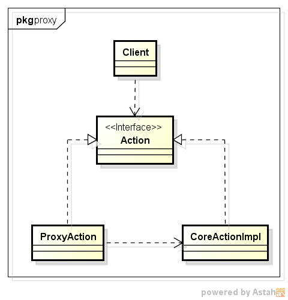
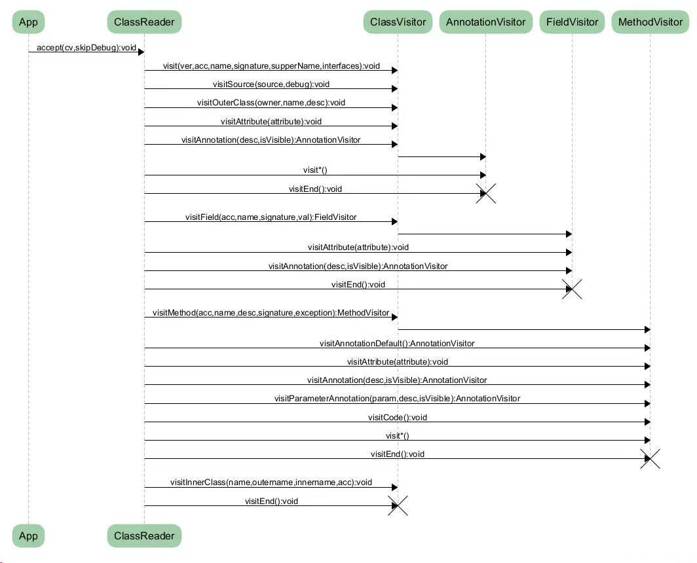

# 字节码增强


&emsp;上节介绍了Java字节码结构，这节介绍字节码增强技术。Java字节码增强指的是在Java字节码生成之后，对其进行修改，增强其功能，这种方式相当于对应用程序的二进制文件进行修改。

&emsp;常见的字节码增强技术包括：

 * Java自带的动态代理
 * ASM
 * Javassist

#### 1. 动态代理

&emsp;在介绍动态代理前，先介绍代理模式。如下图，为代理模式的UML类图：



代理模式是一种设计模式，提供了对目标对象额外的访问方式，即通过代理对象访问目标对象，这样可以在不修改原目标对象的前提下，提供额外的功能操作，扩展目标对象的功能。代理类ProxyAction和被代理类CoreActionImpl都实现了同一个接口Action，ProxyAction还持有了CoreActionImpl，以调用被代理类的核心操作。代理模式实现可以分为静态代理和动态代理。

##### 1.1. 静态代理

&emsp;静态代理完全就是上面UML类图的直译，若代理类在程序运行前就已经存在，那么这种代理方式被成为 静态代理 ，这种情况下的代理类通常都是我们在Java代码中定义的。 通常情况下， 静态代理中的代理类和委托类会实现同一接口或是派生自相同的父类，再通过聚合来实现，让代理类持有一个委托类的引用即可。例子如下：

```
public interface Action {
    void say();
}

public class CoreActionImpl implements Action {

    @Override
    public void say() {
        System.out.println("hello world");
    }
}

public class ProxyAction implements Action {
    private Action action = new CoreActionImpl();
    @Override
    public void say() {
        System.out.println("before core action");
        action.say();
        System.out.println("after core action");
    }

}
```


##### 1.2. 动态代理

&emsp;代理类在程序运行时创建的代理方式被称为动态代理。也就是说，这种情况下，代理类并不是在Java代码中定义的，而是在运行时动态生成的。动态代理利用了JDK API，动态代理对象不需要实现接口，但是要求目标对象必须实现接口，否则不能使用动态代理。例子如下：

```
public class DynamicProxyAction implements InvocationHandler {

    private Object obj;

    public DynamicProxyAction(Object obj) {
        this.obj = obj;
    }

    @Override
    public Object invoke(Object proxy, Method method, Object[] args) throws Throwable {
        System.out.println("before core action");
        Object res = method.invoke(obj,args);
        System.out.println("after core action");
        return res;
    }
}

```

使用如下方法进行调用：

```
DynamicProxyAction proxyAction = new DynamicProxyAction(new CoreActionImpl());
Action action = (Action) Proxy.newProxyInstance(DynamicProxyAction.class.getClassLoader(),new Class[]{Action.class},proxyAction);
action.say()
```

自带的动态代理实现要求代理类实现InvocationHandler接口，并在方法invoke中完成具体方法的代理过程。

&emsp;可以使用如下内容输出代理类内容

```
byte[] clazzData = ProxyGenerator.generateProxyClass(DynamicProxyAction.class.getCanonicalName() + "$Proxy0", new Class[]{Action.class});
OutputStream out = new FileOutputStream(DynamicProxyAction.class.getCanonicalName() + "$Proxy0" + ".class");
out.write(clazzData);
out.close();
```

得到内容如下:

```
public final class DynamicProxyAction$Proxy0 extends Proxy implements Action {
    private static Method m1;
    private static Method m2;
    private static Method m3;
    private static Method m0;

    public DynamicProxyAction$Proxy0(InvocationHandler var1) throws  {
        super(var1);
    }

    public final boolean equals(Object var1) throws  {
        try {
            return (Boolean)super.h.invoke(this, m1, new Object[]{var1});
        } catch (RuntimeException | Error var3) {
            throw var3;
        } catch (Throwable var4) {
            throw new UndeclaredThrowableException(var4);
        }
    }

    public final String toString() throws  {
        try {
            return (String)super.h.invoke(this, m2, (Object[])null);
        } catch (RuntimeException | Error var2) {
            throw var2;
        } catch (Throwable var3) {
            throw new UndeclaredThrowableException(var3);
        }
    }

    public final void say() throws  {
        try {
            super.h.invoke(this, m3, (Object[])null);
        } catch (RuntimeException | Error var2) {
            throw var2;
        } catch (Throwable var3) {
            throw new UndeclaredThrowableException(var3);
        }
    }

    public final int hashCode() throws  {
        try {
            return (Integer)super.h.invoke(this, m0, (Object[])null);
        } catch (RuntimeException | Error var2) {
            throw var2;
        } catch (Throwable var3) {
            throw new UndeclaredThrowableException(var3);
        }
    }

    static {
        try {
            m1 = Class.forName("java.lang.Object").getMethod("equals", Class.forName("java.lang.Object"));
            m2 = Class.forName("java.lang.Object").getMethod("toString");
            m3 = Class.forName("demo.Action").getMethod("say");
            m0 = Class.forName("java.lang.Object").getMethod("hashCode");
        } catch (NoSuchMethodException var2) {
            throw new NoSuchMethodError(var2.getMessage());
        } catch (ClassNotFoundException var3) {
            throw new NoClassDefFoundError(var3.getMessage());
        }
    }
}
```

可以看到，代理类继承了java.lang.reflect.Proxy类并实现了代理接口。代理类内部除了有代理接口的方法外还额外增加了3个方法equals、toString和hashCode。所有方法的内部实现都委托给了InvocationHandler来执行，该InvocationHandler为传入的DynamicProxyAction。

##### 1.3. Cglib

&emsp;java自带的动态代理一个很明显的要求就是被代理类有实现接口，Cglib代理则是为了解决这个问题而存在的。[CGLIB](https://github.com/cglib/cglib)（Code Generator Library）是一个强大的、高性能的代码生成库。其被广泛应用于AOP框架（Spring、dynaop）中，用以提供方法拦截操作，其底层使用了ASM来操作字节码生成新的类。

&emsp;Cglib主要是通过动态生成一个要代理类的子类，子类重写要代理的类的所有不是final的方法。在子类中采用方法拦截的技术拦截所有父类方法的调用，顺势织入横切逻辑，对于final方法，无法进行代理。

&emsp;为了实现上面对CoreActionImpl的代理效果，可以如下实现：

```
public class CglibProxyAction {
    public static void main(String[] args) {
        Enhancer enhancer = new Enhancer();
        enhancer.setSuperclass(CoreActionImpl.class);
        enhancer.setCallback(new MethodInterceptor() {
            @Override
            public Object intercept(Object o, Method method, Object[] objects, MethodProxy methodProxy) throws Throwable {
                System.out.println("before core action");
                Object res = methodProxy.invokeSuper(o, objects);
                System.out.println("after core action");
                return res;
            }
        });
        CoreActionImpl action = (CoreActionImpl) enhancer.create();
        action.say();
    }
}
```

可以打开Cglib的debug参数cglib.debugLocation(DebuggingClassWriter.DEBUG_LOCATION_PROPERTY)，输出代理后的class对象，由于内容过长，这里不全部贴出，只贴出核心部分，如下：

```
public final void say() {
    MethodInterceptor var10000 = this.CGLIB$CALLBACK_0;
    if (var10000 == null) {
        CGLIB$BIND_CALLBACKS(this);
        var10000 = this.CGLIB$CALLBACK_0;
    }

    if (var10000 != null) {
        var10000.intercept(this, CGLIB$say$0$Method, CGLIB$emptyArgs, CGLIB$say$0$Proxy);
    } else {
        super.say();
    }
}
```

如上说的，生成的子类重写了父类方法，并进行了拦截。

#### 2. ASM

&emsp;ASM([https://asm.ow2.io/](https://asm.ow2.io/ ) )是一个Java字节码操控框架。它可以被用来动态生成类或者增强既有类的功能。ASM可以直接产生二进制的class文件，也可以在类被加载到Java虚拟机之前改变类行为。

&emsp;ASM工具提供两种方式来产生和转换已编译的class文件，它们分别是基于事件和基于对象的表示模型。其中，基于事件的表示模型的方式类似于 SAX 处理XML。它使用一个有序的事件序列表示一个class文件，class文件中的每一个元素使用一个事件来表示，比如class的头部，变量，方法声明JVM指令都有相对应的事件表示，ASM使用自带的事件解析器能将每一个class文件解析成一个事件序列。而基于对象的表示模型则类似于DOM处理XML，其使用对象树结构来解析每一个文件。如下为从网上找到的描述事件模型的时序图，比较清晰的介绍了ASM的处理流程：



官网和网上有很多关于ASM的介绍，这边不再赘述，下面给出例子说明。

针对上面提到的CoreActionImpl，它的字节码内容如下：

```
public class demo/CoreActionImpl implements demo/Action  {

  // compiled from: CoreActionImpl.java

  // access flags 0x1
  public <init>()V
   L0
    LINENUMBER 3 L0
    ALOAD 0
    INVOKESPECIAL java/lang/Object.<init> ()V
    RETURN
   L1
    LOCALVARIABLE this Ldemo/CoreActionImpl; L0 L1 0
    MAXSTACK = 1
    MAXLOCALS = 1

  // access flags 0x1
  public say()V
   L0
    LINENUMBER 7 L0
    GETSTATIC java/lang/System.out : Ljava/io/PrintStream;
    LDC "hello world"
    INVOKEVIRTUAL java/io/PrintStream.println (Ljava/lang/String;)V
   L1
    LINENUMBER 8 L1
    RETURN
   L2
    LOCALVARIABLE this Ldemo/CoreActionImpl; L0 L2 0
    MAXSTACK = 2
    MAXLOCALS = 1
}
```

我们要拦截say方法，增加前后日志，则需要在方法的入口处以及返回处增加对应的字节码，可以使用如下的代码实现：

```
public class ASMProxyAction {

    public static void main(String[] args) throws IOException {
        ClassWriter cw = new ClassWriter(ClassWriter.COMPUTE_MAXS);
        ClassReader cr = new ClassReader(Thread.currentThread().getContextClassLoader().getResourceAsStream("demo/CoreActionImpl.class"));
        cr.accept(new ClassVisitor(Opcodes.ASM6, cw) {
            @Override
            public MethodVisitor visitMethod(int access, String name, String desc, String signature, String[] exceptions) {
                MethodVisitor mv = super.visitMethod(access, name, desc, signature, exceptions);
                if (!"say".equals(name)) {
                    return mv;
                }
                MethodVisitor aopMV = new MethodVisitor(super.api, mv) {
                    @Override
                    public void visitCode() {
                        super.visitCode();
                        mv.visitFieldInsn(Opcodes.GETSTATIC, "java/lang/System", "out", "Ljava/io/PrintStream;");
                        mv.visitLdcInsn("before core action");
                        mv.visitMethodInsn(Opcodes.INVOKEVIRTUAL, "java/io/PrintStream", "println", "(Ljava/lang/String;)V", false);
                    }

                    @Override
                    public void visitInsn(int opcode) {
                        if (Opcodes.RETURN == opcode) {
                            mv.visitFieldInsn(Opcodes.GETSTATIC, "java/lang/System", "out", "Ljava/io/PrintStream;");
                            mv.visitLdcInsn("after core action");
                            mv.visitMethodInsn(Opcodes.INVOKEVIRTUAL, "java/io/PrintStream", "println", "(Ljava/lang/String;)V", false);
                        }
                        super.visitInsn(opcode);
                    }
                };
                return aopMV;
            }
        }, ClassReader.SKIP_DEBUG);
        File file = new File("CoreActionImpl.class");
        FileOutputStream fos = new FileOutputStream(file);
        fos.write(cw.toByteArray());
        fos.close();
    }
}
```
该代码重写了MethodVisitor的visitCode和visitInsn(Opcodes.RETURN == opcode)，增加了对应的日志。

修改后的字节码如下:

```
public class demo/CoreActionImpl implements demo/Action  {


  // access flags 0x1
  public <init>()V
    ALOAD 0
    INVOKESPECIAL java/lang/Object.<init> ()V
    RETURN
    MAXSTACK = 1
    MAXLOCALS = 1

  // access flags 0x1
  public say()V
    GETSTATIC java/lang/System.out : Ljava/io/PrintStream;
    LDC "before core action"
    INVOKEVIRTUAL java/io/PrintStream.println (Ljava/lang/String;)V
    GETSTATIC java/lang/System.out : Ljava/io/PrintStream;
    LDC "hello world"
    INVOKEVIRTUAL java/io/PrintStream.println (Ljava/lang/String;)V
    GETSTATIC java/lang/System.out : Ljava/io/PrintStream;
    LDC "after core action"
    INVOKEVIRTUAL java/io/PrintStream.println (Ljava/lang/String;)V
    RETURN
    MAXSTACK = 2
    MAXLOCALS = 1
}
```

#### 3. Javassist

&emsp;Javassist是一个动态类库，可以用来检查、”动态”修改以及创建 Java类。其功能与jdk自带的反射功能类似，但比反射功能更强大。相比较ASM，Javassist直接使用java编码的形式，而不需要了解虚拟机指令，就能动态改变类的结构，或者动态生成类。更多内容可以看官网[http://www.javassist.org/](http://www.javassist.org/)，下面直接讲解例子。

&emsp;为了实现上面对CoreActionImpl的代理效果，可以如下实现：

```
public class JavassistProxyAction {

    public static void main(String[] args) throws Exception {
        ClassPool pool = ClassPool.getDefault();
        CtClass cc = pool.get("demo.CoreActionImpl");
        CtMethod methodSay = cc.getDeclaredMethod("say");
        methodSay.insertBefore("System.out.println(\"before core action\");");
        methodSay.insertAfter("System.out.println(\"after core action\");");
        File file = new File("CoreActionImpl.class");
        FileOutputStream fos = new FileOutputStream(file);
        fos.write(cc.toBytecode());
        fos.close();
    }

}
```

上面的代码比较直观，直接获得目标方法，然后在该方法前后插入了目标逻辑，且为Java代码。上面代码生成的class反编译后的内容如下：

```
public class demo/CoreActionImpl implements demo/Action  {

  // compiled from: CoreActionImpl.java

  // access flags 0x1
  public <init>()V
   L0
    LINENUMBER 3 L0
    ALOAD 0
    INVOKESPECIAL java/lang/Object.<init> ()V
    RETURN
   L1
    LOCALVARIABLE this Ldemo/CoreActionImpl; L0 L1 0
    MAXSTACK = 1
    MAXLOCALS = 1

  // access flags 0x1
  public say()V
   L0
    GETSTATIC java/lang/System.out : Ljava/io/PrintStream;
    LDC "before core action"
    INVOKEVIRTUAL java/io/PrintStream.println (Ljava/lang/String;)V
   L1
    LINENUMBER 7 L1
    GETSTATIC java/lang/System.out : Ljava/io/PrintStream;
    LDC "hello world"
    INVOKEVIRTUAL java/io/PrintStream.println (Ljava/lang/String;)V
   L2
    LINENUMBER 8 L2
    GOTO L3
   L3
   FRAME SAME
    ACONST_NULL
    ASTORE 2
    GETSTATIC java/lang/System.out : Ljava/io/PrintStream;
    LDC "after core action"
    INVOKEVIRTUAL java/io/PrintStream.println (Ljava/lang/String;)V
    RETURN
    LOCALVARIABLE this Ldemo/CoreActionImpl; L0 L3 0
    MAXSTACK = 5
    MAXLOCALS = 3
}
```

