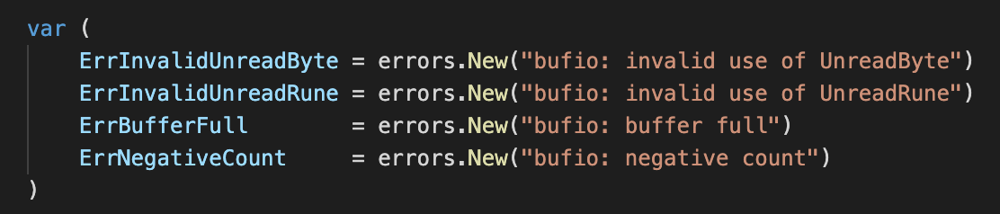
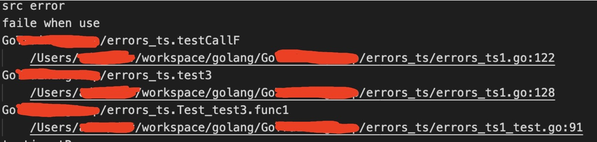
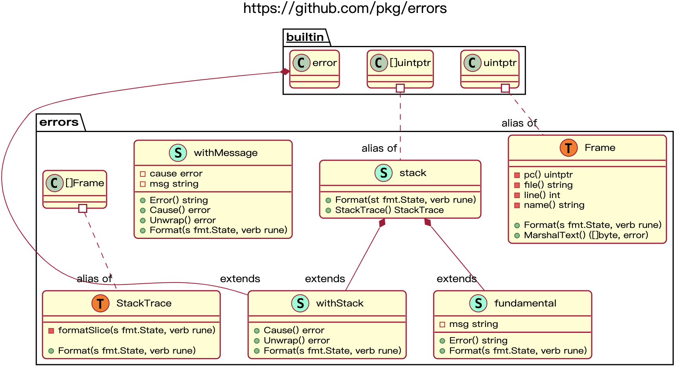

# golang error


## go error

>记录go1.x error相关内容

#### 1. 原生error

```error``` 只是一个普通的interface,在```buildin.go``` 里给出了定义:

```
// The error built-in interface type is the conventional interface for
// representing an error condition, with the nil value representing no error.
type error interface {
	Error() string
}
```

当返回值为nil时，表示没有错误，所以调用方需要通过类似```err != nil```的方式来处理。

该接口只有一个方法，返回具体消息内容，可以使用```errors.New(text string)``` 来返回一个error对象，入参只有一个string，为具体消息内容。如bufio.go内置的错误



用该方法返回的对象，```即使文本相同，返回的error对象也是不同的```，从源码中可以知道原因：

```

// New returns an error that formats as the given text.
// Each call to New returns a distinct error value even if the text is identical.
func New(text string) error {
	return &errorString{text}
}

// errorString is a trivial implementation of error.
type errorString struct {
	s string
}

func (e *errorString) Error() string {
	return e.s
}
```

如上，该方法返回的是errorString结构体对象的指针，因而是用地址作为比较。使用该种方式也能保证预定义的error只有一个，避免值复制。

*PS:1.为了防止自定义error过多，可以像基础库中设计的类似，在包内定义统一的error，以达到公用的目的，如上图的bufio.go中的内置错误*

也可以通过实现error接口以实现自定义error类型，同时还能传递上下文信息，如：

```
type MyError struct {
	Msg string
	Type string
}

func (err *MyError) Error() string {
	return fmt.Sprintf("%s:%s",err.Type,err.Msg);
}
```

#### 2. error的判定方式

##### 2.1 Sentinel error

哨兵error，即预定义error，在这种方式中，错误被定义成了被包导出的变量.如：```if err == io.EOF {}```，这里的io.EOF便是哨兵error.可以通过判断error是否跟这个错误进行比较，就可以知道此处出现的error是否属于这个错误.

##### 2.2 Error types

通过断言转换来确定error的原始类型以达到判定的目的，例如：

```
type MyError struct {
	Msg string
}

func (e *MyError) Error() string {
	return fmt.Sprintf("%s",e.Msg)
}

err := something()
switch err := err.(type) {
	case nil:
	    // call succeeded, nothing to do
	case *MyError:
	    fmt.Println(“error occurred on line:”, err.Line)
	default:
	    // unknown error
}
```

无论是对于哨兵错误还是错误类型断言，使用方都需要了解其使用包的错误定义细节，而包的提供方则需要提供可能的错误类型，加强了包之间的耦合，当错误类型很多时，维护会变得困难。

##### 2.3 Opaque errors

不透明错误处理：通过行为来断言错误，而不是类型。如net包里定义的错误，通过判断Temporary或者Timeout来判断具体是什么错。

```
package net

type Error interface {
    error
    Timeout() bool   // Is the error a timeout?
    Temporary() bool // Is the error temporary?
}

// main.go
if nerr, ok := err.(net.Error); ok && nerr.Temporary() {
    time.Sleep(1e9)
    continue
}
if err != nil {
    log.Fatal(err)
}
```

#### 3. error和panic

关于error和panic设计上的区别，可以看下Dave Cheney的博客[https://dave.cheney.net/tag/panic](https://dave.cheney.net/tag/panic)。大体意思就是，Go设计者觉得Exception这个东西，在设计上经历过C、C++后，在Java中总算是上道了，但还是被乱用了。在Java中，不管异常是大是小，不管是简单还是严重，都往上抛给调用方，导致调用方无脑通过try...catch...finally对异常进行了捕获，没有针对异常的严重性分开处理。同时try...catch...finally这种方式将异常与流程控制混在一起会很容易使得代码变得混乱。

Go设计者则认为错误(error)和异常(panic)是不同的，error是指意料中的问题，如文件不存在这种逻辑条件上的错误；panic是指意料外的问题，如数组越界这种系统异常。对于error，可以通过多值返回的形式通知调用方，上游需要显示处理；而panic的处理的捕获则需要借助defer和recover，类似于catch和finally的效果。

panic的捕获方式如下:

```
func main() {
	fmt.Println("c")
	defer func() { // 必须要先声明defer，否则不能捕获到panic异常
		  fmt.Println("d")
		  if err := recover(); err != nil {
		     fmt.Println(err) // 这里的err其实就是panic传入的内容
		  }
		  fmt.Println("e")
	}()

   f() //开始调用f

   fmt.Println("f") //这里开始下面代码不会再执行
}

func f() {
   fmt.Println("a")
   panic("异常信息")
   fmt.Println("b") //这里开始下面代码不会再执行
}

-------output-------
c
a
d
异常信息
e
```
通过捕获panic，使得必要时程序不至于中断，比如web服务，应该展示错误给到前端，而不是退出程序。

当然个人觉得这两个是相对的，毕竟函数里什么场景返回error，什么场景抛出panic，都是明确的。同时，作为函数提供者无法预测使用者的业务场景，可能某些error对于上层业务来说就是panic。

#### 4. github/pkg/errors

上面的例子看出，在打印eroor时，只打印了错误信息，从实现上也可以看出来，不像java的exception一样会存储上下文堆栈信息，因而对定位问题不太友好。当然我们可以手动的在每个函数的调用入口处打印日志来模拟错误调用栈，只是比较低效，也比较挫，代码也不好看。这里介绍一个比较常用的组件```github/pkg/errors```，可以实现打印错误信息时附加堆栈信息。

先来看个例子，常规的error处理时，是这样

```
func callF() error {
	//模拟抛出error
	return errors.New("src error")
}

err := callF()
if err != nil {
        return err
}
```

直接把error抛给了上层，这时候上下文是不带堆栈信息的，因而上层打印时只有错误信息的字符串，而pkg/erros使用时是这样的

```
err := callF()
if err != nil {
        return errors.Wrap(err, "faile when use")
}
```
通过Wrap方法，附加了额外的错误信息。同时，但使用```fmt.Printf("%+v\n", err)```时，可以查看调用堆栈。如下为本机测试调用栈内容



官方的demo还展示了如何获取原始error以及获取调用栈的方式，这里不再赘述。下面主要介绍下pkg/errors的具体实现。

下面是整个包的结构关系，使用了[https://github.com/jfeliu007/goplantuml](https://github.com/jfeliu007/goplantuml)提供的工具生成。这个工具展示了大致的关系，有些细节没有展示出来，下面会同时说明。



先简单介绍下各个结构体体

- error就不用说了
- uintptr:是golang的内置类型，是能存储指针的整型，能用于指针运算；	runtime.Callers可用来获取当前goroutine函数调用栈的程序计数器及其相关信息，返回相应函数指针的地址值，结果存在[]uintptr中,可以通过uintptr获得对饮函数指针的函数名、行号、文件名
- Frame:uintptr的别名，由于要存储调用链的函数指针，故名帧，个人觉得只是为了让意思更贴切易懂
- stack:[]uintptr的别名，表示调用栈
- StackTrace:[]Frame的别名，表示栈帧，类似于Frame和uintptr，stack和StackTrace一个用于内部，一个用于外部，同时二者可以相互转换
- withStack:继承自stack和error，用于保留调用链和源头错误信息
- fundamental:继承自stack用于保留调用链，同时有一个string的字段，用于存储错误信息，实现了```Error() string```方法，因而为一个error实现
- withMessage:持有一个error和string的结构体，可以看做是对error的扩展，用于存储错误信息，它也实现了```Error() string```方法，因而为一个error实现

上面提到的各个结构体，除了error和uintptr外，都实现了```Format(s fmt.State,verb rune)```方法，相当于实现了Formatter接口：

```
type Formatter interface {
    Format(f State, c rune)
}
```
实现了Formatter接口的类型可以定制自己的格式化输出。Format方法的实现内部可以调用Sprint或Fprint等函数来生成自身的输出。当调用fmt包相关的print方法时，可以输出自定义格式，从而实现打印出对应调用栈信息。

会过头来看Wrap方法，如下：

```
func Wrap(err error, message string) error {
	if err == nil {
		return nil
	}
	err = &withMessage{
		cause: err,
		msg:   message,
	}
	return &withStack{
		err,
		callers(),
	}
}
```

方法在传入的error不为nil时，跟传入的message包装为withMessage，然后再包装为withStack返回。其中```callers```方法返回了当前执行点的调用链，存储在[]uintptr中，即stack。

再看withStack的Format实现

```
func (w *withStack) Format(s fmt.State, verb rune) {
	switch verb {
	case 'v':
		if s.Flag('+') {
			fmt.Fprintf(s, "%+v", w.Cause())
			w.stack.Format(s, verb)
			return
		}
		fallthrough
	case 's':
		io.WriteString(s, w.Error())
	case 'q':
		fmt.Fprintf(s, "%q", w.Error())
	}
}
```

当以```+v```格式打印时，先以```+v```打印内部的error，再打印对应的```stack```调用链。

同样的，stack自定义了打印格式，在遇到```+v```格式时，会遍历函数指针，转为Frame后再执行```+v```打印

```
func (s *stack) Format(st fmt.State, verb rune) {
	switch verb {
	case 'v':
		switch {
		case st.Flag('+'):
			for _, pc := range *s {
				f := Frame(pc)
				fmt.Fprintf(st, "\n%+v", f)
			}
		}
	}
}

```
而Frame的自定义打印便是根据函数指针打印对应的文件名、方法名和行号。即打印顺序为

```
-witchStack
--	error
---		message
--	stack
---		Frame
```
这里需要注意一点，witchStack打印的时候会调用```+v```格式打印witchStack中的error，如果该error也为一个witchStack，则会打印两次调用栈。

为了避免多次打印调用栈，需要保证Wrap只调用一次，可以对最底层的error使用Wrap方法，其他上层使用WithMessage方法，但这个需要自己鉴别什么时候才是底层的error。网上也给出了一个判断当前error是否持有stack的方法

```
type stackTracer interface {
    StackTrace() errors.StackTrace
}

func WithStackOnce(err error) error {
    _, ok := err.(stackTracer)
    if ok {
        return err
    }

    return errors.WithStack(err)
}
```

witchStack继承自stack，而stack有```StackTrace() StackTrace```方法，且StackTrace不是私有的，因而可以通过自定义一个interface的方式来实现。但个人觉得这样也是挺麻烦的，每次调用都要先执行这个也是挺麻烦的，套用网上的一句话就是，直接forck源码来改吧
