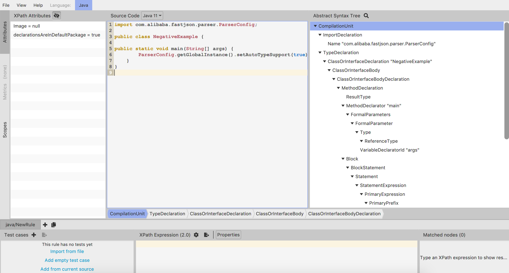
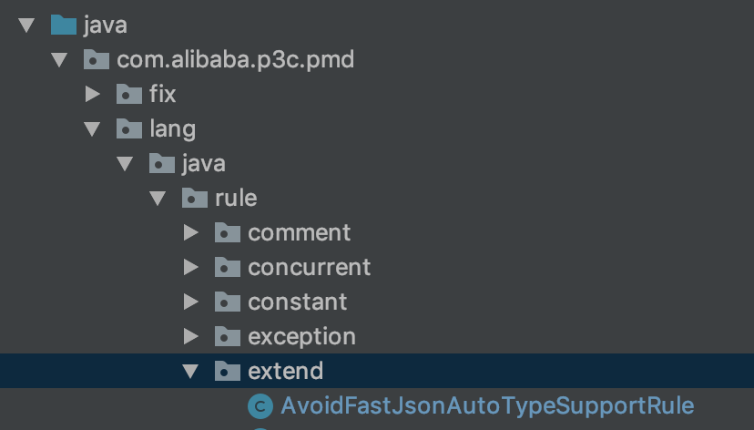
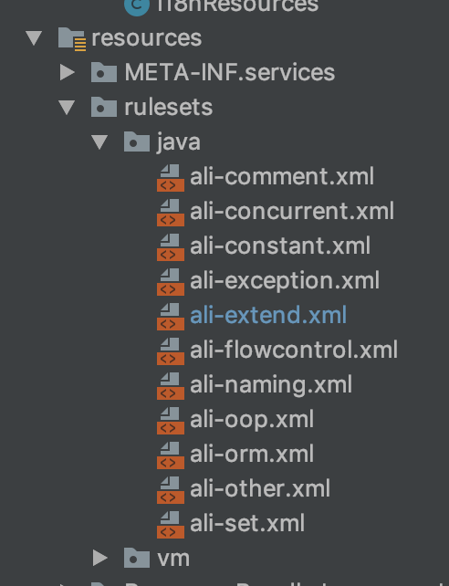
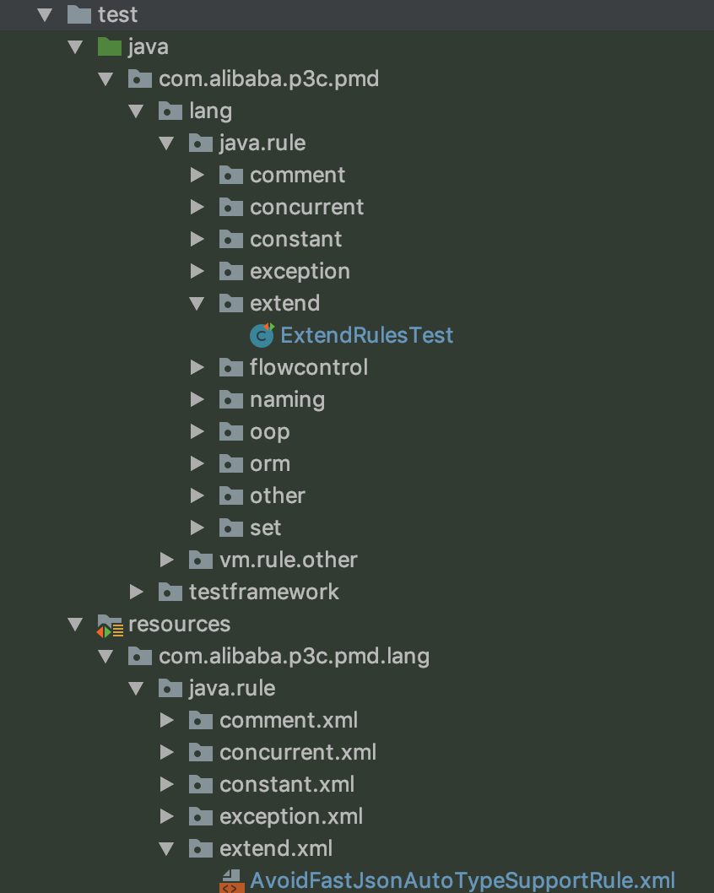
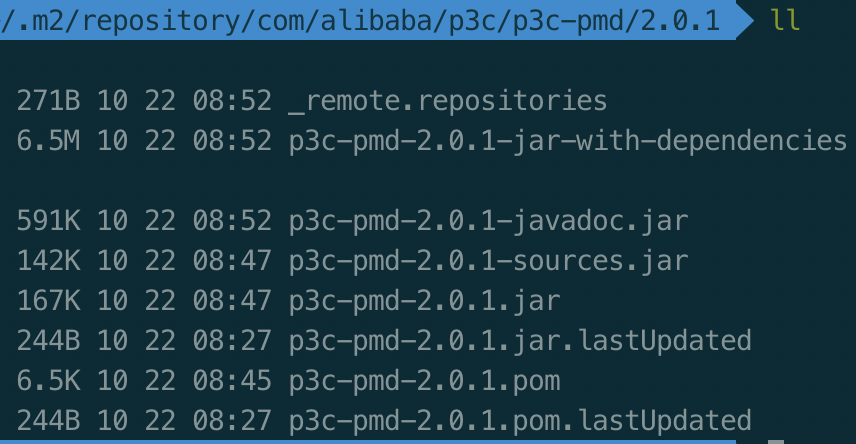
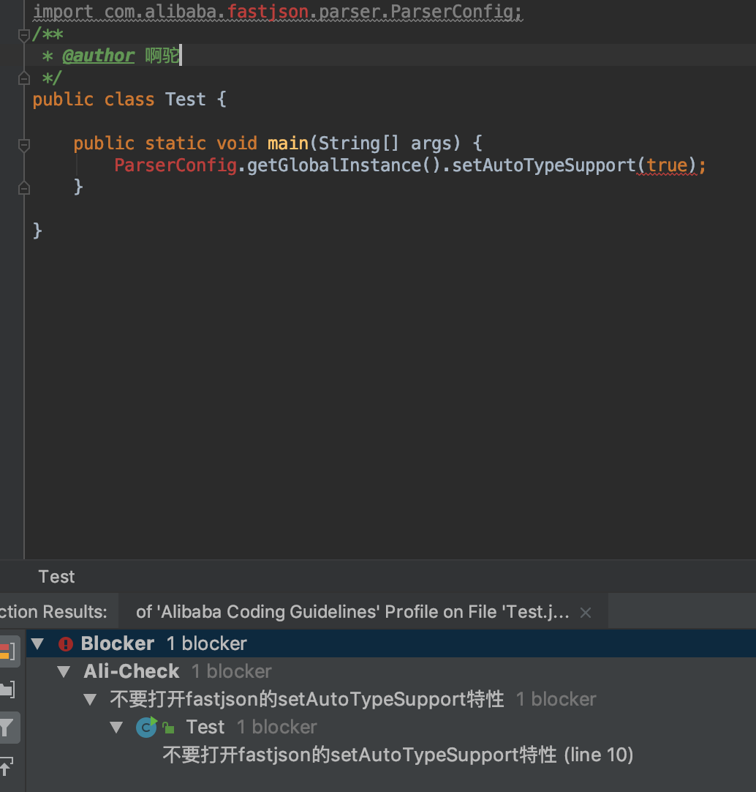
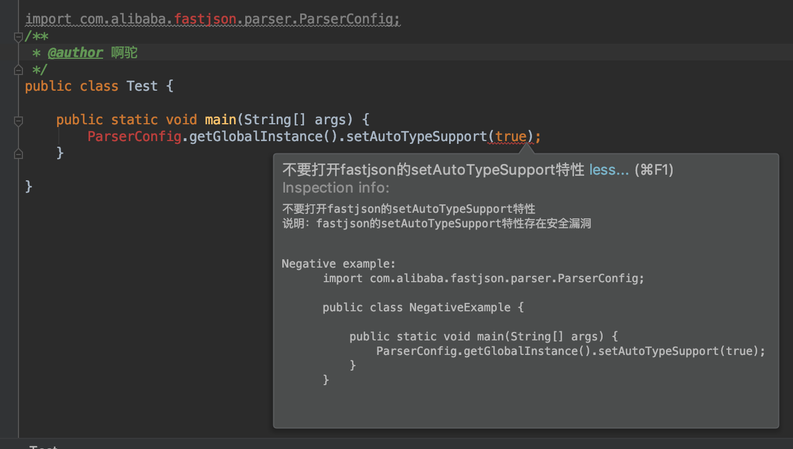

# 扩展阿里p3c实现自定义代码规范检查


&emsp;前段时间fastjson报出了漏洞，只要打开setAutoType特性就会存在风险，自己测试环境的一个项目被揪出来了-_-!。虽然改动很小，但就是觉得憋屈。fastjson还是挺好的，想着禁用的话太可惜，用的话又要注意安全，就想着找款工具提示下在用fastjson的时候不要打开这个特性。刚好阿里开源了p3c（[https://github.com/alibaba/p3c](https://github.com/alibaba/p3c)），一款代码规范的检查工具，有对应的ide插件，能在编码过程中对设置的规则进行提示，便打算对它进行拓展，增加对fastjson检查是否打开setAutoType特性的检查。

&emsp;p3c主要包括3部分：

* PMD实现(p3c-pmd)：使用PMD[https://pmd.github.io/](https://pmd.github.io/)来实现代码规范检查
* Intellij IDEA插件
* Eclipse插件

&emsp;《阿里巴巴Java开发手册》中的大部分规则都是在p3c-pmd模块中实现的，该部分也是这节研究的主要部分。

#### 1. PMD

&emsp;p3c使用了PMD。PMD是一款静态代码扫描工具，该工具可以做到检查Java代码中是否含有未使用的变量、是否含有空的抓取块、是否含有不必要的对象等。PMD使用JavaCC生成解析器来解析源代码并生成AST(抽象语法树)，通过对AST的检查可以直接从源代码文本层面来对代码进行检查，在PMD内部称为规则。即是否符合规则指的是，穷举源码各种可能的写法，然后在AST上检查是否出现。而规则的实现，重点便在对AST的处理上。

##### 1.1. AST

&emsp;关于AST的介绍网上有很多，可以直接搜索，这里重要提两点：

* AST是源代码的抽象语法结构的树状表示
* 抽象语法树并不依赖于原语言的语法，也就是说同语法分析阶段所采用的上下文无关

&emsp;PMD使用JavaCC来生成AST。关于JavaCC也可以在网上查看相关资料，这里不多介绍，只要知道JavaCC是一个词法分析生成器和语法分析生成器便行。

##### 1.2. 自定义规则

&emsp;PMD官方文档介绍了自定义规则的实现步骤，过程比较清晰，这里不赘述，只介绍下本文需要设计的步骤。

###### 1.2.1. 定义规则集

&emsp;PMD的规则需要配置在XML文件中

* 新建如下的空文件表示规则集

	```
	<?xml version="1.0"?>

		<ruleset name="Custom Rules"
	    xmlns="http://pmd.sourceforge.net/ruleset/2.0.0"
	    xmlns:xsi="http://www.w3.org/2001/XMLSchema-instance"
	    xsi:schemaLocation="http://pmd.sourceforge.net/ruleset/2.0.0 https://pmd.sourceforge.io/ruleset_2_0_0.xsd">

	    <description>
	        My custom rules
	    </description>


	    <!-- Your rules will come here -->

	</ruleset>
	```

* 在上面的``` ruleset ``` 标签中引用自定义规则

	```
	<rule ref="pathToYourOwnClass" />
	```

* 配置规则集

###### 1.2.2. 配置规则

&emsp;可以在 ``` rule ``` 标签中对某一规则进行配置

* 配置提示消息和告警级别

	```
	<rule ref="pathToYourOwnClass"
      message="message to show" >
      <priority>5</priority>
	</rule>
	```
	告警优先级分为1-5个level，1最高，5最低

* 配置运行参数

	可以通过 ``` properties ``` 和 ``` propertie ```对类属性赋值

###### 1.2.3. 编写规则

&emsp;规则的编写比较简单，PMD已经给我们做好了配套的开发框架和工具，只要确定后规则出现的情况，按照固定的模式去编写即可。

* 确定实现方式

	可以使用纯Java方式实现，也可以使用XPath方式实现。

	对于纯Java方式，PMD框架本身实现了对AST数的遍历，用户只要在遍历各个节点的时候，对自定义规则的各种情况进行分析判断即可，过程类似与DOM文件的SAX解析，以流和事件的方式来解析AST内容。

	对于XPath方式，则是将AST作为一个XML数，以XPath的方式来遍历解析内容。

* 根据测试代码确定可能出现的情况

	PMD自带了一个designer，可以用来生成对应代码的AST内容。对于本文需要达到的效果，涉及到如下代码：

	```

	import com.alibaba.fastjson.parser.ParserConfig;

	public class NegativeExample {

		public static void main(String[] args) {
	        ParserConfig.getGlobalInstance().setAutoTypeSupport(true);
	    }
	}

	```

	在designer中可以得到如下的AST内容

	

	具体内容这里就不贴出来了，可以下载desigin然后贴上上面的代码就会有。

	对于本文的需求，需要确定在有import ``` ParserConfig ``` 类的时候，调用了 ``` setAutoTypeSupport ``` 方法且参数为 ``` true ```。当然这个条件是不够严谨的，还需要判断是否调用了 ``` ParserConfig ```，也要考虑有通过import导入直接写全限定名的。但考虑到一般的写法，以及ide的格式化处理，这样处理已经可以满足大部分场景了。

* 编写规则实现类

	确定了规则的判断条件，就可以着手写代码了。

	对于Java方式，可以直接继承 ```net.sourceforge.pmd.lang.java.rule.AbstractJavaRule ``` 类，然后重写各种节点的visit方法即可。

	例如如下，用于判断是否有import ``` ParserConfig ``` 类

	```
	private final String PARSER_CONFIG_IMPORT_NAME = "com.alibaba.fastjson.parser.ParserConfig";

	private boolean hasImport = false;

	@Override
    public Object visit(ASTImportDeclaration node, Object data) {
        if (PARSER_CONFIG_IMPORT_NAME.equals(node.getImportedName())) {
            hasImport = true;
        }
        return super.visit(node, data);
    }
	```

	对于XPath方式，可以通过继承 ``` net.sourceforge.pmd.lang.rule.XPathRule ``` 类，重写 ``` setXPath ``` 方法设定对应的XPath即可。上面提到过，可以通过 ``` property ``` 配置对类的属性进行赋值，因而，对于XPat方式，可以在xml配置中进行如下设置来启用XPath。

	```
	<rule name="My Rule"
          language="java"
          message="violation message"
          class="net.sourceforge.pmd.lang.rule.XPathRule">
        <description>
Rule Description
         </description>
         <priority>3</priority>
         <properties>
             <property name="xpath">
                 <value>
                 <![CDATA[
--- here comes your XPath expression
]]>
				 </value>
             </property>
         </properties>
	```

###### 1.2.4. 测试规则

&emsp;PMD推荐对于每个规则，至少要有一个正向和逆向的测试用例，来验证规则出现和不出现的情况。对于规则的测试，PMD也提供了一套框架，只要按照约定好的方式添加xml测试文件即可。

&emsp;PMD约定了几个规则，用来加载测试案例

* 测试类要继承 ``` net.sourceforge.pmd.testframework.PmdRuleTst ```类，该整合了Junt，可以在里面增加需要的测试方法。

* 对于在 ``` src/test/resource ``` 和测试类对应的路径下增加一个xml目录，在增加同第一步同名的xml文件，该文件用于书写测试集。

	例如官网给出的例子

	规则实现类路径如下：

	```
net.sourceforge.pmd.lang.java.rule.bestpractices.AbstractClassWithoutAbstractMethodTest

	```

	测试案例集如下：

	```
	src/test/resources/net/sourceforge/pmd/lang/java/rule/bestpractices/xml/AbstractClassWithoutAbstractMethod.xml

	```

	xml的规则则可以参考官网介绍，这里不再赘述。

#### 2. p3c-pmd

&emsp;代码规范实现的主要模块，使用pmd来实现。p3c-pmd模块在代码组织上很工整，可以按照相同的模式增加自定义的规则/规则集。

&emsp;对于本文需求，打算在该模块的基础上增加一个extend模块，用于实现自定义规则集。如下，为对应的源码路径好规则集路径





&emsp;本文采用纯Java方式实现规则，按照1.2.3.节的描述，可以得到如下的实现类

```

public class AvoidFastJsonAutoTypeSupportRule extends AbstractAliRule {

    private final String PARSER_CONFIG_IMPORT_NAME = "com.alibaba.fastjson.parser.ParserConfig";

    private final String SET_AUTO_TYPE_SUPPORT_NAME = "setAutoTypeSupport";

    private boolean hasImport = false;


    @Override
    public Object visit(ASTImportDeclaration node, Object data) {
        if (PARSER_CONFIG_IMPORT_NAME.equals(node.getImportedName())) {
            hasImport = true;
        }
        return super.visit(node, data);
    }

    @Override
    public Object visit(ASTPrimaryExpression node, Object data) {
        if (hasImport) {
            int size = node.jjtGetNumChildren();
            for (int i = 0; i < size; i++) {
                Node child = node.jjtGetChild(i);
                String imageName = null;
                if (child instanceof ASTPrimaryPrefix) {
                    ASTPrimaryPrefix prefix = (ASTPrimaryPrefix) child;
                    imageName = prefix.jjtGetChild(0).getImage();
                }else if (child instanceof ASTPrimarySuffix){
                    ASTPrimarySuffix suffix = (ASTPrimarySuffix) child;
                    imageName = suffix.getImage();
                }

                if (imageName == null) {
                    continue;
                }else if (imageName.endsWith(SET_AUTO_TYPE_SUPPORT_NAME)){
                    ASTPrimarySuffix argumentSuffix = (ASTPrimarySuffix) node.jjtGetChild(i + 1);
                    try {
                        List<Node> booleanArgs = argumentSuffix.findChildNodesWithXPath("//PrimaryPrefix/Literal/BooleanLiteral");
                        if (booleanArgs.size() == 1) {
                            ASTBooleanLiteral booleanLiteral = (ASTBooleanLiteral) booleanArgs.get(0);
                            if (booleanLiteral.isTrue()) {
                                ViolationUtils.addViolationWithPrecisePosition(this, argumentSuffix, data,
                                    I18nResources.getMessage("java.extend.AvoidFastJsonAutoTypeSupportRule.rule.msg" ));
                            }
                        }
                    } catch (JaxenException e) {
                        e.printStackTrace();
                    } finally {
                        break;
                    }
                }
            }
        }
        return super.visit(node, data);
    }
}

```

&emsp;对应规则集中的配置为

```

<rule name="AvoidFastJsonAutoTypeSupportRule" language="java"
    message="java.extend.AvoidFastJsonAutoTypeSupportRule.rule.msg"
    class="com.alibaba.p3c.pmd.lang.java.rule.extend.AvoidFastJsonAutoTypeSupportRule">
    <description>java.extend.AvoidFastJsonAutoTypeSupportRule.rule.desc</description>
    <priority>1</priority>
    <example>
      <![CDATA[
Negative example:
      import com.alibaba.fastjson.parser.ParserConfig;

      public class NegativeExample {

          public static void main(String[] args) {
              ParserConfig.getGlobalInstance().setAutoTypeSupport(true);
          }
      }
]]>
    </example>
  </rule>

```

&emsp;这里有几点需要注意的，类 ``` AvoidFastJsonAutoTypeSupportRule ``` 继承自 ``` com.alibaba.p3c.pmd.lang.java.rule.AbstractAliRule ```，AbstractAliRule继承自AbstractJavaRule，重写了setDescription,setMessage和addViolationWithMessage等方法，这里提到的3个方法，增加了多语言支持。p3c-pmd使用Resource Bundle来提供多语言支持。每个消息都有一个唯一id来对应，p3c-pmd通过重写方法，将方法参数映射为消息的id，以统一消息的配置。如下为本地对应的消息提示内容

```

	<!--extend-->
    <entry key="java.extend.AvoidFastJsonAutoTypeSupportRule.rule.msg">
        <![CDATA[不要打开fastjson的setAutoTypeSupport特性]]>
    </entry>
    <entry key="java.extend.AvoidFastJsonAutoTypeSupportRule.rule.desc">
        <![CDATA[
说明：fastjson的setAutoTypeSupport特性存在安全漏洞
        ]]>
    </entry>

```

&emsp;对于测试，按照1.2.4.的介绍，则有如下的文件路径



文件内容比较简单，这里就不贴出来了。

&emsp;至此，已经完成了自定义规则的实现，现在就是要把该内容应用到ide上了。首先，需要将该模块进行编译，这里直接保存到本地maven参考，好在本地调试。

&emsp;直接将p3c-pmd的版本升级为2.0.1，然后执行mvn install，可以在本地仓库看到对应的版本



有了该版本，则可以在其他模块引用该版本进行新功能调试，下面将以idea-plugin模块为例。

#### 3. idea-plugin

&emsp;idea-plugin主要实现了idea的插件，能够对代码进行实时检查。这里涉及到idea自定义插件的开发，这里就不深入了，网上有很多教程。这里只介绍如何将上面自定义的规则接入该模块。

1.修改idea-plugin模块的build.gradle文件，开启本地仓库配置，以便从本地直接加载最新的p3c-pmd依赖。

```

buildscript {
    repositories {
        maven {
            url "https://oss.sonatype.org/content/repositories/snapshots/"
        }
        maven {
            url 'http://dl.bintray.com/jetbrains/intellij-plugin-service'
        }
        mavenLocal()
        mavenCentral()

    }
    dependencies {
        classpath "org.jetbrains.kotlin:kotlin-gradle-plugin:$kotlin_version"
    }
}

allprojects {
    group 'com.alibaba.p3c.idea'
    apply plugin: 'java'
    apply plugin: 'kotlin'
    apply plugin: 'maven-publish'

    sourceCompatibility = 1.8
    compileJava.options.encoding = 'UTF-8'
    configurations.all {
        resolutionStrategy.cacheChangingModulesFor 0, 'seconds'
    }
    repositories {
        mavenLocal()
        jcenter()
        mavenCentral()
    }

    dependencies {
        compile "org.jetbrains.kotlin:kotlin-stdlib-jdk8:$kotlin_version"
        testCompile group: 'junit', name: 'junit', version: '4.11'
    }
}


```

如上，增加了```mavenLocal()```

2.修改p3c-common的build.gradle，更改p3c-pmd的版本为2.0.1

3.修改p3c-common模块resources/rulesets/java/ali=pmd.xml，增加

```
<rule ref="rulesets/java/ali-extend.xml"/>
```

以增加自定义规则检查。

4.在p3c-common模块下，执行``` gradle clean buildPlugin ```，生成对应的插件。

#### 4. 验证

&emsp;本地安装该插件，可以得到如下效果





&emsp;这里只验证效果，没有真正引入fastjson依赖，也验证了pmd检查的是源码文本。


