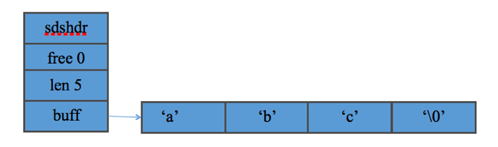
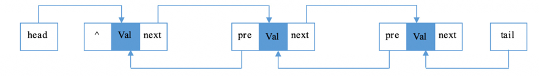
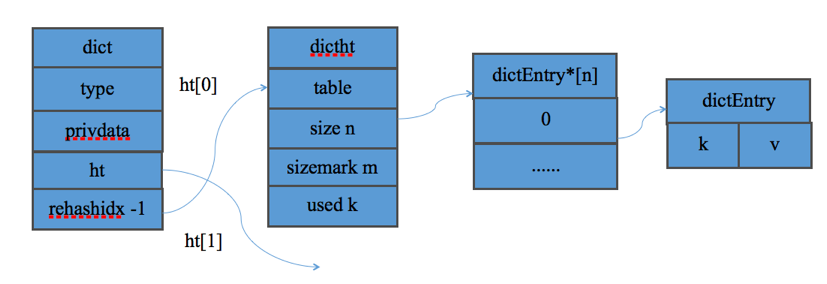
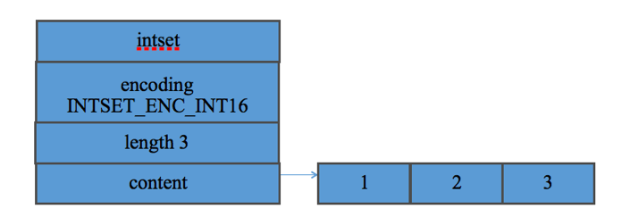
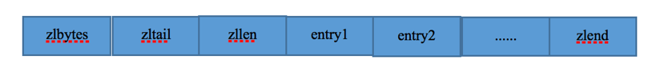
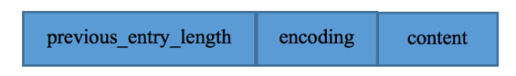

# Redis基本结构

&emsp;之前看了《Redis设计与实现》这本书，对Redis的认识加深了一些，便做了一些总结，同时也记录下自己的一些想法。

&emsp;这节先介绍Redis提供的基本结构，主要分为底层的基本结构和以对象形式包装的Object结构。

#### 1.SDS

&emsp;C字符串在redis中主要用于无须对字符串值进行修改的地方，对于需要修改字符串的场景，则使用SDS（简单动态字符串）。

SDS的结构如下示：

&emsp;其中buff是字符串缓冲区，用于存放字符串，len为buf数组中已使用字节的数量，free为buf数组中未使用字节的数量。注意，buff中存放的是二进制数据，使用len属性来判断字符串是否结束，保留’\0’符号是为了兼容部分C函数。

&emsp;同C字符串相比，由于SDS记录了相关的使用情况，因而能够以常数复杂度获取字符串长度，并且能够杜绝缓冲区溢出。同时，通过使用空间预分配和惰性空间释放两种策略，能够减少修改字符串时带来的内存重分配次数。

&emsp;所谓空间预分配是指，当对SDS进行修改的时候，并且需要对SDS空间进行扩展的时候，程序不仅会为SDS分配修改所需要的空间，还会为SDS分配额外的未使用空间。其分配策略是如下定义的：如果对SDS修改后的长度小于1MB，那么程序分配和len属性同样大小的未使用空间；如果对SDS修改后的长度大于等于1MB，那么程序会分配1MB的未使用空间。通过空间预分配策略，redis可以减少连续执行字符串增长操作所需要的内存重分配次数。

&emsp;所谓惰性空间释放，就是当需要缩短SDS保存的字符串的时候，程序并不立即使用内存重新分配来回收缩短后多出来的字节，而是使用free属性将这些字节的数量记录下来，并等将来使用。

&emsp;SDS的行为同Java中的StringBuilder类似。

#### 2.list

&emsp;list结构是个标准的无环双向链表实现，结构如下:

&emsp;具体过程不再讲解，网上对该结构的讲解比较多。

#### 3.dict

&emsp;dict结构是个标准的字典实现，使用链地址法解决冲突。Dict的结构如下:

&emsp;其中ht是一个长度为2的数组，一般情况下只使用了ht[0]，ht[1]用于rehash过程。rehashidx记录了rehash的过程，-1表示没有在进行。redis采用渐进式rehash的方式来rehash，防止在数量庞大时导致服务器在一段时间内停止服务。

&emsp;渐进式rehash的主要过程为：为dict的ht[1]哈希表分配空间，可以是扩容，也可以是缩容;将保存在ht[0]中的所有键值对重新计算索引值，rehash到ht[1]上;迁移完成后释放ht[0]，将ht[1]设置为ht[0],并在ht[1]新创建一个空白哈希表，为下一次rehash做准备。

#### 4.jump List

&emsp;跳表是有序集合的底层实现之一。

&emsp;关于跳表的细节，可以看下面的[介绍](https://zh.wikipedia.org/wiki/%E8%B7%B3%E8%B7%83%E5%88%97%E8%A1%A8)

&emsp;redis使用跳表不用红黑树的原因在于：

&emsp;在插入、删除、查找以及迭代输出有序序列这几个操作上，跳表跟红黑树的时间复杂度是一样的，但是在按区间查找数据的操作上，跳表的效率比红黑树更高。

1.	跳表较红黑树更好实现，意味着可读性好、不易出错。

2.	跳表更加灵活，可以通过改变索引结构来平衡执行效率和内存消耗之间的关系

#### 5.intset

&emsp;当一个集合只包含整数值元素，并且这个集合的元素数量不多时，redis就会使用整数集合作为集合的底层实现。下面是intset的结构

&emsp;其中content用于存储整数集合的值，length为content的长度，encoding为content中存储的整数的类型，可以为int_16,int_32和int_64。

&emsp;当需要新增元素到intset里时，redis会保证元素是有序的。如果content长度不够或者新增的类型同encoding的类型不同，还会出发intset的升级。升级过程包括重新分配content大小（以新的encoding类型为准），必要时提升encoding的类型，移动元素的位置，最后修改length属性。

&emsp;注意，intset不支持降级操作，一旦对数组进行了升级，编码就会一直保持升级后的状态。

#### 6.zipList

&emsp;当一个列表键只包含少量列表项，并且每个列表项要么就是小整数，要么就是长度比较短的字符串，那么就会使用压缩列表来做列表键的底层实现。

&emsp;压缩列表的结构如下:

&emsp;每个zipList节点的组成部分如下:

每个节点保存一个字节数据或者一个整数值，其中字节数组和整数值都允许保存不同的长度,由encoding属性决定。previous_entry_length属性则记录了前一个节点的长度，使用1个字节或者5个字节来存储，在新节点加入时可能引起[连锁更新](http://redisbook.com/preview/ziplist/cascade_update.html).

#### 7.object

&emsp;Redis以对象的形式来存储键值，提供了字符串对象，列表对象，哈希对象，集合对象和有序集合对象5种类型。并使用引用计数来管理对象的回收。

&emsp;对象结构的主要属性包括type，encoding和ptr属性。

&emsp;其中type属性记录了对象的类型，这个属性的值包括:

类型常量	| 对象的名称
:-: | :-:
REDIS_STRING	| 字符串对象
REDIS_LIST	|列表对象
REDIS_HASH	|哈希对象
REDIS_SET |	集合对象
REDIS_ZSET	| 有序集合对象

&emsp;encoding记录了对象使用了什么数据结构的对象底层实现，这个属性的值包括:

编码常量	|编码所对应的底层数据结构
:-:|:-:
REDIS_ENCODING_INT |	long类型的整数
REDIS_ENCODING_EMBSTR|	embstr编码的简单动态字符串
REDIS_ENCODING_RAW	|简单动态字符串
REDIS_ENCODING_HT	|字典
REDIS_ENCODING_LINKEDLIST|	双端链表
REDIS_ENCODING_ZIPLIST|	压缩列表
REDIS_ENCODING_INTSET	|整数集合
REDIS_ENCODING_SKIPLIST	|跳跃表和字典

###### 1.REDIS_STRING

&emsp;字符串对象的编码可以为INT,EMBSTR或者RAW。当字符串对象保存的是整数，且该整数能够用long来表示，则使用int存储整数值;当保存的是一个字符串，且长度小于39字节，则使用embstr编码，大于39字节则使用raw编码.关于两者的区别，可以看下面的[说明](http://redisbook.com/preview/object/string.html)。而embstr要以39个字节来划分的原因可以看这个[说明](http://www.cnblogs.com/lhcpig/p/4769397.html)

###### 2.REDIS_LIST

&emsp;列表对象的编码可以为ZIPLIST或者LINKEDLIST。

&emsp;当列表对象可以同时满足以下两个条件时，列表对象使用ziplist编码：

1. 列表对象保存的所有字符串元素的长度都小于64字节;

2. 列表对象保存的元素数量小于512个
若不满足则使用linkedlist编码，该条件可以通过配置文件的配置项list-max-ziplist-value和list-max-ziplist-entries进行修改。

###### 3.REDIS_HASH

&emsp;哈希对象的编码可以为ZIPLIST或者HASHTABLE

&emsp;当哈希对象可以同时满足以下两个条件时，哈希对象使用ziplist编码：

1. 哈希对象保存的所有键值对的键和值的字符串当度都小于64字节;

2. 哈希对象保存的键值对数量小于512个
&emsp;若不满足则使用hashtable编码，该条件可以通过配置文件的配置项hash-max-ziplist-value和hash-max-ziplist-entries进行修改。

###### 4.REDIS_SET

&emsp;集合对象的编码可以为INTSET或者HASHTABLE

&emsp;当集合对象可以同时满足以下两个条件时，使用intset编码：

1. 集合对象保存的所有元素都是整数值;

2. 集合对象保存的元素数量不超过512个

&emsp;若不满足则使用hashtable编码，该条件可以通过配置文件的配置项set-max-intset-entries进行修改。

##### 5.REDIS_ZSET

&emsp;有序集合的编码可以为ZIPLIST或者SKIPLIST

&emsp;当有序集合对象同时满足以下两个条件时，使用ziplist

1. 有序集合保存的元素数量小于128个;

2. 有序集合保存的所有元素成员的长度都小于64字节;

&emsp;若不满足则使用skiplist编码，该条件可以通过配置文件的配置项zset-max-ziplist-entries和zset-max-ziplist-values进行修改。
