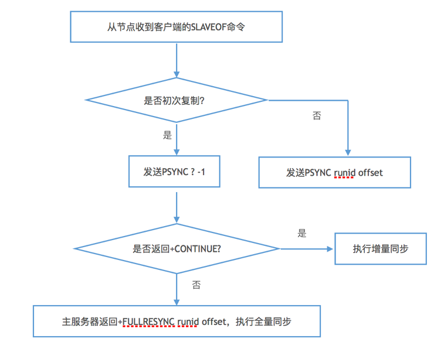

# Redis主从复制


&emsp;这节介绍Redis的主从复制过程,包括建立和复制。

#### 1.复制的建立

##### 1.1 SLAVEOF命令

&emsp;Redis支持主从模式以提供读写分离，可以通过在从服务器的客户端上执行如下命令以连接主服务器：

```
	SLAVEOF	IP	PORT
```

或者在配置文件中配置SLAVEOF选项。

##### 1.2 建立过程

&emsp;SLAVEOF命令包括以下几个步骤：

1. 从服务设置主服务器的地址和端口，从服务器会保存客户端上送的地址和端口。

2. 从服务器同主服务器建立套接字连接。

3. 从服务器向主服务器发送PING命令，通过判断响应是否为PONG或者有没超时，以检查套接字连接是否正常和主服务器能否正常处理命令请求。

4. 身份验证。主服务器的requirepass选项和从服务器的masterauth选项用于身份验证，必须同时设置或者同时去除，才能让身份验证通过（或者不进行身份证验证）。

5. 发送端口信息。

	&emsp;从服务器通过

	```
		REPLCONF	listening-port	从服务器端口
	```

	命令向主服务器发送自己的监听端口号。主服务器收到命令后会将信息进行存储，用于后续INFO replication命令的输出。

6. 执行同步。

	&emsp;从服务器向主服务器发送同步命令，复制主服务器上的数据使之保持一致。


7. 命令传播。

	&emsp;同步完成后，主服务器会一直将自己执行的写命令发送给从服务器以保持同步。在这个过程，从节点会以每秒一次的频率，向主节点发起心跳检测，以保证连接的正常。


#### 2.复制的过程


&emsp;Redis的复制分为同步和命令传播两个操作：

1. 同步操作使用SYNC或者PSYNC命令将从服务器的数据库状态更新至主服务器当前所处的数据库状态。

2.  命令传播操作用于在主服务器的数据库状态被修改，导致主从服务器的数据库状态出现不一致时，主服务器会将该命令发送给从服务器执行，使主从服务器保持一致状态。

##### 2.1 SYNC

&emsp;SYNC命令会触发全量同步，执行步骤包括：

1. 从服务器向主服务器发送SYN命令

2. 主服务器收到命令后执行BGSAVE命令，并将之后的写命令记录到一个缓冲区中。

3. 主服务器会将生成的RDB文件传给从服务器，从服务器接收到文件后会清空自己的本地的数据，然后载入该RDB文件。

4. 主服务器将缓冲区中的记录发送给从服务器。

&emsp;SYNC命令的不足在于，从节点同主节点连接断开重新连接后如果距离上一次的同步时间不久，数据量不大的情况下也会执行全量同步，会影响性能。为了处理这种情况，Redis 2.8后的版本提供PSYNC命令。

##### 2.2 PSYNC

&emsp;PSYNC命令分为增量同步和全量同步两种情况。全量同步用于初次复制的情况，对于断线重连后的情况，主节点会判断是否满足条件，如果满足则会执行增量同步，否则使用全量同步，这个条件依赖于PSYNC命令的实现，包括：

1. 主从节点的复制偏移量

2. 主节点的复制积压缓冲区

3. 服务器的运行ID。

&emsp;复制偏移量：主节点在向从节点传播N个字节的数据时，会将自己的复制偏移量加N；从节点收到数据后，也会更新自己的复制偏移量，该值可以用于判断主从节点是否状态一致。

&emsp;复制积压缓冲区：固定长度的先进先出队列，存储着偏移量和字节值的关系。主节点在进行命令传播时，将命令发送给从节点后，会同时将其写入复制积压缓冲区中。当断线重连后，如果从节点上送的复制偏移量还存在队列中，则执行增量同步，将缓冲区中，复制偏移量后的字节传播给从节点，否则将执行全量同步。

&emsp;服务器运行ID：长度40的16进制字符串，由Redis服务器在启动后自动分配。主从节点建立连接后会互换ID，在断线重连后，从节点可以使用ID来判断新连接上的主节点是否同上次的一致，如果不是直接执行全量同步，否则尝试使用增量同步。

&emsp;PSYNC的执行步骤如下：

 

#### 3 过期键的复制

&emsp;关于过期键的复制，持久化对复制的影响，以及4.0后提供的从节点到从节点的复制等，可以参考官方的[文档](https://redis.io/topics/replication)。

