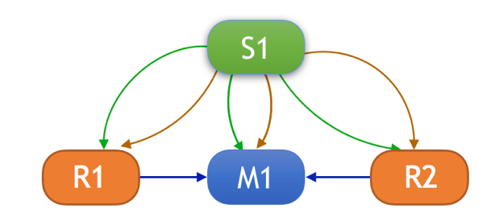
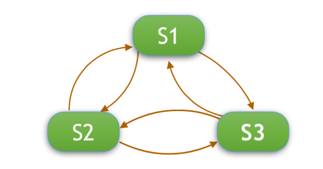

# Redis Sentinel


&emsp;这节介绍Redis的高可用解决方案：Sentinel

#### 1.介绍

&emsp;Sentinel是Redis官方推荐的高可用(HA)解决方案，当用Redis做master-slave的高可用方案时，假如master宕机了，Redis本身(包括它的很多客户端)都没有实现自动进行主备切换。

&emsp;Sentinel本身是一个运行在特殊模式下的Redis服务器，它能监控多个master-slave集群，发现master宕机后能进行自动切换。

#### 2.获取信息方式

&emsp;sentinel通过配置项中的

```
	sentinel monitor  <master name>  <master ip>  <master port>  <quorum>
```

选项来获取master节点的信息。

&emsp;在启动后sentinel会建立同master节点的命令连接和订阅连接。以便通过命令连接向主节点发送命令，通过订阅连接订阅服务器的 _sentinel_:hello 频道。

 

&emsp;sentinel每10秒会向master节点发送INFO命令，通过分析命令的返回结果能够知道主节点和从节点的信息。对于每个从节点，sentinel也会向它建立一个命令连接和订阅连接。

&emsp;sentinel每2秒通过命令连接向所监听的节点发送订阅命令，如

```
	PUBLISH _sentinel_:hello …..
```

其中的信息包括了sentinel本身的信息以及自己记录的主节点信息。同时，sentinel也会订阅_sentinel_:hello频道，所以sentinel能够以这种方式同其他的sentinel节点通信，以同步信息,见[goosip协议](http://www.cnblogs.com/xingzc/p/6165084.html)。

&emsp;当sentinel从订阅信息中发现一个新的sentinel节点时，会向该新发现的节点建立命令连接，最后监视同一主服务器的各个sentinel节点会形成互相连接的网络。



#### 3.节点失效

&emsp;配置项

```
	sentinel down-after-milliseconds <主节点名> <中断时间ms>
```

设置了sentinel主观下线的时间。sentinel每隔一秒就会向主节点发送PING命令，如果master在“中断时间”内不回应PONG 或者是回复了一个错误消息，那么这个sentinel会主观地(单方面地)认为这个master已经不可用了(SDOWN)。

&emsp;当sentinel判断主节点已经处于主观下线状态后，会向其他sentinel发送

```
 is-master-down-by-add
```

命令，以询问其他sentinel的状态，确认该主节点是否处于下线状态（主观下线或者客观下线）。当回复的下线状态的数量达到配置项中的quorum值时，则该sentinel会将主节点标记为客观下线状态（ODOWN）。

&emsp;当sentinel判断主节点处于客观下线状态后，会触发故障转移。

#### 4.故障转移

&emsp;发生故障转移时，会从监听主节点的sentinel中选举出主的sentinel来处理故障转移的过程。选举的过程类似于[Raft协议](http://www.infoq.com/cn/articles/raft-paper;http://thesecretlivesofdata.com/raft/)，由标记客观下线的sentinel节点充当candidate，向其他sentinel节点（follower）发起投票，当某个candidate从follower获得的票数超过一半后，该候选者就会成为leader。而sentinel中的epoch，配置纪元类似于Raft中的term，每次选举后都会自增。主要过程为：

1. 每个充当candidate的sentinel节点都会要求其他sentinel节点发送```is-master-down-addr```命令，将自己设置为leader。

2. 收到命令的sentinel节点，如果当前epoch和candidate传给他的epoch一样，说明他已经把自己的票投给了其他candidate。投过票给别的sentinel后，在当前epoch内自己就只能成为follower。如果该节点还没投过票，会采取先到先得的规则，将自己的票投给请求的candidate节点。

3. 收到回复的candidate节点，会检查响应的epoch值和leader_runid值是否同自身的值一致，是的话则表示获得了一票。

4. 当某个candidate节点获得半数以上的票数时，该节点便成为了leader节点。

5. 如果一定时间内没法选举出leader节点，则每个candidate节点会等待随机时间后再次发起选举，知道选出leader节点为止。

&emsp;选举出领头sentinel节点后，将由该节点处理故障转移，过程如下：

1. 在已下线主节点的所有从节点中，选出一个从节点，将其转换为主节点。

	&emsp;主sentinel会按照下面的规则选择适合的slave节点上升为master节点：

	1) 去除已下线的slave节点

	2) 去除最近五秒内没有回复过主sentinel节点INFO信息的slave节点

	3) 去除与已下线主节点连接断开超过down-after-milliseconds*10毫秒的slave节点

	4) 根据各slave节点的优先级，从小到大排序，选择优先级最小的节点。对于相同优先级的节点，选择复制偏移量最大和runid最小的节点。

	&emsp;最后向被选择出来的slave节点发送```SLAVE OF NO ONE```命令。

2. 向已下线主节点下的所有从节点发送SLAVE OF命令，改为复制新的主节点。

3. 将已下线主节点设置为新主节点的从节点。

&emsp;其中，上面步骤1)中的slave节点优先级由redis配置文件中的```slave-priority N ```选项控制。0作为一个特殊的优先级，标识这个slave不能作为master，所以一个优先级为0的slave永远不会被
哨兵挑选提升为master。

&emsp;上步骤2) 中，从节点需要同步新的主节点的信息，期间会导致从节点不可用，可以通过

```
	sentinel parallel-syncs mymaster <n>
```
来控制同时进行同步的从节点的数量。这个数字越小，完成故障转移所需的时间就越长，但是如果这个数字越大，就意味着越多的slave因为复制而不可用。

#### 5.脑裂时的数据一致性

&emsp;Redis不保证强一致性，在发生网络故障时，有可能出现脑裂。从脑裂发生到网络恢复正常，复制结束的这段时间里，异常主节点写入的数据将丢失。为了避免数据的丢失，可以对主节点增加如下配置：

```
	min-slaves-to-write 1	#执行写操作所需的最少slave服务器数量，如果数量少于设定的值，写操作将被拒绝

   	min-slaves-max-lag 10	#网络延迟的最大时间，当写操作延迟大于所设定的时间，写操作将被拒绝
```
