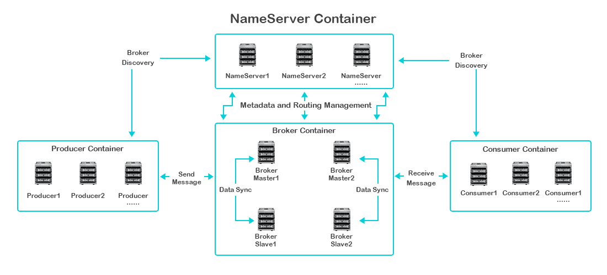
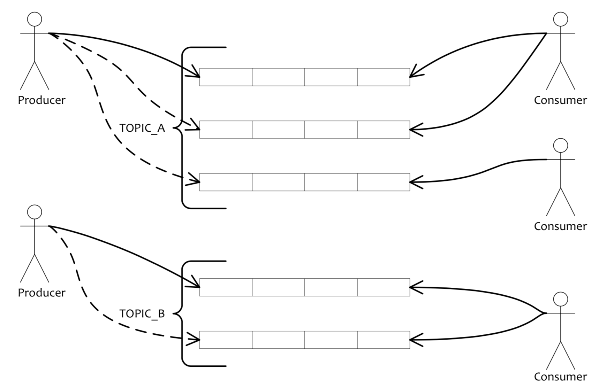
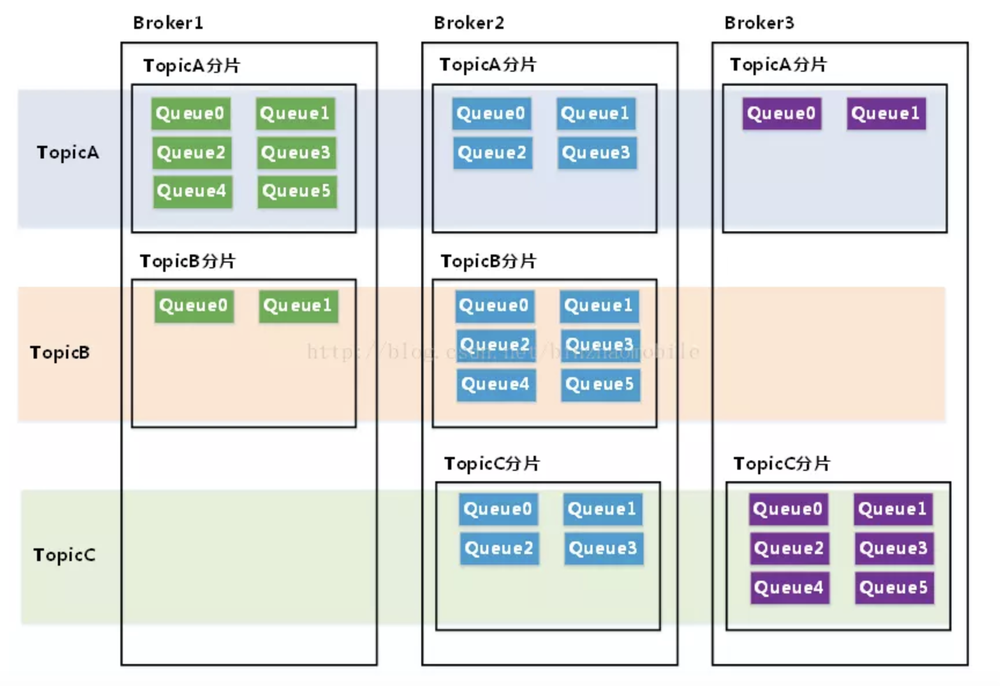

# RocketMQ介绍

&emsp;消息队列是分布式系统中重要的组件，使用消息队列主要是为了通过异步处理提高系统性能和削峰、降低系统耦合性。Apache RocketMQ是由阿里巴巴开源的可支撑万亿级数据洪峰的分布式消息和流计算平台，于2016年捐赠给Apache Software Foundation，2017年9月25日成为Apache 顶级项目。由于其高稳定性、低延时、高吞吐量等特点，被大规模应用于金融、互联网、物流公司的核心交易支付、实时位置追踪、大数据分析等场景，同时也被电力、交通、汽车、零售等十几个行业的数万家企业广泛使用，是企业数字化转型的核心基础性软件。​

&emsp;网上对RocketMQ的介绍很多，还有中文开发者网站[http://rocketmq.cloud/zh-cn/index.html](http://rocketmq.cloud/zh-cn/index.html)，大家可以自行搜索。本章结合网上的各种介绍（<b>内容均来自网上</b>），只对相关的内容、概念进行说明，为后续文章做准备。

&emsp;工作中也比较多的接触RocketMQ，之前看过RocketMQ的源码，梳理过流程，但是没有输出文档。为此，这边将以RocketMQ 4.4.0版本为例，重新整理源码中相应的流程。

#### 1. 总体架构

&emsp;如下为RocketMQ的总体架构：

这里涉及到的角色包括：

 * NameServer:NameServer是一个非常简单的Topic路由注册中心，其角色类似Dubbo中的zookeeper，支持Broker的动态注册与发现。主要包括两个功能：
  * Broker管理，NameServer接受Broker集群的注册信息并且保存下来作为路由信息的基本数据。然后提供心跳检测机制，检查Broker是否还存活
  * 路由信息管理，每个NameServer将保存关于Broker集群的整个路由信息和用于客户端查询的队列信息。然后Producer和Conumser通过NameServer就可以知道整个Broker集群的路由信息，从而进行消息的投递和消费。

 <b>NameServer通常也是集群的方式部署，各实例间相互不进行信息通讯。Broker是向每一台NameServer注册自己的路由信息，所以每一个NameServer实例上面都保存一份完整的路由信息。</b>当某个NameServer因某种原因下线了，Broker仍然可以向其它NameServer同步其路由信息，Producer,Consumer仍然可以动态感知Broker的路由的信息。

 * Broker:Broker主要负责消息的存储、投递和查询以及服务高可用保证。Broker部署相对复杂，Broker分为Master与Slave，一个Master可以对应多个Slave，但是一个Slave只能对应一个Master，Master与Slave 的对应关系通过指定相同的BrokerName，不同的BrokerId 来定义，BrokerId为0表示Master，非0表示Slave。Master也可以部署多个。每个Broker与NameServer集群中的所有节点建立长连接，定时注册Topic信息到所有NameServer。

 * Producer:消息发布的角色，支持分布式集群方式部署。

  * Producer通过MQ的负载均衡模块选择相应的Broker集群队列进行消息投递，投递的过程支持快速失败并且低延迟。
  * Producer与NameServer集群中的其中一个节点（随机选择）建立长连接，定期从NameServer获取Topic路由信息，并向提供Topic 服务的Master建立长连接，且定时向Master发送心跳。Producer完全无状态，可集群部署。

 * Producer Group:一类 Producer 的集合名称，这类 Producer 通常发送一类消息，且消费逻辑一致。

 * Consumer:消息消费的角色，支持分布式集群方式部署。支持以push推，pull拉两种模式对消息进行消费。同时也支持集群方式和广播方式的消费，它提供实时消息订阅机制，可以满足大多数用户的需求。

  * Consumer既可以从Master订阅消息，也可以从Slave订阅消息，消费者在向Master拉取消息时，Master服务器会根据拉取偏移量与最大偏移量的距离（判断是否读老消息，产生读I/O），以及从服务器是否可读等因素建议下一次是从Master还是Slave拉取。
  * Consumer与NameServer集群中的其中一个节点（随机选择）建立长连接，定期从NameServer获取Topic路由信息，并向提供Topic服务的Master、Slave建立长连接，且定时向Master、Slave发送心跳。

 * Consumer Group:一类 Consumer 的集合名称，这类 Consumer 通常消费一类消息，且消费逻辑一致。

#### 2. 工作流程

结合部署架构图，描述集群工作流程：

 * 启动NameServer，NameServer起来后监听端口，等待Broker、Producer、Consumer连上来，相当于一个路由控制中心。
 * Broker启动，跟所有的NameServer保持长连接，定时发送心跳包。心跳包中包含当前Broker信息(IP+端口等)以及存储所有Topic信息。注册成功后，NameServer集群中就有Topic跟Broker的映射关系。
 * 收发消息前，先创建Topic，创建Topic时需要指定该Topic要存储在哪些Broker上，也可以在发送消息时自动创建Topic。
 * Producer发送消息，启动时先跟NameServer集群中的其中一台建立长连接，并从NameServer中获取当前发送的Topic存在哪些Broker上，轮询从队列列表中选择一个队列，然后与队列所在的Broker建立长连接从而向Broker发消息。
 * Consumer跟Producer类似，跟其中一台NameServer建立长连接，获取当前订阅Topic存在哪些Broker上，然后直接跟Broker建立连接通道，开始消费消息。

&emsp;如下图示：

&emsp;Producer会向一些队列轮流发送消息，这些队列集合称为Topic。Consumer可以做广播消费，也可以做集群消费，如果做广播消费，则一个Consumer实例消费这个Topic对应的所有队列，如果做集群消费，则多个Consumer 实例平均消费这个Topic对应的队列集合。

&emsp;Topic是逻辑概念，对于RocketMQ，一个Topic可以分布在各个Broker上，把一个Topic分布在一个Broker上的子集定义为一个Topic分片，其实就是在某一broke上一个topic的部分数据

对应上图，TopicA有3个Topic分片，分布在Broker1,Broker2和Broker3上，TopicB有2个Topic分片，分布在Broker1和Broker2上，TopicC有2个Topic分片，分布在Broker2和Broker3上。

&emsp;将Topic分片再切分为若干等分，其中的一份就是一个Queue（队列）。每个Topic分片等分的Queue的数量可以不同，由用户在创建Topic时指定。每个Topic分片等分的Queue的数量可以不同，由用户在创建Topic时指定, 是消费负载均衡过程中资源分配的基本单元。需要指出的是，在一个Consumer Group内，Queue和Consumer之间的对应关系是一对多的关系：一个Queue最多只能分配给一个Consumer，一个Cosumer可以分配得到多个Queue。这样的分配规则，每个Queue只有一个消费者，可以避免消费过程中的多线程处理和资源锁定，有效提高各Consumer消费的并行度和处理效率。即是负载均衡过程中资源分配的基本单元，同Kafaka相同。

#### 3. 消息

&emsp;消息(Message)是系统所传输信息的物理载体，生产和消费数据的最小单位，每条消息必须属于一个Topic。RocketMQ中每个消息拥有唯一的Message ID，且可以携带具有业务标识的Key。系统提供了通过Message ID和Key查询消息的功能。

&emsp;可以为消息设置标志（Tag），用于同一Topic下区分不同类型的消息。来自同一业务单元的消息，可以根据不同业务目的在同一Topic下设置不同标签。标签能够有效地保持代码的清晰度和连贯性，并优化RocketMQ提供的查询系统。消费者可以根据Tag实现对不同子主题的不同消费逻辑，实现更好的扩展性。

&emsp;消息的消费可以分为集群消费和广播消费

 * 集群消费（Clustering）：集群消费模式下,相同Consumer Group的每个Consumer实例平均分摊消息。
 * 广播消费（Broadcasting）：广播消费模式下，相同Consumer Group的每个Consumer实例都接收全量的消息。

