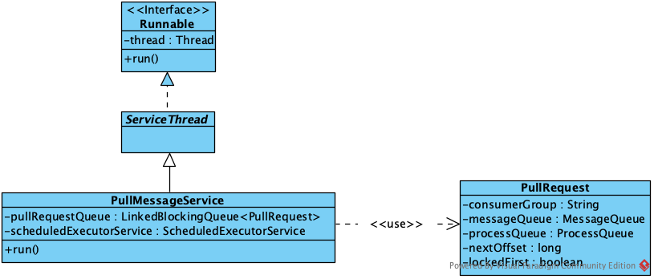

# RocketMQ客户端加载流程


&emsp;这节介绍RocketMQ客户端的启动流程，即Consumer和Producer的启动流程。

#### 1. 客户端demo

&emsp;首先先看下客户端的demo

Producer:

```
public class SyncProducer {

    public static void main (String[] args) throws Exception {
        // 实例化消息生产者Producer
        DefaultMQProducer producer = new DefaultMQProducer ("GroupTest");
        // 设置NameServer的地址
        producer.setNamesrvAddr ("localhost:9876");
        // 启动Producer实例
        producer.start ();
        for (int i = 0; i < 100; i++) {
            // 创建消息，并指定Topic，Tag和消息体
            Message msg = new Message ("TopicTest" /* Topic */,
                "TagA" /* Tag */,
                ("Hello RocketMQ " + i).getBytes (RemotingHelper.DEFAULT_CHARSET) /* Message body */
            );
            // 发送消息到一个Broker
            SendResult sendResult = producer.send (msg);
            // 通过sendResult返回消息是否成功送达
            System.out.printf ("%s%n", sendResult);
        }
        // 如果不再发送消息，关闭Producer实例。
        producer.shutdown ();
    }
}
```


Consumer:

```
public class Consumer {

    public static void main (String[] args) throws InterruptedException, MQClientException {

        // 实例化消费者
        DefaultMQPushConsumer consumer = new DefaultMQPushConsumer ("GroupTest");

        // 设置NameServer的地址
        consumer.setNamesrvAddr ("localhost:9876");

        // 订阅一个或者多个Topic，以及Tag来过滤需要消费的消息
        consumer.subscribe ("TopicTest", "*");
        // 注册回调实现类来处理从broker拉取回来的消息
        consumer.registerMessageListener (new MessageListenerConcurrently () {
            @Override
            public ConsumeConcurrentlyStatus consumeMessage (List<MessageExt> msgs, ConsumeConcurrentlyContext context) {
                System.out.printf ("%s Receive New Messages: %s %n", Thread.currentThread ().getName (), msgs);
                // 标记该消息已经被成功消费
                return ConsumeConcurrentlyStatus.CONSUME_SUCCESS;
            }
        });
        // 启动消费者实例
        consumer.start ();
        System.out.printf ("Consumer Started.%n");
    }
}
```

Producer和Consumer的启动类似，在初始化然后进行必要设置（主要是客户端所属的Group和NameServer地址）后，执行start方法启动后台监听服务，事实上Producer和Consumer都是调用同一个类MQClientInstance的start方法，下图为继承关系：


DefaultMQproducer和DefaultMQPushConsumer都继承自ClientConfig，顾名思义ClientConfig表示客户端的配置，包括NameServer地址、客户端地址、客户端实例名等。由于Producer和Consumer都需要同Broker和NameServer交互，所以配置上有很多相同，这两个将主要功能的实现都委托给了对应的Impl(DefaultMQProducerImpl和DefaultMQPushConsumerImpl)。Impl内部调用了MQClientInstance来完成客户端同远程交互的主要功能，而Producer和Consumer则封装自己相关的行为，MQClientInstance内部又委托忒了MQClientAPIImpl。

#### 2. Producer的启动

&emsp;DefaultMQProducer的启动如下：


DefaultMQProducer将start委托给了DefaultMQProducerImpl来完成，主要过程为：

 * DefaultMQProducerImpl先标记客户端当前状态为START\_FAILED（初始状态为CREATE\_JUST）
 * 调用MQClientManager的getAndCreateMQClientInstance方法获取MQClientInstance，每个客户端实例都会对应一个MQClientInstance，并由MQClientManager管理。MQClientManager内部使用一个Map维护各客户端的关系，key为clientId(格式为ip@instName,instName为pid)，value为MQClientInstance实例。当key不存在时则会初始化一个实例，在初始化时连带初始化MQClientAPIImpl、NettyRemoteClient等。
 * 调用MQClientInstance的registerProducer方法，注册当前客户端自身。实现上是客户端放入client实例缓存中，定时器定时上报，后面会说。
 * 调用MQClientInstance的start方法，启动客户端的后台任务，该方法是重点，后面会介绍。
 * 标记客户端当前状态为RUNNING
 * 调用MQClientInstance的sendHeartbeatToAllBrokerWithLock方法，向所有Broker上报心跳

#### 3. Consumer的启动

&emsp;DefaultMQPushConsumer的启动如下：


DefaultMQPushConsumer同样将start委托给了DefaultMQPushConsumerImpl来完成，流程上也相识。但相比DefaultMQProducer多了很多其他组件来辅助消费过程，如rebalance、offset管理等，主要过程为：

 * DefaultMQPushConsumerImpl先标记客户端当前状态为START\_FAILED（初始状态为CREATE\_JUST）
 * 同步设置RebalanceImpl的topic(Map\<String,String> / \<topic,sub expression>)信息
 * 同DefaultMQProducer一致，调用MQClientManager的getAndCreateMQClientInstance方法获取MQClientInstance，每个客户端实例都会对应一个MQClientInstance，并由MQClientManager管理。MQClientManager内部使用一个Map维护各客户端的关系，key为clientId(格式为ip@instName)，value为MQClientInstance实例。当key不存在时则会初始化一个实例，在初始化时连带初始化MQClientAPIImpl、NettyRemoteClient等。这里需要说明的是，RocketMQ中Consumer的消费模式分为CLUSTERING和BROADCASTING，即集群消费和广播消费。区别在于集群消费时，一条消息只会被一个实例消费，即各实例会平分所有的消息；而广播消费时所有实例都会收到同一条消息。体校在clientId的是，集群模式下instName为pid，而广播模式instName为DEFAULT。
 * 设置RebalanceImpl属性，包括所在Group、消费模式、消息分配策略(平均分配q的策略)
 * 初始化PlullAPIWrapper,设置消息过滤器钩子列表
 * 初始化OffsetStore，设置offset的存储模式，广播模式使用本地存储；集群模式使用远程存储
 * 初始化ConsumeMessageService，根据监听器类型设定消息消费模式(顺序消费/并行消费)，pull模式需要自己指定offset，push不需要设定。
 * 启动ConsumeMessageService
 * 同DefaultMQProducer一致，调用MQClientInstance的registerProducer方法，注册当前客户端自身。实现上是客户端放入client实例缓存中，定时器定时上报，后面会说。
 * 调用MQClientInstance的start方法，启动客户端的后台任务，该方法是重点，后面会介绍。
 * 标记客户端当前状态为RUNNING
 * 判断监听信息是否发生改变，从namesrv更新topic的路由信息
 * 调用MQClientInstance的checkClientInBroker方法，确认该实例已经在broker注册成功，否则抛异常
 * 调用MQClientInstance的sendHeartbeatToAllBrokerWithLock方法，向所有Broker上报心跳
 * 调用MQClientInstance的rebalanceImmediately方法，触发一次rebalance

&emsp;DefaultMQPushConsumer为推模式，RocketMQ还提供了拉模式来消费消息，实现类为DefaultMQPullConsumer，启动过程类似，推模式是用拉模式来实现的，重点实现都在MQClientInstace中。

#### 4. MQClientInstance

&emsp;MQClientInstance为一个门户类，组合了各功能，如下，包括Rebalance、消费数据统计、生产消息、消费消息等,这些都有对应的实现。


&emsp;上面说过，Producer和Consumer在启动的时候，都会在内部先初始化一个MQClientInstance对象，然后调用其start方法启动对应的后台程序，如下：


MQClientInstance的start方法除了调用自身进行准备工作外，也调用了其他组件的start方法开始它们的准备工作，主要流程为：

 1. 先标记客户端当前状态为START\_FAILED（初始状态为CREATE\_JUST）
 * 若没有指定nameserver地址，则调用MQClientAPIImpl同步获取一次（通过设置的Http endpoint同步）
 * 调用MQClientAPIImpl的start方法，主要是初始化Netty客户端，启动netty client初始化任务，连接的建立发生在第一次请求时
 * 开启MQClientInstance的定时任务，包括：
	 1. 如果没有指定nameserver地址，每两分钟从配置的endpoint处同步nameserver地址
	 - 定时从namesrv同步topic路由信息
	 - 定时清除下线的broker信息;发送心跳
	 - 定时持久化消费者消费的offset信息
	 - 每1分钟调整线程池的大小
 * 调用PullMessageService的start方法，启动拉取消息线程
 * 调用RebalanceService的start方法，启动rebalance线程
 * 调用内部Producer(CLIENT\_INNER_PRODUCER)的start方法
 * 标记客户端当前状态为RUNNING

下面详细介绍下各个过程。

##### 4.2. MQClientAPIImpl.fetchNameServerAddr

&emsp;该方法用于更新NameServer地址，该方法会从http://xxx:port/rocketmq/yyy，默认8080端口(如果xxx中没有:，即不带端口时)中获取NameServer地址(xxx为域名，由系统配置项rocketmq.namesrv.domain控制，默认为jmenv.tbsite.net；yyy为访问路径，由系统配置项rocketmq.namesrv.domain.subgroup控制，默认为nsaddr)。该地址要求返回结果为一个ip列表，以;隔开，如果获取回来的地址跟现有的地址不一致则会更新缓存的NameServer地址列表。解析出来的地址列表用于根据NettyRemotingClient内部持有的变量：

```
private final AtomicReference<List<String>> namesrvAddrList = new AtomicReference<List<String>>();
```

##### 4.3. MQClientAPIImpl.start

&emsp;该方法在内部调用了NettyRemotingClient的start方法，用于初始化Netty客户端。NettyRemotingClient是基于Netty实现的tcp协议客户端，主要流程为：

 *	初始化客户端bootstrap连接池
 *	设置处理链：编码、解码、空闲处理、连接管理(服务端)、请求分发
 *	每3秒清除超时的请求（netty主线程不处理逻辑）
 *	启动客户端的事件处理器，处理IDLE、CLOSE、CONNECT、EXCEPTION事件

关于NettyRemotingClient后面会专门进行讲解，这里只介绍在客户端启动时其做了哪些动作。

##### 4.4.2. MQClientInstance.updateTopicRouteInfoFromNameServer

&emsp;该方法用于根据客户端实例关注的所有topic的路由信息，包括客户端监听的topic以及producer生产的topic。首先会遍历从MQClientInstance内部的consumerTable和consumerTable的客户端实例，拿到所有的topic信息，然后挨个更新topic的路由。

&emsp;同步topic路由时，会通过NettyRemotingClient选择一个NameServer获取topic路由信息，然后判断topic信息是否发生了更改，主要比较topic所对应的Queue和Broker是否发生了更改。若路由信息发生了更改则会同步topic所在的broker地址列表，即内部的brokerAddrTable属性；接着同步produer关注的topic路由信息，即producerTable属性；接着同步consumer订阅的topic路由信息，即consumerTable属性；最后更新本地topic信息，即topicRouteTable属性。

##### 4.4.3. MQClientInstance.sendHeartbeatToAllBrokerWithLock

&emsp;该方法会遍历MQClient所持有的各个producer和consumer，将客户端信息构造为HeartbeatData对象，然后调用MQClientAPIImpl的sendHearbeat方法，向所有的broker上报心跳数据。心跳内容包括：

 * Consumer:所有Consumer的Group、消费类型、消息模式、消费起始offset、订阅消息的筛选类型等
 * Producer:所有Producer的group

##### 4.4.4. MQClientInstance.persistAllConsumerOffset

&emsp;该方法会遍历consumerTable里的所有MQConsumer对象，获取每个队列处理的MessageQueue，然后调用OffsetStore持久化所有的MessageQueue。OffsetStore后面会专门进行讲解。

##### 4.4.5. MQClientInstance.adjustThreadPool

&emsp;该方法主要是动态调整DefaultMQPushConsumerImpl(推模式)客户端消费线程池的大小。前面说过推模式是通过包装拉模式来实现的，内部都依赖PullAPIWrapper。实现上推模式多了一个ConsumeMessageService定时使用拉模式消费消息，该实现需要一个线程池，adjustThreadPool就是动态调整该线程池的大小。关于客户端消费消息的过程，后面也会专门进行讲解。

##### 4.5. PullMessageService.start

&emsp;PullMessageService用于封装拉模式以实现推模式。它会循环从内部的LinkedBlockingQueue\<PullRequest>中拿出PullRequest对象(消费q消息封装的对象)，选取一个可用的客户端实例DefaultMQPushConsumerImpl，调用其pullMessage方法.该方法会判断消费进度，决定是立即消费还是延迟消费，如果是延迟消费则再放回LinkedBlockingQueue中等待消费;如果是直接消费，则调用PullMessageService(拉模式)的executePullRequestImmediately消费消息.

&emsp;PullMessageService的基础关系如下：



PullMessageService.start内部主要是启动线程，该线程会循环执行执行任务，具体实现会在后续介绍消息消费的时候提及。

##### 4.6. RebalanceService.start

&emsp;该方法用于启动rebalance任务。RebalanceService同PullMessageService相同，都继承自ServiceThread类，，并实现了run方法。RebalanceService在run方法中等待一定时间(默认20S,可以通过rocketmq.client.rebalance.waitInterval配置具体时间)后会调用MQClientInstance.doRebalance执行具体的动作。具体实现会在后续介绍rebalance实现的时候提及。

##### 4.7. DefaultMQPushConsumerImpl.start

&emsp;在上面```2.```时有提及该流程，这里的DefaultMQPushConsumerImpl对象是Group为```CLIENT_INNER_PRODUCER```的内部对象。

&emsp;客户端的启动过程就如上面介绍，下面附上该部分当时源码阅读过程做的笔记简图，该图描述了客户端启动过程的大致过程：

