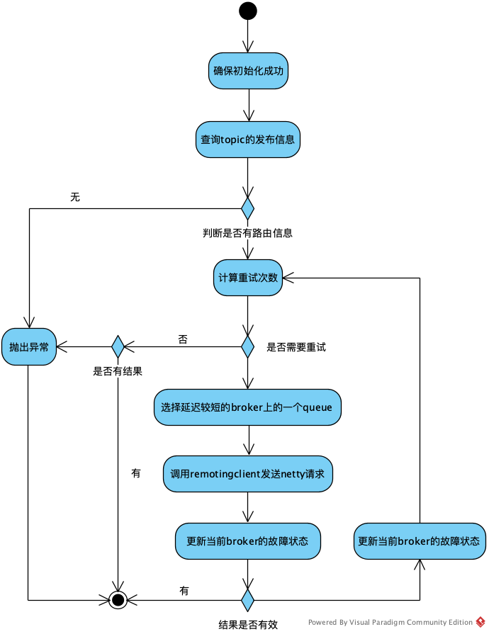
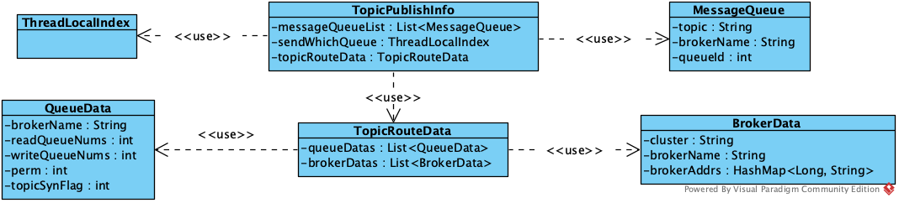
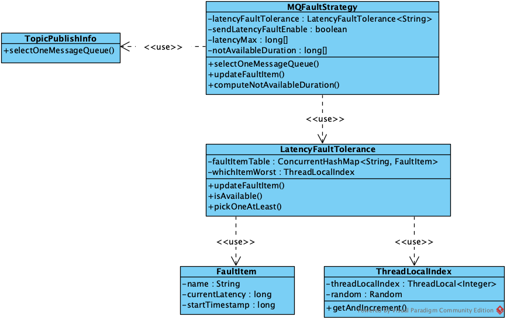
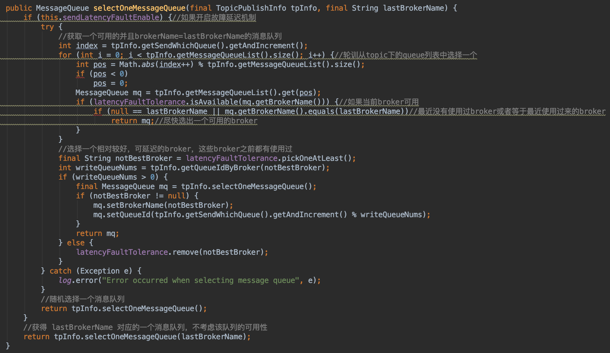
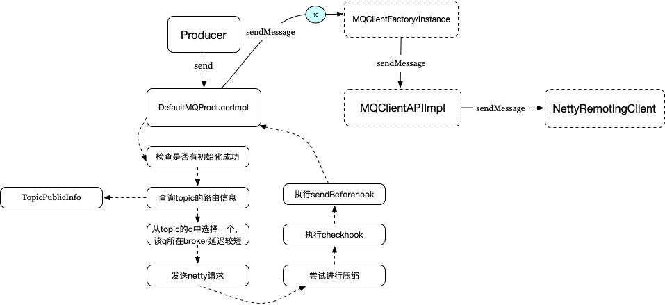

# RocketMQ Producer发送消息流程


&emsp;这节介绍Producer发送消息的流程。

&emsp;接上一节开头的Demo，发送消息的写法如下：

```
public class SyncProducer {

    public static void main (String[] args) throws Exception {
        // 实例化消息生产者Producer
        DefaultMQProducer producer = new DefaultMQProducer ("GroupTest");
        // 设置NameServer的地址
        producer.setNamesrvAddr ("localhost:9876");
        // 启动Producer实例
        producer.start ();
        for (int i = 0; i < 100; i++) {
            // 创建消息，并指定Topic，Tag和消息体
            Message msg = new Message ("TopicTest" /* Topic */,
                "TagA" /* Tag */,
                ("Hello RocketMQ " + i).getBytes (RemotingHelper.DEFAULT_CHARSET) /* Message body */
            );
            // 发送消息到一个Broker
            SendResult sendResult = producer.send (msg);
            // 通过sendResult返回消息是否成功送达
            System.out.printf ("%s%n", sendResult);
        }
        // 如果不再发送消息，关闭Producer实例。
        producer.shutdown ();
    }
}
```

发送消息的方法为：

```
SendResult sendResult = producer.send (msg);
```

其send方法内容如下：

```
public SendResult send(
    Message msg) throws MQClientException, RemotingException, MQBrokerException, InterruptedException {
    return this.defaultMQProducerImpl.send(msg);
}
```

主要调用了DefaulMQProducerImpl，委托给了DefaultMQProducerImpl的send方法。而DefaultMQProducerImpl又调用了自身的sendDefaultImpl，该方法完成了发送的主要动作。sendDefaultImpl的定义如下：

```
private SendResult sendDefaultImpl(
        Message msg,
        final CommunicationMode communicationMode,
        final SendCallback sendCallback,
        final long timeout
    ) throws MQClientException, RemotingException, MQBrokerException, InterruptedException {}
```

参数包括：

 * Message:消息内容
 * CommunicationMode:通讯模式，包括同步、异步、单步
 * SendCallback:异步模式下的回调接口，包括成功和异常通知
 * timeout:超时时间

如下为SendDefaultImpl的主要执行过程：



(1) 确保客户端已经初始化成功

&emsp;主要确保DefaultMQProducerImpl的状态为RUNNING

(2) 查询topic的发布信息

&emsp;从内部维护的ConcurrentMap\<String/* topic */, TopicPublishInfo>中获取topic对应的发布信息，上一节介绍过，该信息会通过后台线程定时更新，如果当前没有topic对应的信息，则会立即调用updateTopicRouteInfoFromNameServer方法实时同步。

&emsp;TopicPlushInfo用于表示Topic的路由信息，第一节介绍RocketMQ时说过，Topic的数据分布在多个Broker上，同时在一个broker上还会分为若干个Queue以增加并行度。



上图的关系图中，TopicPlushInfo持有一个MessageQueue列表和一个TopicRouteData。MessageQueue表示了各个Queue的映射信息，即上面提到的各个Broker上的Queue。而TopicRouteData则用于描述Broker的位置信息和Queue的配置信息。

(3) 判断是否有路由信息

&emsp;如果上一步没有查询到topic对应的发布信息，则抛出异常结束，否则转到(4)

(4) 计算重试次数

&emsp;根据通讯模式计算重试次数

```
int timesTotal = communicationMode == CommunicationMode.SYNC ? 1 + this.defaultMQProducer.getRetryTimesWhenSendFailed() : 1;
```

即如果是同步模式，则在失败时会再重试配置的次数(默认为2次)，其他情况不进行重试。

(5) 判断当前是否需要重试

&emsp;即判断当前执行次数是否已经超过重试次数，如果已经超过，则说明重试次数用完，没法继续尝试，判断当前是否有结果，如果有结果则返回，否则抛出异常结束。如果重试次数没用完，则转到(6)

(6) 选取一个延迟较短的broker

&emsp;选取一个延迟较短的broker,该功能由MQFaultStrategy提供。这里先介绍MQFaultStrategy，其提供了可选的故障延迟机制，对于请求响应较慢的broker，可以在一段时间内将其状态置为不可用。如下图：



可以通过MQFaultStrategy的sendLatencyFaultEnable属性控制是否打开故障延迟机制开关，默认为false不打开。在打开该开关时，则每次选取topic下对应的queue时，会基于之前执行的耗时，在有存在符合条件的broker的前提下，优选选取一个延迟较短的broker，否则再考虑随机选取。

&emsp;LatencyFaultTolerance用于维护有“故障”broker的“可用”状态。对于每一个被定义为“故障”的broker，LatencyFaultTolerance内部都会有一个对应的FaultItem来表示，其主要内容如下：

```
class FaultItem implements Comparable<FaultItem> {
    private final String name;//brokername
    private volatile long currentLatency;//最近发生延迟的时间点
    private volatile long startTimestamp;//下一次开始可用的时间点

    public FaultItem(final String name) {
        this.name = name;
    }

    public boolean isAvailable() {//判断当前时间是否已经过了设置的开始可用时间点
        return (System.currentTimeMillis() - startTimestamp) >= 0;
    }

}

```

即当一个broker发送故障时，会记录其最近发生延迟的时间点和下一次开始可用的时间点，而一个broker“可用”的意思是指：该broker不存在LatencyFaultTolerance维护的faultItemTable属性中，或者当前时间已经大于该broker下一次开始可用的时间点。

&emsp;LatencyFaultTolerance通过updateFaultItem方法更新“故障”broker的可用状态，该方法会直接更新faultItemTable中broker对应FaultItem的最近延迟时间和最近开始可用时间点。该方法需要给定指定broker的不可用时间。而判断一个broker是否有故障以及不可用时间的方法，则在MQFaultStrategy的computNotAvaliableDuration方法中,如下：

```
private long computeNotAvailableDuration(final long currentLatency) {
    for (int i = latencyMax.length - 1; i >= 0; i--) {
        if (currentLatency >= latencyMax[i])
            return this.notAvailableDuration[i];
    }

    return 0;
}
```

其中延迟级别数组latencyMax和不可用时长数组notAvailableDuration的定义如下：

```
private long[] latencyMax = {50L, 100L, 550L, 1000L, 2000L, 3000L, 15000L};

private long[] notAvailableDuration = {0L, 0L, 30000L, 60000L, 120000L, 180000L, 600000L};
```

即如果当前请求的“延迟时间”超过latencyMax的某个级别，则认为该broker已经是“故障”状态，会从notAvailableDuration中选择该broke对应的不可用时间。从这两组数组的定义也可以看出来，当延迟时间小于50ms则认为该broker状态正常，不用进行故障延迟处理。而“延迟时间”则是指：调用remotingclient发送netty请求这一步的耗时，会在后面进行说明。

&emsp;现在回过头来看当前步骤的动作，MQFaultStrategy的selectOneMessageQueue方法用于选取指定topic下的queue，其内容如下：



上面selectOneMessageQueue方法已经添加了注释，在开启了故障延迟机制时，该方法首先从topic下可选的queue列表中轮训选择一个broker“可用”的，并且brokerName=lastBrokerName(lastBrokerName表示上次使用过的broker，可以为空，表示第一次选择)上的queue。如果没有符合要求的broker，则会选择一个“相对好”的broker上的queue，最后才会从该topic下可选的列表中随机选择一个queue。如果没有开启故障延迟机制，则会直接从该topic下最近使用过的broker上的可选queue列表中随机选择一个queue。

(7)调用remotingclient发送netty请求

&emsp;使用MQClientAPIImpl发送消息(内部使用RemotingClient)，发送模式包括单步、异步、同步。步骤为：

 1. 从缓存中获取broker的ip和端口，如果缓存中没有该broker的信息则从nameserver同步一次到缓存，再从缓存中获取信息
 * 包装一个发送的上下文对象SendMessageContext
 * 如果不是批量消息，则设置唯一的ID，ID值为:应用启动到当前的时间差+当前消息计数
 * 尝试压缩消息体，目前，批量消息不压缩；单条消息，超过配置的长度会进行压缩，使用Deflater算法。因为上层会在该步骤失败时进行重试，因而改不在最后会使用finally将压缩后的消息体重新设置为未压缩前的内容
 * 如果存在CheckForbiddenHook，则执行
 * 如果存在sendHook，则执行发送前回调动作executeSendMessageHookBefore
 * 包装请求头SendMessageRequestHeader
 * 使用MQClientAPIImpl的sendMessage方法发送消息，得到SendResult结果
 * 如果存在sendHook，则执行发送后回调动作executeSendMessageHookAfter，当抛出异常也会执行发送后回调动作executeSendMessageHookAfter
 * 发送完后将消息体设置回原值(还原Message被压缩过的body值),为重试做准备
 * 返回SendResult

(8) 更新broker的故障状态

&emsp;(7)调用remotingclient执行完请求后，可以得到该步的耗时，再根据(6)指出的，如果打开了故障延迟开关，会根据该耗时来确定该broker是否有故障，然后让其“不可用”一段时间，具体可看(6)的内容。

(9) 判断结果是否有有效

&emsp;判断该次请求是否有效，有效包括：执行过程无异常，(7)正确返回结果，如果无效，则会执行(8)更新broker的故障状态，然后跳到(5)进行重试

&emsp;以上就是Producer发送消息的主要流程，其中涉及到很多缓存数据很多都是上一节客户端启动过程中讲过的后台任务同步的.下面附上该部分当时源码阅读过程做的笔记简图，该图描述了Producer发送消息的大致过程：


