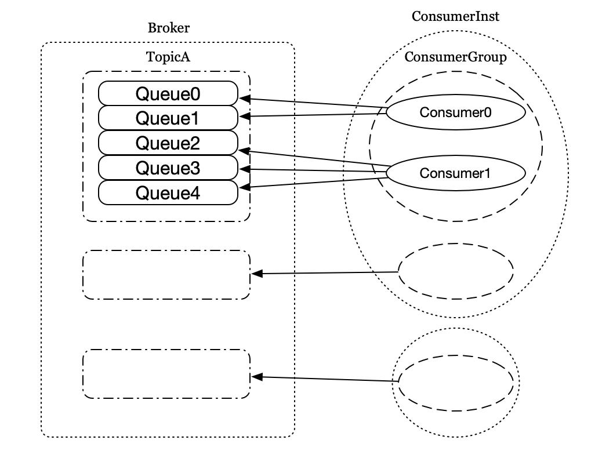
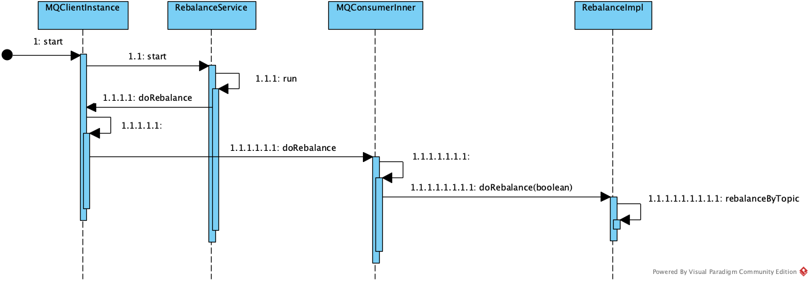
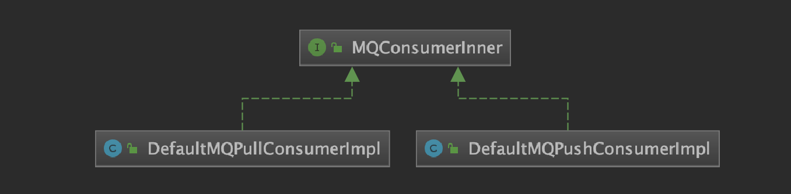
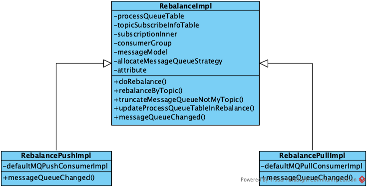
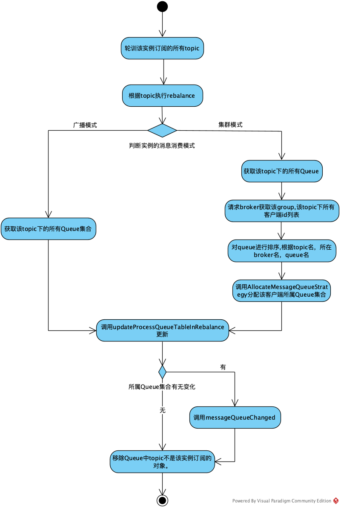
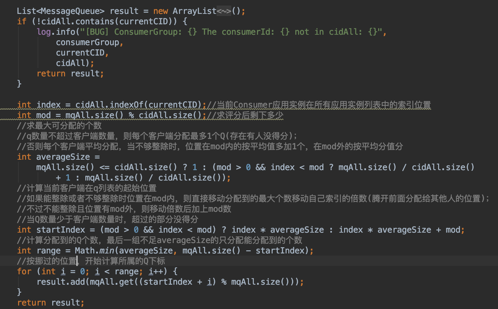
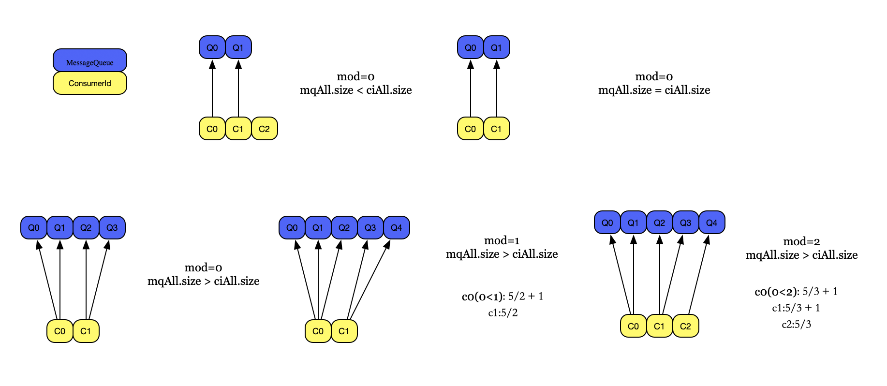
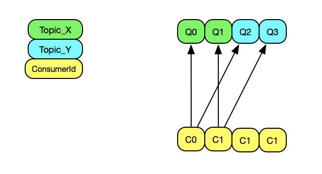
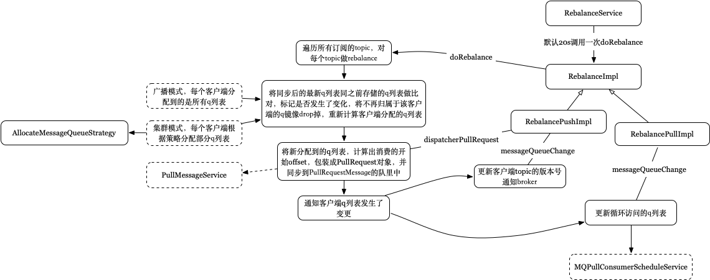

# RocketMQ RocketMQ Rebalance流程分析


&emsp;这节介绍Rebalance流程。在介绍Consumer消费消息流程前，先介绍Rebalance得流程，该过程涉及到Consumer的启动。

&emsp;之前介绍过，Topic是一个逻辑概念，Topic下可以划分多个Queue以增加Consumer消费的并行度。在一个Consumer Group内，Queue和Consumer之间的对应关系是一对多的关系：一个Queue最多只能分配给一个Consumer，一个Cosumer可以分配得到多个Queue，如下图



而Rebalance是一种协议，规定了一个 Consumer Group 下的所有 consumer如何达成一致来分配Queue。当Consumer订阅的Topic发生变化，或者Consumer Group内的Consumer实例发送变化时便会触发Rebalance以重新分配每个实例对应的Queue。

#### 1.RebalanceService

&emsp;前面介绍客户端启动流程时提到，MQClientInstance在start方法中会启动一系列后台任务，其中就包括Rebalance任务，主要调用了RebalanceService的start方法。RebalanceService继承自ServiceThread，start方法会启动一个后台线程，确保每隔一段时间（默认20秒）会调用一次MQClientInstance的doRebalance方法。如下图：



MQClientInstance.doRebalance会调用MQConsumerInner.doRebalance。MQConsumerInner是DefaultMQPullConsumerImpl和DefaultMQPushConsumerImp的父接口，如下，即MQClientInstance将doRebalance方法交给了Consumer实例处理。



接着Consumer实例会调用内部RebalnaceImpl的doRebalance方法完成真正的，动作。

&emsp;这里提一点，RebalanceService被MQClientInstane持有，一个MQClientInstance只有一个Rebalance实例，之前在讲客户端启动时提到，MQClientInstance由MQClientManager管理，跟本机ip,进程pid有关。RebalanceImpl跟Consumer实例相关，一个Consumer实例对应一个RebalanceImpl对象。

#### 2.RebalanceImpl

&emsp;先介绍该类的基本情况

1.属性

```
protected final ConcurrentMapConcurrentMap</*Queue*/MessageQueue, /*Queue消费进度镜像*/ProcessQueue> processQueueTable = new ConcurrentHashMap<MessageQueue, ProcessQueue>(64);

//DefaultMQXxxxConsumerImpl updateTopicSubscribeInfo时添加
protected final ConcurrentMap<String/* topic */, Set<MessageQueue>> topicSubscribeInfoTable = new ConcurrentHashMap<String, Set<MessageQueue>>();

//DefaultMQXxxxConsumerImpl subscript时会添加
protected final ConcurrentMap<String /* topic */, /*消息的过滤条件*/SubscriptionData> subscriptionInner = new ConcurrentHashMap<String, SubscriptionData>();

protected String consumerGroup;//Consumer实例所在的ConsumerGroup

protected MessageModel messageModel;//消息消费模式

protected AllocateMessageQueueStrategy allocateMessageQueueStrategy;//Queue分配策略，默认为AllocateMessageQueueAveragely
```

2.继承关系



&emsp;接第一Part的内容，会调用该类的doRebalce方法，主要逻辑如下：



(1) 轮训该实例订阅的所有topic，通过遍历subscriptionInner的值来获取topic信息，该属性内容会在客户端实例调用subscript时增加

(2) 根据topic调用rebalanceByTopic执行rebalance

(3)如果是广播模式，则从topicSubscribeInfoTable获取该topic下的所有Queue，用于后续更新。即广播模式，每个客户端都能收到topic下的所有q,为客户端分配的Queue集合为全量的集合。

(4)如果是集群模式，会获取topic下的所有Queue；从broker获取该topic下所有客户端id列表；排序后调用AllocateMessageAueueStrateg获得ConsumerGroup下该客户端应该分配到的Queue集合。即集群模式，每个客户端分到的q列表由AllocateMessageQueueStrategy来分配。

(5) 获取该客户端所属的Queue集合后，调用updateProcessQueueTableInRebalance更新。

(6) 执行完后，如果有发生变化，则调用messageQueueChanged交给子类具体处理。

(7) 调用truncateMessageQueueNotMyTopic移除缓存中不是该实例处理的Queue。

##### 2.1. 从broker查找该topic对应的客户端id列表

&emsp;从MQClientInstance的缓存中获取该topic对应的broker地址，然后调用Netty直接访问broker获取结果

##### 2.2. 分配客户端实例所属Queue集合

&emsp;前面说过，广播模式每个客户端实例分配到全量的Queue集合，这里主要介绍集群模式下AllocateMessageQueueStrategy的处理情况。默认为平均分配，实现类为AllocateMessageQueueAveragely。

&emsp;先看AllocateMessageQueueStrategy的定义

```
List<MessageQueue> allocate(
        final String consumerGroup,//当前Consumer实例所属ConsumerGroup
        final String currentCID,//当前客户端应用ID
        final List<MessageQueue> mqAll,//待分配的Queue列表
        final List<String> cidAll //该topic，该ConsumerGroup下的所有客户端应用ID列表
    );
```

该方法会选出currentCID所属的Queue列表。AllocateMessageQueueAveragely则是按照currentCID所属的位置进行平均分配，过程如下：



上面在源码里加上了对应的注释。前面提到传进来的mqAll和cidAll都是排过序的，该过程就是按照客户端序号，从所有Queue列表中平均分配自己所属的Queue，涉及到的各种可能如下：



大概过程就是：能整除，则平均分；不能整除，则cid在mod数内的则多分1个Queue，在mod数外的则少分一个。

&emsp;前面说过，该分配策略执行时，会将topic下的Queue列表和客户端进行排序，在分配时便会导致排在前面的客户端能分到Queue，且分的Queue会多点。考虑一种情况，如果一个ConsumerGroup订阅了2个topic，Topic\_X和Topic\_Y,每个topic都有2个Queue，同时该ConsumerGroup下有4个客户端实例，因为Rebalance是根据topic来的，所以不会出现4个Queue被平均消费的情况，结果如下如下：



因而在初始化时，最好保证ConsumerGroup下的客户端数量<=Topic下的Queue数量。

##### 2.3. updateProcessQueueTableInRebalance

&emsp;该方法的定义如下：

```
    /**
     * @param topic topic
     * @param mqSet Rebalance后该客户端实例，该topic下的所有现有分配到的q集合
     * @param isOrder 是否为顺序消费
     * @return
     */
    private boolean updateProcessQueueTableInRebalance(final String topic, final Set<MessageQueue> mqSet,final boolean isOrder) {}
```

前面提到，RebalanceImpl只有一个processQueueTable属性，该属性维护了当前客户端真在处理的所有Queue，以及Queue对应的消费进度，updateProcessQueueTableInRebalance则会更新该属性。

1 找出rebalance后不属于当前客户端实例的Queue或者已经过期的Queue,标记为drop，并由子类判断是否是否需要移除，如果需要移除，则该客户端实例所属的Queue便有改变。

2 判断Rebalance后分配的Queue是否有新增的Queue，如果有则移除缓存中该Queue的消费偏移量（保底操作），计算该Queue的消费偏移量，然后构造一个PullRequest对象存到列表里，标记Rebalane后处理的Queue有改变

3 分发rebalance后新增的Queue列表，即PullRequest列表，由具体的子类处理。pull模式不处理，push模式，则会放到PullMessageService中，循环处理，具体在RebalancePushImpl的dispatchPullRequest方法中

```
@Override
    public void dispatchPullRequest(List<PullRequest> pullRequestList) {
        for (PullRequest pullRequest : pullRequestList) {
            this.defaultMQPushConsumerImpl.executePullRequestImmediately(pullRequest);
            log.info("doRebalance, {}, add a new pull request {}", consumerGroup, pullRequest);
        }
    }
```

这一步中，会调回DefaultMQPushConsumerImpl的executePullRequestImmediately方法，往里面加PullRequest对象，以触发整个Push模式的执行，具体过程会在下节介绍<1>。

##### 2.4. messageQueueChanged

&emsp;Rebalance后如果处理的Queue列表发生了变更，则执行相应的动作。对于Push模式，会更新客户端订阅topic的版本号（以当前时间时间戳）并通知broker；对于Pull模式，会回调DefaultMQPullConsumerImpl的MessageQueueListener有Queue发生改变。在MQPullConsumerScheduleService中会用到，用于Pull模式定时消费消息<2>。

##### 2.5. truncateMessageQueueNotMyTopic

&emsp;移除Queue中topic不是该实例订阅的对象。

&emsp;上面介绍的<1>,<2>点可以用于触发Consumer自动/定时拉取消息，具体会在下节客户端消费过程时介绍。

#### 3. Broker端通知Rebalance

&emsp;上面提到的Rebalance是客户端自己定时(默认20秒)执行的，还存在一种Broker端主动通知的情况。

&emsp;Broker有一个ConsumerManager，当客户端实例发生变更时(上下线)会通知到各个客户端，客户端收到通知后会调用MQClientInstance的rebalanceImmediately直接执行rebalance。该方法会唤醒ServiceThread，使的RebalanceService不再等待，直接执行。

&emsp;RocketMQ与Kafka Rebalance机制类似，二者Rebalance分配都是在客户端进行，不同的是：

1. Kafka：会在消费者组的多个消费者实例中，选出一个作为Group Leader，由这个Group Leader来进行分区分配，分配结果通过Cordinator(特殊角色的broker)同步给其他消费者。相当于Kafka的分区分配只有一个大脑，就是Group Leader。
2. RocketMQ：每个消费者，自己负责给自己分配队列，相当于每个消费者都是一个大脑。

#### 4. Rebalance的潜在危害

1. 消费暂停：考虑在只有Consumer 1的情况下，其负责消费所有5个队列；在新增Consumer 2，触发Rebalance时，需要分配2个队列给其消费。那么Consumer 1就需要停止这2个队列的消费，等到这两个队列分配给Consumer 2后，这两个队列才能继续被消费。
* 重复消费：Consumer 2 在消费分配给自己的2个队列时，必须接着从Consumer 1之前已经消费到的offset继续开始消费。然而默认情况下，offset是异步提交的，如consumer 1当前消费到offset为10，但是异步提交给broker的offset为8；那么如果consumer 2从8的offset开始消费，那么就会有2条消息重复。也就是说，Consumer 2 并不会等待Consumer1提交完offset后，再进行Rebalance，因此提交间隔越长，可能造成的重复消费就越多。
* 消费突刺：由于rebalance可能导致重复消费，如果需要重复消费的消息过多；或者因为rebalance暂停时间过长，导致积压了部分消息。那么都有可能导致在rebalance结束之后瞬间可能需要消费很多消息。

附上该部分当时源码阅读过程做的笔记简图：


