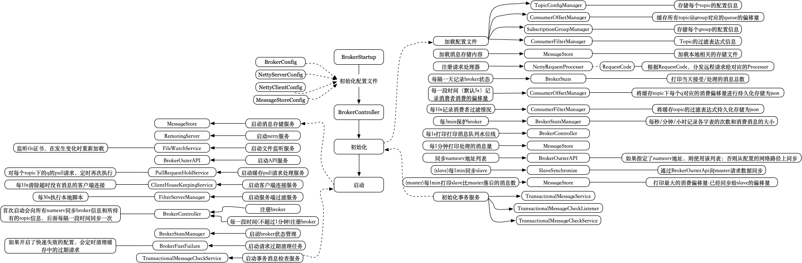

# RocketMQ的心脏:Broker


# RocketMQ的心脏:Broker

这节介绍下RocketMQ中最后的一个部分，也是内容较多的一部分：Broker。

Broker的启动同其他几个组件一样，从XXXStartup(BrokerStartup)类的main方法开始，首先加载对应的配置文件XXXConfig(BrokerConfig、NettyServerConfig、NettyClientConfig、MessageStoreConfig)，然后实例化XXXController(BrokerController)，接着调用Controller的initialize方法，最后注册ShutdownHook。

Broker在构造方法中，会进行如下的实例化动作：


包括：

1. 配置类：BrokerConfig、NettyServerConfig、NettyClientConfig、MessageStoreConfig
2. 管理类：ConsumerOffsetManager(偏移量管理)、TopicConfigManager(topic配置管理)、ConsumerManager(消费者管理)、ConsumerFilterManager(消费者过滤管理)、ProducerManager(生产者管理)、SubscriptionGroupManager(订阅组管理)、FilterServerManager(服务端过滤管理)、BrokerStatsManager(broker状态管理)
3. 服务类：PullMessageProcessor(拉取消息处理器)、PullRequestHoldService(拉取请求缓存服务)、ClientHousekeepingService(客户端长连接服务)、SlaveSynchronize(slave同步)
4. 监听类：NotifyMessageArrivingListener(通知消息到达监听器)、DefaultConsumerIdsChangeListener(客户端id改变监听器)
5. 工具类：Broker2Client、BrokerOuterAPI
6. 线程队列类：发送线程、拉取线程、查询线程、客户端管理线程、消费者管理线程、心跳线程、事务线程

Broker的初始化和启动过程如下：



初始化的步骤为：

1. 加载配置文件,由TopicConfigManager处理:存储每个topic的配置信息；ConsumerOffsetManager:缓存所有topic@group对应的queue的偏移量；SubscriptionGroupManager:存储每个group的配置信息；ConsumerFilterManager:Topic的过滤表达式信息
2. 加载消息存储内容,由MessageStore处理
3. 注册请求处理器，由NettyRequestProcesser处理，根据RequestCode，分发远程请求给对应的Processer，包括SendMessageProcessor、QueryMessageProcessor、ClientManageProcessor、ConsumerManageProcessor、AdminBrokerProcessor
4. 每隔一天记录broker状态，BrokerStats会打印当天接受/处理的消息总数
5. 每一段时间（默认5s）记录消费者消费的偏移量，ConsumerOffsetManager会将缓存topic下每个q对应的消费偏移量进行持久化存储为json
6. 每10s记录消费者过滤情况，ConsumerFilterManager会将缓存topic的过滤表达式持久化存储为json
7. 每3min“保护”broker，BrokerStatsManager会每秒/分钟/小时记录各字表的次数和消费消息的大小，如果记录的客户端消费失败字节数大于配置的参数，会将该topic设置为不可消费
8. 每1s打印打印消息队列水位线，包括发送Queue数量、拉取Queue数量、查询Queue数量
9. 每1分钟打印处理的消息量
10. 同步namesrv地址列表，由BrokerOutterAPI处理，如果指定了namesrv地址，则使用该列表；否则从配置的网络路径上同步
11. (slave)每1min同步slave，SlaveSynchronize会通过BrokerOutterApi向master请求数据同步
12. (master)每1min打印slave比master落后的消息数，MessageStore会打印最大的消费偏移量-已经同步给slave的偏移量
13. 初始化事务服务

启动步骤包括：

1. 启动消息存储服务MessageStore
2. 启动Netty服务RemotingServer
3. 启动文件监听服务FileWatchService，监听tls证书，在发生变化时重新加载
4. 启动API服务BrokerOuterAPI
5. 启动缓存pull请求处理服务PullRequestHoldService，对每个topic下的q的pull请求，定时再次执行
6. 启动客户端连接服务ClientHouseKeepingService，每10s清除超时没有消息的客户端连接
7. 启动服务端过滤服务FilterServerManager，每30s执行本地脚本
8. 注册broker，后面每一段时间(不超过1分钟)注册broker，首次启动会向所有namesrv同步broker信息和所持有的topic信息，后面每隔一段时间同步一次
9. 启动broker状态管理BrokerStatsManager
10. 启动请求过期清理任务BrokerFastFailure，如果开启了快速失效的配置，会定时清理缓存中的过期请求
11. 启动事务消息检查服务TransactionalMessageCheckService

下面将介绍其中几块内容。

#### 1. SendMessageProcessor

消息发送处理器，主要处理Producer发送的消息和Consumer的重试消息。

#### 1.1. 处理发送消息请求

主要过程为：

1. 解析请求头，得到SendMessageRequestHeader
2. 构建上下文对象，SendMessageContext
3. 执行前置hook，调用SendMessageHook的sendMessageBefore方法
4. 执行核心处理逻辑，分为单消息和批量消息的处理，主要是先进行前置检查，如判断MesageStore是否已经启动、Queue是否正确等，然后将请求内容包装为Broker内部处理的形式，交由MessageStore处理放入CommitLog中。其中单消息包装为MessageExtBrokerInner、批量消息包装为MessageExtBatch
5. 执行后置hook，调用SendMessageHook的sendMessageAfter方法


#### 1.2. 处理Consumer的重试消息

在介绍Consumer消费消息过程时提到过，在Push模式下，如果消息消费失败，可以将消息重新返回Consumer实例的内存缓存队里中等待消费，也可以由Consumer模拟Producer角色，将消息发送到Broker，等待再次消费。

主要过程为：

1. 解析请求头，得到ConsumerSendMsgBackRequestHeader
2. 如果原消息Id不为空，执行消费后置hook，调用ConsumeMessageHook.consumeMessageAfter
3. 检查前置判断条件，包括所在Group是否存在、是否有权限等
4. 默认放到Retry重试队列中，分配新的topic，格式为 ``%RETRY%+Group````
5. 检查重试队列配置，包括重试队列配置是否为空、重置队列是否可写等
6. 根据原消息的偏移量offset在CommitLog中查找原消息内容(MessageExt格式)
7. 判断该消息的重试次数是否已经超过设定的最大值(默认16次)，如果是，则将放到DLQ死信队列中，将topic格式更新为``%DLQ%+Group````
8. 将原消息重新包装为MessageExtBrokerInner对象，并调用MessageStore放到CommitLog中


#### 2. PullMessageProcessor

消息拉取处理器，在介绍消费者消费消息过程时提到过，RocketMQ内部都是通过Pull方式从Broker拉取消息的，Push模式是通过包装Pull方式，由RocketMQ定时发起，并自动处理offset、消息重试动作。

PullMessageProcessor主要的工作是根据客户端提供的offset，从ConsumeQueue中获取到该topic-queueId在CommitLog中的起始位置，每次读取消息都会从ConsumeQueue中尽可能多的读取消息，并计算出客户端下次的offset,把结果返回。如果提供的offset过大，会将请求暂缓，在超时时间内或者ConsumeQueue的数据符合后，再次处理请求。

具体的处理流程如下：


上面过程比较清晰，大多是前置检查，主要看"判断GetMessageResult"的过程，如下：


该过程主要是设置返回结果RemotingCommand的值，包括：
1. 偏移量:下次消费的起始偏移量、下次可消费的最小偏移量、下次可消费的最大偏移量
2. 消费节点:下次从master节点还是slave节点消费
3. 消费结果：成功(SUCCESS)、未找到符合条件的消息(PULL_NOT_FOUND)、直接重试(PULL_RETRY_IMMEDIATELY)、消息被移动(PULL_OFFSET_MOVED)

该过程有几点需要说明：

1. 在判断response状态码进行后续处理前会执行一次前置调用，调用consumerMessageBefore，而后置调用则发送在客户端或者消息重试的时候，详见之前Consumer消费过程一节和本节前面内容。
2. 向response写内容时的实现

用户态方式直接复制GetMessageResult的结果，设置到response中，由response序列化后返回；零拷贝方式则通过封装为Netty的FileRegion，以mmap的方式返回。
3. 未找到消息时暂缓响应由PullRequestHoldService完成，会等待一段时间后再处理


#### 3. ClientManageProcessor

客户端管理处理，主要包括：接收客户端心跳、去注册客户端、检查客户端配置，这里主要介绍接收客户端心跳的情况。

#### 3.1. 接收客户端心跳

Broker通过解码客户端上报的心跳信息，会得到HeartbeatData对象，该对象包括客户端实例的标识clientID以及该实例的生产者和消费者信息，如下：


对于没一个客户端，会根据clientID和连接对象Channel关联到一个ClientChannelInfo，用于标识该客户端实例。获得生产者和消费者信息后，就会调用用ConsumerManager和ProducerManager注册消费者和生产者。

ConsumerManager对象如下，主要持有每个Group对应的ConsumerGroupInfo，用于存储消费者的连接和订阅信息；以及一个ConsumerIdsChangeListener，用于监听消费者变化情况。


当消费者上线(ConsumerManager.registerConsumer)时，如果是新客户端连接，或者消费者订阅的topic列表发生了改变时，就会触发ConsumerIdsChangeListener的CHANGE事件；另外，当消费者下线(ConsumerManager.unregisterConsumer)时，也会触发CHANGE事件。ConsumerIdsChangeListener的默认实现如下：


对于CHANGE事件，会遍历Broker所持有的消费客户端连接(ConsumerGroupInfo.channelInfoTable)，通知该Group下的消费者列表发生了改变。即在介绍Rebalace那节介绍过的Broker端主动通知Consumer的情况。

ProducerManager类似，如下，比较简单，只持有生成者客户端链接。


上面只介绍了Broker对外提供的几个有代表行的接口，主要用于同其他组件交互。其中有提及用于Producer和Consuemr中转的消息存储服务MessageStore，该部分内容会在下节介绍。
