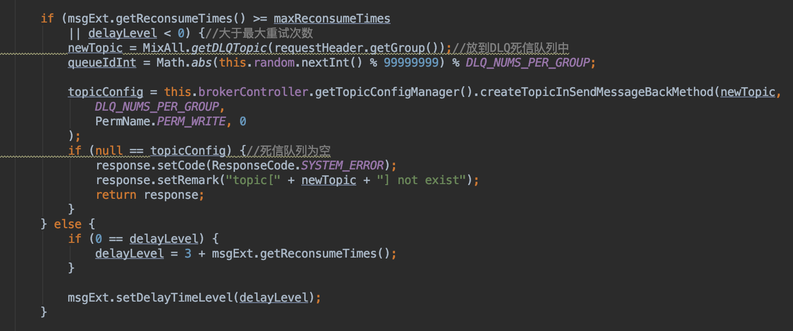

# RocketMQ文件存储的基础:MappedFile和MappedFileQueue


# RocketMQ文件存储的基础:MappedFile和MappedFileQueue

RocketMQ中的MappedFile类对应一个文件的mmap映射,是RocketMQ实现高效存储的基础。本文先介绍零拷贝的相关背景，再介绍RocketMQ中mmap的应用，为后面介绍MessageStore做过渡。

#### 1. 零拷贝

零拷贝（zero copy）指的是当拷贝发生时，CPU并不参与实际的拷贝过程。CPU可以切换到其他线程，数据的拷贝过程异步进行，异步过程通常要由硬件DMA实现。常用的零拷贝有 mmap 和 sendFile。

采用传统的读写操作将磁盘中的数据发送到网络中，通常经历2次用户态/内核态的切换，并且读和写操作CPU分别要参与一次拷贝过程。

我们知道，操作系统设置了用户态和内核态两种状态，用户态想要获取系统资源(例如访问硬盘), 必须通过系统调用进入到内核态, 由内核态获取到系统资源,再切换回用户态返回应用程序。同时，操作系统在内核态中也增加了一个"内核缓冲区"(kernel buffer)，读取数据时并不是直接把数据读取到应用程序的缓存区(app buffer), 而是先读取到内核缓冲区, 再由内核缓冲区复制到应用程序的缓存区。

传统的IO读写过程，数据会在用户态和内核态之间发送多次复制和多次上下文切换，如下：


主要流程为：

1. 硬盘拷贝到内核缓冲区(DMA COPY)
2. 内核缓冲区拷贝到应用程序缓冲区(CPU COPY)
3. 应用程序缓冲区拷贝到socket缓冲区(CPU COPY)
4. socket buf拷贝到网卡的buf(DMA COPY)

即一次读写过程涉及到2次cpu copy, 还有4次的上下文切换。

很明显,第2次和第3次的copy只是把数据复制到app buffer又原封不动的复制回来, 为此带来了两次的cpu copy和两次上下文切换, 是完全没有必要的。

#### 1.1 PageCache

pagecache是文件系统层级的缓存，从磁盘里读取的内容是存储到这里，这样程序读取磁盘内容就会非常快。page cache的大小为一页，通常为4K。


Java里的写操作都是写到PageCache里便认为逻辑落盘成功，后续操作是通过操作系统把它刷到磁盘文件上。


#### 1.2. sendfile

linux内核2.1开始引入一个叫sendFile系统调用

```
ssize_t sendfile(int out_fd, int in_fd, off_t *offset, size_t count);
```

这个系统调用可以在内核态内把数据从内核缓冲区直接复制到套接字(SOCKET)缓冲区内, 从而可以减少上下文的切换和不必要数据的复制,如下：


涉及到数据拷贝变成:

1. 硬盘拷贝到内核缓冲区(DMA COPY)
2. 内核缓冲区拷贝到socket缓冲区(CPU COPY)
3. socket缓冲区拷贝到网卡的buf(DMA COPY)

sendfile只能将数据从文件传递到套接字上，反之则不行。
使用sendfile不仅减少了数据拷贝的次数，还减少了上下文切换。

Java类库通过java.nio.channels.FileChannel的transgerTo方法支持零拷贝。而在Netty中也通过在FileRegion中包装了NIO的FileChannel.transferTo()方法实现了零拷贝。RocketMQ在涉及到网络传输的地方也使用了该方法。

FileChannel本身不是基于零拷贝实现的，而是是基于块来实现的。FileChannel配合着ByteBuffer，将读写的数据缓存到内存中，然后以批量/缓存的方式read/write，省去了非批量操作时的重复中间操作，操纵大文件时可以显著提高效率。FileChannel的write方法将数据写入PageCache后就认为落盘了，最终还是要操作系统完成PageCache到磁盘的最终写入。FileChannel的force方法则是用于通知操作系统进行及时的刷盘。

#### 1.3. mmap

mmap也是零拷贝实现的一种，它利用共享内存空间的方式, 把文件映射到用户空间里的虚拟内存，省去了从内核缓冲区复制到用户空间的过程。

```
void mmap(void *start, size_t length, int prot, int flags, int fd, off_t offset);
```

mmap通过内存映射文件的方法，将一个文件或者其它对象映射到进程的地址空间，实现文件磁盘地址和进程虚拟地址空间中一段虚拟地址的一一对映关系。实现这样的映射关系后，进程就可以采用指针的方式读写操作这一段内存，而系统会自动回写脏页面到对应的文件磁盘上，即完成了对文件的操作而不必再调用read,write等系统调用函数。相反，内核空间对这段区域的修改也直接反映用户空间，从而可以实现不同进程间的文件共享。如下图所示：


如上，每个进程都有独立的进程地址空间，通过页表和MMU，可将虚拟地址转换为物理地址，每个进程都有独立的页表数据，这可解释为什么两个不同进程相同的虚拟地址，却对应不同的物理地址。

mmap内存映射的实现过程，总的来说可以分为三个阶段：

1. 进程启动映射过程，并在虚拟地址空间中为映射创建虚拟映射区域
2. 调用内核空间的系统调用函数mmap（不同于用户空间函数），实现文件物理地址和进程虚拟地址的一一映射关系
3. 进程发起对这片映射空间的访问，引发缺页异常，实现文件内容到物理内存（主存）的拷贝

前两个阶段仅在于创建虚拟区间并完成地址映射，但是并没有将任何文件数据的拷贝至主存。真正的文件读取是当进程发起读或写操作时。

完成上面步骤后，目前只是建立了地址映射，真正的硬盘数据还没有拷贝到内存中。这时候进程的读或写操作访问虚拟地址空间这一段映射地址时，通过查询页表，会发现这一段地址并不在物理页面上，因此将引发缺页异常。缺页异常会进行一系列判断，确定无非法操作后，会触发内核发起请求调页过程。

调页过程先在交换缓存空间（swap cache）中寻找需要访问的内存页，如果没有则调用nopage函数把所缺的页从磁盘装入到主存中，之后进程便可对这片主存进行读或者写的操作。如果写操作改变了其内容，一定时间后系统会自动回写脏页面到对应磁盘地址，也即完成了写入到文件的过程。

修改过的脏页面并不会立即更新回文件中，而是有一段时间的延迟，可以调用msync()来强制同步, 这样所写的内容就能立即保存到文件里了。

Java中的MappedByteBuffer便是对应mmap实现，在Java中一次只能映射1.5~2G的文件内存。其中MappedByteBuffer的put方法实际上是将数据写到了虚拟内存，而虚拟内存是依赖于操作系统的定时刷盘的。可以手动通过MappedByteBuffer的force方法来手动控制刷盘。

#### 1.4. mmap和sendFile的区别

1. mmap适合小数据量读写,sendFile适合大文件传输。
2. mmap 需要 4 次上下文切换，3次数据拷贝；sendFile 需要 3 次上下文切换，最少 2 次数据拷贝。
3. sendFile 可以利用DMA方式，减少CPU拷贝，mmap 则不能
4. sendFile必须从内核拷贝到Socket缓冲区

RocketMQ因为有小块数据传输的需求，因而选择了mmap。RocketMQ为了提高写的效率，也支持使用FileChannel(开启堆外缓冲区且使用异步刷盘且为Master节点时)。下面为网上别人测试得出的使用mmap和FileChannel的结果


数据来源于[https://www.jianshu.com/p/d0b4ac90dbcb](https://www.jianshu.com/p/d0b4ac90dbcb)

虽然FileChanel在读写时不支持零拷贝，但是基于ByteBuff缓冲，在数据量稍大时是有一定优势的。

#### 2. MappedFile

RocketMQ中的MappedFile类对应一个文件的mmap映射，提供了初始化、追加写、刷盘、清除、数据预热等功能。MappedFile支持同时使用mmap和FileChannel操作文件。两者同时使用时，mmap用于读，FileChannel则用于写，默认情况下只使用mmap进行读写。

定义如下：

```
public class MappedFile extends ReferenceResource {
    public static final int OS_PAGE_SIZE = 1024 * 4;
    protected static final InternalLogger log = InternalLoggerFactory.getLogger(LoggerName.STORE_LOGGER_NAME);

private static final AtomicLong TOTAL_MAPPED_VIRTUAL_MEMORY = new AtomicLong(0);//总的虚拟内存大小

private static final AtomicInteger TOTAL_MAPPED_FILES = new AtomicInteger(0);//总的映射文件数
protected final AtomicInteger wrotePosition = new AtomicInteger(0);//当前mmap文件的写位置
//ADD BY ChenYang
protected final AtomicInteger committedPosition = new AtomicInteger(0);//当前mmap文件的提交位置
private final AtomicInteger flushedPosition = new AtomicInteger(0);//当前mmap文件已刷盘的位置
protected int fileSize;//文件大小
protected FileChannel fileChannel;
/**
* Message will put to here first, and then reput to FileChannel if writeBuffer is not null.
*/
protected ByteBuffer writeBuffer = null; //堆外写缓冲区
protected TransientStorePool transientStorePool = null;//堆外缓冲池
private String fileName;
private long fileFromOffset;//文件存储的消息起始偏移量，值为文件名
private File file;
private MappedByteBuffer mappedByteBuffer;//mmap映射
private volatile long storeTimestamp = 0;
private boolean firstCreateInQueue = false;
}
```

#### 2.1 初始化(init)

通过RandomAccessFile获取文件的FileChannel对象，然后得到MappedByteBuffer对象，对应一个mmap映射。如果提供了TransientStorePool对象，则相当于打开了FileChannel用于写的开关。会从堆外内存获取一块写缓冲区(writeBuffer)，对于数据的写操作，会在数据写到FileChannel前会先写到writeBuffer，等到数据满了再写入FileChannel。增加缓冲区是为加大一次写入的数据量，如上面数据反映。反之，如果没有提供，则文件的读写操作都基于mmap。

#### 2.2. 追加写(append)

包括
1. 直接物理追加写：通过FileChannel直接写入byte[]
2. 回调追加写：以AppendMessageCallback回调的方式写入，传给AppendMessageCallback的是FileChannel的写缓冲区或者MappedByteBuffer。

追加写不是线程安全的，需要上层自己控制。

#### 2.3. 提交缓冲内容(commit)

将FileChannel的写缓冲区中的数据提交到FileChannel中，然后归还缓冲区到TransientStorePool，最后将缓冲区置为空，后续写操作使用mmap。条件包括：

1. 写缓冲区为空直接返回
2. 写入位置等于文件大小（文件满了但缓冲区数据没同步）
3. 指定最少提交页数（一页大小为4K）时，看是否有大于指定值的页数没提交，如果符合则提交缓冲区内容
4. 写入位置是否大于已刷盘的位置，是则提交缓冲区内容

#### 2.4. 刷盘(flush)

调用FileChannel的force方法或者MappedByteBuffer的force方法进行强制刷盘，只调用其中一种方法。条件同提交缓冲内容的条件一致。

#### 2.5. 随机读(selectMappedBuffer)

使用mmap方式，返回从给定位置起指定大小的数据，数据以ByteBuffer的形式返回。

#### 2.6. mlock内存锁定

锁住内存是为了防止这段内存被操作系统swap掉。

```
int mlock(const void *addr, size_t len);
```

系统调用mlock函数允许程序在物理内存上锁住它的部分或全部地址空间。这将阻止Linux将这个内存页调度到交换空间（swap space），即使该程序已有一段时间没有访问这段空间。对于RocketMQ这种的高吞吐量的分布式消息队列来说，追求的是消息读写低延迟，那么肯定希望尽可能地多使用物理内存，提高数据读写访问的操作效率。

RocketMQ在MappedFile类中提供了对应的操作：


在调用mlock后还调用了madvise，告诉操作系统以MADV_WILLNEED模式（预读一些页进来）使用该快内存。

需注意的是，仅分配内存并调用mlock并不会为调用进程锁定这些内存，因为对应的分页可能是写时复制（copy-on-write）的。因此，应该在每个页面中写入一个假的值,RocketMQ中对应的是数据预热过程。


#### 2.7. 文件预热

上面介绍mmap的时候提到，当调用mmap函数后，只是创建虚拟区间并完成地址映射，程序要访问数据时OS会检查该部分的分页是否已经在内存中，如果不在，则发出一次缺页中断。当mmap文件过大时缺页中断的次数也会随之变多，会对影响读写性能。因而RocketMQ在MappedFile类中提供了预热功能，如下：



RocketMQ会在创建并分配MappedFile的过程中，预先写入假值(0)至mmap映射出的内存空间里，从而让系统提前分配物理内存空间。

#### 3. MappedFileQueue

顾名思义，以队列的形式，将多个MappedFile组成一个无限的大文件对外提供服务。

定义如下：

```
public class MappedFileQueue {
    private static final InternalLogger log = InternalLoggerFactory.getLogger(LoggerName.STORE_LOGGER_NAME);
    private static final InternalLogger LOG_ERROR = InternalLoggerFactory.getLogger(LoggerName.STORE_ERROR_LOGGER_NAME);

private static final int DELETE_FILES_BATCH_MAX = 10;

private final String storePath;//存储路径

private final int mappedFileSize;//每个MapedFile的大小，默认1G

private final CopyOnWriteArrayList<MappedFile> mappedFiles = new CopyOnWriteArrayList<MappedFile>();//多个文件串起来的队列

private final AllocateMappedFileService allocateMappedFileService;//预分配文件服务

private long flushedWhere = 0;
private long committedWhere = 0;

private volatile long storeTimestamp = 0;
}
```


主要包括如下操作:

#### 3.1. 加载本地路径下的文件,load

路径下的每个文件都对应一个MappedFile，并添加到内部维护的mappedFiles属性中

```
private final CopyOnWriteArrayList<MappedFile> mappedFiles = new CopyOnWriteArrayList<MappedFile>();
```

#### 3.2. 根据offset查找MappedFile,findMappedFileByOffset

先尝试计算所给offset在mappedFiles里的下标index，获得对应的MappedFile后判断offset是否在MappedFile中。如果存在则返回，否则遍历mappedFiles，逐一判断是否存在符合条件的MappedFile。

#### 3.3. 根据过期时间删除MappedFile

遍历mappedFiles里的每个文件，判断文件的最后修改时间+超时时间是否小于当前时间，如果是则将给MappedFile卸下，关闭对应的FileChannel连接等资源。

#### 3.4. 根据offset删除MappedFile

遍历mappedFiles里的每个文件，如果MappedFile的最大偏移量，如果小于所给offset，则将MappedFile卸下。

#### 3.5. 获取最后一个MappedFile

如果队列为空或者最后一个MappedFile已经满了，则初始化一个MappedFile。可以使用AllocateMappedFileService异步预分配两个文件，或者直接同步创建一个文件。

AllocateMappedFileService继承自ServiceThread，ServiceThread之前介绍过，类似定时器，会定时执行run方法。AllocateMappedFileService用于预分配MappedFile,将请求包装为AllocateRequest并放到内部的优先级队列中，并每隔5秒从队里中取出请求并执行分配操作。在这一步并会调用MappedFile的warmMappedFile方法，写入0值进行数据的预热，然后锁定该内部防止被交换出去。

MappedFileQueue主要为CommitLog和ConsumeQueue提供支持。CommitLog用于存储Producer的消息，ConsumeQueue会接受CommitLog分配的消息，等待Consumer消费，具体内容会在下节进行介绍。

MappedFileQueue的操作都建立在MappedFile上，基本都是先找到目标的MappedFile，再针对该MappedFile进行操作。

MappedFile和MappedFileQueue作为RocketMQ消息存储的基础，将为上层的CommitLog和ConsumeQueue提供支持。


