# JVM层面的切面实现 : jvm-sandbox 之 <应用启动>


#### 1. 启动

sandbox源码各模块的结构如下:

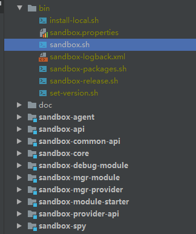

sandbox安装后的目录结构如下:

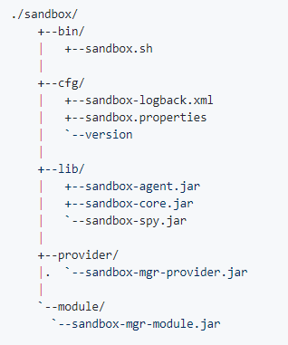

按照官方的教程，启动命令如下：

```
./sandbox.sh -p 2343
```

查看对应的脚本，函数定义如下：

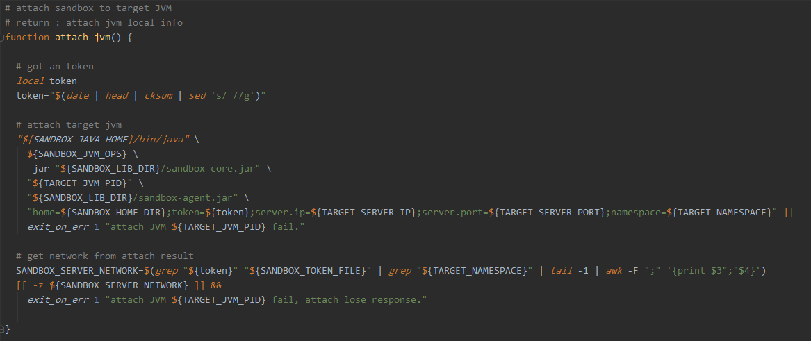

翻译过来就是执行如下命令

```
java -Xms128M -Xmx128M -Xnoclassgc -ea -jar /xxx/sandbox-core.jar 2342 /xxx/sandbox-agent.jar home=/xxx;token=xxx;server.ip=xxx;service.port=xxx;namespace=xxx
```

按顺序将参数定义为

1. targetJvmPid:目标应用pid
2. agentJarPath:附加的agent包路径
3. cfg:agent-main的参数,包括home路径;该次唯一标识toke;ip端口以及命名空间

查看sandbox-core模块的pom.xml

```
<archive>
    <manifest>
        <mainClass>com.alibaba.jvm.sandbox.core.CoreLauncher</mainClass>
    </manifest>
</archive>
```

找到启动类 ```com.alibaba.jvm.sandbox.core.CoreLauncher```

该类存在一个main方法，接收3个参数，并实例化一个CoreLauncher实例，它在构造方法中完成agent的attach动作.

```
public CoreLauncher(final String targetJvmPid,
                    final String agentJarPath,
                    final String token) throws Exception {

    attachAgent(targetJvmPid, agentJarPath, token);

}
```

主要是以agent-main的方式执行。

去到```sandbox-agent```模块的pom.xml，有如下配置

```
<archive>
    <manifestEntries>
        <Premain-Class>com.alibaba.jvm.sandbox.agent.AgentLauncher</Premain-Class>
        <Agent-Class>com.alibaba.jvm.sandbox.agent.AgentLauncher</Agent-Class>
        <Can-Redefine-Classes>true</Can-Redefine-Classes>
        <Can-Retransform-Classes>true</Can-Retransform-Classes>
    </manifestEntries>
</archive>
```

分别指定了premain和agent的启动类```com.alibaba.jvm.sandbox.agent.AgentLauncher```

查看入口agentmain方法

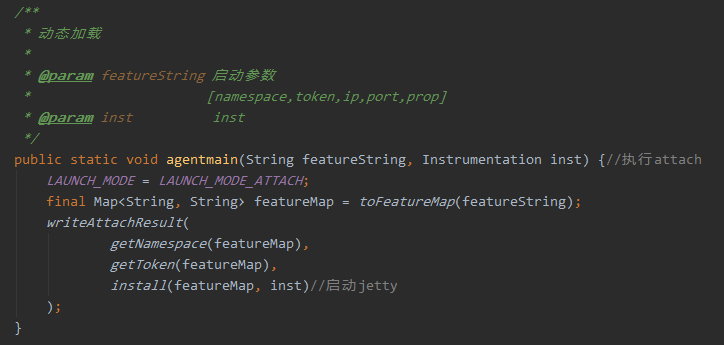

处理agent传入的cfg参数字段，解析为k-v对，然后执行install方法，并将结果写入到了${HOME}/.sandbox.token里,该文件记录的内容为

```
default;21988529;0.0.0.0;32165//命名空间;token;ip;port
```

#### 2. AgentLauncher.install

sandbox-agent模块里AgentLauncher类的install方法将完成主要的加载过程,包括:

1. 将系统参数序列化，用于后续反射调用
2. 将sandbox-spy.jar 加入BootstrapClassLoader
3. 分别为每个namespace初始化一个**SandboxClassLoader**自定义类加载器，其继承自URLClassLoader，指向sandbox-core.jar，支持加载该jar包中的类。结合第2步，SandboxClassLoader目前加载的自定义jar包括**sandbox-spy.jar**和**sandbox-core.jar**。其中sandbox-core.jar包括了源码里的sandbox-core-api模块。注意，SandboxClassLoader位于sandbox-agent.jar包中，其父类加载器为AppClassLoader
4. 使用SandboxClassLoader反射加载并实例化sandbox-core.jar里的```com.alibaba.jvm.sandbox.core.CoreConfigure```，传入第1步的参数以及sandbox.properties文件的路径
5. 使用SandboxClassLoader反射加载并实例化sandbox-core.jar里的```com.alibaba.jvm.sandbox.core.server.ProxyCoreServer```，该步会实例化sandbox-core.jar里的```com.alibaba.jvm.sandbox.core.server.jetty.JettyCoreServer```实例
6. 执行JettyCoreServer的bind方法，加载自定义模块、启动http服务

#### 3. JettyCoreServer.bind

JettyCoreServer的bind方法主要完成Http服务的启动以及各模块的加载，主要动作为:

1. 初始化JvmSandbox对象
2. 初始化Http服务
3. 初始化Jetty处理器
4. 启动Http服务
5. 重置所有用户模块，先卸载再加载

注，当前的ClassLoader为每个namespace对应的**SandboxClassLoader**，后续该包里加载的类的类加载器都是这个，影响的类位于sandbox-core.jar中，对应源码里的**sandbox-common-api**、**sandbox-provider-api**、**sandbox-api**、**sandbox-core**模块。

#### 3.1 初始化JvmSandbox对象

 ``` JvmSandbox ```表示一个沙箱对象，关系如下，依赖CoreConfigure和**CoreModuleManager**，分别表示系统配置信息和模块管理。CoreModuleManager的实现类为**DefaultCoreModuleManager**，为主要功能。

 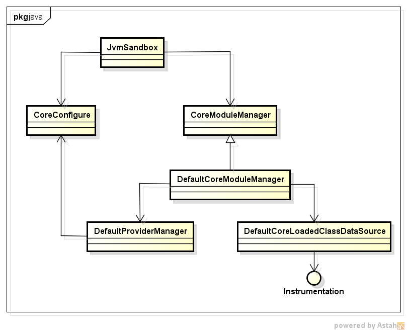

 同时在初始化的时候还会调用SpyUtils，为每个namespace分配公共的**EventListenerHandler**(**SpyHandler**实现)类

 ```
 private void init() {
    SpyUtils.init(cfg.getNamespace());//初始化SpyUtils，分配公共的EventListenerHandler(SpyHandler实现)类
}
 ```

#### 3.2 初始化Http服务

初始化Http服务,启动一个Jetty Server，并设置为daemon

#### 3.3 初始化Jetty处理器

初始化Jetty处理器，实现一个请求分发器，可以通过http的方式来触发**@Command**注解的方法。

注册的处理器有两种:

1. web-scoket-servet

	访问路径为

	```
	/sandbox/${namespace}/module/websocket/*
	```

	处理类为~~WebSocketAcceptorServlet~~

2. module-http-servlet

	访问路径为

	```
	/sandbox/${namespace}/module/http/*
	```

	处理类为**ModuleHttpServlet**，这边重点介绍http处理器

#### 3.3.1 ModuleHttpServlet

该Servlet要求请求URL按照如下格式：

```
/sandbox/${namespace}/module/http/${uniqueId}/${command}?${k1}=${v1}&${k2}=${v2}
```

1. ${uniqueId}:模块id
2. ${command}:模块下的方法，需要加@Command注解
3. {k1}=${v1}&${k2}=${v2}:方法参数

对于一个http请求，具体流程为:

1. 解析url得到模块id，如果模块不存在则返回，否则从模块管理类CoreModuleManager中获取对应的模块CoreModule
2. 匹配对应的方法,获得Method对象查找有@Command注解且匹配/${uniqueId}/${command}的方法，具体会将模块id和@Command的值用```/```进行拼接
3. 生成方法调用参数，遍历方法的入参类型，按照类型设置对应的入参列表，支持的类型包括:
	1. HttpServletRequest
	2. HttpServletResponse
	3. Map\<String,String[]>：使用http请求的参数
	4. String：使用url中```?```后面的内容
	5. PrintWriter：HttpServletResponse.getWriter()
	6. OutputStream：HttpServletResponse.getOutputStream()

4. 反射执行Method

相当于自己实现了一个http请求分发器

#### 3.4 启动Http服务

启动Jetty http服务

#### 3.5 重置所有用户模块

主要调用CoreModuleManager的reset方法，完成模块的重置。先卸载各个模块再进行加载。

在这之前先介绍模块的生命周期

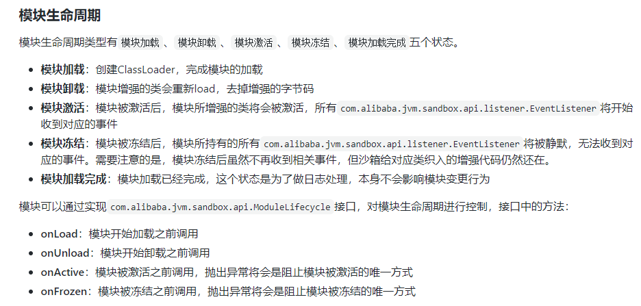
*(来自官网github wiki，官网都有，懒的搬了)*

上面少了一个```loadCompleted```事件，会在模块加载完成，模块完成加载后调用。作者的意思是方法比较常用，所以单独出来成为一个接口。

模块的卸载会先将模块进行冻结，然后再将模块卸载，期间会触发onFrozen和onUnload事件。**有点需要注意的是冻结和卸载的不同，冻结只是把sandbox的事件通知机制给屏蔽掉，模块的插桩代码还在。冻结后可以解冻，插桩代码可以复用。而卸载则会移除模块对应的ClassFileTransformer，并重新加载原始的class，重新处理class，达到去除模块插桩的目的。**

这里先只关注模块的加载流程,模块的加载过程如下:


1. DefaultCoreModuleManager构造ModuleLibLoader对象，传入模块jar包所在路径和两个Callback，再调用load方法
2. ModuleLibLoader在load方法里会遍历路径下的所有Jar包，对每个Jar包，构造ModuleJarLoader对象，传入Jar包所在路径，再调用load方法触发加载
3. ModuleJarLoader会构造一个**ModuleJarClassLoader**，用于加载Jar包，如下：

	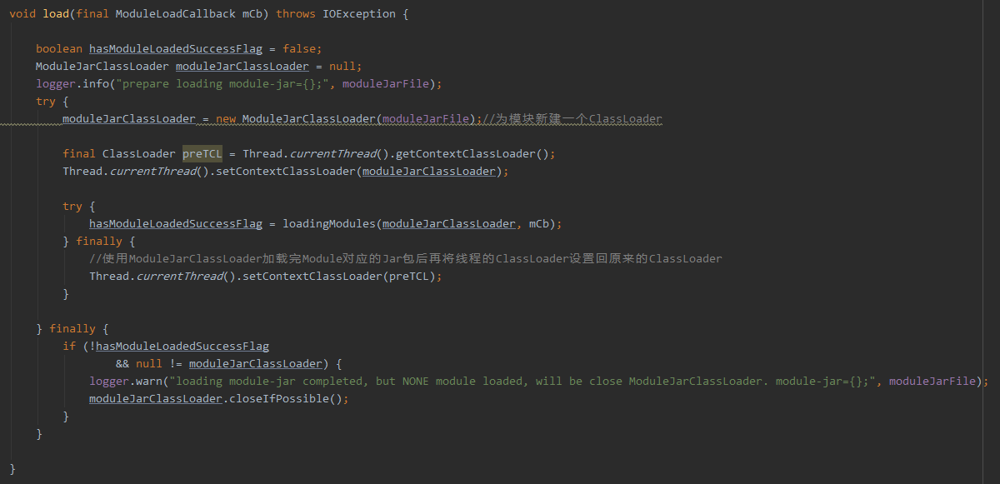

	由于ModuleJarClassLoader当前线程的类加载器为SandboxClassLoader，为了让Jar包中的类独立开来，避免不同自定义模块包中的类冲突，执行真正的加载动作```loadingModules```方法前，会把当前线程的类加载器设置为刚创建的ModuleJarClassLoader，加载完后再设置回namespace公用的SandboxClassLoader。

#### 3.5.1 ModuleJarLoader.loadingModules

该方法会使用ModuleJarClassLoader通过SPI机制加载jar包里的Module类。由于通过SPI机制，因而需要符合SPI规范:

1. 必须拥有publish的无参构造函数
2. 必须实现com.alibaba.jvm.sandbox.api.Module接口
3. 必须完成META-INF/services/com.alibaba.jvm.sandbox.api.Module文件中的注册（Java SPI规范要求）

sandbox里的模块都是通过```sandbox-module-starter```插件完成，只要实现Module接口然后再类上加上```org.kohsuke.MetaInfServices```注解，*为插件点赞*。

加载完Module类后会读取类似的```com.alibaba.jvm.sandbox.api.Information```注解，获得模块id，如果没有该注解，则不会加载该模块。

加载完后会通知```InnerModuleLoadCallback```进行回调，完成后续动作。然后将该模块id加入已加载模块列表中。

InnerModuleLoadCallback经过过滤链处理后，会委托给DefaultCoreModuleManager的load方法完成实际的处理动作。

#### 3.5.2 DefaultCoreModuleManager.load

该方法主要完成如下动作：

1. 构造CoreModule对象，初始化模块信息
2. 为Module实现类上有@Resource的属性字段注入资源，当前只支持
	1. LoadedClassDataSource，已加载类数据源，注入已有的DefaultCoreLoadedClassDataSource
	2. ModuleEventWatcher，事件观察者，注入新建的DefaultModuleEventWatcher.该对象被标记为一个可释放资源，由ReleaseResource引用，会在模块卸载的时候进行回收。具体到这里是触发ModuleEventWatcher的delete动作，在释放模块资源时，清除模块上的事件，该动作会触发class重新加载，去除该模块的插桩代码。
	3. ModuleController，模块控制接口，注入新建的DefaultModuleController
	4. ModuleManager，模块管理器，注入新建的DefaultModuleManager
	5. ConfigInfo，沙箱配置信息，注入新建的DefaultConfigInfo

3. 模块生命周期回调，MODULE_LOAD
4. 标记模块已加载
5. 如果模块标记了加载时自动激活，则需要在加载完成之后激活模块
6. 注册到模块列表中
7. 模块生命周期回调，MODULE_LOAD_COMPLETED

#### 3.5.3 ModuleJarClassLoader

回到3.5.2的第2步，这里新建了很多对象注入到自定义Module实现类中，这些类都位于sandbox-core.jar包中。前面说过，这些类由SandboxClassLoader来加载，而ModuleJarClassLoader只复制加载各自模块jar包的类，因而ModuleJarClassLoader需要继承SandboxClassLoader，看下它的定义

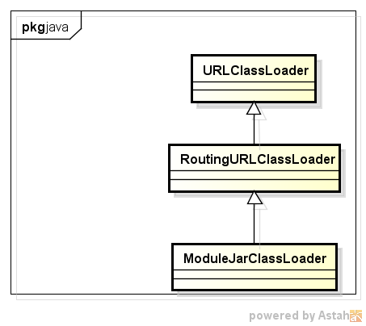

RoutingURLClassLoader预先给指定的包路径正则表达式指定ClassLoader，命中后将加载动作委托给指定的ClassLoader，没命中才委托给父类加载器。

而ModuleJarClassLoader继承自RoutingURLClassLoader，构造方法如下

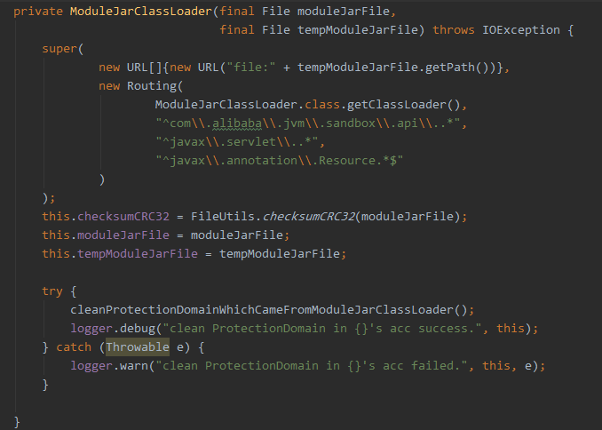

指定了sandbox-core.jar里类都由ModuleJarClassLoader的父类加载器即SandboxClassLoader来处理。


综上，得到jvm-sandbox的类加载关系如下：

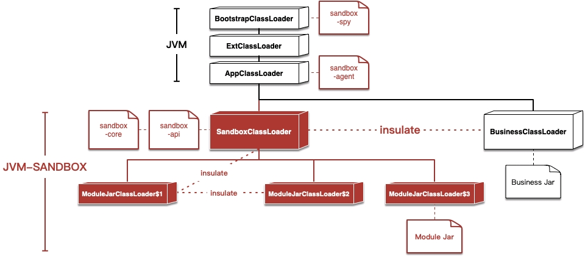

*(图片来自官网github)*

除了sandbox-spy.jar包外，其他都包跟业务包进行了分离，各个模块的包也互不影响。而sandbox-spy.jar里的类由于s在完成插桩后会出现在业务代理里，所以需要全局加载，故由Bootstrap加载器加载。

Ok,用一张图总结jvm-sandbox的的启动过程:

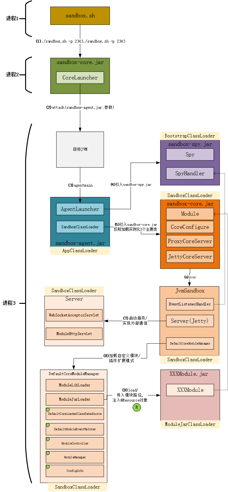
