# JVM层面的切面实现 : jvm-sandbox 之 <事件机制>


这节介绍jvm-sandbox的事件机制，事件机制提供了切面通知的核心功能，内部主要结合asm和观察者模式来实现。jvm-sandbox提供的事件包括：

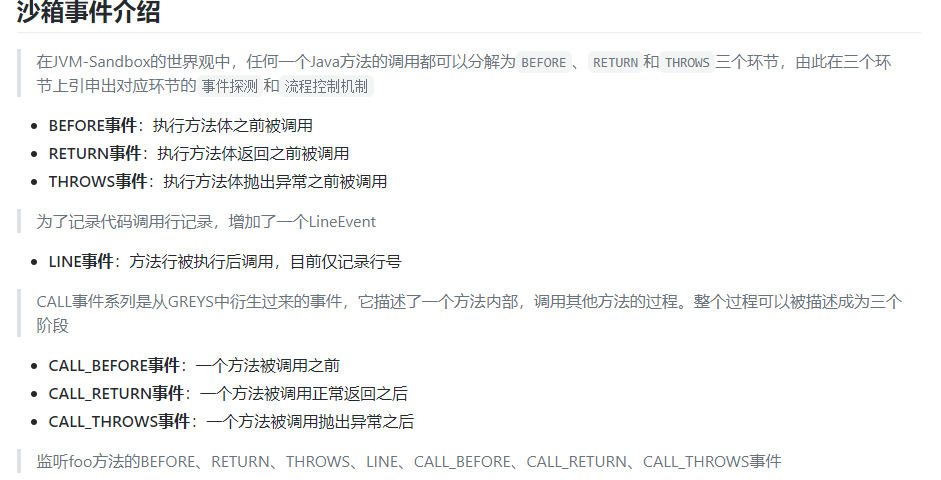

上面的截图是官网github wiki对事件的介绍，包括提供的事件类型、事件的作用域以及状态机流转。概括的说就是，jvm-sandbox围绕了目标方法这个切面点，提供了多种通知机制。

#### 1.观察者模式

观察者模式的简单示意如下：

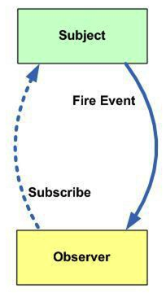

Observer(观察者)观察Subject(目标)，Subject在发生变化时通知Observer。具体到这里，模型抽象为:

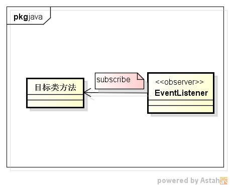

目标对象为符合条件的类的方法，观察者则为EventListener实现类。一般我们在实现时，

1. Subject都会有一个**Observer列表**，以及提供一个添加观察者的方法(add)
2. 用户通过调用Subject的add方法，**触发观察**，把Observer添加到Observer列表中
3. Subject在事件发生时，遍历Observer列表，**通知到Observer**

以此达到目的。下面来看jvm-sandbox如何实现该过程。

#### 2. 触发观察DefaultModuleEventWatcher.watch

从官网的例子开始

```
 /**
   * 一个损坏的钟实现
   */
  static class BrokenClock extends Clock {

      @Override
      void checkState() {
          throw new IllegalStateException();
      }

      @Override
      void delay() throws InterruptedException {
          Thread.sleep(10000L);
      }

  }
```

```
/**
 * 修复损坏的钟模块
 */
@Information(id = "broken-clock-tinker")
public class BrokenClockTinkerModule implements Module {

    @Resource
    private ModuleEventWatcher moduleEventWatcher;

    @Http("/repairCheckState")
    public void repairCheckState() {

        moduleEventWatcher.watch(

                // 匹配到Clock$BrokenClock#checkState()
                new NameRegexFilter("Clock\\$BrokenClock", "checkState"),

                // 监听THROWS事件并且改变原有方法抛出异常为正常返回
                new EventListener() {
                    @Override
                    public void onEvent(Event event) throws Throwable {
                        // 立即返回
                        ProcessControlException.throwReturnImmediately(null);
                    }
                },

                // 指定监听的事件为抛出异常
                Event.Type.THROWS
        );

    }

}
```

按上一节的介绍，每个Module类都会分配一个MOduleEventWatcher，注入的对象为**DefaultModuleEventWatcher**。DefaultModuleEventWatcher是jvm-sandbox内置的默认观察者实现门户类(没有实现EventWatcher)，用于将用户定义的EventWatcher添加到目标类中。上面例子中的watch动作最终会调用到如下方法

```
private int watch(/*匹配器*/final Matcher matcher,
                      /*事件监听器*/final EventListener listener,
                      final Progress progress,
                     /*观察的时间类型*/ final Event.Type... eventType)
```

该方法的主要流程如下:

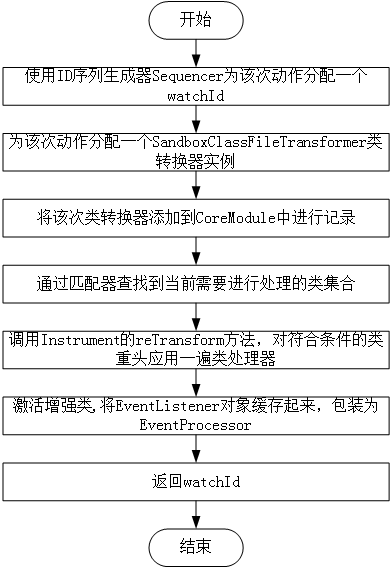

概括来说就是，每一次watch(观察)都会对应一个watchId**(1)**，对应多个需要处理的class**(2)**，对应一个EventListener**(3)**，对应一个**SandboxClassFileTransformer** **(4)**，激活后会对应一个**EventProcessor** **(5)**

1. watchId由Sequencer进行分配，该ID序号是全局的，目前的实现是从1000开始的int，每次获取都加1
2. 通过CoreLoadedClassDataSource找出符合条件的Class列表
3. EventListener由用户传入，会在用户指定的事件发生时进行回调通知
4. SandboxClassFileTransformer实现了ClassFileTransformer接口，提供了AOP代码的织入逻辑的入口，真正的字节码处理动作由EventEnhancer和EventWeaver完成。SandboxClassFileTransformer的构造方法如下，

	```
	SandboxClassFileTransformer(/*观察动作id*/final int watchId,
                                /*模块id*/final String uniqueId,
                                /*类匹配器*/final Matcher matcher,
                               /*监听器*/ final EventListener eventListener,
                                final boolean isEnableUnsafe,
                                final Event.Type[] eventTypeArray,
                                /*命名空间*/final String namespace) {
        this.watchId = watchId;
        this.uniqueId = uniqueId;
        this.matcher = matcher;
        this.eventListener = eventListener;
        this.isEnableUnsafe = isEnableUnsafe;
        this.eventTypeArray = eventTypeArray;
        this.namespace = namespace;
        //为每个EventListener实例分配一个全局的id，便于传递
        this.listenerId = ObjectIDs.instance.identity(eventListener);
    }
	```

	在构造方法中会为EventListener对象分配一个全局的id(listenerId)，这个id会跟事件处理器(EventListener)对象进行映射，并缓存起来，后续可以通过id获取该对象。

	*当进行观察时，会使用asm将listenerId织入到目标方法中，从而实现上面提到的调用**add**方法的效果。*

	再调用Instrument的reTransform方法，对符合条件的类重头应用一遍类处理器，从而达到新增监听器的效果。

5. 调用**EventListenerHandler**的active方法激活该事件处理器，本质是将该对象缓存在内部的Map中

	```
	// 全局处理器ID:处理器映射集合
    private final Map<Integer/*LISTENER_ID*/, EventProcessor> mappingOfEventProcessor
            = new ConcurrentHashMap<Integer, EventProcessor>();
	```

	后续可以通过该listenerId获取到对应的对象。

#### 3. Subject的Observer列表

"**add**"方法的具体实现是由EventEnhancer和EventWeaver完成。内容上偏底层，主要是字节码操作。这边直接给出处理后效果，以开头的例子为例，感兴趣的可以看源码了解具体的实现。BrokenClock增强后的内容如下:

```
public class BrokenClock extends Clock {
    public BrokenClock() {
    }

    void checkState() {
        boolean var10000 = true;

        try {
            Ret var5 = Spy.spyMethodOnBefore(new Object[0], "default", 1000, 1001, "com.alibaba.jvm.sandbox.qatest.core.enhance.target.BrokenClock", "checkState", "()V", this);
            int var6 = var5.state;
            if (var6 != 1) {
                if (var6 != 2) {
                    var10000 = true;
                    throw new IllegalStateException();//原方法内容
                } else {
                    throw (Throwable)var5.respond;
                }
            } else {
                Object var2 = var5.respond;
            }
        } catch (Throwable var1) {
            boolean var10001 = true;
            Ret var3 = Spy.spyMethodOnThrows(var1, "default", 1000);
            int var10002 = var3.state;
            if (var10002 != 1) {
                if (var10002 != 2) {
                    var10001 = true;
                    throw var1;
                } else {
                    throw (Throwable)var3.respond;
                }
            } else {
                Object var4 = var3.respond;
            }
        }
    }

    void delay() throws InterruptedException {
        Thread.sleep(10000L);
    }
}
```

其中原方法的内容用注释的方式进行了标明。可以看到，相比原方法，里面多了几个判断，入口都来自于Spy.spyMethodOnXXXX，分别有:

1. Spy.spyMethodOnBefore
2. Spy.spyMethodOnThrows

分别表示方法进入前，以及捕获异常后进入插桩，后面再根据返回结果的状态Sy.Ret.state来控制流程。这两个方法都以硬编码的方式传入了listenerId（例子中是1000），然后在事件触发的地方通过Spy类将listenerId带入。即不存在Subject的Observer列表，而是把遍历的过程通过硬编码来实现。官方给出的效果为：

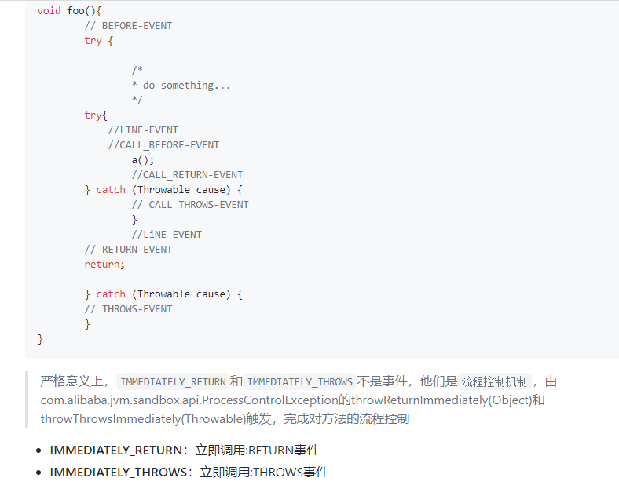

需要指出，当有多个EventListener时便会重复嵌套。比如，新增一个EventListener如下，该方法只监听before事件：

```
@Command("log")
    public void log() {
        new EventWatchBuilder(moduleEventWatcher)
            .onClass("sandbox.demo.Clock")
            .onBehavior("checkState")
            .onWatch(new EventListener() {
	            @Override
	            public void onEvent(Event event) throws Throwable {
	                System.out.println("a");
	            }
        });
    }
```

反编译后的方法内容如下(先执行repairCheckState，listenerId为1000；再执行log，listenerId为1002)：

```
void checkState() {
        boolean var10000 = true;

        boolean var10001;
        int var10002;
        Ret var4;
        Object var5;
        try {
            Ret var7 = Spy.spyMethodOnBefore(new Object[0], "default", 1002, 1001, "com.alibaba.jvm.sandbox.qatest.core.enhance.target.BrokenClock", "checkState", "()V", this);
            int var8 = var7.state;
            Object var3;
            if (var8 == 1) {
                var3 = var7.respond;
            } else if (var8 != 2) {
                var10000 = true;
                var10000 = true;

                try {
                    var7 = Spy.spyMethodOnBefore(new Object[0], "default", 1000, 1001, "com.alibaba.jvm.sandbox.qatest.core.enhance.target.BrokenClock", "checkState", "()V", this);
                    var8 = var7.state;
                    if (var8 != 1) {
                        if (var8 != 2) {
                            var10000 = true;
                            throw new IllegalStateException();
                        } else {
                            throw (Throwable)var7.respond;
                        }
                    } else {
                        var3 = var7.respond;
                        var10000 = true;
                        Ret var6 = Spy.spyMethodOnReturn((Object)null, "default", 1002);
                        var8 = var6.state;
                        if (var8 != 1) {
                            if (var8 != 2) {
                                var10000 = true;
                            } else {
                                throw (Throwable)var6.respond;
                            }
                        } else {
                            var3 = var6.respond;
                        }
                    }
                } catch (Throwable var1) {
                    var10001 = true;
                    var4 = Spy.spyMethodOnThrows(var1, "default", 1000);
                    var10002 = var4.state;
                    if (var10002 != 1) {
                        if (var10002 != 2) {
                            var10001 = true;
                            throw var1;
                        } else {
                            throw (Throwable)var4.respond;
                        }
                    } else {
                        var5 = var4.respond;
                        var10001 = true;
                        var4 = Spy.spyMethodOnReturn((Object)null, "default", 1002);
                        var10002 = var4.state;
                        if (var10002 != 1) {
                            if (var10002 != 2) {
                                var10001 = true;
                            } else {
                                throw (Throwable)var4.respond;
                            }
                        } else {
                            var5 = var4.respond;
                        }
                    }
                }
            } else {
                throw (Throwable)var7.respond;
            }
        } catch (Throwable var2) {
            var10001 = true;
            var4 = Spy.spyMethodOnThrows(var2, "default", 1002);
            var10002 = var4.state;
            if (var10002 != 1) {
                if (var10002 != 2) {
                    var10001 = true;
                    throw var2;
                } else {
                    throw (Throwable)var4.respond;
                }
            } else {
                var5 = var4.respond;
            }
        }
    }
```

效果上相当于第二个EventListener的插桩代码是在第一个EventListener处理过的class后再进行处理。

#### 4. 通知Observer

从第2部分插桩过后的代码可以看出，jvm-sandbox在方法的每个通知点(before,throw,return)都买入了Spy.spyMethodOnXXX方法以及对应的listenerId。当相应的流程到达对应的通知点时，便会触发listenerId对应EventListener的回调，从而达到通知Observer的效果。

根据前面几部分，可以得到jvm-sandbox实现观察者模式的过程是这样的：

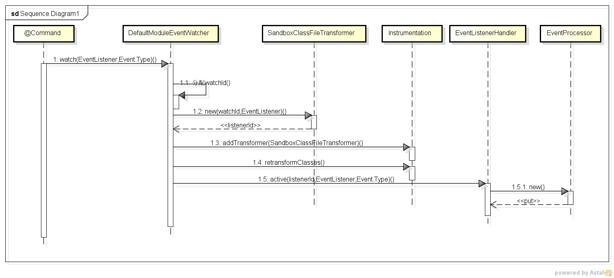

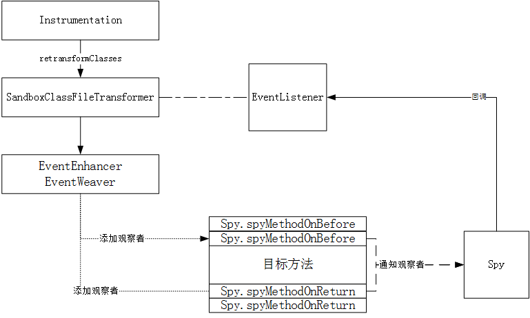

#### 5. Spy

从第2部分插桩过后的代码可以看出，Spy完成了方法的回调，然后插桩代码根据Spy.Ret的状态更新了原流程的控制。下面来看下这两个类

#### 5.1 Spy间谍类

Spy类会分布在各个ClassLoader中，因而Spy类由BoostrapClassLoader加载。涉及到的类如下：

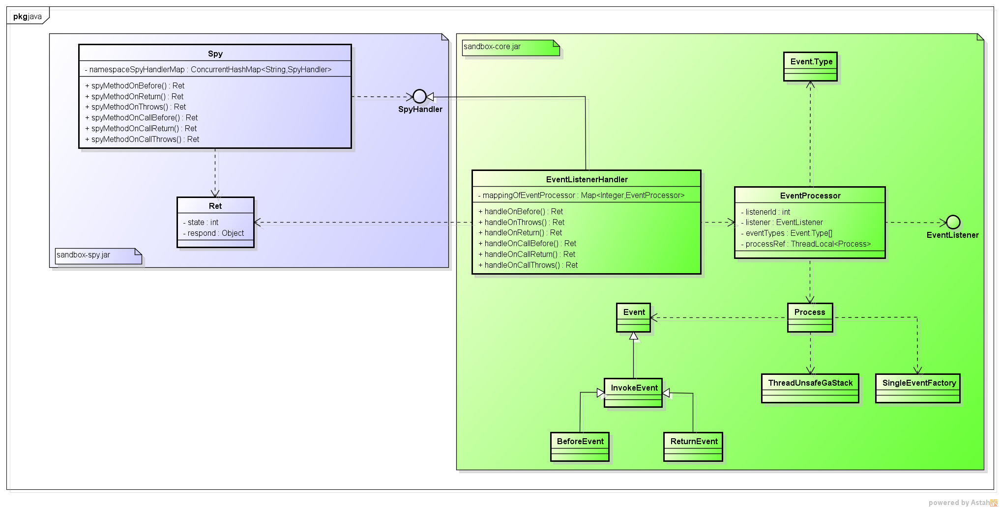

以Spy.spyMethodOnBefore为例，该方法会调用命名空间内的SpyHandler类对应的handleOnBefore方法。SpyHandler为接口，位于sandbox-spy.jar中，实现类为EventListenerHandler，该对象会在初始化JvmSandbox对象时调用SpyUtils进行赋值（将上一节内容）。EventListenerHandler位于sandbox-core.jar中，通过Spy.spyMethodOnBefore，将流程传到了EventListenerHandler，传递的参数如下：

```
public static Ret spyMethodOnBefore(final Object[] argumentArray,//参数列表
                                        final String namespace,//命名空间
                                        final int listenerId,//EventListener对象对应的全局id
                                        final int targetClassLoaderObjectID,//触发目标方法所在ClassLoader对应的全局对象id
                                        final String javaClassName,
                                        final String javaMethodName,
                                        final String javaMethodDesc,
                                        final Object target) throws Throwable {
```

关注listenerId，EventListenerHandler会用该listnerId获取对应的EventProcessor对象，该对象持有客户自定义的EventListener实现和关注的事件类型（见上面讲解）。

#### 5.2 EventProcessor

EventProcessor持有事件的3要素：

1. listenerId：EventListener对象对应的id
2. EventListener对象
3. Event.Type[]：关注的事件类型列表

以及一个线程相关的Process对象

```
final ThreadLocal<Process> processRef = new ThreadLocal<Process>() {
        @Override
        protected Process initialValue() {
            return new Process();
        }
    };
```

该对象作用在运行时，每个线程独享一个实例。Process对象有两个重要的属性，为：

```
// 事件工厂
        private final SingleEventFactory eventFactory
                = new SingleEventFactory();

        // 调用堆栈
        private final GaStack<Integer> stack
                = new ThreadUnsafeGaStack<Integer>();
```

事件工厂**SingleEventFactory**用来创建各种事件对象，如BeforeEvent、ReturnEvent；调用堆栈**ThreadUnsafeGaStack**用于记录调用过程。

SingleEventFactory使用Unsafe为各种事件对象赋值，避免在新生代赋值，减少不必要的GC。同时对于同一个线程，事件对象是公用的，该对象使用完后会留作下次使用，这样避免频繁申请堆外内存。

jvm-sandbox会在每个Before事件发生时，为该次动作分配一个调用id：**invokeId**，并将该invokeId推入调用堆栈ThreadUnsafeGaStack中。并在方法流程完成时从堆栈中弹出对应的id。

由于Process在EventProcess中分配且是线程相关的，因而堆栈只记录对应EventListener的调用且是线程相关的。所以堆栈主要用来记录同个EventListener锁匹配方法的调用深度。

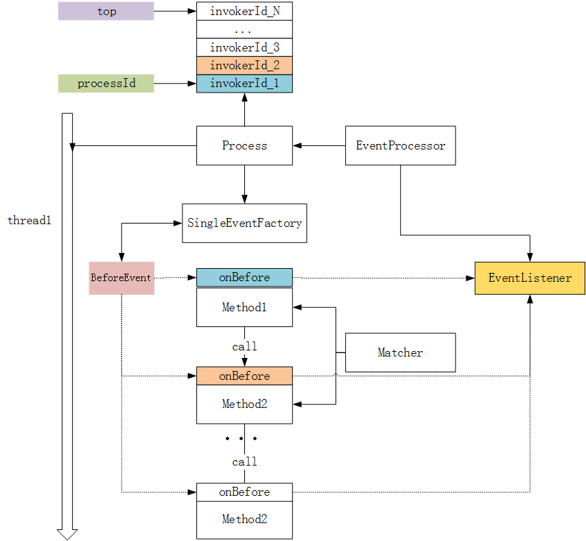

上面通过SingleEventFactory产生了BeforeEvent对象，可以通过EventProcessor获取到EventListener对象，并进行回调。

#### 5.3 Spy.Ret

前面介绍过，插桩后的代码是通过Spy.Ret.status来控制流程。定义为:

```
public static class Ret {

        public static final int RET_STATE_NONE = 0;
        public static final int RET_STATE_RETURN = 1;
        public static final int RET_STATE_THROWS = 2;
        private static final Ret RET_NONE = new Ret(RET_STATE_NONE, null);
        /**
         * 返回状态(0:NONE;1:RETURN;2:THROWS)
         */
        public final int state;
        /**
         * 应答对象
         */
        public final Object respond;

        private Ret(int state, Object respond) {
            this.state = state;
            this.respond = respond;
        }
    }
```

即返回结果中：

1. 0 ：不处理，继续原流程
2. 1 ： 直接返回，流程不再往下走
3. 2 ：抛出异常，流程以异常的方式结束

这个状态是用户指定返回的，但EventListener的定义为:

```
public interface EventListener {
    void onEvent(Event event) throws Throwable;
}
```

没有返回值。咋回事？？？实际上，jvm-sandbox是通过异常来控制流程可传递参数的，开头的例子中

```
ProcessControlException.throwReturnImmediately(null);
```

是jvm-sandbox封装的工具类。通过在对应的事件中抛出异常或者正常返回可以控制原方法的流程，官方给出的状态机为：

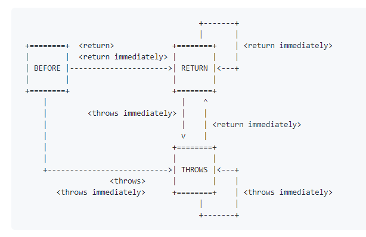

具体到实现如下:

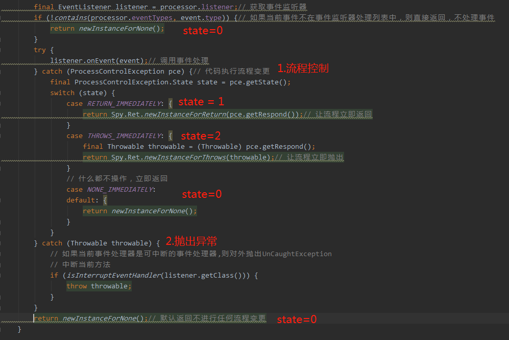

通过在EventListener中抛出ProcessControlException，并设置state对应的值来判断流程的具体走向。


上面介绍了jvm-sandbox如果通过AOP实现了事件机制通知，最后总结整个过程如下：

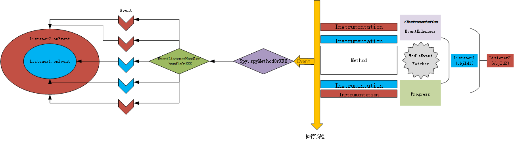


