# Sentinel Core流程分析

&emsp;上次介绍了Sentinel的基本概念，并在文章的最后介绍了基本的用法。这次将对用法中的主要流程和实现做说明，该部分主要涉及到源码中的sentinel-core模块。

#### 1.token获取

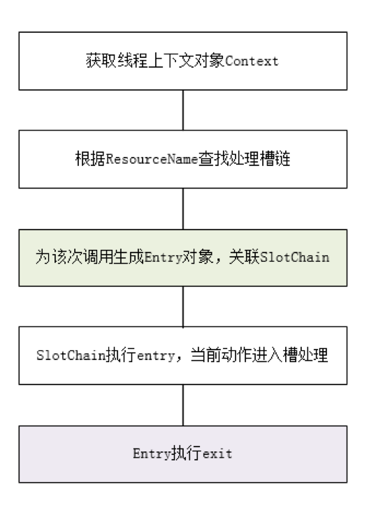

&emsp; 如上为token获取的主流程，首先会先获取线程的上下文对象Context，然后根据ResourceName查找对应的处理槽链，获得SlotChain后，生成该次调用动作的Entry对象，该对象会关联对应SlotChain。内部会调用SlotChain的entry方法，让entry动作进入每个槽，后续需要调用Entry的exit方法，让exit动作进入SlotChain的每个槽。

&emsp; 其中第三步生成的Entry对象为CtEntry对象，其模型上是一个链表，会将每次entry动作生成的Entry对象串联起来

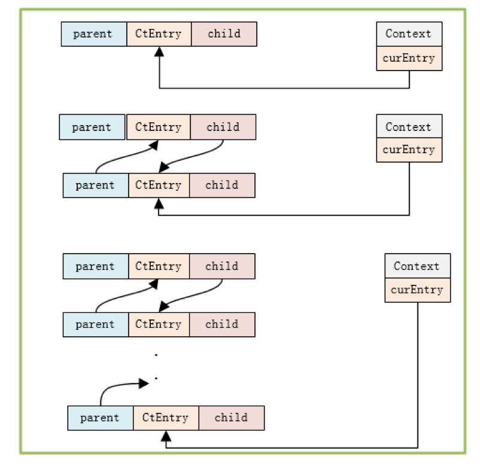

&emsp; 如上图，每new一个CtEntry，都会传入context对象。由于每次操作会将当前Entry赋值context的curEntry，每次new一次时，会检查该属性，如果为空，则是第一个节点，直接复制给curEntry；如果非空，则该值为上一个节点，将该值复制给当前值的parent，并将该值的child指向当前节点。做完这些动作后将context的curEntry指向当前节点。具体过程如上图示。

&emsp; 执行entry.exit，内部会判断context.curEntry是否是执行时的entry，此举是为了控制exit顺序保持后进先出。如果判断不通过，说明不是按照后进先出的顺序执行exit，会从执行的entry开始，到根节点逐个进行exit，并抛出异常。如果判断通过，则调用对应的SlotChain执行exit，并更改context.curEntry，将其指向当前节点的父节点，但不解除Entry链的关系。

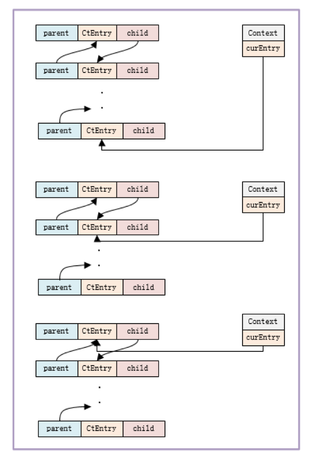

#### 2.查找处理槽链

&emsp; 执行时会先从本地的缓存中查找是否已经有该资源对应的处理槽链，如果没有，则重新新生成一个。新加载时，使用SPI，查找系统提供的SlotChainBuilder实现，若有除默认的DefaultSlotChainBuilder之外的实现在，则使用第一个，否则使用默认的Builder。默认的Builder提供的处理槽链如下

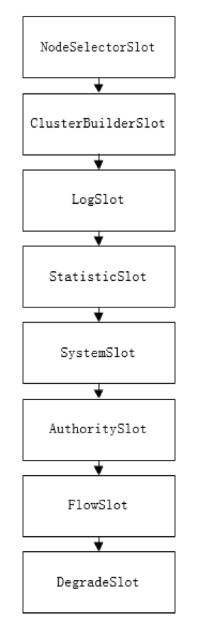

#### 3.执行处理槽链

&emsp; 槽的处理过程如下：

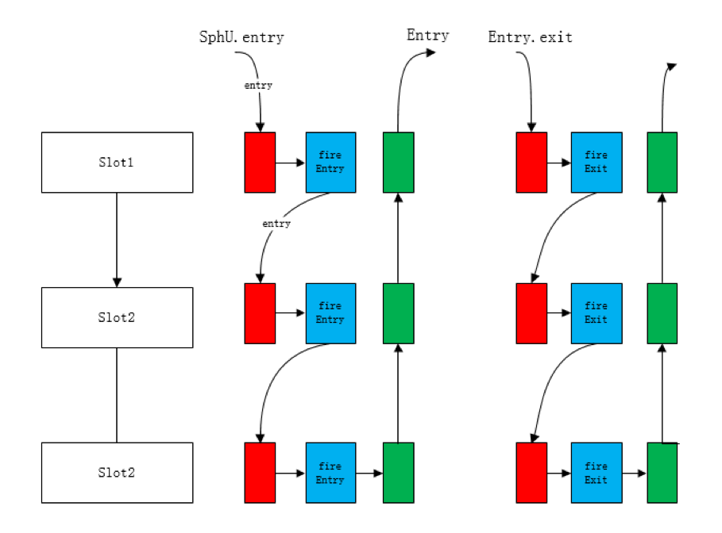

&emsp; ProcessorSlotChain为一个链表，执行slot的entry方法会进入到Slot的内部，在内部可以通过fireEntry执行链表中下一个slot的entry方法(如果存在)。如上，在fireEntry之前和之后可以有每个slot自己的处理逻辑，从而形成了类似过滤器链的结构。同理，exit过程也类似

##### 3.1. NodeSelectorSlot

&emsp; 负责收集资源的路径，并将这些资源的调用路径，以树状结构存储起来，用于根据调用路径来限流降级；该动作发生在fireEntry动作前。

&emsp; 如下代码将构建出相对应的调用路径:

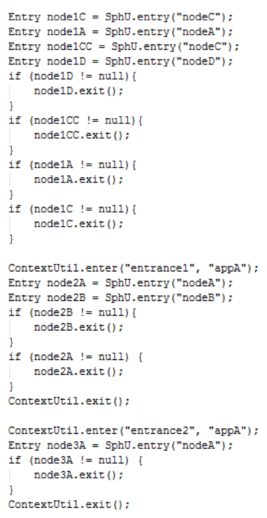

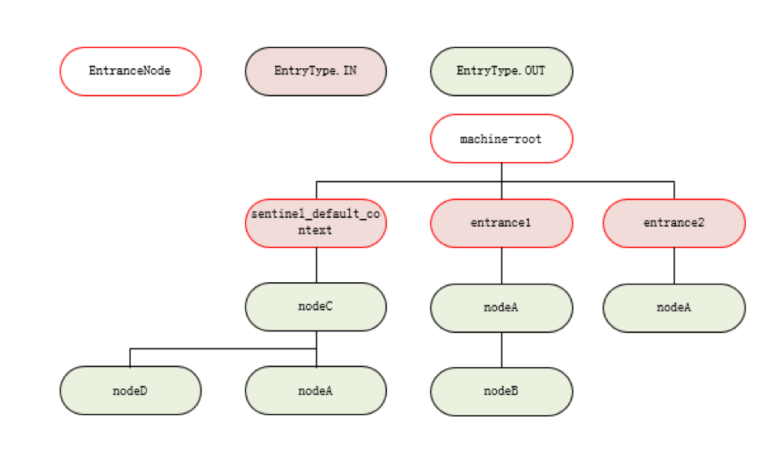

&emsp; 执行SphU.entry时会先获取线程上下文对应的Context，如果没有则新增一个。对于node1C，直接调用SphU.entry，会自动生成一个默认的Context，内部会调用ContextUtil.enter，并设置EntranceNode(sentinel_default_context)，然后将该EntranceNode接入到虚拟EntranceNode(machine-root)的子节点列表中。对于node2A和node3A，由于调用了ContextUtil.enter，相当于显示指定了Context，并设置了EntraceNode(entrance1)和EntraceNode(entrance2)。SphU.entry在没有指定EntryType时，将设置EntryType为OUT。
实现代码如下：

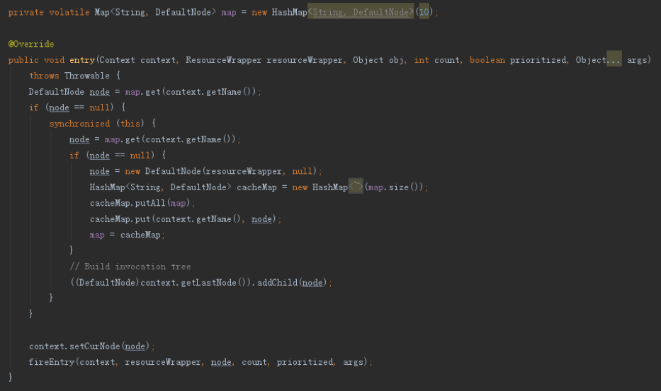

&emsp; 实现上，由于同一个资源共享同一个ProcessorSlotChain对象，因而不同Context调用同一个资源时会使用到同一个NodeSelectorSlot对象。代码中直接使用ContextName相当于是使用了ResourceName-ContextName进行判断。为了在对应的Context下构建调用链，内部维护了一个Map<String,DefaultNode>，其中key为对应线程上下文的ContextName,value为该上下文调用链中的各个Node。对于第一次访问的资源，会在对应的Context链下新增一个Node，并将该节点做为子节点链接到链上最近访问的那个节点上，从而完成调用链的构建。对于重复出现的资源，只会使用第一次出现的顺序。在该slot获得的Node节点将传入后续各个槽进行处理。

##### 3.2.ClusterBuilderSlot

&emsp; 用于存储资源的统计信息以及调用者信息，例如该资源的 RT, QPS, thread count 等等，这些信息将用作为多维度限流，降级的依据；该动作发生在fireEntry动作前。

&emsp; 上面的例子经过该slot后将新增如下ClusterNode节点

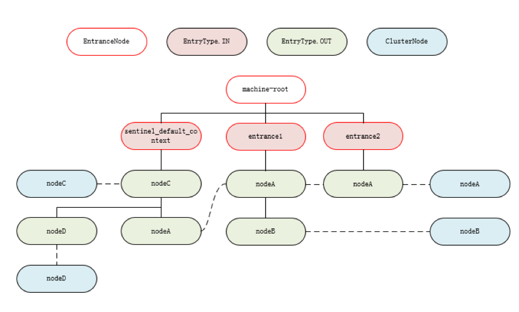

&emsp; 上面说过，由于同一个资源共享同一个ProcessorSlotChain对象，因而不同Context调用同一个资源时会使用到同一个NodeSelectorSlot对象，为了统计该种资源的Cluster信息，直接使用一个ClusterNode节点表示即可。
    实现上，ClusterBuilderSlot还持有一个静态的ClusterNodeMap，用于缓存所有资源的ClusterNode信息。当经过该slot时，会判断Map中是否有该资源的节点信息，没有则新建一个。

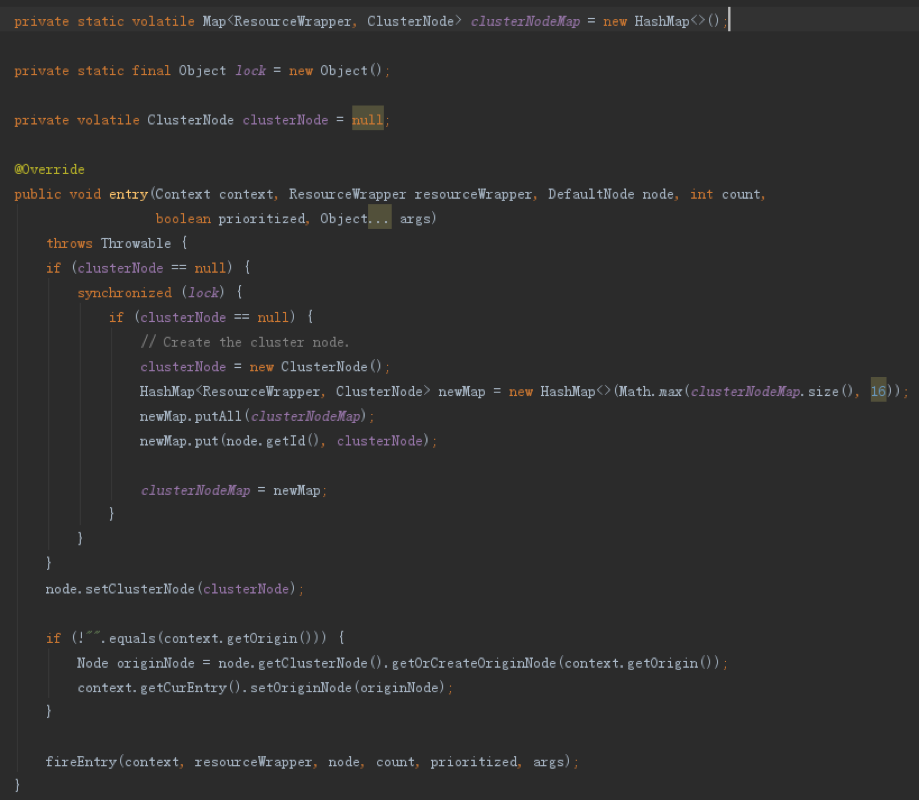

&emsp; 上面还有一段内容是设置节点的Origin信息节点的内容。如下图，ClusterNode统计了同一种资源的统计信息，而不区分不同的Context来源，内部使用originCountMap区分不同的来源的统计情况。
    对于默认的sentinel_default_context，其orgin设置为空("")，因而Cluster没有该Context的Origin信息

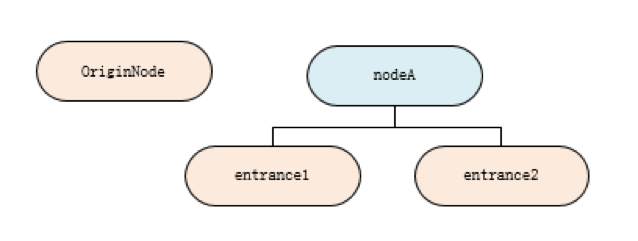

##### 3.3.LogSlot

&emsp; 用于打印日志，在发生限流或者降级时输出特定日志；该动作发生在fireEntry动作后。

##### 3.4.StatisticSlot

&emsp; 用于记录、统计不同纬度的 runtime 指标监控信息；该动作发生在fireEntry动作后。

&emsp; 该Slot的动作发生在fireEntry后，根据上面SlotChain执行图，该动作会在后续Slot检查执行后再执行。后续检查包括了权限检查，系统指标，用户自定义的限流和降级规则。

&emsp; 如下图，该Slot的动作如下：

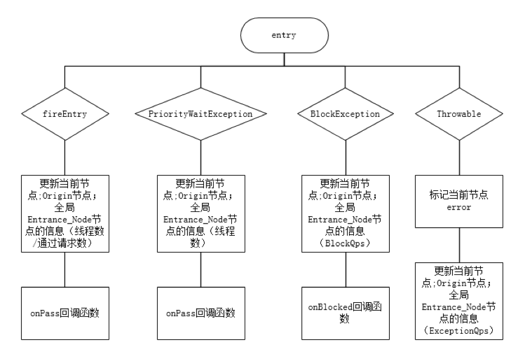

&emsp; 若成功经过后续各个Slot的检查，相当于获得了token，则会更新统计信息，包括增加线程数（ThreadNum），增加通过请求数（PassRequest），涉及的节点包括：

1. 当前节点；当前节点的Origin节点（若存在）

2. 全局Entrance_Node节点（若当前节点类型为EntryType.IN）；执行后将调用onPass回调函数。

&emsp; 其他情况如图示，包括:

1. 在获取token设置了优先策略，等待超时抛出PriorityWaitExeption（注：为什么只增加ThreadNum但不增加PassRequest，却执行了onPass回调函数？这里PriorityWatitException并不是BlockException，抛出PriorityWaitException时，该请求已经获取了令牌，可以执行后续的操作，只是不在当前窗口，这点后续会说明）

2. 后续Slot规则不通过，抛出BlockException

3. 发生其他异常，这时候会设置当前节点的Error值，为exit动作做判断

&emsp; 退出的动作如下，该行为发生在fireExit前，用于统计成功时的响应时间，减去获取token时的线程数，增加成功请求数（SuccessRequest）

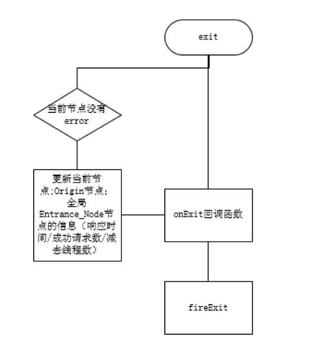

&emsp; 具体的统计方法，后续会对StatisticNode做说明。

##### 3.5.SystemSlot

&emsp; 通过系统的状态，例如 load1 等，来控制总的入口流量；

&emsp; 检查当前系统指标是否正常，只检查入口流量节点。包括全局QPS，全局线程数，全局平均响应时间，系统负载，CPU负载。

##### 3.6.AuthoritySlot

&emsp; 根据配置的黑白名单和调用来源信息，来做黑白名单控制；

##### 3.7.FlowSlot

&emsp; 用于根据预设的限流规则以及前面 slot 统计的状态，来进行流量控制；

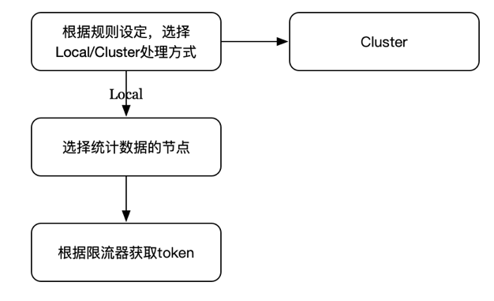

&emsp; 首先会根据规则设定的模式，选择处理方式，有Local和Cluster两种，这里先介绍Local方式。

&emsp; Local方式时，先选择统计数据的节点，再根据设定的限流器获取token，达到限流的目的。

###### 3.7.1 选择统计数据的节点

&emsp; 这一步将根据给定设置的应用范围，和限流策略来选择对应的节点。

&emsp; 这边先介绍默认的应用范围和限流策略，分为：

1. 应用范围：default，other

2. 限流策略：DIRECT，RELATE，CHAIN

&emsp; 选择时，将根据调用方LimitApp来选择对应的节点。若规则作用于origin上且除default和other外,如果是DIRECT策略，返回origin节点；若是作用于default上，如果是DIRECT策略，返回Cluster节点；若是作用于other上，如果是DIRECT策略，返回origin节点。上述其他情况的选择过程都是相同的，即：如果资源名为空，返回空；如果是RELATE策略，使用ClusterNode节点数据；如果是CHIAN策略，且当前节点名同规则名一致，使用当前节点数据，否则返回为空，详情可以看代码。

&emsp; 获得数据节点后，便可以使用规则中指定的限流器校验节点的数据，以获取token。

###### 3.7.2 根据限流器获取token

&emsp; 系统提供的限流器包括：

1. 默认限流器：直接拒绝

	 默认限流器采用直接拒绝的方式，若当前已经被获取的token数和需要的token数大于设定的规则，则直接拒绝，支持按线程数和QPS来算。当按QPS算时，还支持优先模式，允许参照之前的使用情况，在一定期望时间内，从后续时间借用令牌，保证当前请求能够通过。支持优先模式能够充分利用系统的资源，尽可能多的接受请求，防止请求被不必要的拦截

2. 预热限流器：参考guava，提供带预热/冷启动功能的令牌桶方法

	参考guava的预热限流器，按照请求数来计算。Token个数不是一开始就达到设定的上限，而是有个预热的过程，在预热的时间内，token的生成速度是固定的，当超过该时间后将根据可用token数，调整速率，使之增加到设定的值。这样做能够有效的防止突发流量穿透到后台服务。

4.  恒定速率限流器：根据预设的速率进行恒定控制

	根据设定的QPS，可以得到每个token所需的恒定时间，对于所需的token数，能够预估所需的时间。若该等待时间大于最大等待时间，则拒绝，否则更新上次通过时间（该规则在上个请求已经获取token后的预期时间），加上该次需要的时间，并让该次请求进行等待。能够保证token的获取速率是平滑恒定的，达到削峰填谷，防止通过的请求扎堆在窗口的前段。

5. 预热的恒定速率限流器：前期同预热限流器相同，过了预热时间后，将按照恒定的速率获取token。

##### 3.8.DegradeSlot

&emsp; 则通过统计信息以及预设的规则，来做熔断降级；

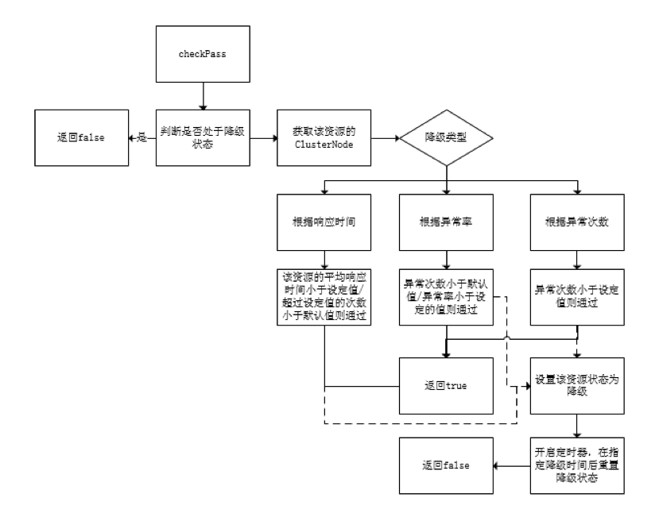

&emsp; 降级的流程如上：

1. 流程进来时，如果该规则（资源）已经处于降级状态，则直接返回校验不通过

2. 若不处于降级状态，则获取该资源的ClusterNode节点数据，按照设定的降级类型进行判断：

	1) 根据响应时间判断：若该资源的平均响应时间小于规则的设定值，则重置不通过的次数为0，并返回true；如不通过的次数小于默认值，则返回true；否则进入降级流程

	2) 根据异常率判断：若该资源异常次数小于默认值或者异常率小于设定值，则返回true；否则进入降级流程

	3) 根据异常次数判断：若异常次数小于设定值，则返回true；否则进入降级流程

3. 降级流程：将资源状态置为降级，并开启定时器，该定时器将在规则设定的时间后执行，执行时将重置该规则指定的资源降级状态

#### 4.Node

##### 4.1 滑动窗口模型

&emsp; Sentinel 底层采用高性能的滑动窗口数据结构 LeapArray 来统计实时的秒级指标数据，可以很好地支撑写多于读的高并发场景。

&emsp; LeapArray主要包括如下属性 ：

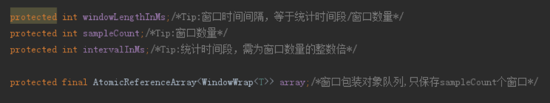

&emsp; 滑动窗口模型如下：

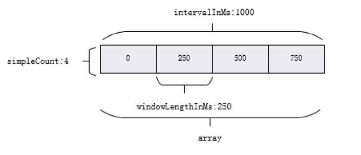

&emsp; LeapArray的主体实现如下（去除原有备注，换上自己的备注）:

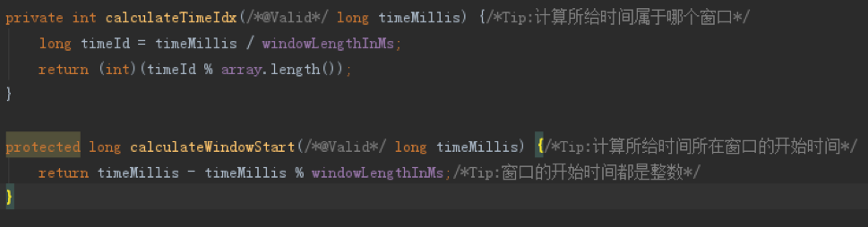

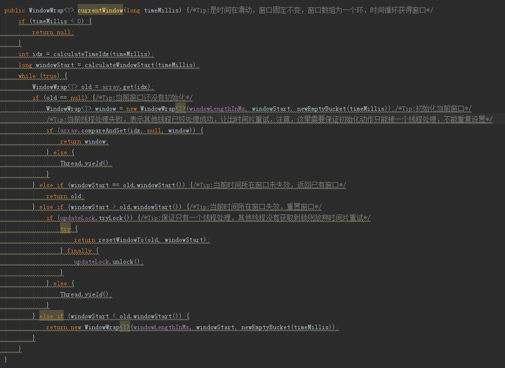

&emsp; 将array抽象为一个环，则上面的流程可以按如下图看：

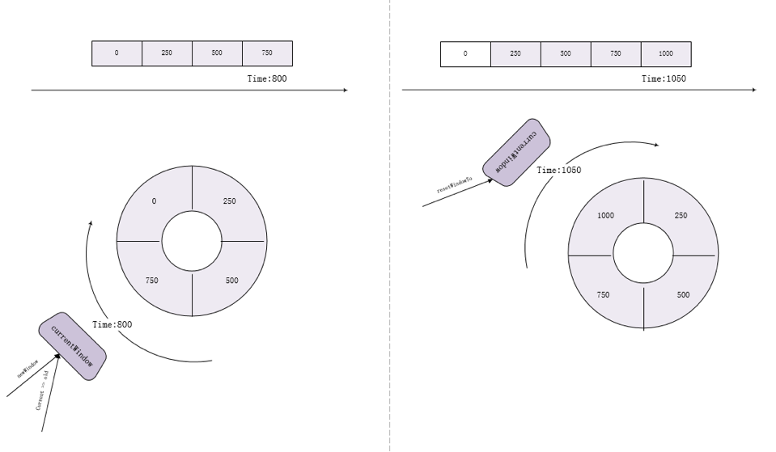

&emsp; 主体流程为：

1. 计算所给时间所在窗口索引号：i

2. 计算所给时间所在窗口开始时间：ws

3. 根据索引号i获取现有窗口对象:window

4. 根据现有窗口对象:window，判断是否需要更新当前窗口

	1) 如果现有窗口对象为空，则初始化当前窗口

	2) 如果现有窗口的开始时间同ws一致，则说明现有窗口还未过期，继续使用当前窗口

	3) 如果现有窗口的开始时间小于ws，说明现有窗口已经过期，需要更新该窗口

##### 4.2 StatisticNode

&emsp; StatisticNode为Sentinel实现监控统计的必要组件，该组件能够实现不同粒度，不同维度的数据监控统计。

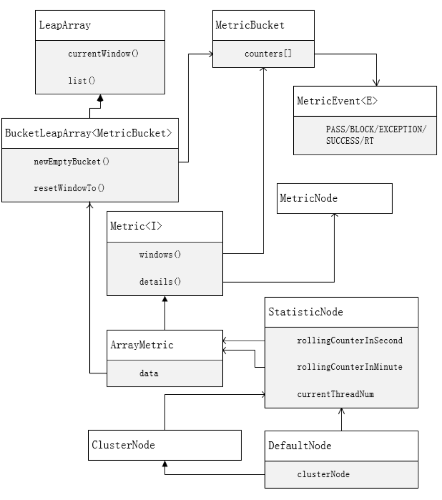

&emsp; 上图为Statistic必要组件的组成：

1. LeapArray：滑动窗口模型，实现不同时间粒度的滑动窗口行为，LeapArray为抽象类

2. BucketLeapArray：LeapArray的实现类，主要实现方法

	1) newEmptyBucket：初始化窗口的动作，这里初始化时设置了包装类MetricBucket

	2) resetWindowTo：更新窗口的动作，这里重置了窗口的开始时间，以及重置了窗口中包装类的值

3. MetricBucket：存储着各个统计维度的计数，统计的维度为MetricEvent枚举值

4. MetricEvent：统计维度，包括

	1) PASS：获得令牌的计数

	2) BLOCK：未获得令牌的计数

	3) EXCEPTION：发生异常的计算

	4) SUCCESS：获得令牌并成功归还的计数

	5) RT：请求时间

5. Metric：统计接口，按接口译，可以理解为“可统计的”，聚合了采集统计信息以及生成统计信息的方法。采集统计信息为各个维度的add方法，生成统计信息使用windows和details方法，返回MetricNode包含各统计信息

	1) windows：返回现在LeapArray中的统计信息，以MetricBucket形式

	2) details：返回现在LeapArray中的统计信息，以MetricNode的形式

6. MetricNode：Bean，各属性为统计信息的值，相当于当前系统的一个镜像数据，将计数数据按照维度进行运算过。

7. ArrayMetric：Metric的实现类，内部使用LeapArray作为滑动窗口统计各个窗口的数据

8. StatisticNode：统计节点，内部使用1秒和1分钟的滑动窗口来统计数据，同时还会记录当前的线程数

	1) rollingCounterInSecond：sampleCounter为2，intervalInMs为1秒的滑动窗口

	2) rollingCounterInMinute：sampleCounter为60，intervalInMs为1分钟的滑动窗口

9. ClusterNode : 继承自StatisticNode，对于某一个资源的全局统计

10. DefaultNode：继承自StatisticNode，对于某一个资源在相应上下文中的实现，保存了一个指向ClusterNode的引用。另外还保存了子节点列表，当在同一个context下多次调用SphU.entry不同资源时会创建子节点

&emsp; 主要调用流程如下：

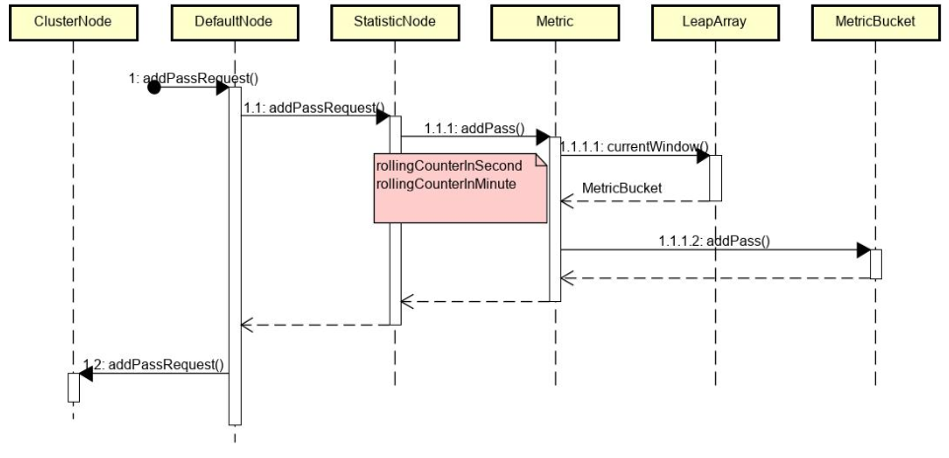

&emsp; 流程到最后，将累加MetricBucket中维护的各维度计数数据。这些数据可以在调用时转为MetricNode提供格式化数据。

##### 4.3 LeapArray

&emsp; LeapArray的实现包括:

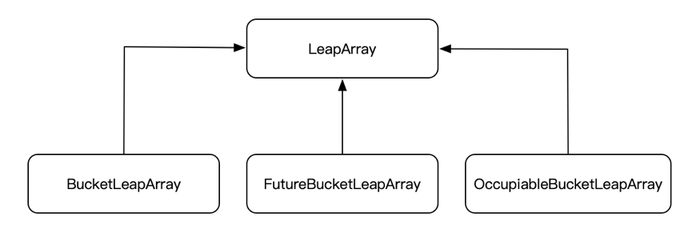

1. BucketLeapArray：每个窗口持有一个MetricBucket，该对象存储着当前窗口内各个维度的计数值

2. FutureLeapArray：只存储比当前时间大的窗口

3. BorrowBucketLeapArray：持有FutureLeapArray，支持从后续窗口中借用资源

4. LeapArray的默认实现上，每个窗口在intervalInMs内都是有效的

&emsp; 如图，在某个时间800时，intervalInMs内的各个窗口都是有效的，这时候计算qps将使用各个窗口的统计值之和。

&emsp; FutureLeapArray重写了isWindowDeprecated方法，如下

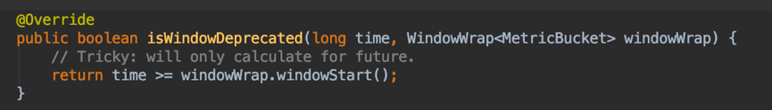

&emsp; 只要给定时间大于给定窗口的起始时间则算窗口失效;当给定时间为当前时间，窗口为上一个窗口或者当前时间所在窗口时，都是失效的，只能存给定时间后的窗口。上图中，在给定的时间为800时，只有1000这个窗口是有效的。

&emsp; BorrowBucketLeapArray，主要用于在进行限流时支持有限模式，当当前的token不够时，允许先从后续窗口中获取token。内部持有一个FutureLeapArray，该窗口队列用于存储在当前时间后的窗口。通过重写LeapArray的addWaiting方法，占用指定的后续窗口计数值，再通过currentWaiting方法，可以获取当前时间已经占用后后续窗口多少个资源。

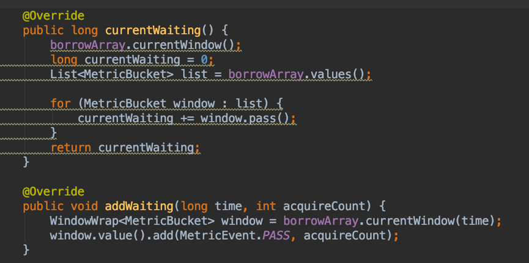

&emsp; 因为borrowArray中的窗口可能在之前已经初始化或者使用过，因而，BorrowBucketLeapArray在初始化窗口或者更新窗口时，会考虑borrowArray中已有的窗口数据，如下重写的newEmptyBucket方法和resetWindowTo方法。

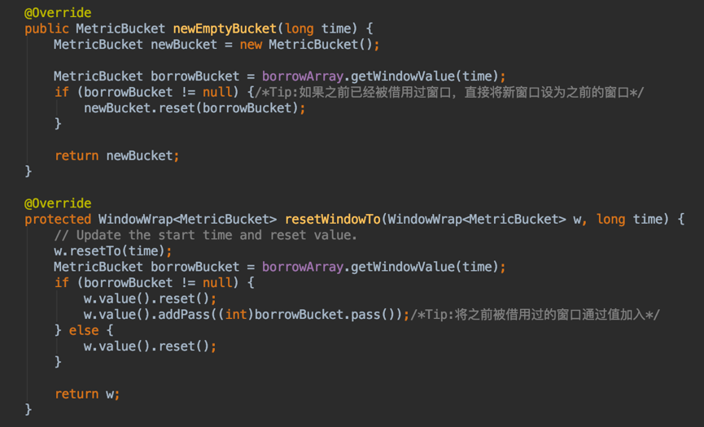

&emsp; newEmptyBucket方法初始化时，如果发现该时间所在的窗口已经在FutureBucketArray中出现过，将会使用该窗口的值。同理，restWindowTo在更新时，如果所给时间窗口已经存在，则加上之前已经存在的计数值。

&emsp; StatisticNode在使用时还会根据之前统计的请求，估算后续窗口的可用请求，再从后续窗口借用token，具体实现如下：

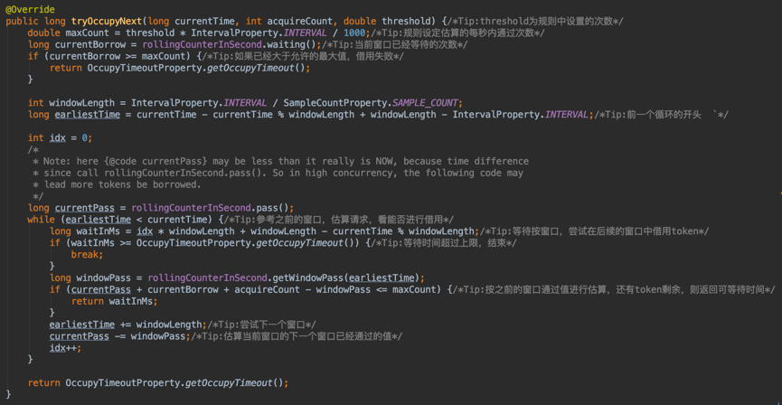

&emsp; 执行时会先计算离当前时间最远的一个有效窗口的开始值，如下图，假设当前窗口为curr，则earliestTime落在earliest 1的开始处。然后从earliest 1开始，逐次增加一个窗口，以逐步根据之前的Pass值，估算后续可能出现的请求，如果根据之前的某个窗口的值估算出后续某个窗口存在空闲的token，且等待时间在期望的时间内，则hold住当前请求，使之到达特定窗口后再继续通过。下图假设设定规则的最大QPS为20，在前3个窗口时，每次都没有达到最大限定的最大值，则可以认为，在curr值后的一个窗口内也是该种情况。当curr突然到来22个请求时，根据规则将有2个请求被拒接掉，但根据之前窗口的情况，这两个请求可以在后续的第二个请求中完成，以此充分的利用系统的资源。

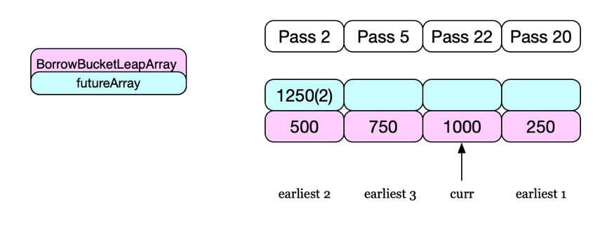

##### 5.RuleManager

&emsp; 各规则管理的模式都一致，主要用到如下3个组件

1. RuleManager，具体的规则实现类，没有具体的实现接口，但是都有loadRules方法

2. ProertyListener，规则监听器

3. SentinelProperty，观察者，持有各监听器

&emsp; RuleManaer内部持有PropertyListener和SentinelProerty，并且RuleManager有PropertyListener的内部实现类

&emsp; 具体流程为，初始化时RuleManager调用SentinelProepety.addListener，设置监听器。SentinelProperty会调用PropertyListener.configLoad，完成初始化。后面调用RuleManager.loadRules重新更改规则时，内部调用者SentinelProerty.updateValue，该方法会遍历SentinelProperty内部持有的所有Listener，逐个执行PropertyListner.configUpdate，从而通知到RuleManager规则发生了改变，以便让RuleManager做出处理。

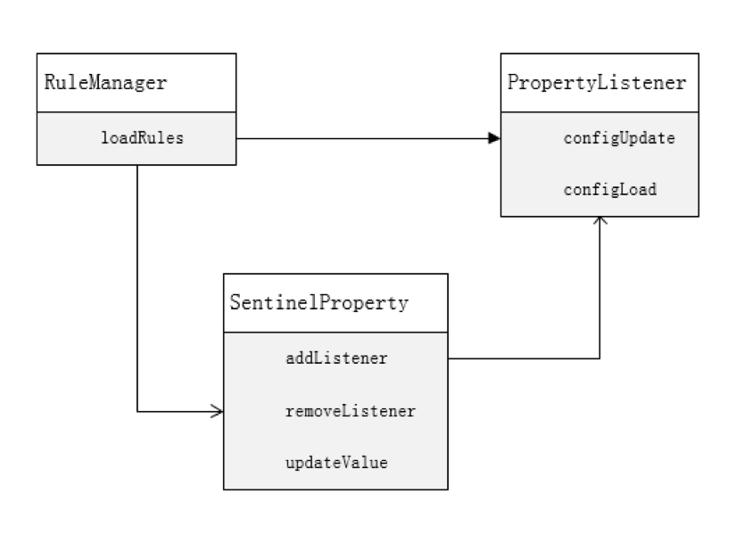

