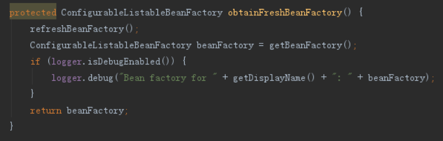

# Spring启动流程

&emsp;Spring用了挺久的了，但是没系统做过总结，刚好前段时间在做一个Spring封装的项目，趁机回顾了下，便基于Spring framework 4.3.22做了源码分析。

&emsp;刚开始接触Spring时的入门例子大致如下：

&emsp;设置配置文件路径，初始化ApplicationContext然后获取Bean，处理完后关闭context即可。这一节先来了解Spring的启动过程。

#### 一. 启动

&emsp;跟踪ClassPathXmlApplicationContext的构造方法可以看到如下内容：

&emsp;里面设置了配置文件的路径，并且调用了父类AbstractApplicationContext的refresh方法，该方法完成了Spring环境的初始化。如下，为refresh方法的主要过程（为方便排版，去除了原来的注释和空格）：

&emsp;下面将介绍各个方法步骤的内容，但不进行过多的深入，后面会单独对每个深入的细节进行详细的介绍，这节先介绍大概过程。

##### 1.1. try

###### 1.prepareRefresh

&emsp;PrepareRefresh的内容如上，该方法主要进行环境的准备，包括Context的启动时间，活动状态，然后会设置context中的配置数据源，使用默认的StandardEnvironment对象，该对象添加了System.env()属性和System.properties()属性。initPropertySources方法用于初始化context 中 environment的属性源。在AbstractApplicationContext中为空实现。其他子类的实现如下：

&emsp;对于GenericWebApplicationContext和AbstractRefreshableWebApplicationContext的实现大致一致，都是:

&emsp;通过在getEnvironment方法中，重写createEnvironment方法，将默认的StandardEnvironment替换为StandardServletEnvironment， Environment的关系图为：

&emsp;因而会执行该类的initPropertySources方法，为context添加ServletContext和ServletConfig对应的配置属性源。具体的Environment中配置属性源的加载会在后面单独进行介绍。

###### 2.obtainFreshBeanFactory

&emsp;该方法的实现如下，通过refreshBeanFacotry重置AbstractApplicationContext持有的BeanFacotry，然后通过getBeanFacotry获得该对象再返回。

&emsp;AbstractApplicationContext中refreshBeanFacoty方法和getBeanFactory方法都是抽象方法，具体实现在AbstractRefreshableApplicationContext上。

&emsp;如上，增加了方法的注释，重点在于loadBeanDefinitions方法，该抽象方法在具体实现子类上用于处理不同场景下Bean定义的加载，如Xml配置，注解配置，Web环境等，具体实现会在后面展开。

&emsp;目前，只是完成了Bean定义的加载，没有出现Bean的实例化。

###### 3.prepareBeanFactory

&emsp;为第2步返回的BeanFactory设置基础属性。包括：

1. 设置ClassLoader

2. 设置beanFactory的表达式语言处理器，默认使用EL表达式，可以使用#{bean.xxx}的形式来调用相关属性值

3. 添加默认的属性编辑器

4. 添加后置处理器ApplicationContextAwareProcessor，在Bean初始化后自动执行各Aware接口的set方法，包括ResourceLoaderAware、ApplicationEventPublisherAware、MessageSourceAware、ApplicationContextAware、EnvironmentAware

5. 添加需要忽略的依赖注入类型，这些类型会在ApplicationContextAwareProcessor中通过BeanPostProcessor后置处理，包括第（4）点涉及的各内容

6. 预先设置用于自动依赖注入的接口对象，包括BeanFactory、ResourceLoader、ApplicationEventPublisher、ApplicationContext

7. 如果存在loadTimeWeaver这个Bean，则增加对应的后置处理器

8. 如果不存在environment，systemProperties，systemEnvironment这3个默认的环境属性Bean，则注册对应的单例，这3个对象已经在第1步中初始化完成

&emsp;具体可以看源码，这步主要预先设置公共的单例Bean并添加一些公共的后置处理动作，主要体现在BeanPostProcessor上。

###### 4.postProcessBeanFactory

&emsp;所有Bean的定义已经加载完成，但是没有实例化，这一步可以修改bean定义或者增加自定义的bean，AbstractApplicationContext中为空实现。

&emsp;如上，以AbstractRefreshableWebApplicationContext为例，其增加了ServletContextAwareProcessor后置处理器，用于处理ServletContextAware接口和ServletConfigAware接口中相关对象的自动注入。同时新增了Web相关的应用范围，包括：request,session,globalSession和application，并增加了各范围默认的单例对象。最后增加了Web环境相关的环境配置Bean,包括servletContext，servletConfig，contextParameters和contextAttributes。

&emsp;该步骤的功能同第3步类似，都能够增加一些后置处理器。

###### 5.invokeBeanFactoryPostProcessors

&emsp;在Spring容器中找出实现了BeanFactoryPostProcessor接口的Bean并执行。Spring容器会委托给PostProcessorRegistrationDelegate的invokeBeanFactoryPostProcessors方法执行，内容如下：

&emsp;invokeBeanFactoryPostProcessors在处理时，将BeanFactoryPostProcessor分为了两类进行处理，BeanFactoryPostProcessor和BeanDefinitionRegistryPostProcessor，其中BeanDefinitionRegistryPostProcessor继承自BeanFactoryPostProcessor。执行的时候，先找出所有的BeanDefinitionRegistryPostProcessor执行再找出所有BeanFactoryPostProcessor执行。因为BeanDefinitionRegistryPostProcessor继承自BeanFactoryPostProcessor，所以执行后者时会过滤掉前者的内容。

&emsp;在执行BeanDefinitionRegistryPostProcessor时，会按照如下的优先级，分类先执行postProcessBeanDefinitionRegistry方法，再统一执行所有的postProcessBeanFactory方法，，规则为：

1. 筛选实现了PriorityOrdered接口的BeanDefinitionRegistryPostProcessor实现

2. 筛选实现了Ordered接口的BeanDefinitionRegistryPostProcessor实现，并执行

3. 执行其他BeanDefinitionRegistryPostProcessors

&emsp;在执行BeanFactoryPostProcessor也会按照如上的规则，执行BeanFactoryPostProcessor方法。

&emsp;***这里会实例化并初始化实现BeanFactoryPostProcessor接口的类并执行，若存在依赖的的Bean也会被初始化和实例化，具体的过程会在介绍Bean初始化过程时说明。***

###### 6.registerBeanPostProcessors

&emsp;从Spring容器中找出的BeanPostProcessor接口的Bean，并添加到BeanFactory内部维护的List属性中，以便后续Bean被实例化的时候调用这个BeanPostProcessor进行回调处理。该方法委托给了PostProcessorRegistrationDelegate类的registerBeanPostProcessors方法执行。执行过程同步骤5类似，也是按照优先级进行了筛选，具体顺序为：

1. 将实现PriorityOrdered接口的BeanPostProcessor列表注册到ApplicationContext中

2. 将实现Ordered接口的BeanPostProcessor列表注册到ApplicationContext中

3. 将剩余的BeanPostProcessor列表注册到ApplicationContext中

4. 将实现MergedBeanDefinitionPostProcessor接口的BeanPostProcessor列表注册到ApplicationContext中

&emsp;其中MergedBeanDefinitionPostProcessor接口继承自BeanPostProcessor接口，因而，上述第（4）点的列表同头三点的列表式存在交集的。但是，AbstraceApplicationContext在添加BeanPostProcessor时，会先将存在的对象删除，再添加新的，如下：

&emsp;因而执行顺序为因而执行顺序为:PriorityOrdered、Ordered、NotOrdered、MergedBeanDefinitionPostProcessor。

&emsp;***这里会实例化并初始化实现BeanPostProcessor接口的类，但不执行，若存在依赖的的Bean也会被初始化和实例化。***

###### 7.initMessageSource

&emsp;在Spring容器中初始化一些国际化相关的属性

###### 8.initApplicationEventMulticaster

&emsp;在Spring容器中初始化事件广播器对象SimpleApplicationEventMulticaster，并将该对象作为单例applicationEventMulticaster注册到Context中。该广播器用于广播ApplicationEvent事件对应的ApplicationListener接口Bean。

&emsp;***PS：根据以上的顺序，在这之前实例化的Bean，都不会经过BeanFactoryPostProcessor和BeanPostProcessor的处理，包括因为依赖而实例化的Bean,还有提前通过new注册的Bean（只有直接调用BeanFactory.getBean方法获取的bean才会进行后置回调）。这里需要注意，Context提前将两种后置处理器的所有实现都提前加载了，由于实例化前需要将依赖的Bean提前实例化，所以被这两种后置处理器依赖的Bean的初始化动作，是不会被其监听到的。***

###### 9.onRefresh

&emsp;模板方法，可用于refresh动作的扩展，默认为空实现。在SpringBoot中主要用于启动内嵌的web服务器。

###### 10.registerListeners

&emsp;找出系统中的ApplicationListener对象，注册到时间广播器中。如果有需要提前进行广播的时间，则执行广播.

###### 11.finishBeanFactoryInitialization

&emsp;实例化BeanFactory中已经被注册但是未实例化的所有实例(懒加载的不需要实例化)，主要操作是BeanFacotry的preInstantiateSingletons方法。该方法分为两部分：

1. 遍历已经解析出来的所有beanDefinitionNames，如果不是抽象类、是单例且没有设置懒加载，则进行实例化和初始化。

2. 在spring容器管理的所有单例对象（非懒加载对象）初始化完成之后调用SmartInitializingSingleton回调接口，注意，该回调只会发生在启动阶段，后续懒加载对象再初始化的话，不会再进行回调

12.	finishRefresh

&emsp;刷新后的其他动作，包括：

1. 初始化生命周期处理器DefaultLifecycleProcessor，该处理器管理所有实现了Lifecycle接口的类

2. 通知所有Lifecycle.onRefresh，该方法内部调用LifecycleProcessor.startBeans(false)，这里只会调用实现了SmartLifecycle接口，并且设定了AutoStartup的实例，回调将按照设定的优先级，从第到高执行

3. 发布ContextRefreshedEvent通知事件

4. 调用LiveBeansView的registerApplicationContext方法

##### 1.2. catch

###### 1.destroyBeans

&emsp;销毁所有已经注册的单例，对于实现了DisposableBean的类，会先单独进行销毁，以便执行回调方法，再清理所有单例的缓存信息和剩余的单例实例

###### 2.cancelRefresh

&emsp;将当前的活动状态标识未false

##### 1.3. finally

1. resetCommonCaches

&emsp;清除缓存

#### 二. 关闭

&emsp;AbstractApplicationContext的close方法如下：

&emsp;主要是调用doClose方法，然后判断是否有shutdownHook，如果有则移除该钩子，避免重复关闭，因为默认的shutdownHook也是调用的doClose方法。

&emsp;doClose方法如下：

&emsp;过程为：

1. 去除当前Context的MBean，如果开启了MBean

2. 发送ContextClosedEvent通知事件

3. 回调声明周期管理器的onClose方法

4. 销毁已经实例化的单例，同上面提到的一致

5. 重置BeanFacotry id为空

6. 调用onClose方法，默认实现为空，对于SpringBoot应用，在前面说过，SpringBoot应用重写了onRefresh方法用于启动web服务器，而在这里，则用于关闭内嵌的web服务器。（***PS：注意这里，web服务器的关闭是在所有Bean销毁后再关闭的，因而在关闭服务器前，web还会接收Http请求，有可能导致请求无法处理，官方给了一个解决方法，详见[issue https://github.com/spring-projects/spring-boot/issues/4657](issue https://github.com/spring-projects/spring-boot/issues/4657)）***

#### 三. Start Stop方法

&emsp;这两个方法来自Lifecycle接口，如下，简单的调用了DefaultLifecycleProcessor的start和stop方法，回调Lifecycle的实现类。

#### 四. 扩展接口顺序

&emsp;我们知道Spring中存在很多预设的接口，用于扩展。通过以上分析，目前得到的回调接口顺序如下：

&emsp;后续对其他细节进行展开时，会看到更多的扩展接口，到时再更新上面的图。

