# Spring GetBean的流程


&emsp;第一节讲解Spring启动（链接）的时候说到，Spring内部先解析了所有的配置，加载所有的Bean定义后，再根据需要对Bean进行实例化和初始化。除开Spring自己主动新建的对象，第一次根据Bean定义加载对象的动作出现在AbstractApplicationContext的invokeBeanFactoryPostProcessors方法，该方法会在Spring容器中找出实现了BeanFactoryPostProcessor接口的bean列表并执行。根据之前介绍的内容，内部主要调用了AbstractBeanFactory的getBean方法，这节将对该方法进行讲解。

####  一、getBean
&emsp;在这之前，先介绍BeanFactory的层次结构，如下：

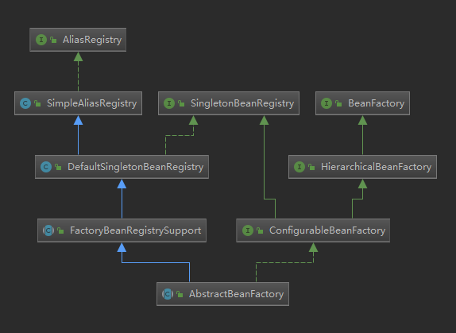

涉及到的接口和实现类为：

&emsp;AliasRegistry：别名管理接口，定义了别名管理的功能

&emsp;SimpleAliasRegistry：AliasRegistry的默认实现，内部用一个

&emsp;ConcurrentHashMap：管理别名

&emsp;SingletonBeanRegistry：单例实例管理接口，定义了单例管理的功能

&emsp;DefaultSingletonBeanRegistry：单例管理实现类，内部用Map维护着被实例化后的所有单例、单例工厂等相关信息。Map的键为bean的唯一标识，Spring内部成为raw name，一般等同于Bean定义中的id或者name或者别名等，具体规则可以从上节BeanDefinition的加载查看（链接），值为相应的对象实例。这边需要指出的一点时，对于bean定义中具有别名意义的字段，如一定情况下的name以及alias字段，只存在于SimpleAliasRegistry维护的内部Map中，通过递归查询的方式可以从一个给定的别名查找到指定的id。

&emsp;如下，DefaultSingletonBeanRegistry维护的Map中存在key为testBean，value为TestBean的对象，SimpleAliasRegistry维护的Map中存在Key为testBeanAlias1，value为testBean的记录。当通过testBeanAlias1查找bean时，会先通过AliasRegistry查找到testBean，再从通过BeanRegistry查找到对应的Bean实例。

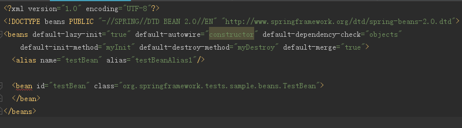

&emsp;FactoryBeanRegistrySupport：增加缓存FactoryBean实例功能，DefaultSingleBeanRegistry在生成单例后便不再持有对应的FactoryBean

&emsp;BeanFactory：定义了Bean容器的基本查询接口，同时设定了以&前缀来区别工厂Bean，即如果beanName前面有&则返回对应Bean的工厂Bean对象而不是该Bean对象。

&emsp;HierarchicalBeanFactory：在BeanFactory接口上增加了父子层级关系，以实现双亲委托。

&emsp;ConfigurableBeanFactory：按照规矩，增加了修改功能的接口，同时增加了Scope特性，默认分为single单例和prototype多例。

&emsp;AbstractBeanFactory：BeanFacoty的基本实现。

&emsp;AbstractBeanFactory的getBean方法内部调用了doGetBean，该方法提供了根据beanName获取实例的具体实现，代码如下(删除了相关的注释和空格)：


```java

protected <T> T doGetBean(
			final String name, final Class<T> requiredType, final Object[] args, boolean typeCheckOnly)
			throws BeansException {

		/*(1)*/
		final String beanName = transformedBeanName(name);
		Object bean;
		/*(2)*/
		Object sharedInstance = getSingleton(beanName);
		/*(3)*/
		if (sharedInstance != null && args == null) {
			if (logger.isDebugEnabled()) {
				if (isSingletonCurrentlyInCreation(beanName)) {
					logger.debug("Returning eagerly cached instance of singleton bean '" + beanName +
							"' that is not fully initialized yet - a consequence of a circular reference");
				}
				else {
					logger.debug("Returning cached instance of singleton bean '" + beanName + "'");
				}
			}
			bean = getObjectForBeanInstance(sharedInstance, name, beanName, null);
		}
		/*(4)*/
		else {
			/*(5)*/
			if (isPrototypeCurrentlyInCreation(beanName)) {
				throw new BeanCurrentlyInCreationException(beanName);
			}
			/*(6)*/
			BeanFactory parentBeanFactory = getParentBeanFactory();
			if (parentBeanFactory != null && !containsBeanDefinition(beanName)) {
				String nameToLookup = originalBeanName(name);
				if (args != null) {
					return (T) parentBeanFactory.getBean(nameToLookup, args);
				}
				else {
					return parentBeanFactory.getBean(nameToLookup, requiredType);
				}
			}
			/*(7)*/
			if (!typeCheckOnly) {
				markBeanAsCreated(beanName);
			}
			try {
				/*(8)*/
				final RootBeanDefinition mbd = getMergedLocalBeanDefinition(beanName);
				checkMergedBeanDefinition(mbd, beanName, args);
				/*(9)*/
				String[] dependsOn = mbd.getDependsOn();
				if (dependsOn != null) {
					for (String dep : dependsOn) {
						if (isDependent(beanName, dep)) {
							throw new BeanCreationException(mbd.getResourceDescription(), beanName,
									"Circular depends-on relationship between '" + beanName + "' and '" + dep + "'");
						}
						registerDependentBean(dep, beanName);
						try {
							getBean(dep);
						}
						catch (NoSuchBeanDefinitionException ex) {
							throw new BeanCreationException(mbd.getResourceDescription(), beanName,
									"'" + beanName + "' depends on missing bean '" + dep + "'", ex);
						}
					}
				}
				/*(10)*/
				if (mbd.isSingleton()) {
					sharedInstance = getSingleton(beanName, new ObjectFactory<Object>() {
						@Override
						public Object getObject() throws BeansException {
							try {
								return createBean(beanName, mbd, args);
							}
							catch (BeansException ex) {
								destroySingleton(beanName);
								throw ex;
							}
						}
					});
					bean = getObjectForBeanInstance(sharedInstance, name, beanName, mbd);
				}
				/*(11)*/
				else if (mbd.isPrototype()) {
					Object prototypeInstance = null;
					try {
						beforePrototypeCreation(beanName);
						prototypeInstance = createBean(beanName, mbd, args);
					}
					finally {
						afterPrototypeCreation(beanName);
					}
					bean = getObjectForBeanInstance(prototypeInstance, name, beanName, mbd);
				}
				/*(12)*/
				else {
					String scopeName = mbd.getScope();
					final Scope scope = this.scopes.get(scopeName);
					if (scope == null) {
						throw new IllegalStateException("No Scope registered for scope name '" + scopeName + "'");
					}
					try {
						Object scopedInstance = scope.get(beanName, new ObjectFactory<Object>() {
							@Override
							public Object getObject() throws BeansException {
								beforePrototypeCreation(beanName);
								try {
									return createBean(beanName, mbd, args);
								}
								finally {
									afterPrototypeCreation(beanName);
								}
							}
						});
						bean = getObjectForBeanInstance(scopedInstance, name, beanName, mbd);
					}
					catch (IllegalStateException ex) {
						throw new BeanCreationException(beanName,
								"Scope '" + scopeName + "' is not active for the current thread; consider " +
								"defining a scoped proxy for this bean if you intend to refer to it from a singleton",
								ex);
					}
				}
			}
			catch (BeansException ex) {
				/*(13)*/
				cleanupAfterBeanCreationFailure(beanName);
				throw ex;
			}
		}
		if (requiredType != null && bean != null && !requiredType.isInstance(bean)) {
			try {
				return getTypeConverter().convertIfNecessary(bean, requiredType);
			}
			catch (TypeMismatchException ex) {
				if (logger.isDebugEnabled()) {
					logger.debug("Failed to convert bean '" + name + "' to required type '" +
							ClassUtils.getQualifiedName(requiredType) + "'", ex);
				}
				throw new BeanNotOfRequiredTypeException(name, requiredType, bean.getClass());
			}
		}
		return (T) bean;
	}

```

先说下入参：

1.  name：要查找的bean名，可以为raw name，也可以为alias name或者factoryBean name，Spring内部会自行进行转换。

2. requiredType：要返回的对象类型

3. args：对象实例化时需要用到的构造参数

4. typeCheckOnly：该对象只是用来进行类型检查，而不会真正的进行使用，可以避免实例化和初始化对象

具体过程为：

1. 获取raw name

	计算所给name对应的内部beanName，具体为循环去除name前面的&，再根据之前的介绍的，如果传入的是别名，会查找到对应的raw name

2. 尝试获取bean实例

	使用上面获得的beanName，调用内部的getSingleton方法，获取对应的对象实例，赋值给sharedInstance。getSingleton方法来自于DefaultSingletonBeanRegistry，即这步尝试直接从内部维护的单例Map中获取实例。这步可以检测到手工注入的singleton，如第一节提到的ApplicationContext对象，就是Spring自己手动注册的。

3. bean实例已经存在

	若sharedInstance不为空，且args参数为空，说明该对象已经存在，不需要再进行实例化和初始化。由于在(1)的时候对所传的name去除了&，需要判断返回的对象是否符合要求。这时候，会使用getObjectForBeanInstance方法，对sharedInstance和name进行判断，返回对应的实例，该方法主要内容如下：

	1) 若name以&开头，但sharedInstance没有实现FactoryBean接口，则抛出异常

	2) 若sharedInstance没有实现FactoryBean接口，或者name以&开头，则直接将sharedInstance对象返回。即sharedInstace本身是从name对应的FactoryBean获取的对象。

	3) 若前面2个条件都不符合，则sharedInstance本身实现了FactoryBean接口,name也是以&开头，这时候会尝试从FactoryBeanRegistrySupport中根据beanName(raw name)获取已经实例化的对象。若对象为空，即首次获取，则将sharedInstace转为FactoryBean,并调用该工厂方法获取对象。这里涉及到FactoryBeanRegistrySupport的getObjectFromFactoryBean方法，该方法在使用FactoryBean获得对象后，会调用上下文中已有的BeanPostProcessor对象列表，逐个执行postProcessAfterInitialization方法，当遇到处理后的结果为空，则直接返回，否则继续遍历执行，如下，出现在AbstractAutowireCapableBeanFactory中：

	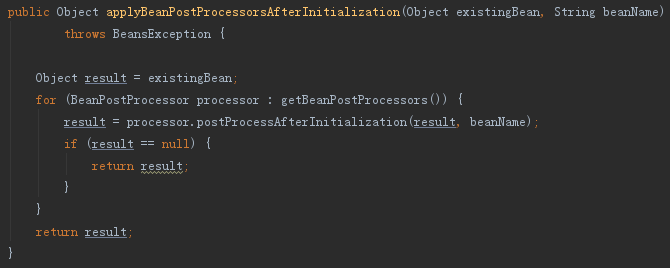

4.  Bean实例不存在

	如果没有找到beanName对应的实例，即不存在对应的单例实例，则转入实例化该对象的流程，注意单例或者多例都需要实例化。

5. 如果该beanName有对应的在初始化中的多例对象，则抛出异常。

	AbstractBeanFactory内部维护了一个ThreadLocal对象，用于维护当前线程正在初始化的多例对象。

6. 启用双亲委托机制

	如果存在父容器，且父容器存在该beanName的定义，则委托给父容器完成。

7. 如果本次调用不单是为了类型检查，则标记该beanName在创建中

	AbstractBeanFactory内部维护了一个Set<String>集合alreadyCreated，用于存储已经创建好或者正在创建的bean

8. 获取该beanName对应的BeanDefinition,包装为RootBeanDefinition返回。

	AbstractBeanFactory内部维护了一个Map<String, RootBeanDefinition>集合mergedBeanDefinitions，用于维护当前已经加载的各个bean定义bd。在加载该bean定义时，如果存在父定义pdb，则会将pdb包装为一个RootBeanDefinition，然后将当前的bd覆盖掉父定义的内容，包括scope、lazyInit、dependsOn等属性，达到继承的效果。获得RootBeanDefinition后，如果最后的定义中scope为空，则会默认赋值为single。此外还有一个containingBd的概念，这个是相对于bd来说的，指的是包含bd的外部bean定义，主要用于inner bean的情况。如果包含containingBd不为空，且不是单例，但是bd为单例，则bd的scope需要设置为containingBd的值，直白点说就是包含被非单例bean包含的bean本身不能为单例（这段有点绕，还没找到实际的例子，直接按照代码里的直译过来）。

9. 处理依赖的bean

	获取该bean依赖的bean列表dependsOn值，对每个依赖的bean进行逐一操作，先检查该bean是否存在循环依赖，若不存在循环依赖，则将依赖关系缓存起来，最后先实例化依赖的bean。其中检查循环依赖很重要，如果没有该步，最后实例化依赖的bean时会导致死循环。为此AbstractBeanFacotry内部维护了两个Map<String, Set<String>>属性dependentBeanMap和dependenciesForBeanMap，分别用于缓存bean的依赖关系。前者表示bean从属关系的缓存，缓存依赖于key所表示的bean的所有bean name，举例来讲，如果beanB的一个属性是beanA,则beanA为key是被依赖方，beanB则为value是依赖方(从属方)的一员；后者标识bean依赖关系的缓存，缓存key所表示的bean依赖的所有bean name,举例来讲，如果beanB的一个属性是beanA,则beanB是key从属方，beanA则是value被依赖方的一员。如下为Spring检查循环依赖的过程：

	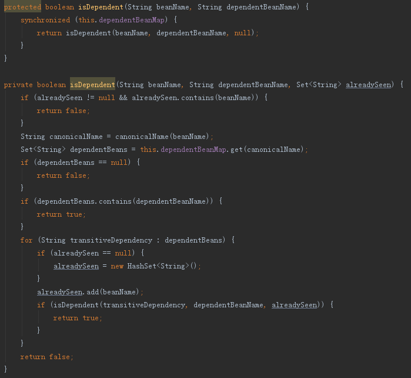

	其中beanName为当前bean,dependentBeanName为当前bean所依赖的bean。大致过程为找出所有依赖beanName的bean列表transitiveDependency，递归判断transitiveDependency是否也依赖dependentBeanNam，即如果 beanName依赖于 dependentBeanName ，而且 transitiveDependency依赖于 beanName, 如果transitiveDependency 依赖于dependentBeanName，即出现了环，则存在循环依赖。

10. 如果该bean为单例，则转入初始化单例流程

	调用父类DefaultSingletonBeanRegistry的getSingleton模板方法，该模板方法会保证该单例只有被创建一次，创建完成后将对象缓存在内部。真正实例化和初始化的过程在createBean方法中，其中如果该bean实例化失败，则会调用destroySingleton方法进行回收，这两个方法在后面会进行重点讲解。同第二步类似，获取该对象后，会再调用getObjectForBeanInstance检查FactoryBean。

11. 如果该bean为多例，则转入初始化多例流程

	第（5）步讲过，内部有一个ThreadLocal，保证多例在当前线程创建时是唯一的，重点方法也是createBean。需要注意的是，如果是多例，创建失败是不会进行回收的。

12. 如果该bean为其他scope，则转入对应的初始化流程

	具体过程同(10)一致，只是调用的模板委托给了具体的Scope对象。

13. 初始化失败，则清理相关内容

	将该beanName从alreadyCreated移除，标识该beanName还未创建。

####  二、createBean

&emsp;createBean方法主要用于完成bean的实例化和初始化过程，该方法在AbstractFactory中为抽象方法，具体实现是在AbstractAutowireCapableBeanFactory类中。如下为核心操作：

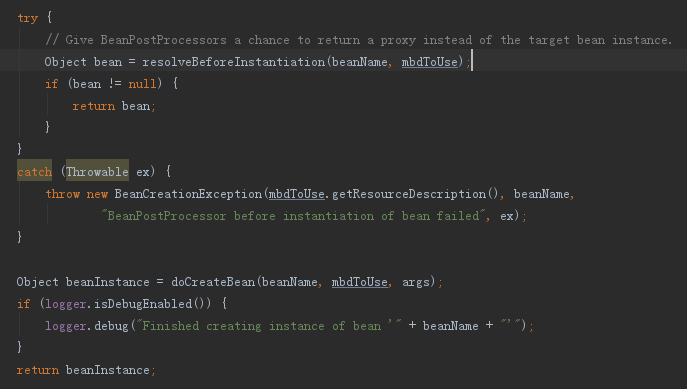

1.	resolveBeforeInstantiation

	创建对象前的代理口子，能够拦截创建过程，使用自定义的代理对象来替换Spring内部正常创建的对象，即上面判断的，如果该方法返回对象不为空，则直接使用返回的对象返回。实现上， 会逐一遍历所有的BeanPostProcessor，找出InstantiationAwareBeanPostProcessor对象，并执行postProcessBeforeInstantiation方法，若返回结果不为空，则直接使用该方法返回，如下：

	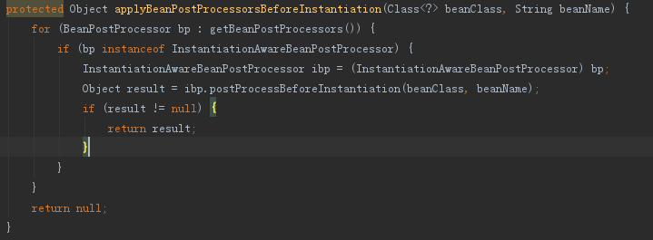

	该方法主要用在AOP实现上，上节提到的CommonAnnotationBeanPostProcessor和PersistenceAnnotationBeanPostProcessor类虽然实现了该接口，但是postProcessBeforeInstantiation方法为空实现。

	若该方法返回对象不为空，则会逐一执行BeanPostProcessor列表的postProcessAfterInitialization方法，以完成回调。

2.	doCreateBean

	该方法的主要过程如下，省略了提前暴露bean实例的部分内容。

	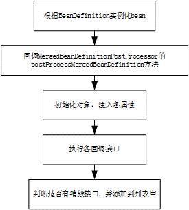

	由上图可知，该过程完成了bean的实例化和初始化以及调用各回调接口的过程。具体为：

	1) 根据BeanDefinition实例化bean

	主要尝试从各种方法进行实例化，包括：

	a. 使用工厂方法进行实例化

	b.	使用bean定义的构造方法或者可用的构造方法进行实例化

	c.	使用默认的构造方法进行实例化

	2) 回调MergedBeanDefinitionPostProcessor的postProcessMergedBeanDefinition方法

	如下，遍历各个MergedBeanDefinitionPostProcessor实例，回调postProcessMergedBeanDefinition方法

	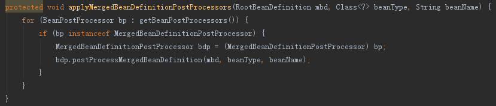

3. 初始化对象，填充各属性

	执行初始化，实现属性的依赖注入，在自动进行依赖注入前， 会先调用一个回调接口，以判断是否需要自动依赖注入，如下：

	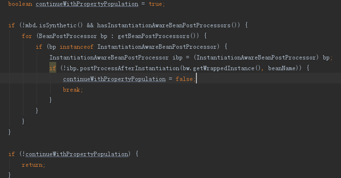

	通过回调InstantiationAwareBeanPostProcessor的postProcessAfterInstantiation方法来判断。

	若需要进行依赖注入，则会根据依赖策略：根据autowireByName或者autowireByType，为属性字段找到符合定义的bean实例（会通过getBean方法调用）。在真正将值赋值给属性前， 还会再次执行回调接口，如下，回调InstantiationAwareBeanPostProcessor的postProcessPropertyValues方法，这里也可以进行拦截。

	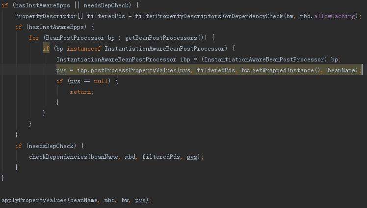

	若前面都没被拦截到，则会真正将bean值复制给对应的属性，最终会通过反射设置field的accessable，然后将bean实例设置进去。

4. 执行各回调接口

	1) 执行Aware接口，包括BeanNameAware、BeanClassLoaderAware和BeanFactoryAware

	2) 执行BeanPostProcessor的postProcessBeforeInitialization（InitDestroyAnnotationBeanPostProcessor类实现了该方法，用以回调@PostConstruct注解的方法，CommonAnnotationBeanPostProcessor继承自该类，设置了initAnnotationType为PostConstruct.class）方法

	3) 如果该Bean实现了InitializingBean接口，则调用afterPropertiesSet方法

	4) 如果设置了init-method,则执行init-method指定的方法

	5) 执行BeanPostProcessor的postProcessAfterInitialization方法

5. 判断是否有销毁接口，并添加到列表中

	如下，为处理过程，会先判断当前bean定义不是多例，且需要进行销毁回调，才会进行处理。如果是单例，则直接将其添加到响应列表列表中进行缓存，存储在内部维护的disposableBeans列表中；如果是其他socpe，则将其委托给对应的Scope对象实现。

	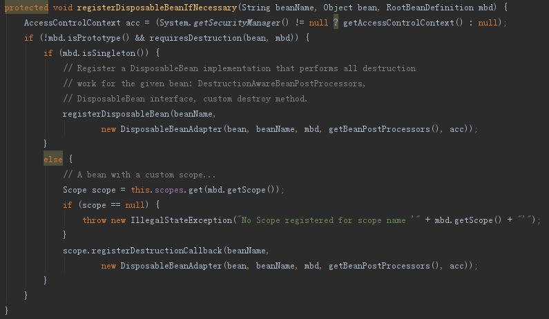

	这里有几个条件：
	1) 必须为非prototy

	2) 该bean存在销毁方法，满足一下条件之一即是

	a. 该bean实现了DisposableBean接口

	b. 该bean实现了AutoCloseable接口

	c.该bean实现了Closeable接口

	d.该bean定义的destory-method不为空

	e.该bean符合DestructionAwareBeanPostProcessor.requiresDestruction方法的过滤条件

	只要符合以上条件，就会新建一个DisposableBeanAdapter对象进行存储，并在销毁时进行相应的接口回调。

#### 三、回调接口顺序

&emsp;结合之前几节内容，可以得到如下的回调顺序：

<table border="1" cellspacing="0" cellpadding="0">
  <thead>
    <tr>
      <td>阶段</td>
      <td>动作</td>
      <td>回调接口</td>
      <td>备注</td>
    </tr>
  </thead>
  <tbody>
  <tr>
    <td rowspan="3">启动</td>
    <td rowspan="3">Context执行invokeBeanFactoryPostProcessors</td>
    <td>BeanDefinitionRegistryPostProcessor.postProcessBeanDefinitionRegistry</td>
    <td>继承自BeanFactoryPostProcessor</td>
  </tr>
  <tr>
    <td>BeanFactoryPostProcessor.postProcessBeanFactory</td>
    <td rowspan="2">按照PriorityOrdered、Ordered、一般执行；不重复执行</td>
  </tr>
  <tr>
    <td>BeanDefinitionRegistryPostProcessor.postProcessBeanDefinitionRegistry</td>
  </tr>
  <tr>
    <td rowspan="14">实例化</td>
    <td>从FactoryBean中获取实例</td>
    <td>BeanPostProcessor.postProcessAfterInitialization</td>
    <td>从FactoryBean获取Bean的话不会执行下面的初始化回调</td>
  </tr>
  <tr>
    <td rowspan="2">resolveBeforeInstantiation（代理口子）</td>
    <td>InstantiationAwareBeanPostProcessor.postProcessBeforeInstantiation</td>
    <td>继承自BeanPostProcessor</td>
  </tr>
  <tr>
    <td>BeanPostProcessor.postProcessAfterInitialization</td>
    <td>这里返回对象非空不会执行下面的初始化回调</td>
  </tr>
  <tr>
    <td rowspan="11">doCreateBean</td>
    <td>MergedBeanDefinitionPostProcessor.postProcessMergedBeanDefinition</td>
    <td></td>
  </tr>
  <tr>
    <td>InstantiationAwareBeanPostProcessor.postProcessAfterInstantiation</td>
    <td></td>
  </tr>
  <tr>
    <td>InstantiationAwareBeanPostProcessor.postProcessPropertyValues</td>
    <td></td>
  </tr>
  <tr>
    <td>BeanNameAware.setBeanName</td>
    <td rowspan="3">初始化后执行invokeAwareMethods</td>
  </tr>
  <tr>
    <td>BeanClassLoaderAware.setBeanClassLoader</td>
  </tr>
  <tr>
    <td>BeanFactoryAware.setBeanFactory</td>
  </tr>
  <tr>
    <td>BeanPostProcessor.postProcessBeforeInitialization</td>
    <td></td>
  </tr>
  <tr>
    <td>InitializingBean.afterPropertiesSet</td>
    <td></td>
  </tr>
  <tr>
    <td>init-method</td>
    <td></td>
  </tr>
  <tr>
    <td>BeanPostProcessor.postProcessAfterInitialization</td>
    <td></td>
  </tr>
  <tr>
    <td>DestructionAwareBeanPostProcessor.requiresDestruction</td>
    <td>销毁方法检查</td>
  </tr>
  <tr>
    <td>初始化后</td>
    <td>preInstantiateSingletons</td>
    <td>SmartInitializingSingleton.afterSingletonsInstantiated</td>
    <td></td>
  </tr>
  </tbody>
</table>

&emsp;以上为大致的过程，不含其它的回调接口，若有其它回调接口可以按照顺序依次加入。


