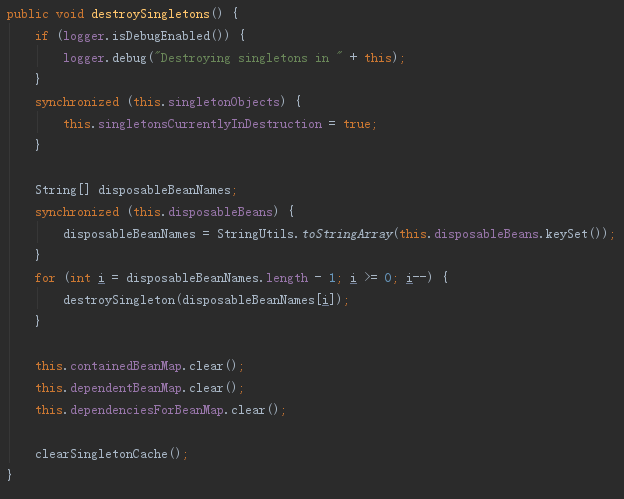
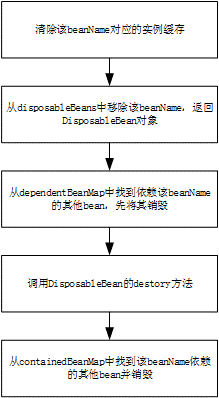
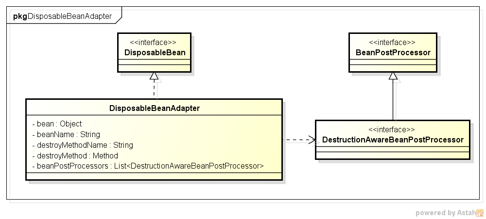
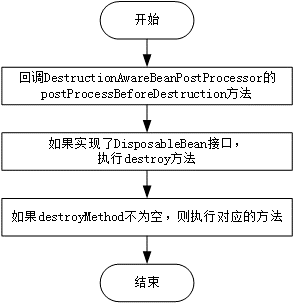

# Spring DestroySingleton流程

&emsp;第一节介绍Spring启动(链接)时，介绍AbstractApplicationContext的过销毁过程，主要是调用了内部的destroyBeans方法，这节便来介绍bean的销毁过程。

#### 一.销毁流程

destroyBeans方法内部委托给了DefaultSingletonBeanRegistry的destroySingletons方法。destroySingletons方法如下，比较清晰:

&emsp;前面介绍过，DefaultSingletonBeanRegistry用一个Map缓存着所有的单例实例，对于对象的销毁，只要简单的将其从Map中移除就行。主要处理的是依赖关系下的bean销毁顺序以及回调接口的处理。上面先对disposableBeans中所涉及到的bean逐个进行销毁，然后再清理所有的依赖关系和缓存的单例实例。

&emsp;上一节提到，disposableBeans中存放的是存在销毁时需要进行方法回调的DisposableBeanAdapter对象，key为对应的bean name，会在bean初始化后进行判断并且存入。这里会优先处理这些bean的销毁，下面重点介绍下destroySingleton方法。

#### 二.destroySingleton

&emsp;如上描述了该方法的大致过程，分别为

1.	将DefaultSingletonBeanRegistry中缓存的各种单例实例清除掉

2.	执行disposableBeans.remove方法，移除该beanName，这里会返回一个DisposableBean对象

3.	删除dependentBeanMap中beanName的内容，也是执行remove的方法，会返回依赖于beanName的其他bean name列表，再依次调用destorySingleton销毁这些bean
4.	对当前的DisposableBean执行destory

5.	删除containedBeanMap中beanName的内容，执行的remove方法，hi返回beanName依赖的其他bean name列表，再依次调用destorySingleton销毁这些bean
从而具体的回调发生在第4步，开头提到，bean在实例化后会以DisposableBeanAdapter存放进disposableBeans中，从而该类实现了具体的回调过程。

#### 三.DisposableBeanAdapter

&emsp;DisposableBeanAdapter的结构如下，其实现了DisposableBean接口，因而可以如上面说的，在destroySingleton方法进行回调。它在构造方法中对几个重要的属性进行了赋值，用于存储销毁动作相关的信息，包括：

1. Bean：待销毁bean对象

2. beanName：待销毁bean的beanName

3. destroyMethodName：待销毁要调用的方法，该方法来源于destory-method配置项，如果为(inferred)，则会将回调方法赋值为close或者shutdown

4. destoryMethod：destoryMethodName对应的Method对象

5. beanPostProcessors：需要处理该bean的DestructionAwareBeanPostProcessor回调列表。在实例化DisposableBeanAdapter对象时，会过滤系统中的BeanPostProcessor列表，找出实现DestructionAwareBeanPostProcessor接口，且requiresDestruction方法返回true的实例，用于后续进行回调。（InitDestroyAnnotationBeanPostProcessor类实现了该方法，用以回调@PreDestory注解的方法，CommonAnnotationBeanPostProcessor继承自该类，设置了destroyAnnotationType为PreDestroy.class）

&emsp;当按照第（二）部分第4步执行时，该类会按照如下顺序执行销毁动作：

1. 如果beanPostProcessors列表不为空，则回调DestructionAwareBeanPostProcessor的postProcessBeforeDestruction方法，即执行@PreDestory注解方法
2. 如果实现了DisposableBean，则回调DisposableBean的destroy方法，即执行DisposableBean接口方法
3. 如果配置了destroy-method，则执行配置的方法，即执行destory-method配置方法

