# Spring AOP


&emsp;这节介绍Spring AOP。关于Spring AOP的名字就不多做介绍了，网上有很多对AOP的解释。

#### 1. 概念术语

1.1 切面（Aspect）

&emsp;切面是一个关注点的模块化，这个关注点可能是横切多个对象；

1.2 连接点（Join Point）

&emsp;连接点是指在程序执行过程中某个特定的点，比如某方法调用的时候或者处理异常的时候；

1.3 通知（Advice）

&emsp;指在切面的某个特定的连接点上执行的动作。Spring切面可以应用5种通知：

 * 前置通知（Before）：在目标方法或者说连接点被调用前执行的通知；

 * 后置通知（After）：指在某个连接点完成后执行的通知；

 * 返回通知（After-returning）：指在某个连接点成功执行之后执行的通知；

 * 异常通知（After-throwing）：指在方法抛出异常后执行的通知；

 * 环绕通知（Around）：指包围一个连接点通知，在被通知的方法调用之前和之后执行自定义的方法。

1.5 切点（Pointcut）

&emsp;指匹配连接点的断言。通知与一个切入点表达式关联，并在满足这个切入的连接点上运行，例如：当执行某个特定的名称的方法。

1.4 引入（Introduction）

&emsp;引入也被称为内部类型声明，声明额外的方法或者某个类型的字段。

1.5 目标对象（Target Object）

&emsp;目标对象是被一个或者多个切面所通知的对象。

1.6 AOP代理（AOP Proxy）

&emsp;AOP代理是指AOP框架创建的对象，用来实现切面（包括通知方法等功能）

1.7 织入（Wearving）

&emsp;指把切面连接到其他应用出程序类型或者对象上，并创建一个被通知的对象。或者说形成代理对象的方法的过程。

#### 2. 入口

&emsp;AOP的一般配置如下：

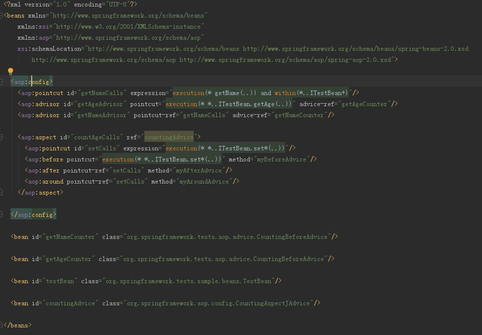

&emsp;之前BeanDefiniton解析那节提到，XML的解析在classpath下META-INF的spring.handlers里。查看spring-aop模块可以看到如下配置

```
http\://www.springframework.org/schema/aop=org.springframework.aop.config.AopNamespaceHandler
```

&emsp;该处理类如下

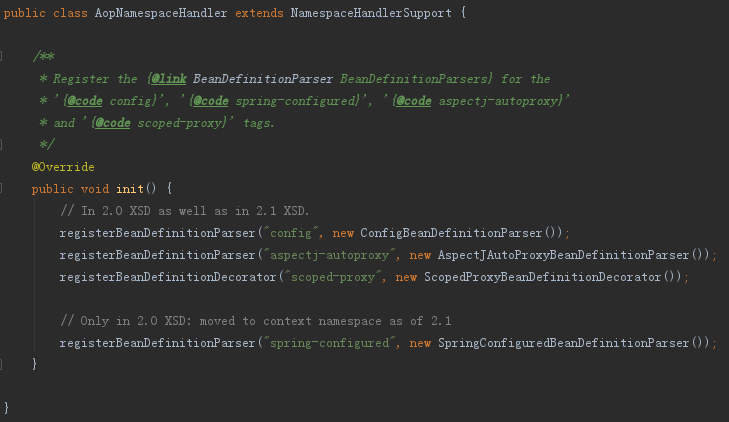

&emsp;可以看到配置文件的处理交由

```
org.springframework.aop.config.ConfigBeanDefinitionParser
```

来处理，该类实现了BeanDefinitionParser接口，该接口的实现内容如下：

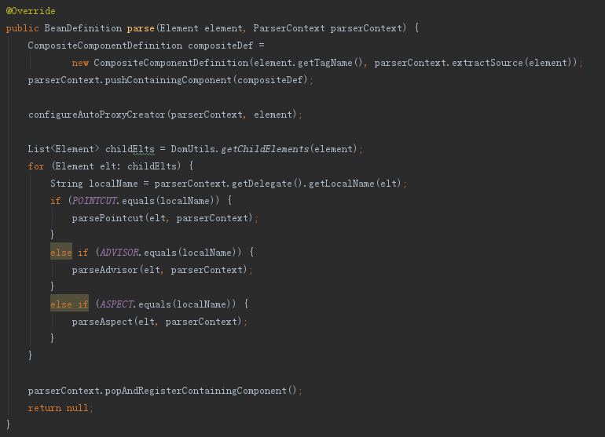

该方法主要完成两件事，

 * 注册AspectJAwareAdvisorAutoProxyCreator

 * 解析pointcut,advisor,aspect节点

&emsp;下面重点看下这两点


#### 3.  AspectJAwareAdvisorAutoProxyCreator

 &emsp;AspectJAwareAdvisorAutoProxyCreator的继承结构如下：

 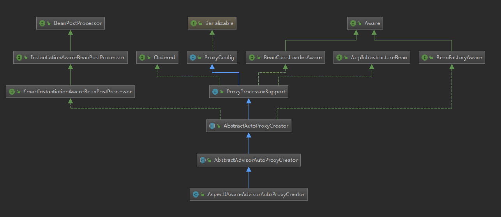

 该类在父类AbstractAutoProxyCreator那实现了接口SmartInstantiationAwareBeanPostProcessor，AbstractAutoProxyCreator主要实现了 方法

 ```
 postProcessBeforeInstantiation
 ```

和方法

 ```
 postProcessAfterInitialization
 ```

 &emsp; postProcessBeforeInstantiation会在bean实例化前执行，如果返回非null，则不会实例化该bean。 postProcessAfterInitialization会在bean实例化并初始化后执行，如果返回非null，则使用该实例，否则使用原Bean对象。即对目标对象的包装可以发生在实例化前，也可以发生在初始化后。

##### 3.1. postProcessBeforeInstantiation

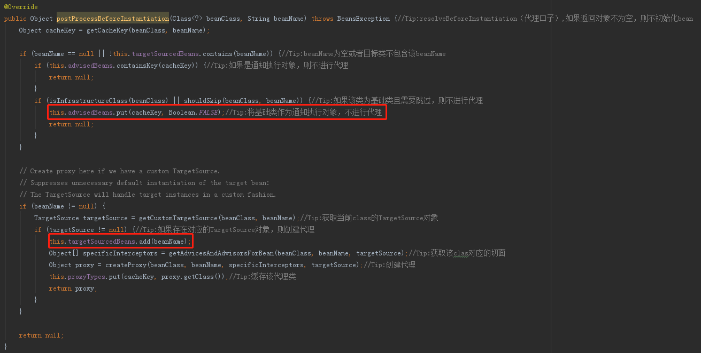

&emsp;如上图示：

 * 在beanName为空或者目标类不包含该beanName的前提下，如果该bean是通知执行对象(advisedBeans)则不进行代理；如果为基础类且需要跳过则不进行代理，同时会将其标记为非通知执行对象。

 * 如果该beanName设置了TargetSource，则调用createProxy方法为该beanName创建代理对象，并将其进行标记，存于targetSourceBeans字段中。这里调用createProxy方法前会调用getAdvicesAndAdvisorsForBean方法获取该bean上设置的通知点。

##### 3.2. postProcessAfterInitialization

&emsp;该方法主要调用了wrapIfNecessary，先判断初始化后的对象是否需要进行代理，如果需要进行代理，也是同上面一样调用createProxy方法，并调前前会调用getAdvicesAndAdvisorsForBean方法获取该bean上设置的通知点，如下：

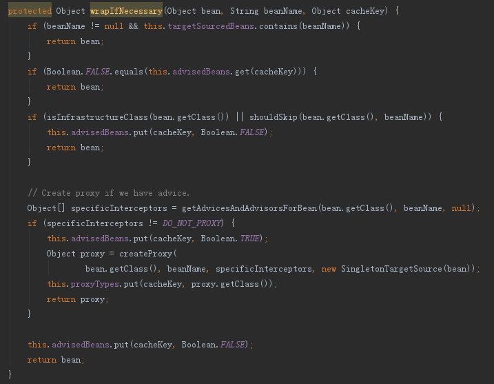

该过程会将已经初始化后的bean包装为SingletonTargetSource传入。

##### 3.3. getAdvicesAndAdvisorsForBean

&emsp;该方法的具体实现在其子类AbstractAdvisorAutoProxyCreator中，内容如下

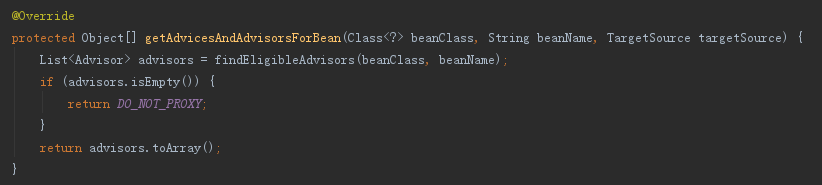

主要调用了findEligibleAdvisors方法，如果该方法返回为空，则返回DO<u>&nbsp;&nbsp;</u>NOT<u>&nbsp;&nbsp;</u>PROXY.

&emsp;findEligibleAdvisors方法的处理流程为：

 * 找出所有实现了Advisors接口的Bean（配置为Advisor的Bean将会被包装为DefaultBeanFactoryPointcutAdvisor注册到Spring中；配置为Advice的将会被包装为AspectJPointcutAdvisor注册到Spring中）

 * 从所有Advisors中找出能够应用在beanClass上的bean，主要判断Advisors是否命中PointCut的规则

 * 根据Order对Advisor进行排序

##### 3.4. createProxy

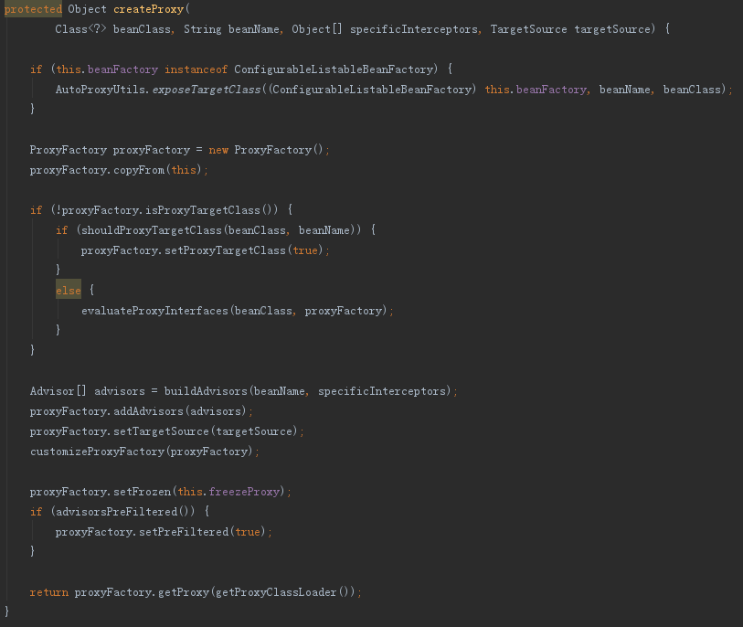

&emsp;如上为createProxy的主要内容，主要是使用相关的Advisor列表和TargetSource生成ProxyFactory对象，委托为ProxyFactory进行代理的包装。主要调用ProxyFacotry的getProxy方法，	该过程会在后面进行讲解.

#### 4. 节点解析

&emsp;回到ConfigBeanDefinitionParser的parse过程，在注册完AspectJAwareAdvisorAutoProxyCreator后便是XML配置项的解析，主要包括：pointcut,advisor和aspect节点。

 * pointcut：为每个pointcut配置注册一个AspectJExpressionPointcut，范围为prototype的Bean，会设置expression属性
 * advisor：为每个advisor配置注册一个DefaultBeanFactoryPointcutAdvisor，需要关联一个advice，通过advice-ref指定对应的Bean；以及关联一个pointcut
 * aspect：包含一个或者多个advice节点已经pointcut节点，pointcut的解析同之前的类似，主要是advice节点。advice类别分为
	 - before：执行前置通知
	 - after：执行后置通知
	 - after-returning：执行返回通知
	 - after-throwing：执行异常通知
	 - around：执行回环通知
	 对于每个advice都会包装为一个AspectJPointcutAdvisor

#### 5. ProxyFacotry

&emsp;ProxyFactory的结构如下：
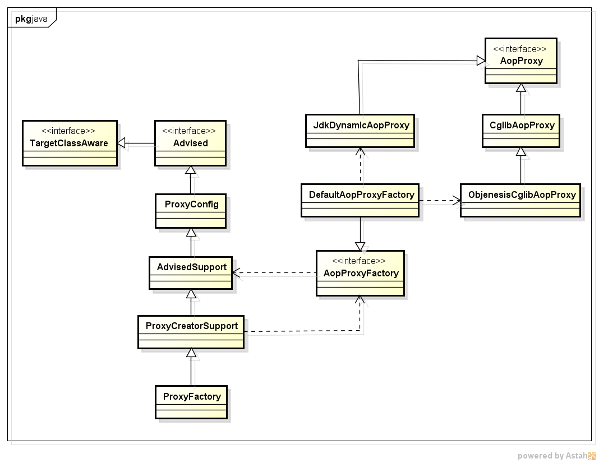

 * ProxyFactory主要对ProxyCreatorSupport进行了封装，用于设置TargetSource和各拦截器接口。
 * ProxyCreatorSupport继承自AdvisedSupport，AdvisedSupport本身持有创建代理的各参数。同时引用了AopProxyFactory，将代理的创建动作委托给了AopProxyFactory。调用ProxyFactory的createAopProxy方法实际调用了AopProxyFactory的createAopProxy方法，该方法需要传入一个AdvisedSupport对象，即ProxyFactory本身。
 * DefaultAopProxyFactory决定使用哪种方式来创建代理，可选方式为Jdk动态代理或者Cglib，内容如下：
  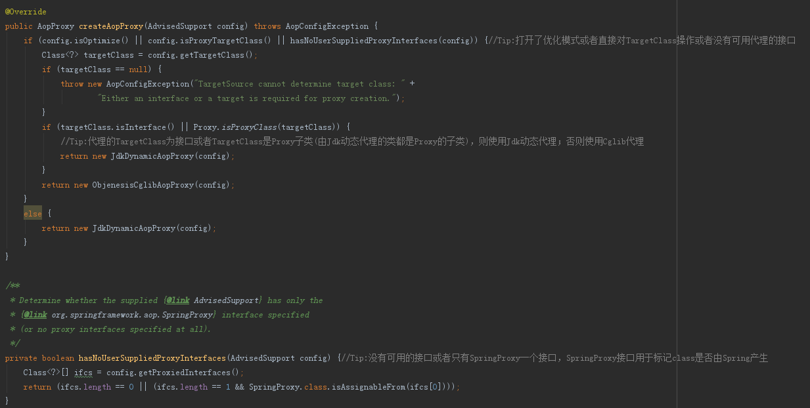

#### 6. aspectj-autoproxy

&emsp;aspectj-autoproxy提供自动完成创建代理织入切面的功能，能够通过配置注解Aspectj织入切面。aspectj-autoproxy 有一个proxy-target-class属性，默认为false，表示使用jdk动态代理织入增强，当配为true时，表示使用CGLib动态代理技术织入增强。不过即使proxy-target-class设置为false，如果目标类没有声明接口，则spring将自动使用CGLib动态代理。根据上面的介绍，该动能由AspectJAutoProxyBeanDefinitionParser提供，主要向Spring注册了AnnotationAwareAspectJAutoProxyCreator类。

&emsp;AnnotationAwareAspectJAutoProxyCreator继承自AspectJAwareAdvisorAutoProxyCreator，只扩展了findCandidateAdvisors方法，将Advisor的搜索范围扩大到了注解上，使之可以用注解进行配置，具体委托给了BeanFactoryAspectJAdvisorsBuilderAdapter的BeanFactoryAspectJAdvisorsBuilderAdapter实现。

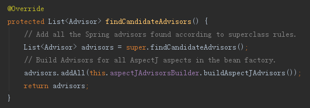
